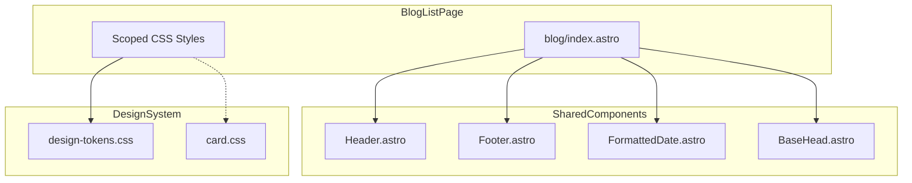

# Design Document

## Overview

**Purpose**: ブログ一覧ページ（`/blog/`）のデザインを改善し、すべての記事カードを統一されたサイズ・レイアウトで表示する。

**Users**: ブログ閲覧者が一覧ページで記事を選択する際に使用。

**Impact**: 現在の非対称レイアウト（最初の記事が大きい）を、統一グリッドレイアウトに変更。視覚的一貫性を向上させ、記事の選択体験を改善する。

### Goals
- すべての記事カードを同一サイズで表示
- レスポンシブグリッド（3列/2列/1列）の実現
- タイトル・説明文の省略表示による高さ統一
- 既存デザインシステムとの整合性維持

### Non-Goals
- 検索・フィルタリング機能の追加
- ページネーションの実装
- PostCard.astroコンポーネントの抽出（将来検討）
- タグ表示の追加

## Architecture

### Existing Architecture Analysis

現在の `src/pages/blog/index.astro` は以下の構造を持つ:
- インラインCSS（`<style>`タグ）でスタイル定義
- `li:first-child` セレクタで最初の記事を特別扱い
- `grid-template-columns: repeat(auto-fill, minmax(300px, 1fr))` による自動グリッド
- 既存の `FormattedDate` コンポーネントを使用

**変更が必要な箇所**:
- グリッドレイアウトのCSS（列数の明示的制御）
- カードの高さ統一（Flexbox導入）
- 最初の記事の特別扱いスタイルの削除

### Architecture Pattern & Boundary Map



**Architecture Integration**:
- **Selected pattern**: Astroスコープ付きCSS（既存パターン維持）
- **Domain boundaries**: ブログ一覧ページ固有のスタイルはindex.astro内に閉じる
- **Existing patterns preserved**: デザイントークンの使用、コンポーネント構成
- **New components rationale**: 新規コンポーネントは追加しない（既存構造内での修正）
- **Steering compliance**: TypeScript strict mode、Astroコンポーネント規約に準拠

### Technology Stack

| Layer | Choice / Version | Role in Feature | Notes |
|-------|------------------|-----------------|-------|
| Frontend | Astro v5 | ページレンダリング | 既存 |
| Styling | CSS (Scoped) | レイアウト・カードスタイル | デザイントークン使用 |
| Image | astro:assets | ヒーロー画像最適化 | 既存 |

## Requirements Traceability

| Requirement | Summary | Components | Interfaces | Flows |
|-------------|---------|------------|------------|-------|
| 1.1 | カード同一サイズ | ScopedCSS | - | - |
| 1.2 | グリッドレイアウト | ScopedCSS | - | - |
| 1.3 | レスポンシブ列数調整 | ScopedCSS | - | - |
| 1.4 | 最初の記事特別扱い削除 | ScopedCSS | - | - |
| 1.5 | 3列/2列/1列グリッド | ScopedCSS | - | - |
| 2.1 | 固定縦幅 | ScopedCSS | - | - |
| 2.2 | 固定アスペクト比画像 | ScopedCSS | - | - |
| 2.3 | タイトル省略表示 | ScopedCSS | - | - |
| 2.4 | 説明文省略表示 | ScopedCSS | - | - |
| 2.5 | 表示位置統一 | ScopedCSS | - | - |
| 2.6 | 画像なし時の高さ維持 | ScopedCSS | - | - |
| 3.1-3.5 | タイポグラフィ | ScopedCSS | - | - |
| 4.1-4.4 | レスポンシブ対応 | ScopedCSS | - | - |
| 5.1-5.3 | ダークモード対応 | ScopedCSS | - | - |

## Components and Interfaces

| Component | Domain/Layer | Intent | Req Coverage | Key Dependencies | Contracts |
|-----------|--------------|--------|--------------|------------------|-----------|
| blog/index.astro | Pages | ブログ一覧ページ | 1-5 | Header, Footer, FormattedDate, BaseHead (P0) | - |
| ScopedCSS | Styling | カード・グリッドスタイル | 1-5 | design-tokens.css (P0) | State |

### Pages Layer

#### blog/index.astro

| Field | Detail |
|-------|--------|
| Intent | ブログ記事一覧を統一グリッドレイアウトで表示 |
| Requirements | 1.1-1.5, 2.1-2.6, 3.1-3.5, 4.1-4.4, 5.1-5.3 |

**Responsibilities & Constraints**
- 記事データの取得と日付順ソート
- 統一グリッドレイアウトでの記事カード表示
- レスポンシブ対応（3列/2列/1列）
- ダークモード対応

**Dependencies**
- Inbound: astro:content — 記事データ取得 (P0)
- Outbound: Header, Footer, BaseHead, FormattedDate — UIコンポーネント (P0)
- External: design-tokens.css — デザイントークン (P0)

**Contracts**: State [x]

##### State Management

**Grid Layout State (CSS)**:
```css
/* デスクトップ: 3列 */
.posts-grid {
  display: grid;
  grid-template-columns: repeat(3, 1fr);
  gap: var(--space-6);
}

/* タブレット: 2列 */
@media (max-width: 1023px) {
  .posts-grid {
    grid-template-columns: repeat(2, 1fr);
  }
}

/* モバイル: 1列 */
@media (max-width: 767px) {
  .posts-grid {
    grid-template-columns: 1fr;
  }
}
```

**Card Height State (CSS)**:
```css
.post-card {
  display: flex;
  flex-direction: column;
  height: 100%;
}

.post-card__content {
  display: flex;
  flex-direction: column;
  flex-grow: 1;
  padding: var(--space-5);
}

.post-card__description {
  flex-grow: 1;
  display: -webkit-box;
  -webkit-line-clamp: 2;
  -webkit-box-orient: vertical;
  overflow: hidden;
}
```

**Implementation Notes**
- Integration: 既存のindex.astro内スタイルを置換
- Validation: ビルド時の型チェック（Astro標準）
- Risks: 既存のView Transition（`view-transition-name: main-content`）を維持する必要あり

## Data Models

### Domain Model

本機能はデータモデルの変更を伴わない。既存の `blog` コンテンツコレクションをそのまま使用。

```typescript
// 既存のblogコレクションスキーマ（変更なし）
interface BlogPost {
  id: string;
  data: {
    title: string;
    description?: string;
    pubDate: Date;
    heroImage?: ImageMetadata;
    tags?: string[];
  };
}
```

## Error Handling

### Error Strategy

本機能はUI変更のみであり、特別なエラーハンドリングは不要。

- **画像なし**: 画像なし記事でもカードの高さを維持（CSS固定高さ）
- **説明なし**: 説明文がない場合もレイアウトを維持（flexboxによる自動調整）

## Testing Strategy

### Visual Testing
1. 全カードが同一サイズで表示されることを確認
2. タイトル省略表示の動作確認（長いタイトル）
3. 説明文省略表示の動作確認（長い説明文）
4. 画像なし記事のカード高さ確認
5. ダークモードでの表示確認

### Responsive Testing
1. デスクトップ（1024px以上）: 3列グリッド
2. タブレット（768px-1023px）: 2列グリッド
3. モバイル（767px以下）: 1列グリッド

### Browser Testing
1. Chrome（最新）
2. Firefox（最新）
3. Safari（最新）
4. Edge（最新）

## Performance & Scalability

**現状維持**: 本機能はCSSのみの変更であり、パフォーマンスへの影響は最小限。

- レンダリングパフォーマンス: Flexbox/Gridは現代ブラウザで高速
- 画像最適化: 既存のastro:assets（sharp）を継続使用
