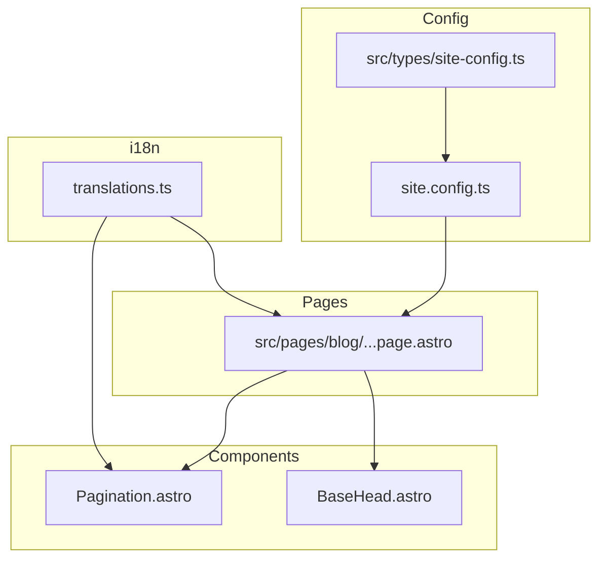
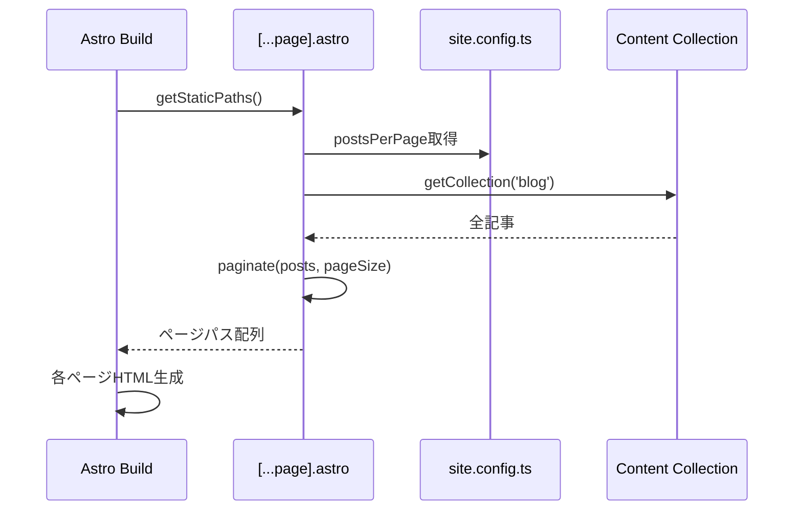

# Technical Design Document

## Overview

**Purpose**: ブログ記事数増加時のパフォーマンス問題を解決し、ユーザーが効率的に記事を閲覧できるページネーション機能を提供する。

**Users**: ブログ読者が一覧ページで記事を閲覧する際、ページ分割されたナビゲーションを使用して過去の記事にアクセスする。

**Impact**: 現在の`src/pages/blog/index.astro`を`[...page].astro`パターンに移行し、複数ページの静的HTML生成を実現する。

### Goals
- 1ページあたりの記事数を設定可能にする（デフォルト24件）
- SEOに最適化されたURL構造（`/blog/`, `/blog/page/2/`）
- アクセシブルなページナビゲーションUI
- 既存のスタイル・コンポーネントとの一貫性維持

### Non-Goals
- 無限スクロール（Load More）方式
- クライアントサイドでのページ切り替え
- 検索・フィルター機能との連携

## Architecture

### Existing Architecture Analysis

現在のブログ一覧ページ（`src/pages/blog/index.astro`）：
- `getCollection('blog')`で全記事取得
- 更新日時順でソート
- 全記事を1ページに表示
- カード形式のグリッドレイアウト

既存パターン：
- 設定は`site.config.ts`で一元管理、型は`src/types/site-config.ts`
- 翻訳は`src/i18n/translations.ts`で定義
- メタタグは`BaseHead.astro`コンポーネントで管理

### Architecture Pattern & Boundary Map



**Architecture Integration**:
- Selected pattern: Astro標準`paginate()`関数による静的ページ生成
- Domain boundaries: 設定（Config）、ページ（Pages）、UIコンポーネント（Components）、国際化（i18n）
- Existing patterns preserved: SiteConfig構造、i18n翻訳パターン、BaseHeadメタタグ管理
- New components rationale: Paginationコンポーネントは再利用可能なナビゲーションUIとして分離
- Steering compliance: TypeScript strict mode、Astroコンポーネントパターン準拠

### Technology Stack

| Layer | Choice / Version | Role in Feature | Notes |
|-------|------------------|-----------------|-------|
| Framework | Astro v5 | `paginate()`関数によるページ生成 | 既存バージョン継続 |
| Language | TypeScript | 型安全な設定・props定義 | strict mode |
| Styling | CSS Variables | 既存デザインシステム活用 | ダークモード対応済み |

## System Flows



**Key Decisions**:
- ビルド時に全ページを静的生成（SSG）
- ページサイズは設定ファイルから動的に取得

## Requirements Traceability

| Requirement | Summary | Components | Interfaces | Flows |
|-------------|---------|------------|------------|-------|
| 1.1 | 設定値に基づく記事数決定 | [...page].astro | PaginationConfig | Build Flow |
| 1.2 | デフォルト24件 | site-config.ts | PaginationConfig | - |
| 1.3 | 複数ページ生成 | [...page].astro | paginate() | Build Flow |
| 1.4 | 更新日時順ソート | [...page].astro | - | Build Flow |
| 1.5 | 条件付きUI表示 | Pagination.astro | PaginationProps | - |
| 2.1 | ページ番号表示 | Pagination.astro | PaginationProps | - |
| 2.2 | 次へリンク | Pagination.astro | PaginationProps | - |
| 2.3 | 前へリンク | Pagination.astro | PaginationProps | - |
| 2.4 | ページ番号リンク | Pagination.astro | PaginationProps | - |
| 2.5 | 省略記号表示 | Pagination.astro | PaginationProps | - |
| 3.1 | 1ページ目URL | [...page].astro | - | - |
| 3.2 | 2ページ目以降URL | [...page].astro | - | - |
| 3.3 | 404ページ | [...page].astro | - | - |
| 3.4 | canonical URL | BaseHead.astro | BaseHeadProps | - |
| 4.1-4.5 | アクセシビリティ | Pagination.astro | - | - |
| 5.1-5.4 | SEO対応 | BaseHead.astro, [...page].astro | BaseHeadProps | - |
| 6.1-6.3 | 設定項目 | site-config.ts | PaginationConfig | - |

## Components and Interfaces

| Component | Domain/Layer | Intent | Req Coverage | Key Dependencies | Contracts |
|-----------|--------------|--------|--------------|------------------|-----------|
| PaginationConfig | Config | ページネーション設定型 | 1.1, 1.2, 6.1-6.3 | SiteConfig (P0) | Type |
| [...page].astro | Pages | ページネーション付き一覧 | 1.1-1.5, 3.1-3.3 | paginate (P0), Pagination (P1) | - |
| Pagination.astro | Components | ナビゲーションUI | 1.5, 2.1-2.5, 4.1-4.5 | i18n (P1) | Props |
| BaseHead.astro | Components | SEOメタタグ拡張 | 3.4, 5.1-5.4 | - | Props拡張 |
| translations.ts | i18n | 翻訳キー追加 | 2.1-2.3, 5.1 | - | Type拡張 |

### Config Layer

#### PaginationConfig

| Field | Detail |
|-------|--------|
| Intent | ページネーション設定の型定義 |
| Requirements | 1.1, 1.2, 6.1, 6.2, 6.3 |

**Responsibilities & Constraints**
- `site.config.ts`の`pagination`セクションの型を定義
- デフォルト値のドキュメント化

**Dependencies**
- Inbound: SiteConfig — 設定オブジェクトの一部として参照 (P0)

**Contracts**: Type [x]

##### Type Definition

```typescript
/**
 * ページネーション設定
 */
export interface PaginationConfig {
  /**
   * 1ページあたりの記事表示数
   * @default 24
   */
  postsPerPage?: number;
}
```

**Implementation Notes**
- `SiteConfig`インターフェースに`pagination?: PaginationConfig`を追加
- デフォルト値24は使用箇所で`?? 24`としてフォールバック

### Pages Layer

#### [...page].astro

| Field | Detail |
|-------|--------|
| Intent | ページネーション対応ブログ一覧ページ |
| Requirements | 1.1, 1.2, 1.3, 1.4, 1.5, 3.1, 3.2, 3.3 |

**Responsibilities & Constraints**
- `getStaticPaths()`で`paginate()`を使用してページ生成
- 設定値からページサイズを取得
- 存在しないページ番号は404を返す（Astro標準動作）

**Dependencies**
- Inbound: Astro Build — ビルド時にgetStaticPathsを呼び出し (P0)
- Outbound: Pagination.astro — ナビゲーションUI表示 (P1)
- Outbound: BaseHead.astro — SEOメタタグ設定 (P0)
- External: siteConfig — ページサイズ設定取得 (P0)

**Contracts**: Props [x]

##### Props Interface

```typescript
interface Props {
  page: {
    data: CollectionEntry<'blog'>[];
    start: number;
    end: number;
    size: number;
    total: number;
    currentPage: number;
    lastPage: number;
    url: {
      current: string;
      prev: string | undefined;
      next: string | undefined;
      first: string | undefined;
      last: string | undefined;
    };
  };
}
```

**Implementation Notes**
- `src/pages/blog/index.astro`から移行（ファイル名変更）
- 既存のカードレイアウト・スタイルは維持
- `page.lastPage > 1`の場合のみPaginationコンポーネント表示

### Components Layer

#### Pagination.astro

| Field | Detail |
|-------|--------|
| Intent | 再利用可能なページナビゲーションUI |
| Requirements | 1.5, 2.1, 2.2, 2.3, 2.4, 2.5, 4.1, 4.2, 4.3, 4.4, 4.5 |

**Responsibilities & Constraints**
- ページ番号、前後リンク、省略記号の表示ロジック
- アクセシビリティ属性（aria-label, aria-current）
- レスポンシブ・ダークモード対応スタイル

**Dependencies**
- Inbound: [...page].astro — ページ情報を受け取り表示 (P0)
- External: i18n — 翻訳テキスト取得 (P1)

**Contracts**: Props [x]

##### Props Interface

```typescript
interface Props {
  /** 現在のページ番号（1始まり） */
  currentPage: number;
  /** 総ページ数 */
  lastPage: number;
  /** 前ページURL（1ページ目はundefined） */
  prevUrl: string | undefined;
  /** 次ページURL（最終ページはundefined） */
  nextUrl: string | undefined;
  /** ベースURL（ページ番号リンク生成用） */
  baseUrl?: string;
}
```

##### Page Number Display Logic

```
総ページ数 <= 7: 全ページ番号を表示
総ページ数 > 7:
  - 現在ページが前半: 1, 2, 3, 4, 5, ..., lastPage
  - 現在ページが後半: 1, ..., lastPage-4, lastPage-3, lastPage-2, lastPage-1, lastPage
  - 現在ページが中間: 1, ..., current-1, current, current+1, ..., lastPage
```

**Implementation Notes**
- `<nav aria-label="ページネーション">`でナビゲーションランドマーク
- 現在ページは`aria-current="page"`属性
- 省略記号は`<span aria-hidden="true">...</span>`
- キーボードフォーカス可能なリンク要素

### i18n Layer

#### translations.ts 拡張

| Field | Detail |
|-------|--------|
| Intent | ページネーション関連翻訳キー追加 |
| Requirements | 2.1, 2.2, 2.3, 5.1 |

**Contracts**: Type拡張 [x]

##### 追加翻訳キー

```typescript
// TranslationKeysに追加
'pagination.page': string;           // "ページ {current} / {total}"
'pagination.prev': string;           // "前へ"
'pagination.next': string;           // "次へ"
'pagination.goToPage': string;       // "ページ {page} へ移動"
'blog.pageTitle.paginated': string;  // "ブログ記事一覧 - ページ {page}"
```

### BaseHead.astro 拡張

| Field | Detail |
|-------|--------|
| Intent | SEO用prev/nextリンク追加 |
| Requirements | 3.4, 5.1, 5.2, 5.3, 5.4 |

**Contracts**: Props拡張 [x]

##### Props追加

```typescript
interface Props {
  // 既存props...

  /** ページネーション情報（一覧ページ用） */
  pagination?: {
    currentPage: number;
    lastPage: number;
    prevUrl: string | undefined;
    nextUrl: string | undefined;
  };
}
```

**Implementation Notes**
- `pagination`propが渡された場合のみrel prev/nextを出力
- titleにページ番号を含める（2ページ目以降）

## Data Models

### Domain Model

このフィーチャーは新規データモデルを導入しない。既存の`CollectionEntry<'blog'>`を使用。

### Configuration Model

```typescript
// site.config.ts に追加
pagination: {
  postsPerPage: 24,
},
```

## Error Handling

### Error Strategy

- **存在しないページ番号**: Astro標準の404ページ表示（`src/pages/404.astro`既存）
- **設定値不正**: `postsPerPage`が未定義または0以下の場合、デフォルト値24を使用

### Error Categories and Responses

**User Errors (4xx)**:
- `/blog/page/999/`など存在しないページ → 404ページ表示

**Business Logic Errors**:
- 記事0件の場合 → 空の一覧表示（既存動作維持）

## Testing Strategy

### Unit Tests
- ページ番号表示ロジック（省略記号の位置計算）
- デフォルト値フォールバック

### Integration Tests
- `getStaticPaths()`が正しいページ数を生成するか
- ページデータが正しくスライスされるか

### E2E Tests
- ページ間のナビゲーション動作
- キーボードでのページ切り替え
- モバイル表示でのタップ操作

## Optional Sections

### Performance & Scalability

- **ビルド時間**: 記事数に比例してページ数増加、ビルド時間も増加（許容範囲）
- **ページサイズ**: 1ページあたりのHTML削減（全記事→24件）により初期ロード高速化
- **画像**: 既存の`loading="lazy"`維持

### Security Considerations

新規セキュリティ考慮事項なし。静的サイト生成のため、ランタイムリスクは最小。
