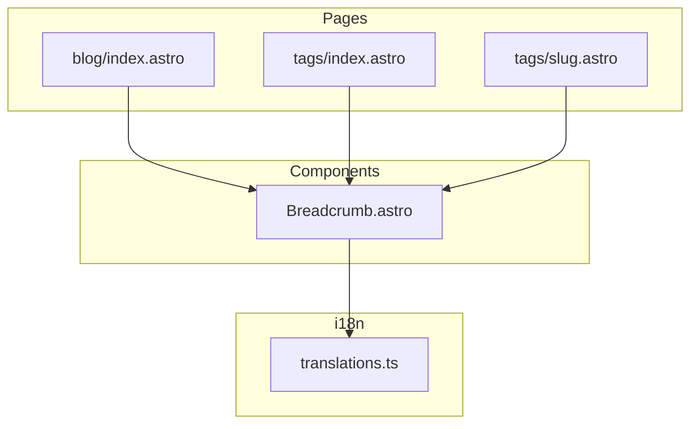

# Design Document: Breadcrumb Expansion

## Overview

**Purpose**: 既存のBreadcrumbコンポーネントをブログ一覧ページ、タグ一覧ページ、および個別タグページに適用し、サイト全体で一貫したナビゲーション体験を提供する。

**Users**: サイト閲覧者がサイト構造を把握し、上位階層へ容易に移動できるようになる。

**Impact**: 3ページへのパンくずリスト追加、タグ詳細ページの既存独自実装の置き換え、i18n翻訳キーの追加。

### Goals
- ブログ一覧ページ（`/blog/`）にパンくずリストを追加
- タグ一覧ページ（`/tags/`）にパンくずリストを追加
- 個別タグページ（`/tags/[slug]/`）に階層対応パンくずリストを追加
- 既存の独自パンくずリスト実装を共通コンポーネントに統一
- 多言語対応の維持

### Non-Goals
- Breadcrumb.astroコンポーネント自体の変更
- JSON-LD構造化データの追加（将来の拡張）
- ホームページへのパンくずリスト追加

## Architecture

### Existing Architecture Analysis

現在のBreadcrumb実装：
- `src/components/Breadcrumb.astro`: 汎用パンくずリストコンポーネント
- `src/layouts/BlogPost.astro`: ブログ記事ページで使用（唯一の使用箇所）
- `src/pages/tags/[...slug].astro`: 独自の`.breadcrumbs`クラスによる実装

### Architecture Pattern & Boundary Map



**Architecture Integration**:
- Selected pattern: コンポーネント再利用パターン
- Existing patterns preserved: Astroコンポーネントのprops渡し、i18n翻訳関数の使用
- New components rationale: 新規コンポーネントなし（既存を再利用）
- Steering compliance: 機能ベースのディレクトリ構造、再利用可能なコンポーネント設計

### Technology Stack

| Layer | Choice / Version | Role in Feature | Notes |
|-------|------------------|-----------------|-------|
| Frontend | Astro v5 | ページ生成・コンポーネント描画 | 既存 |
| i18n | カスタム実装 | 翻訳テキスト提供 | translations.ts |

## Requirements Traceability

| Requirement | Summary | Components | Interfaces | Flows |
|-------------|---------|------------|------------|-------|
| 1.1, 1.2, 1.3 | ブログ一覧ページへのパンくずリスト追加 | blog/index.astro, Breadcrumb | BreadcrumbItem[] | - |
| 2.1, 2.2, 2.3 | タグ一覧ページへのパンくずリスト追加 | tags/index.astro, Breadcrumb | BreadcrumbItem[] | - |
| 3.1, 3.2, 3.3, 3.4 | 個別タグページへのパンくずリスト追加 | tags/[...slug].astro, Breadcrumb | BreadcrumbItem[] | 階層タグ展開 |
| 4.1, 4.2, 4.3 | 既存独自ナビゲーションの置き換え | tags/[...slug].astro | - | コード削除 |
| 5.1, 5.2, 5.3, 5.4 | 多言語対応（i18n） | translations.ts | TranslationKeys | - |
| 6.1, 6.2, 6.3, 6.4 | アクセシビリティ | Breadcrumb | - | 既存実装維持 |
| 7.1, 7.2, 7.3 | スタイルの一貫性 | Breadcrumb | - | 既存実装維持 |

## Components and Interfaces

| Component | Domain/Layer | Intent | Req Coverage | Key Dependencies | Contracts |
|-----------|--------------|--------|--------------|------------------|-----------|
| Breadcrumb.astro | UI | パンくずリスト表示 | 1, 2, 3, 6, 7 | i18n (P0) | Props |
| blog/index.astro | Page | ブログ一覧ページ | 1 | Breadcrumb (P0), i18n (P0) | - |
| tags/index.astro | Page | タグ一覧ページ | 2 | Breadcrumb (P0), i18n (P0) | - |
| tags/[...slug].astro | Page | タグ詳細ページ | 3, 4 | Breadcrumb (P0), i18n (P0), TagService (P1) | - |
| translations.ts | i18n | 翻訳リソース | 5 | - | TranslationKeys |

### UI Layer

#### Breadcrumb.astro（既存・変更なし）

| Field | Detail |
|-------|--------|
| Intent | 汎用パンくずリストコンポーネント |
| Requirements | 6.1, 6.2, 6.3, 6.4, 7.1, 7.2, 7.3 |

**Responsibilities & Constraints**
- items配列を受け取りパンくずリストを描画
- 最後の要素（href未定義）は現在のページとして表示
- アクセシビリティ属性の適用

**Dependencies**
- Inbound: 各ページから使用される (P0)
- External: i18n — aria-label翻訳 (P0)

**Contracts**: Props [x]

##### Props Interface
```typescript
interface BreadcrumbItem {
  label: string;
  href?: string;  // undefinedの場合は現在のページ
}

interface Props {
  items: BreadcrumbItem[];
  separator?: string;  // デフォルト: "›"
}
```

**Implementation Notes**
- 変更不要：既存実装をそのまま使用

### Page Layer

#### blog/index.astro

| Field | Detail |
|-------|--------|
| Intent | ブログ一覧ページへのパンくずリスト追加 |
| Requirements | 1.1, 1.2, 1.3 |

**Responsibilities & Constraints**
- Breadcrumbコンポーネントのimport追加
- パンくずリストアイテム配列の構築
- ページヘッダー前にBreadcrumbコンポーネントを配置

**Dependencies**
- Outbound: Breadcrumb — パンくずリスト描画 (P0)
- External: i18n — 翻訳テキスト取得 (P0)

**Contracts**: -

**Implementation Notes**
- Integration: `<main>`要素内、`page-header`前に配置
- パンくずリスト構築例:
  ```typescript
  const breadcrumbItems = [
    { label: t('breadcrumb.home'), href: '/' },
    { label: t('breadcrumb.blog') }  // 現在のページ
  ];
  ```

#### tags/index.astro

| Field | Detail |
|-------|--------|
| Intent | タグ一覧ページへのパンくずリスト追加 |
| Requirements | 2.1, 2.2, 2.3 |

**Responsibilities & Constraints**
- Breadcrumbコンポーネントのimport追加
- パンくずリストアイテム配列の構築
- ページヘッダー前にBreadcrumbコンポーネントを配置

**Dependencies**
- Outbound: Breadcrumb — パンくずリスト描画 (P0)
- External: i18n — 翻訳テキスト取得 (P0)

**Contracts**: -

**Implementation Notes**
- Integration: `<main>`要素内、`page-header`前に配置
- パンくずリスト構築例:
  ```typescript
  const breadcrumbItems = [
    { label: t('breadcrumb.home'), href: '/' },
    { label: t('breadcrumb.tags') }  // 現在のページ
  ];
  ```

#### tags/[...slug].astro

| Field | Detail |
|-------|--------|
| Intent | タグ詳細ページへの階層対応パンくずリスト追加・既存実装の置き換え |
| Requirements | 3.1, 3.2, 3.3, 3.4, 4.1, 4.2, 4.3 |

**Responsibilities & Constraints**
- Breadcrumbコンポーネントのimport追加
- 階層タグに対応したパンくずリストアイテム配列の構築
- 既存の独自パンくずリスト実装（`.breadcrumbs`）の削除
- 既存の「戻る」リンクの削除
- 関連CSSスタイルの削除

**Dependencies**
- Outbound: Breadcrumb — パンくずリスト描画 (P0)
- Outbound: TagService — タグ情報取得 (P1)
- External: i18n — 翻訳テキスト取得 (P0)

**Contracts**: -

**Implementation Notes**
- Integration: 既存の「戻るリンク」と「独自breadcrumbs」を削除し、Breadcrumbコンポーネントに置き換え
- 階層タグのパンくずリスト構築ロジック:
  ```typescript
  function buildBreadcrumbItems(tagName: string): BreadcrumbItem[] {
    const items: BreadcrumbItem[] = [
      { label: t('breadcrumb.home'), href: '/' },
      { label: t('breadcrumb.tags'), href: '/tags/' }
    ];

    const parts = tagName.split('/');
    for (let i = 0; i < parts.length; i++) {
      const partialTag = parts.slice(0, i + 1).join('/');
      const isLast = i === parts.length - 1;
      items.push({
        label: parts[i],
        href: isLast ? undefined : `/tags/${partialTag.toLowerCase()}/`
      });
    }

    return items;
  }
  ```
- 削除対象:
  - 「戻るリンク」: `<a href="/tags/" class="back-link">...</a>`
  - 独自パンくずリスト: `<nav class="breadcrumbs">...</nav>`
  - CSSスタイル: `.breadcrumbs`, `.breadcrumb-item`, `.breadcrumb-link`, `.breadcrumb-separator`, `.back-link`

### i18n Layer

#### translations.ts

| Field | Detail |
|-------|--------|
| Intent | パンくずリスト用翻訳キーの追加 |
| Requirements | 5.1, 5.2, 5.3, 5.4 |

**Responsibilities & Constraints**
- `breadcrumb.tags`キーの追加
- 日本語・英語の翻訳値を定義

**Dependencies**
- Inbound: 各ページ、Breadcrumbコンポーネントから使用 (P0)

**Contracts**: TranslationKeys [x]

##### TranslationKeys追加
```typescript
interface TranslationKeys {
  // ... 既存キー
  'breadcrumb.tags': string;  // 追加
}

// ja
'breadcrumb.tags': 'タグ',

// en
'breadcrumb.tags': 'Tags',
```

**Implementation Notes**
- TranslationKeysインターフェースへのキー追加
- ja/en両方の翻訳オブジェクトへの値追加

## Testing Strategy

### Unit Tests
- translations.tsに`breadcrumb.tags`キーが存在することを確認

### Integration Tests
- ブログ一覧ページでパンくずリストが正しく表示される
- タグ一覧ページでパンくずリストが正しく表示される
- フラットタグページでパンくずリストが正しく表示される
- 階層タグページでパンくずリストが正しく表示される（親タグへのリンク含む）

### E2E/UI Tests
- パンくずリストのホームリンクをクリックしてホームページに遷移
- パンくずリストのタグリンクをクリックしてタグ一覧ページに遷移
- 階層タグのパンくずリストで親タグリンクをクリックして親タグページに遷移

### Accessibility Tests
- パンくずリストに適切な`aria-label`が設定されている
- 現在のページ要素に`aria-current="page"`が設定されている
- 区切り文字に`aria-hidden="true"`が設定されている
