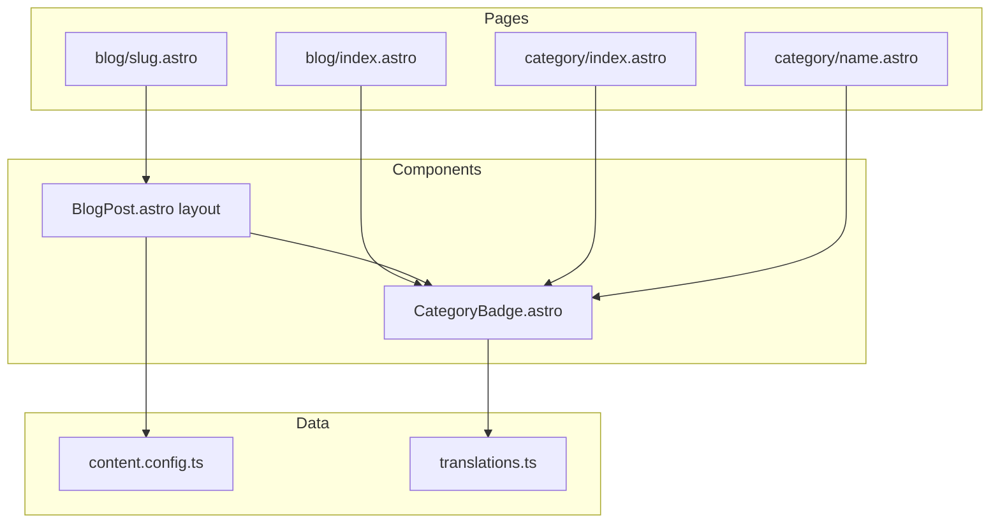

# Technical Design: Category UI Display

## Overview

**Purpose**: ブログ記事のカテゴリフィールドをUI上に表示し、カテゴリによるコンテンツナビゲーションを可能にする機能を提供する。

**Users**: ブログ読者がカテゴリを通じて関連記事を発見し、効率的にコンテンツを探索できるようになる。

**Impact**: 既存のBlogPostレイアウト、記事一覧ページ、i18n翻訳ファイルに変更を加え、新規でカテゴリ関連ページとコンポーネントを追加する。

### Goals
- 記事詳細ページでカテゴリを視覚的に表示
- 記事カードにカテゴリバッジを追加
- カテゴリ別・カテゴリ一覧ページによるナビゲーション提供
- 既存のタグ機能との視覚的区別を実現

### Non-Goals
- カテゴリの階層構造（タグのような親子関係）
- カテゴリの管理UI（フロントマターでの定義のみ）
- カテゴリのRSSフィード生成

## Architecture

### Existing Architecture Analysis
- **タグ実装パターン**: TagBadge/TagList コンポーネント、tags/index.astro + [...slug].astro ページ構造
- **コンテンツスキーマ**: `src/content.config.ts` で `category: z.string().optional().default('')` 定義済み
- **i18n**: `src/i18n/translations.ts` で ja/en 翻訳管理

### Architecture Pattern & Boundary Map



**Architecture Integration**:
- Selected pattern: コンポーネントベースアーキテクチャ（Astro標準）
- Domain boundaries: カテゴリUIはタグUIと独立、共通のスタイル変数を使用
- Existing patterns preserved: TagBadge/TagList のパターンを踏襲
- New components rationale: CategoryBadge は視覚的区別とコード独立性のため新規作成
- Steering compliance: TypeScript strict mode、Astro規約に準拠

### Technology Stack

| Layer | Choice / Version | Role in Feature | Notes |
|-------|------------------|-----------------|-------|
| Frontend | Astro v5 | ページ・コンポーネント生成 | 既存 |
| Styling | CSS Variables + Scoped CSS | テーマ対応・ダークモード | 既存パターン踏襲 |
| Data | Astro Content Collections | カテゴリデータ取得 | 既存スキーマ使用 |
| i18n | Custom translations.ts | 翻訳テキスト管理 | キー追加のみ |

## Requirements Traceability

| Requirement | Summary | Components | Interfaces | Flows |
|-------------|---------|------------|------------|-------|
| 1.1, 1.2, 1.3, 1.4 | 記事詳細ページカテゴリ表示 | BlogPost.astro, CategoryBadge | Props拡張 | - |
| 2.1, 2.2, 2.3 | 記事一覧カテゴリ表示 | blog/index.astro, CategoryBadge | - | - |
| 3.1, 3.2, 3.3, 3.4, 3.5 | カテゴリ別記事一覧 | category/[name].astro | getStaticPaths | カテゴリフィルタリング |
| 4.1, 4.2, 4.3, 4.4 | カテゴリ一覧ページ | category/index.astro | - | カテゴリ集計 |
| 5.1, 5.2, 5.3, 5.4 | CategoryBadgeコンポーネント | CategoryBadge.astro | Props型定義 | - |
| 6.1, 6.2, 6.3 | 国際化対応 | translations.ts | TranslationKeys拡張 | - |

## Components and Interfaces

| Component | Domain/Layer | Intent | Req Coverage | Key Dependencies | Contracts |
|-----------|--------------|--------|--------------|------------------|-----------|
| CategoryBadge | UI/Components | カテゴリバッジ表示 | 5.1-5.4 | translations.ts (P1) | Props |
| BlogPost.astro | UI/Layouts | 記事詳細レイアウト拡張 | 1.1-1.4 | CategoryBadge (P0), ContentConfig (P0) | Props |
| blog/index.astro | UI/Pages | 記事一覧ページ拡張 | 2.1-2.3 | CategoryBadge (P1) | - |
| category/index.astro | UI/Pages | カテゴリ一覧ページ | 4.1-4.4 | CategoryBadge (P0), translations.ts (P1) | - |
| category/[name].astro | UI/Pages | カテゴリ別記事一覧 | 3.1-3.5 | CategoryBadge (P0), Breadcrumb (P1) | getStaticPaths |
| translations.ts | Data/i18n | 翻訳キー追加 | 6.1-6.3 | - | TranslationKeys |

### UI Components

#### CategoryBadge.astro

| Field | Detail |
|-------|--------|
| Intent | 単一カテゴリをバッジ形式で表示する再利用可能コンポーネント |
| Requirements | 5.1, 5.2, 5.3, 5.4 |

**Responsibilities & Constraints**
- カテゴリ名とリンクURLを受け取り、スタイル付きバッジを表示
- ダークモード対応（CSS変数使用）
- ホバー・フォーカス時の視覚フィードバック提供
- アクセシビリティ要件（aria-label, role, tabindex）を満たす

**Dependencies**
- Outbound: translations.ts — aria-label翻訳 (P1)

**Contracts**: Props [x]

##### Props Interface
```typescript
interface Props {
  /** カテゴリ名 */
  category: string;
  /** カテゴリページへのURL（省略時はリンクなし） */
  href?: string;
  /** 記事数（省略時は表示しない） */
  count?: number;
  /** 追加のCSSクラス */
  className?: string;
  /** アクセシビリティ用のaria-label */
  ariaLabel?: string;
}
```

**Implementation Notes**
- Integration: TagBadge.astro のスタイルパターンを参考に、異なるカラースキーム（緑系）を適用
- Validation: category が空文字の場合は何も表示しない
- Risks: タグとの視覚的混同 → カラーで明確に区別

---

#### BlogPost.astro（既存レイアウト拡張）

| Field | Detail |
|-------|--------|
| Intent | 記事詳細ページのレイアウト。メタデータエリアにカテゴリ表示を追加 |
| Requirements | 1.1, 1.2, 1.3, 1.4 |

**Responsibilities & Constraints**
- article-meta セクションにカテゴリバッジを表示
- カテゴリが空の場合は非表示
- カテゴリクリックでカテゴリ別記事一覧に遷移

**Dependencies**
- Inbound: blog/[...slug].astro — category prop (P0)
- Outbound: CategoryBadge — カテゴリ表示 (P0)

**Contracts**: Props [x]

##### Props Interface（差分のみ）
```typescript
type Props = CollectionEntry<'blog'>['data'] & {
  // 既存props...
  /** 記事カテゴリ（オプション） */
  category?: string;
};
```

**Implementation Notes**
- Integration: 既存の article-meta 内に `.article-meta__category` として追加
- Validation: `category && category.trim() !== ''` でチェック

---

### Pages

#### category/index.astro

| Field | Detail |
|-------|--------|
| Intent | 全カテゴリの一覧を記事数と共に表示 |
| Requirements | 4.1, 4.2, 4.3, 4.4 |

**Responsibilities & Constraints**
- 全ブログ記事からカテゴリを収集・集計
- アルファベット順でソート
- 各カテゴリの記事数を表示

**Dependencies**
- Outbound: CategoryBadge — カテゴリ表示 (P0)
- Outbound: Breadcrumb — パンくずリスト (P1)
- External: astro:content — getCollection (P0)

**Implementation Notes**
- Integration: tags/index.astro のレイアウトを参考に実装
- Validation: 空カテゴリは除外

---

#### category/[name].astro

| Field | Detail |
|-------|--------|
| Intent | 特定カテゴリに属する記事一覧を表示 |
| Requirements | 3.1, 3.2, 3.3, 3.4, 3.5 |

**Responsibilities & Constraints**
- getStaticPaths で全カテゴリのパスを生成
- カテゴリ名をページタイトルに表示
- 該当記事がない場合は空メッセージ表示
- パンくずリストにカテゴリ名を含める

**Dependencies**
- Outbound: CategoryBadge — カテゴリ表示 (P1)
- Outbound: Breadcrumb — パンくずリスト (P0)
- Outbound: FormattedDate — 日付表示 (P1)
- External: astro:content — getCollection (P0)

**Contracts**: getStaticPaths [x]

##### getStaticPaths Contract
```typescript
export async function getStaticPaths() {
  const posts = await getCollection('blog', ({ data }) => {
    return import.meta.env.PROD ? data.draft !== true : true;
  });

  // カテゴリごとにグループ化
  const categories = new Map<string, number>();
  posts.forEach(post => {
    if (post.data.category) {
      categories.set(post.data.category, (categories.get(post.data.category) || 0) + 1);
    }
  });

  return Array.from(categories.keys()).map(category => ({
    params: { name: category.toLowerCase() },
    props: { category, posts }
  }));
}
```

**Implementation Notes**
- Integration: tags/[...slug].astro のパターンを踏襲
- Validation: カテゴリが見つからない場合は404

---

### Data/i18n

#### translations.ts（拡張）

| Field | Detail |
|-------|--------|
| Intent | カテゴリ関連UIテキストの翻訳定義追加 |
| Requirements | 6.1, 6.2, 6.3 |

**Contracts**: TranslationKeys [x]

##### TranslationKeys Interface（追加分）
```typescript
export interface TranslationKeys {
  // 既存キー...

  // カテゴリ関連
  'category.title': string;
  'category.backToList': string;
  'category.ariaLabel': string;
  'category.totalCategories': string;
  'category.posts': string;
  'category.noPostsFound': string;
  'category.noPostsFoundDesc': string;
  'breadcrumb.category': string;
  'nav.category': string;
}
```

##### Translation Values
```typescript
// ja
'category.title': 'カテゴリ一覧',
'category.backToList': 'カテゴリ一覧に戻る',
'category.ariaLabel': 'カテゴリ',
'category.totalCategories': '総カテゴリ数',
'category.posts': '件の記事',
'category.noPostsFound': '記事が見つかりません',
'category.noPostsFoundDesc': 'このカテゴリの記事はまだありません。',
'breadcrumb.category': 'カテゴリ',
'nav.category': 'カテゴリ',

// en
'category.title': 'Categories',
'category.backToList': 'Back to Categories',
'category.ariaLabel': 'Category',
'category.totalCategories': 'Total Categories',
'category.posts': ' posts',
'category.noPostsFound': 'No posts found',
'category.noPostsFoundDesc': 'There are no posts in this category yet.',
'breadcrumb.category': 'Category',
'nav.category': 'Category',
```

## Data Models

### Domain Model

カテゴリは記事フロントマターの単一文字列フィールドとして定義済み：

```typescript
// src/content.config.ts（既存）
category: z.string().optional().default('')
```

- **Aggregate**: BlogPost（記事が集約ルート）
- **Value Object**: category（文字列値）
- **Invariant**: 1記事につき0または1カテゴリ

### Logical Data Model

カテゴリ集計用の一時的データ構造：

```typescript
interface CategoryInfo {
  name: string;      // カテゴリ名
  count: number;     // 記事数
  slug: string;      // URLスラッグ（小文字）
}
```

## Error Handling

### Error Categories and Responses

**User Errors (4xx)**:
- 存在しないカテゴリへのアクセス → 404ページ表示（Astro標準）

**Business Logic Errors**:
- カテゴリ未設定記事 → カテゴリバッジ非表示（条件付きレンダリング）
- 該当カテゴリの記事0件 → 「記事がありません」メッセージ表示

## Testing Strategy

### Unit Tests
- CategoryBadge: Props による表示切り替え（href有無、count有無）
- 翻訳キー: ja/en 両言語の定義存在確認

### Integration Tests
- BlogPost レイアウト: category prop 渡し時の表示確認
- カテゴリページ: getStaticPaths による正しいパス生成

### E2E/UI Tests
- 記事詳細ページ: カテゴリバッジ表示・リンク遷移
- カテゴリ一覧ページ: カテゴリクリック → 記事一覧遷移
- ダークモード: カテゴリバッジのスタイル切り替え
