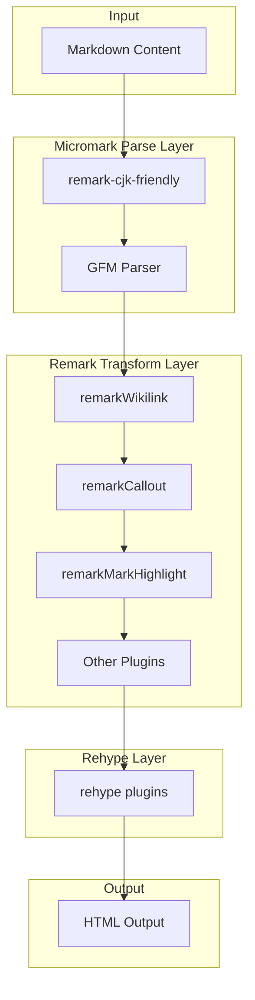
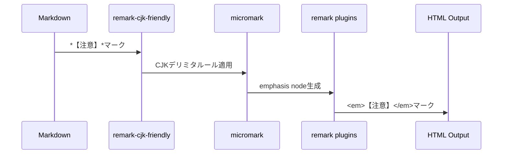

# Technical Design Document

## Overview

**Purpose**: CJK（中国語・日本語・韓国語）の括弧類と強調記法の組み合わせで発生するマークダウンレンダリング問題を解決し、日本語コンテンツの自然な表記をサポートする。

**Users**: itzpapaを使用するブログ執筆者が、`*【注意】*`や`==*（ハイライト内強調）*==`のような日本語表記を正しくレンダリングできるようになる。

**Impact**: `astro.config.mjs`にremark-cjk-friendlyプラグインを追加し、マークダウンパーサーのCJK文字処理を改善する。

### Goals

- CJK括弧を含むテキストで強調記法（`*text*`、`**text**`）が正しく動作する
- マークハイライト（`==text==`）と強調記法の入れ子構造が正しくレンダリングされる
- 既存機能（WikiLink、Callout、Task Status）との互換性を維持する

### Non-Goals

- GFM strikethrough（`~~text~~`）のCJK対応（必要に応じて別途対応）
- カスタムmicromark拡張の開発
- パフォーマンス最適化（計測後に必要であれば対応）

## Architecture

### Existing Architecture Analysis

現在のマークダウン処理パイプラインは以下の構造：

```
Markdown → micromark (parse) → remark (transform) → rehype → HTML
```

**現在のプラグイン処理順序**（`astro.config.mjs`）:
1. remarkWikilink（WikiLink処理）
2. remarkCallout（Callout構文）
3. remarkBreaks（改行処理）
4. remarkTaskStatus（タスクステータス）
5. remarkMarkHighlight（ハイライト記法）
6. remarkTags（タグ処理）

**制約**: micromarkパース段階で強調記法（`*`、`**`）が処理されるため、remarkプラグインでは強調記法の認識を変更できない。

### Architecture Pattern & Boundary Map



**Architecture Integration**:
- Selected pattern: Plugin composition（既存プラグイン構成への追加）
- Domain/feature boundaries: micromarkパース層でのCJK処理拡張
- Existing patterns preserved: commonRemarkPlugins配列構造、Astro設定パターン
- New components rationale: remark-cjk-friendly導入によりmicromarkのデリミタ処理を拡張
- Steering compliance: 外部パッケージ利用の標準パターンに準拠

### Technology Stack

| Layer | Choice / Version | Role in Feature | Notes |
|-------|------------------|-----------------|-------|
| Framework | Astro v5.13.7 | マークダウン処理基盤 | 既存 |
| Parser | remark v15.0.1 | マークダウン変換 | 既存 |
| **New Dependency** | remark-cjk-friendly v1.2.3 | CJK強調記法対応 | **追加** |
| Highlight | remark-mark-highlight | `==text==`処理 | 既存、変更なし |

## System Flows

### CJK強調記法処理フロー



**Key Decisions**:
- remark-cjk-friendlyはmicromarkパース前に実行され、CJK文字を単語境界として認識させる
- 既存のremarkプラグインは変更なしで動作継続

## Requirements Traceability

| Requirement | Summary | Components | Interfaces | Flows |
|-------------|---------|------------|------------|-------|
| 1.1, 1.2, 1.3 | CJK括弧+イタリック/太字 | remark-cjk-friendly | remarkPlugins配列 | CJK処理フロー |
| 1.4 | 日本語括弧サポート | remark-cjk-friendly | - | - |
| 2.1 | ハイライト+強調入れ子 | remark-cjk-friendly, remark-mark-highlight | - | CJK処理フロー |
| 2.2 | 太字+イタリック入れ子 | remark-cjk-friendly | - | - |
| 2.3 | 不正入れ子のフォールバック | micromark標準動作 | - | - |
| 3.1-3.5 | 既存機能互換性 | 全既存プラグイン | - | 変更なし |
| 4.1-4.2 | パフォーマンス維持 | remark-cjk-friendly | - | - |
| 5.1-5.4 | テストカバレッジ | テストスイート | - | - |

## Components and Interfaces

### Component Summary

| Component | Domain/Layer | Intent | Req Coverage | Key Dependencies | Contracts |
|-----------|--------------|--------|--------------|------------------|-----------|
| remark-cjk-friendly | Parser Extension | CJK強調記法対応 | 1.1-1.4, 2.1-2.2 | micromark (P0) | Plugin |
| astro.config.mjs | Configuration | プラグイン設定 | 全要件 | Astro (P0) | Config |
| CJK Test Suite | Testing | CJK対応テスト | 5.1-5.4 | node:test (P0) | Test |

### Parser Extension Layer

#### remark-cjk-friendly（外部パッケージ）

| Field | Detail |
|-------|--------|
| Intent | CommonMarkのデリミタ処理をCJK文字に対応させる |
| Requirements | 1.1, 1.2, 1.3, 1.4, 2.1, 2.2 |

**Responsibilities & Constraints**
- CJK文字（括弧類含む）を単語境界として認識
- CommonMark 0.31.2との互換性維持
- CJK以外の言語への影響なし

**Dependencies**
- Outbound: micromark — デリミタ処理拡張 (P0)
- External: unified ecosystem — remark統合 (P0)

**Contracts**: Plugin [ ✓ ]

##### Plugin Interface

```typescript
// remark-cjk-friendly プラグインインターフェース
import type { Plugin } from 'unified';

declare const remarkCjkFriendly: Plugin;
export default remarkCjkFriendly;
```

- Preconditions: remarkプラグイン配列の最初に配置
- Postconditions: CJK括弧を含む強調記法が正しくパースされる
- Invariants: 非CJKコンテンツの処理結果は変更なし

**Implementation Notes**
- Integration: `commonRemarkPlugins`配列の先頭に追加
- Validation: 既存テスト + CJK固有テストで検証
- Risks: 外部依存追加、バージョン互換性

### Configuration Layer

#### astro.config.mjs

| Field | Detail |
|-------|--------|
| Intent | remarkプラグイン設定の更新 |
| Requirements | 全要件 |

**変更内容**

```javascript
// Before
const commonRemarkPlugins = [
  [remarkWikilink, { priority: 'high' }],
  // ...
];

// After
import remarkCjkFriendly from 'remark-cjk-friendly';

const commonRemarkPlugins = [
  remarkCjkFriendly, // ← 最初に追加
  [remarkWikilink, { priority: 'high' }],
  // ...
];
```

**Implementation Notes**
- Integration: importステートメントとプラグイン配列への追加のみ
- Validation: ビルド成功 + 既存テストパス
- Risks: プラグイン順序ミス

### Testing Layer

#### CJK Test Suite

| Field | Detail |
|-------|--------|
| Intent | CJK括弧+強調記法の動作検証 |
| Requirements | 5.1, 5.2, 5.3, 5.4 |

**テストケース設計**

```typescript
// tests/unit/cjk-emphasis-test.js

interface CJKTestCase {
  input: string;
  expected: string;
  description: string;
}

// 必須テストケース（要件5.1より）
const requiredTestCases: CJKTestCase[] = [
  { input: '*【注意】*', expected: '<em>【注意】</em>', description: '隅付き括弧+イタリック' },
  { input: '*〈参考〉*', expected: '<em>〈参考〉</em>', description: '山括弧+イタリック' },
  { input: '==*（ハイライト内強調）*==', expected: '<mark><em>（ハイライト内強調）</em></mark>', description: 'ハイライト+イタリック入れ子' },
];

// CJK括弧全種テスト（要件5.2より）
const cjkBrackets = ['（）', '「」', '『』', '【】', '〈〉', '《》', '〔〕', '［］', '｛｝'];

// 入れ子パターンテスト（要件5.3より）
const nestedPatterns: CJKTestCase[] = [
  { input: '**（太字）**', expected: '<strong>（太字）</strong>', description: '太字+全角括弧' },
  { input: '***（太字斜体）***', expected: '<em><strong>（太字斜体）</strong></em>', description: '太字+斜体+全角括弧' },
];

// エッジケース（要件5.4より）
const edgeCases: CJKTestCase[] = [
  { input: '*【】*', expected: '<em>【】</em>', description: '空括弧' },
  { input: '**「」**', expected: '<strong>「」</strong>', description: '括弧のみ' },
];
```

**Implementation Notes**
- Integration: `tests/unit/`に新規テストファイル作成
- Validation: `npm run test:unit`で実行
- Risks: テストカバレッジ不足

## Error Handling

### Error Strategy

| シナリオ | 対応 | ユーザー影響 |
|---------|------|-------------|
| パッケージ未インストール | ビルドエラー | 明示的なエラーメッセージ |
| プラグイン順序誤り | CJK記法が動作しない | テストで検出 |
| 不正な入れ子構造 | 元テキストを表示 | 静かに失敗（既存動作維持） |

### Monitoring

- ビルド時のエラーログ
- テスト結果レポート

## Testing Strategy

### Unit Tests
- `*【注意】*` → `<em>【注意】</em>` 変換テスト
- `*〈参考〉*` → `<em>〈参考〉</em>` 変換テスト
- `==*（テキスト）*==` 入れ子構造テスト
- 全CJK括弧タイプ × 強調記法の組み合わせテスト
- エッジケース（空文字、括弧のみ）テスト

### Integration Tests
- WikiLinkとCJK強調の共存テスト
- CalloutブロックとCJK強調の共存テスト
- 既存テストスイートの回帰テスト

### E2E Tests
- ブログ記事ページでのCJK表示確認
- `src/content/blog/20260102-obsidian-syntax-demo/index.md`のレンダリング検証

## Performance & Scalability

### Target Metrics
- CJK処理による処理時間増加: 既存の2倍以内（要件4.1）
- ReDoS耐性: 維持（要件4.2）

### Measurement Strategy
- 既存パフォーマンステスト（`tests/performance/`）でベンチマーク
- 大量CJKコンテンツでの処理時間計測

## Supporting References

詳細な調査結果は`research.md`を参照:
- remark-cjk-friendlyバージョン互換性調査
- プラグイン実行順序の詳細分析
- アーキテクチャパターン評価
