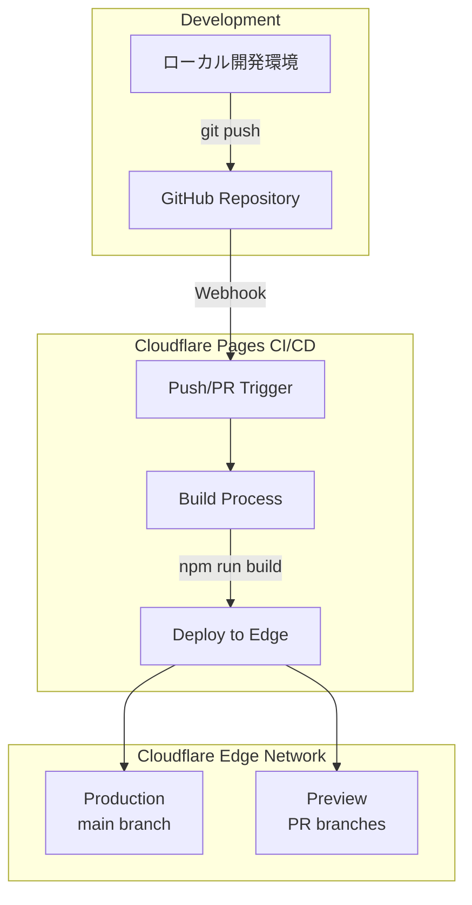
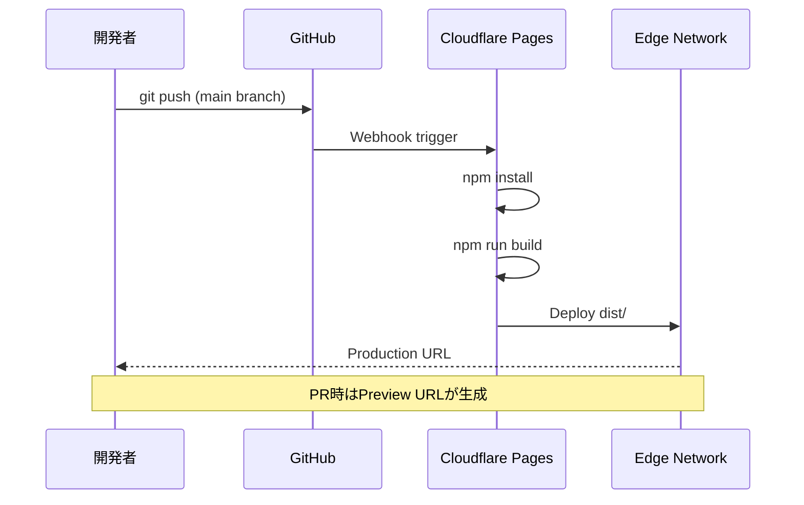

# Design Document: Cloudflare Pages Deploy

## Overview

**Purpose**: itzpapa（Astro v5ベースのObsidian互換ブログ）をCloudflare Pagesにデプロイし、グローバルエッジネットワークでの高速配信を実現する。

**Users**: プロジェクト開発者がGitHub連携による自動デプロイワークフローを利用する。

**Impact**: 新規デプロイパイプラインの追加。既存のビルドプロセス・コードへの変更は最小限。

### Goals
- Cloudflare Pagesへの静的サイトデプロイを実現
- GitHub連携による自動デプロイ（main push時）とプレビューデプロイ（PR時）を構成
- 既存のremark/rehypeプラグイン・ビルドプロセスとの互換性を維持

### Non-Goals
- SSR（サーバーサイドレンダリング）機能の追加（現時点では不要）
- Cloudflare Workers/Functions統合
- カスタムドメイン設定（Cloudflare側の設定は手動で実施）

## Architecture

### Existing Architecture Analysis

**現行アーキテクチャ**:
- Astro v5による静的サイトジェネレーション（SSG）
- ビルド出力: `dist/` ディレクトリ
- カスタムremark/rehypeプラグイン群（WikiLink、Callout、Tags等）
- `trailingSlash: 'always'` 設定による統一URL形式

**維持すべきパターン**:
- `npm run build`コマンドでの完全なビルド
- すべてのプラグイン設定（astro.config.mjs）
- sitemap/RSS生成（@astrojs/sitemap統合）

### Architecture Pattern & Boundary Map



**Architecture Integration**:
- **Selected pattern**: 静的サイトデプロイ（SSGモード、アダプターなし）
- **Domain boundaries**: ビルド成果物（`dist/`）をCloudflare Pagesにそのまま配信
- **Existing patterns preserved**: Astroビルドプロセス、プラグイン設定、sitemap/RSS生成
- **New components rationale**: wrangler.jsonc（オプション）はローカルプレビュー用
- **Steering compliance**: 既存tech.md記載のビルドコマンド・テスト体制を維持

### Technology Stack

| Layer | Choice / Version | Role in Feature | Notes |
|-------|------------------|-----------------|-------|
| Framework | Astro v5.13.7 | 静的サイトジェネレーション | 既存、変更なし |
| Hosting | Cloudflare Pages | エッジ配信・自動デプロイ | 新規追加 |
| CI/CD | Cloudflare Pages Build | ビルド実行環境 | Node.js 18+ |
| CLI Tool | Wrangler | ローカルプレビュー・デプロイ | オプション |

## System Flows

### デプロイフロー



## Requirements Traceability

| Requirement | Summary | Components | Interfaces | Flows |
|-------------|---------|------------|------------|-------|
| 1.1 | `@astrojs/cloudflare`インストール | N/A (不要) | N/A | N/A |
| 1.2 | アダプター設定 | N/A (不要) | N/A | N/A |
| 1.3 | Cloudflare Pages互換出力 | AstroBuild | dist/ | Deploy Flow |
| 1.4 | プラグイン設定維持 | astro.config.mjs | N/A | Build Flow |
| 2.1 | ビルドコマンド設定 | CloudflarePagesBuild | npm run build | Deploy Flow |
| 2.2 | 出力ディレクトリ設定 | CloudflarePagesBuild | dist/ | Deploy Flow |
| 2.3 | Node.jsバージョン設定 | CloudflarePagesBuild | NODE_VERSION | Deploy Flow |
| 2.4 | 自動デプロイ設定 | CloudflarePagesConfig | GitHub Webhook | Deploy Flow |
| 3.1 | SITE環境変数 | CloudflarePagesBuild | 環境変数 | Build Flow |
| 3.2 | 環境変数機能活用 | CloudflarePagesConfig | ダッシュボード | N/A |
| 3.3 | デプロイドキュメント | N/A | N/A | N/A |
| 4.1 | PRプレビュー生成 | CloudflarePagesConfig | 自動 | Preview Flow |
| 4.2 | プレビューURL提供 | CloudflarePages | 自動 | Preview Flow |
| 4.3 | プレビュー保持 | CloudflarePages | 自動 | N/A |
| 5.1 | remarkプラグインビルド | AstroBuild | N/A | Build Flow |
| 5.2 | rehypeプラグインビルド | AstroBuild | N/A | Build Flow |
| 5.3 | sitemap/RSS生成 | AstroBuild | N/A | Build Flow |
| 5.4 | 静的アセット出力 | AstroBuild | dist/ | Build Flow |
| 5.5 | trailingSlash動作 | CloudflarePages | ルーティング | N/A |

> **Note**: 要件1.1, 1.2について、調査の結果、静的サイト（SSG）では`@astrojs/cloudflare`アダプターは不要であることが判明。詳細は`research.md`参照。

## Components and Interfaces

| Component | Domain/Layer | Intent | Req Coverage | Key Dependencies | Contracts |
|-----------|--------------|--------|--------------|------------------|-----------|
| wrangler.jsonc | Config | Wrangler CLI設定 | 2.1, 2.2 | - | Config File |
| CloudflarePagesBuild | CI/CD | ビルド・デプロイ設定 | 2.1-2.4, 3.1-3.2 | GitHub (P0) | Platform Config |

### Configuration Layer

#### wrangler.jsonc

| Field | Detail |
|-------|--------|
| Intent | ローカルプレビューとデプロイ設定の明文化 |
| Requirements | 2.1, 2.2 |

**Responsibilities & Constraints**
- Wrangler CLIでのローカルプレビュー（`wrangler pages dev`）
- ビルド出力ディレクトリの指定
- Cloudflare Pages設定の明文化（ドキュメント目的）

**Dependencies**
- Inbound: なし
- Outbound: dist/ ディレクトリ — ビルド成果物参照 (P0)
- External: Wrangler CLI — ローカル開発ツール (P1)

**Contracts**: Config File [x]

##### Config Schema
```jsonc
{
  "name": "itzpapa",
  "compatibility_date": "2025-01-01",
  "pages_build_output_dir": "./dist"
}
```

**Implementation Notes**
- Integration: `.gitignore`に`.wrangler/`を追加
- Validation: `wrangler pages dev ./dist`でローカル動作確認
- Risks: wrangler.jsoncがなくてもCloudflare Pagesダッシュボードで設定可能

### CI/CD Layer

#### Cloudflare Pages Build Configuration

| Field | Detail |
|-------|--------|
| Intent | GitHub連携による自動ビルド・デプロイ |
| Requirements | 2.1-2.4, 3.1-3.2, 4.1-4.3, 5.1-5.5 |

**Responsibilities & Constraints**
- GitHub Webhookによるビルドトリガー
- Node.js環境でのAstroビルド実行
- Production（main）とPreview（PR）のデプロイ管理

**Dependencies**
- Inbound: GitHub Repository — ソースコード提供 (P0)
- Outbound: Cloudflare Edge Network — 配信先 (P0)
- External: npm registry — 依存関係取得 (P0)

**Contracts**: Platform Config [x]

##### Platform Configuration

**Build Settings** (Cloudflare Pagesダッシュボードで設定):

| Setting | Value | Notes |
|---------|-------|-------|
| Framework preset | Astro | 自動設定推奨 |
| Build command | `npm run build` | package.jsonのbuildスクリプト |
| Build output directory | `dist` | Astroデフォルト出力 |
| Root directory | `/` | プロジェクトルート |

**Environment Variables**:

| Variable | Value | Environment | Purpose |
|----------|-------|-------------|---------|
| NODE_VERSION | 18 | All | Node.jsバージョン指定 |
| SITE | https://itzpapa.hachian.com | Production | 本番サイトURL（オプション） |

**Implementation Notes**
- Integration: Cloudflare PagesダッシュボードでGitHubリポジトリを接続
- Validation: 初回デプロイ後にビルドログを確認、全プラグインが正常動作することを検証
- Risks: sharpパッケージのビルド互換性（Node.js 18で解決済み）

## Testing Strategy

### 検証項目

**ビルド検証**:
- ローカル`npm run build`が成功すること
- `wrangler pages dev ./dist`でローカルプレビューが動作すること
- すべてのremark/rehypeプラグインが正常に処理されること

**デプロイ検証**:
- Cloudflare Pagesへの初回デプロイが成功すること
- Production URL（main branch push）でサイトにアクセスできること
- Preview URL（PR作成時）でプレビューにアクセスできること

**機能検証**:
- WikiLink、Callout、Mark Highlight等のObsidian記法が正しく表示されること
- sitemap.xmlとRSSフィードが生成されていること
- `trailingSlash: 'always'`設定によるURL末尾スラッシュが正しく動作すること

### E2E Tests
1. デプロイ後のトップページ表示確認
2. ブログ記事ページの表示とObsidian記法レンダリング確認
3. タグページ・アーカイブページの動作確認
4. sitemap.xml、rss.xmlへのアクセス確認

## Error Handling

### Error Strategy

**ビルドエラー**:
- Cloudflare Pagesビルドログで詳細確認
- Node.jsバージョン不一致の場合はNODE_VERSION環境変数を調整
- 依存関係エラーの場合はpackage-lock.jsonを確認

**デプロイエラー**:
- Cloudflareダッシュボードでデプロイステータス確認
- 失敗時は前回成功デプロイが維持される（自動ロールバック）

### Monitoring
- Cloudflare Pagesダッシュボードでビルド履歴・ステータス確認
- Cloudflare Analyticsでトラフィック・エラー率監視

## Migration Strategy

### Phase 1: 準備
1. wrangler.jsonc作成（オプション）
2. .gitignoreに`.wrangler/`追加
3. ローカルビルド・プレビュー動作確認

### Phase 2: Cloudflare Pages設定
1. Cloudflare Pagesでプロジェクト作成
2. GitHubリポジトリ連携
3. ビルド設定（Build command, Output directory, NODE_VERSION）
4. 初回デプロイ実行

### Phase 3: 検証
1. Production URLでサイト動作確認
2. PRを作成してPreviewデプロイ確認
3. 全ページ・機能の動作検証

### Rollback Plan
- Cloudflare Pagesは前回成功デプロイを保持
- ダッシュボードから任意のデプロイにロールバック可能
- 問題発生時はGitHubでrevertしてre-deploy
