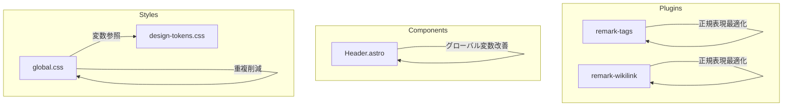

# Technical Design Document

## Overview

**Purpose**: コードベース改善Phase 2は、Phase 1で整備されたテスト基盤を活用し、プラグインの正規表現最適化、グローバル変数の堅牢化、CSSダークモードスタイルの重複削減を実現する。

**Users**: 開発者がビルド時のパフォーマンス向上、View Transitions時の安定動作、CSS保守性向上の恩恵を受ける。

**Impact**: 既存のプラグイン、コンポーネント、CSSファイルを修正するが、機能的な変更はなく、出力は同一を維持する。

### Goals

- 正規表現の事前コンパイルによるビルド時パフォーマンス向上
- グローバル変数パターンの廃止によるView Transitions対応の堅牢化
- CSSダークモードスタイルの重複削減による保守性向上

### Non-Goals

- プラグインのTypeScript化
- E2Eテストの新規追加
- ビジュアルリグレッションテストの導入
- 正規表現のメモ化（設定依存の正規表現は今回スコープ外）

---

## Architecture

### Existing Architecture Analysis

現在のシステムは以下の構成を持つ：

- **remark/rehypeプラグイン**: `src/plugins/`に配置、JavaScriptで実装
- **Astroコンポーネント**: `src/components/`に配置、スコープ付きCSS
- **グローバルCSS**: `src/styles/`に配置、design-tokens.cssを基盤とする

修正対象：
1. `src/plugins/remark-tags/index.js` - 正規表現最適化
2. `src/plugins/remark-wikilink/index.js` - 正規表現最適化
3. `src/components/Header.astro` - グローバル変数改善
4. `src/styles/global.css` - ダークモード重複削減

### Architecture Pattern & Boundary Map



**Architecture Integration**:
- 選択パターン: インプレースリファクタリング（既存ファイルの修正のみ）
- ドメイン境界: 変更なし（各プラグイン、コンポーネント、CSSファイルは独立）
- 既存パターン維持: プラグイン構造、コンポーネントスクリプト構造、CSS設計方針
- 新規コンポーネント: なし
- Steering準拠: JavaScriptプラグイン、相対パス使用、機能ベース分割

### Technology Stack

| Layer | Choice / Version | Role in Feature | Notes |
|-------|------------------|-----------------|-------|
| Plugins | JavaScript (ES Modules) | remark/rehypeプラグイン | TypeScript化は対象外 |
| Components | Astro v5 + TypeScript | Header.astroスクリプト | DOM標準APIを使用 |
| Styles | CSS3 | ダークモードスタイル | CSS変数ベース |

---

## Requirements Traceability

| Requirement | Summary | Components | Interfaces | Flows |
|-------------|---------|------------|------------|-------|
| 1.1 | remark-tagsの正規表現事前コンパイル | remark-tags/index.js | - | - |
| 1.2 | remark-wikilinkの正規表現モジュールスコープ化 | remark-wikilink/index.js | - | - |
| 1.3 | ビルド出力同一性 | 全対象ファイル | - | ビルド比較 |
| 1.4 | テスト全パス | 全対象ファイル | - | テスト実行 |
| 1.5 | new RegExp呼び出し最適化 | remark-tags/index.js | - | - |
| 2.1 | document直接プロパティ追加回避 | Header.astro | - | - |
| 2.2 | data属性でフラグ管理 | Header.astro | - | - |
| 2.3 | View Transitionsでメニュー正常動作 | Header.astro | - | 手動テスト |
| 2.4 | ページ遷移時メニューリセット | Header.astro | - | 手動テスト |
| 2.5 | `(document as any)`パターン廃止 | Header.astro | - | - |
| 3.1 | design-tokens.cssでCSS変数一元管理 | design-tokens.css | - | - |
| 3.2 | global.cssのCSS変数上書き廃止 | global.css | - | - |
| 3.3 | ダークモード視覚的同一性 | global.css | - | 手動テスト |
| 3.4 | OSダークモード視覚的同一性 | global.css | - | 手動テスト |
| 3.5 | html.dark内重複定義解消 | global.css | - | - |
| 3.6 | global.cssはコンポーネント固有スタイルのみ | global.css | - | - |

---

## Components and Interfaces

| Component | Domain/Layer | Intent | Req Coverage | Key Dependencies | Contracts |
|-----------|--------------|--------|--------------|------------------|-----------|
| remark-tags | Plugins | タグ処理プラグイン | 1.1, 1.3, 1.4, 1.5 | unist-util-visit (P0) | - |
| remark-wikilink | Plugins | WikiLink処理プラグイン | 1.2, 1.3, 1.4 | unist-util-visit (P0), utils (P1) | - |
| Header.astro | Components | ヘッダーナビゲーション | 2.1-2.5 | Astro View Transitions (P0) | - |
| global.css | Styles | グローバルスタイル | 3.1-3.6 | design-tokens.css (P0) | - |

### Plugins Layer

#### remark-tags

| Field | Detail |
|-------|--------|
| Intent | Obsidian形式のタグ（#tag, #parent/child）をリンクまたはspanに変換 |
| Requirements | 1.1, 1.3, 1.4, 1.5 |

**Responsibilities & Constraints**
- テキストノード内のタグパターンを検出し、リンクノードまたはspanノードに変換
- 設定値（tagPrefix, hierarchySeparator）に依存する正規表現の生成
- 現状: 関数内で毎回`new RegExp()`を実行

**Dependencies**
- Inbound: Astro Build System — プラグイン実行 (P0)
- Outbound: unist-util-visit — ASTトラバース (P0)

**Implementation Notes**

現在の問題箇所と最適化方針：

```javascript
// 現状（66-68行目）: 関数内で毎回生成
const tagRegex = new RegExp(
  `${escapeRegExp(config.tagPrefix)}...`,
  'g'
);

// 現状（196-204行目）: normalizeTag関数内で毎回生成
normalized = normalized.replace(
  new RegExp(`${escapeRegExp(config.hierarchySeparator)}+`, 'g'),
  ...
);
```

**最適化設計**:
- 設定依存の正規表現は現状維持（メモ化は将来課題）
- 正規表現オブジェクトの生成自体は軽量であり、ビルド全体への影響は軽微
- ただし、一部の定数パターン（`escapeRegExp`用の正規表現など）はモジュールスコープに移動可能

```javascript
// 最適化後（モジュールスコープに移動可能な部分）
const ESCAPE_REGEX_SPECIAL_CHARS = /[.*+?^${}()|[\]\\]/g;

function escapeRegExp(string) {
  return string.replace(ESCAPE_REGEX_SPECIAL_CHARS, '\\$&');
}
```

#### remark-wikilink

| Field | Detail |
|-------|--------|
| Intent | WikiLink記法（[[path]]、[[path\|alias]]）をリンクノードに変換 |
| Requirements | 1.2, 1.3, 1.4 |

**Responsibilities & Constraints**
- テキストノード内のWikiLinkパターンを検出し、リンクノードに変換
- 画像WikiLink、エイリアス、アンカーリンクを処理

**Dependencies**
- Inbound: Astro Build System — プラグイン実行 (P0)
- Outbound: unist-util-visit — ASTトラバース (P0)
- Outbound: ../utils/index.js — URL構築ユーティリティ (P1)

**Implementation Notes**

現在の問題箇所と最適化方針：

```javascript
// 現状（12行目）: 関数内で定義されているが設定非依存
const wikilinkMatch = node.url.match(/^\[\[([^\]]+?)(?:(?:\\\||<<<PIPE>>>|\|)([^\]]+?))?\]\]$/);

// 現状（104行目）: 設定非依存
text = text.replace(/\[\[([^\]|]+)\|((?:[^\]]|\](?!\]))+)\]\]/g, ...);

// 現状（111行目）: 設定非依存
const wikilinkRegex = /(!?)\[\[([^\]|]+?)(?:(?:\\\||<<<PIPE>>>|\|)((?:[^\]]|\](?!\]))+?))?\]\]/g;
```

**最適化設計**:
```javascript
// 最適化後: モジュールスコープに移動
const WIKILINK_URL_PATTERN = /^\[\[([^\]]+?)(?:(?:\\\||<<<PIPE>>>|\|)([^\]]+?))?\]\]$/;
const WIKILINK_PIPE_REPLACE_PATTERN = /\[\[([^\]|]+)\|((?:[^\]]|\](?!\]))+)\]\]/g;
const WIKILINK_MAIN_PATTERN = /(!?)\[\[([^\]|]+?)(?:(?:\\\||<<<PIPE>>>|\|)((?:[^\]]|\](?!\]))+?))?\]\]/g;
const FILE_EXTENSION_PATTERN = /\.(md|mdx|png|jpg|jpeg|gif|svg|webp)$/i;
const INDEX_SUFFIX_PATTERN = /\/index$/;
```

### Components Layer

#### Header.astro

| Field | Detail |
|-------|--------|
| Intent | ヘッダーナビゲーションとモバイルメニュー機能を提供 |
| Requirements | 2.1, 2.2, 2.3, 2.4, 2.5 |

**Responsibilities & Constraints**
- モバイルメニューの開閉制御
- グローバルイベントリスナー（click, keydown）の登録
- View Transitions時の状態リセット

**Dependencies**
- Inbound: Astro Router — View Transitions (P0)
- Outbound: DOM API — イベント処理 (P0)

**Implementation Notes**

現在の問題箇所：
```typescript
// 現状（131-132行目）: document直接プロパティ追加
if (!(document as any).__mobileMenuGlobalListeners) {
  (document as any).__mobileMenuGlobalListeners = true;
```

**最適化設計**:
```typescript
// 最適化後: document.body.datasetでフラグ管理
const GLOBAL_INIT_FLAG = 'mobileMenuGlobalInit';

// グローバルイベントリスナーの登録
if (!document.body.dataset[GLOBAL_INIT_FLAG]) {
  document.body.dataset[GLOBAL_INIT_FLAG] = 'true';

  // メニュー外クリックで閉じる
  document.addEventListener('click', (e) => { ... });

  // Escキーで閉じる
  document.addEventListener('keydown', (e) => { ... });
}
```

**View Transitions対応**:
- `transition:persist`属性によりヘッダー要素は永続化
- `astro:after-swap`イベントで`setupMobileMenu`が再実行
- `document.body`はView Transitions後も同一インスタンスを維持

### Styles Layer

#### global.css

| Field | Detail |
|-------|--------|
| Intent | グローバルなHTMLスタイルとダークモード対応 |
| Requirements | 3.1, 3.2, 3.3, 3.4, 3.5, 3.6 |

**Responsibilities & Constraints**
- 基本HTML要素のスタイル定義（body, h1-h6, a, p, code, etc.）
- ダークモードでの要素固有スタイル上書き
- design-tokens.cssで定義されたCSS変数を参照

**Dependencies**
- Inbound: Astro Layout — スタイル適用 (P0)
- Outbound: design-tokens.css — CSS変数 (P0)

**Implementation Notes**

現在の問題箇所：
```css
/* 317-368行目: html.dark ブロック */
html.dark body { ... }
html.dark ::selection { ... }
/* ... 多数のスタイル ... */

/* 370-411行目: @media (prefers-color-scheme: dark) ブロック */
@media (prefers-color-scheme: dark) {
  :root:not(.light) body { ... }
  :root:not(.light) ::selection { ... }
  /* ... 同一内容の重複 ... */
}
```

**最適化設計**:

design-tokens.cssは既に適切に構造化されているため変更不要。global.cssの重複のみを解消：

```css
/* 最適化後: 共通スタイルを定義し、セレクタを統合 */

/* ダークモード要素スタイル（html.dark または OSダークモード時） */
html.dark body,
:root:not(.light) body {
  background-color: var(--color-background);
  background-image: linear-gradient(...);
}

/* 注: @media (prefers-color-scheme: dark) 内で :root:not(.light) を使用 */
@media (prefers-color-scheme: dark) {
  /* 上記セレクタと統合可能な部分を削除 */
  /* media query固有の処理のみ残す */
}
```

**CSS特定度の考慮**:
- `html.dark`: 特定度 = 0,1,0 (クラスセレクタ)
- `:root:not(.light)`: 特定度 = 0,2,0 (疑似クラス + :not)
- 統合時は特定度の高い方に合わせるか、`:where()`で調整

**実装上の注意**:
- CSSカスケード順序を維持するため、メディアクエリブロックは維持
- セレクタの順序変更による副作用を避けるため、慎重に確認

---

## Testing Strategy

### Unit Tests

Phase 1で整備された既存テストを活用：

- `tests/unit/wikilink-unit-test.js` — WikiLink変換の回帰テスト
- `tests/unit/tags-unit-test.js` — タグ処理の回帰テスト
- `tests/unit/mark-highlight-unit-test.js` — ハイライト処理の回帰テスト
- `tests/unit/callout-test.js` — Callout処理の回帰テスト

テスト実行: `npm run test`

### Integration Tests

- **ビルド出力比較**: 変更前後の`dist/`ディレクトリを比較し、出力が同一であることを確認
- **開発サーバー動作確認**: `npm run dev`で動作確認

### Manual Tests

- **View Transitions動作確認**:
  1. モバイル画面幅でメニューを開閉
  2. メニューを開いた状態でページ遷移
  3. 遷移後にメニューが閉じていることを確認
  4. 遷移後にメニューが正常に開閉できることを確認

- **ダークモード動作確認**:
  1. ライトモード→ダークモード切替で視覚的変化がないこと
  2. OSダークモード設定での表示確認
  3. 各要素（body, selection, code, strong, em, blockquote）の表示確認

---

## Error Handling

### Error Strategy

- 正規表現変更による構文エラー: ビルド時に即座に検出される
- CSS変更によるスタイル崩れ: 開発サーバーで視覚的に確認
- イベントリスナー重複: data属性フラグで確実に防止

### Monitoring

- ビルドログでエラー検出
- 開発サーバーのコンソールでJavaScriptエラー検出
- ブラウザ開発者ツールでCSSエラー検出
