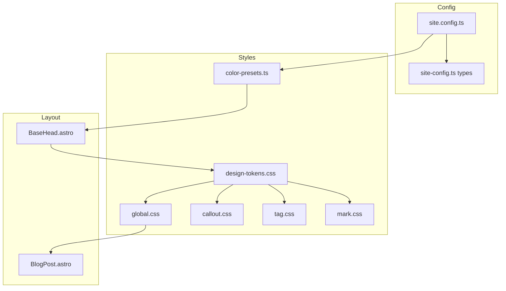

# Design Document: 配色スキームの見直し

## Overview

**Purpose**: itzpapaブログテンプレートの配色スキームを改善し、プリセット配色、アクセシビリティ対応、ダークモード最適化、本文エリアの視覚的分離を実現する。

**Users**: サイト管理者（配色カスタマイズ）、読者（快適な閲覧体験）、開発者（保守性向上）

**Impact**: 既存のOKLCHベースカラーシステムを拡張。design-tokens.css、site.config.ts、BlogPost.astroに変更を加える。

### Goals
- プリセット配色による簡単なテーマカスタマイズ
- WCAG 2.1 AA準拠のアクセシビリティ
- ライト/ダークモードの統一感と快適性
- ブログ本文エリアの視覚的分離

### Non-Goals
- ランタイムでのプリセット切り替えUI（ダークモード切り替えは既存）
- カスタムカラーピッカー機能
- 印刷スタイルの最適化（既存維持）

## Architecture

### Existing Architecture Analysis
- **現在のパターン**: OKLCHベースのCSS変数システム、`--primary-hue`による動的パレット生成
- **ドメイン境界**: スタイル定義は`src/styles/`に集約、設定は`site.config.ts`
- **維持すべき統合点**: ダークモード切り替え（html.dark / prefers-color-scheme）、Astroコンポーネントとの連携
- **技術的負債**: Callout色が固定色相で統一感に欠ける

### Architecture Pattern & Boundary Map



**Architecture Integration**:
- **Selected pattern**: CSS変数ベースのデザイントークンシステム（既存拡張）
- **Domain boundaries**: 設定（site.config.ts）→ プリセット解決（color-presets.ts）→ CSS変数生成（BaseHead.astro）→ スタイル適用
- **Existing patterns preserved**: OKLCH色空間、CSS変数命名規則、ダークモード対応パターン
- **New components rationale**: color-presets.tsはプリセット定義と解決ロジックを集約
- **Steering compliance**: TypeScript strict mode、機能別CSS分離

### Technology Stack

| Layer | Choice / Version | Role in Feature | Notes |
|-------|------------------|-----------------|-------|
| Frontend | Astro v5 | ビルド時CSS変数注入 | 既存 |
| Styling | CSS (OKLCH) | デザイントークン定義 | 既存拡張 |
| Config | TypeScript | プリセット型定義 | 新規追加 |
| Validation | Playwright | 視覚的検証 | 既存活用 |

## Requirements Traceability

| Requirement | Summary | Components | Interfaces | Notes |
|-------------|---------|------------|------------|-------|
| 1.1-1.4 | プリセット配色 | ColorPresets, SiteConfig, BaseHead | ThemeConfig, ColorPreset | プリセット名or数値 |
| 2.1-2.4 | アクセシビリティ | DesignTokens | - | OKLCH明度調整 |
| 3.1-3.4 | セマンティックカラー | DesignTokens | - | 新規CSS変数 |
| 4.1-4.5 | ダークモード最適化 | DesignTokens | - | 明度20%以上 |
| 5.1-5.4 | Obsidian要素統一 | CalloutCSS, TagCSS, MarkCSS | - | 色相オフセット |
| 6.1-6.4 | モード統一感 | DesignTokens | - | 相対的明度維持 |
| 7.1-7.4 | 本文背景分離 | BlogPost, GlobalCSS | - | サーフェス色適用 |

## Components and Interfaces

| Component | Domain/Layer | Intent | Req Coverage | Key Dependencies | Contracts |
|-----------|--------------|--------|--------------|------------------|-----------|
| ColorPresets | Config | プリセット定義と解決 | 1.1-1.4 | SiteConfig (P0) | Service |
| DesignTokens | Styles | CSS変数定義 | 2.1-4.5, 6.1-6.4 | - | State |
| BaseHead | Layout | CSS変数注入 | 1.1-1.4 | ColorPresets (P0) | - |
| BlogPost | Layout | 本文背景分離 | 7.1-7.4 | DesignTokens (P0) | - |
| SemanticColors | Styles | 状態色定義 | 3.1-3.4 | DesignTokens (P0) | State |

### Config Layer

#### ColorPresets

| Field | Detail |
|-------|--------|
| Intent | プリセット配色の定義と解決ロジックを提供 |
| Requirements | 1.1, 1.2, 1.3, 1.4 |

**Responsibilities & Constraints**
- プリセット名から色相値への変換
- 無効なプリセット名のフォールバック処理
- 数値指定（0-360）の直接サポート

**Dependencies**
- Outbound: BaseHead.astro — プリセット解決結果の提供 (P0)

**Contracts**: Service [x]

##### Service Interface
```typescript
/** 配色プリセットの定義 */
interface ColorPreset {
  name: string;
  primaryHue: number;
  description: string;
}

/** プリセット一覧 */
const COLOR_PRESETS: readonly ColorPreset[] = [
  { name: 'purple', primaryHue: 293, description: '紫（デフォルト）' },
  { name: 'ocean', primaryHue: 220, description: '青・海' },
  { name: 'forest', primaryHue: 145, description: '緑・森' },
  { name: 'sunset', primaryHue: 25, description: 'オレンジ・夕焼け' },
  { name: 'mono', primaryHue: 0, description: 'モノクロ' },
] as const;

/** プリセット解決関数 */
function resolveColorPreset(
  input: string | number
): { primaryHue: number; presetName: string | null } {
  // 数値の場合はそのまま使用
  if (typeof input === 'number') {
    return { primaryHue: Math.max(0, Math.min(360, input)), presetName: null };
  }
  // プリセット名の場合は検索
  const preset = COLOR_PRESETS.find(p => p.name === input);
  if (preset) {
    return { primaryHue: preset.primaryHue, presetName: preset.name };
  }
  // フォールバック: デフォルトの紫
  return { primaryHue: 293, presetName: 'purple' };
}
```

**Implementation Notes**
- Integration: BaseHead.astroで呼び出し、`<style>`タグに`--primary-hue`を注入
- Validation: プリセット名は小文字英字のみ許可
- Risks: 新規プリセット追加時の型定義更新忘れ

### Styles Layer

#### DesignTokens (design-tokens.css)

| Field | Detail |
|-------|--------|
| Intent | OKLCHベースのCSS変数定義、ダークモード対応 |
| Requirements | 2.1-2.4, 3.1-3.4, 4.1-4.5, 6.1-6.4 |

**Responsibilities & Constraints**
- プライマリカラーパレット（50-900）の定義
- セマンティックカラー（background, surface, text, accent）の定義
- 新規: 状態色（success, warning, error, info）の追加
- ダークモード明度の最適化（背景20%以上）

**Dependencies**
- Inbound: 全CSSファイル — 変数参照 (P0)

**Contracts**: State [x]

##### State Management

**ライトモード基本色（変更なし）**
```css
:root {
  --color-background: var(--color-gray-50);  /* oklch(98% 0.005 280) */
  --color-surface: oklch(100% 0 0);          /* 白 */
  --color-text-primary: var(--color-gray-900);
  --color-text-secondary: var(--color-gray-600);
}
```

**ダークモード最適化（明度調整）**
```css
html.dark {
  /* 背景: 15% → 22% に明度UP */
  --color-gray-900: oklch(22% 0.010 var(--primary-hue));
  /* サーフェス: 25% → 30% に明度UP */
  --color-gray-800: oklch(30% 0.012 var(--primary-hue));

  --color-background: var(--color-gray-900);
  --color-surface: var(--color-gray-800);
}
```

**セマンティック状態色（新規追加）**
```css
:root {
  /* Success - Green */
  --color-success: oklch(65% 0.20 145);
  --color-success-bg: oklch(65% 0.20 145 / 0.1);

  /* Warning - Yellow/Orange */
  --color-warning: oklch(75% 0.18 75);
  --color-warning-bg: oklch(75% 0.18 75 / 0.1);

  /* Error - Red */
  --color-error: oklch(60% 0.25 25);
  --color-error-bg: oklch(60% 0.25 25 / 0.1);

  /* Info - Blue */
  --color-info: oklch(65% 0.20 260);
  --color-info-bg: oklch(65% 0.20 260 / 0.1);
}

html.dark {
  --color-success: oklch(75% 0.18 145);
  --color-success-bg: oklch(75% 0.18 145 / 0.15);

  --color-warning: oklch(85% 0.16 75);
  --color-warning-bg: oklch(85% 0.16 75 / 0.15);

  --color-error: oklch(70% 0.22 25);
  --color-error-bg: oklch(70% 0.22 25 / 0.15);

  --color-info: oklch(75% 0.18 260);
  --color-info-bg: oklch(75% 0.18 260 / 0.15);
}
```

**コンポーネント色変数（新規追加）**
```css
:root {
  /* Article Card */
  --article-bg: var(--color-surface);
  --article-border: var(--color-gray-200);
  --article-shadow: var(--shadow-md);

  /* Card */
  --card-bg: var(--color-surface);
  --card-border: var(--color-gray-200);
}

html.dark {
  --article-border: var(--color-gray-700);
  --card-border: var(--color-gray-700);
}
```

**Implementation Notes**
- Integration: グレースケールの色相をプライマリhueと連動させるオプション検討
- Validation: WCAG AA（4.5:1）を各組み合わせで検証
- Risks: 既存ダークモードユーザーの体験変化

### Layout Layer

#### BlogPost.astro

| Field | Detail |
|-------|--------|
| Intent | ブログ記事レイアウト、本文背景分離 |
| Requirements | 7.1, 7.2, 7.3, 7.4 |

**Responsibilities & Constraints**
- 記事本文エリアに背景色を適用
- ページ背景との視覚的コントラスト確保
- 既存レイアウト構造の維持

**Dependencies**
- Inbound: DesignTokens — CSS変数 (P0)

**Contracts**: State [x]

##### State Management

**本文エリアスタイル（追加）**
```css
.prose.blog-content {
  background-color: var(--article-bg);
  border-radius: var(--radius-xl);
  padding: var(--space-8);
  box-shadow: var(--article-shadow);
}

/* ライトモード: 白背景 + 薄いグレーページ背景 */
/* ダークモード: 明るめダークグレー背景 + 暗いページ背景 */
```

**Implementation Notes**
- Integration: `.blog-layout-with-toc`との組み合わせ調整が必要
- Validation: モバイル時のパディング調整
- Risks: 既存マージン/パディングとの競合

### Obsidian互換要素

#### Callout/Tag/Mark配色調整

| Field | Detail |
|-------|--------|
| Intent | プライマリカラーとの調和 |
| Requirements | 5.1, 5.2, 5.3, 5.4 |

**Implementation Notes**
- Callout: 既存の固定色相を維持（機能的意味を持つため）
- タグ: `--tag-bg`, `--tag-color`がプライマリから派生済み（変更不要）
- マーク: プライマリhueに応じた補色または類似色の選択オプション

## Testing Strategy

### Unit Tests
- ColorPresets: プリセット解決ロジック（有効名、無効名、数値、範囲外数値）
- CSS変数: OKLCH値の正当性チェック

### Integration Tests
- ダークモード切り替え時の変数適用確認
- プリセット変更後のビルド成功確認

### E2E/UI Tests (Playwright)
- ホームページ: ライト/ダークモードのスクリーンショット比較
- ブログ記事: 本文背景分離の視覚確認
- タグページ: タグ配色の確認
- レスポンシブ: 3ビューポート（1280px, 768px, 375px）での確認

### Verification Checklist (Playwright)
各実装段階で以下を確認:
1. 変更前スクリーンショット取得
2. CSS変更適用
3. ライトモード確認
4. ダークモード確認
5. 変更後スクリーンショット取得
6. 差分が意図通りか確認

## Error Handling

### Error Categories and Responses
- **Invalid Preset Name**: フォールバックでデフォルト紫を適用、コンソール警告
- **Out of Range Hue**: 0-360にクランプ
- **Missing CSS Variable**: フォールバック値をCSS内で定義

## Optional Sections

### Security Considerations
該当なし（フロントエンドスタイリングのみ）

### Performance & Scalability
- CSS変数数は最小限に維持（既存パターン踏襲）
- プリセット解決はビルド時のみ実行（ランタイム負荷なし）

### Migration Strategy
1. design-tokens.cssの変数追加（後方互換）
2. ダークモード明度調整
3. BlogPost.astroの背景分離
4. site.config.ts型拡張（プリセット対応）
5. 全ページのPlaywright確認
