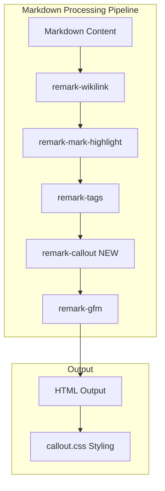
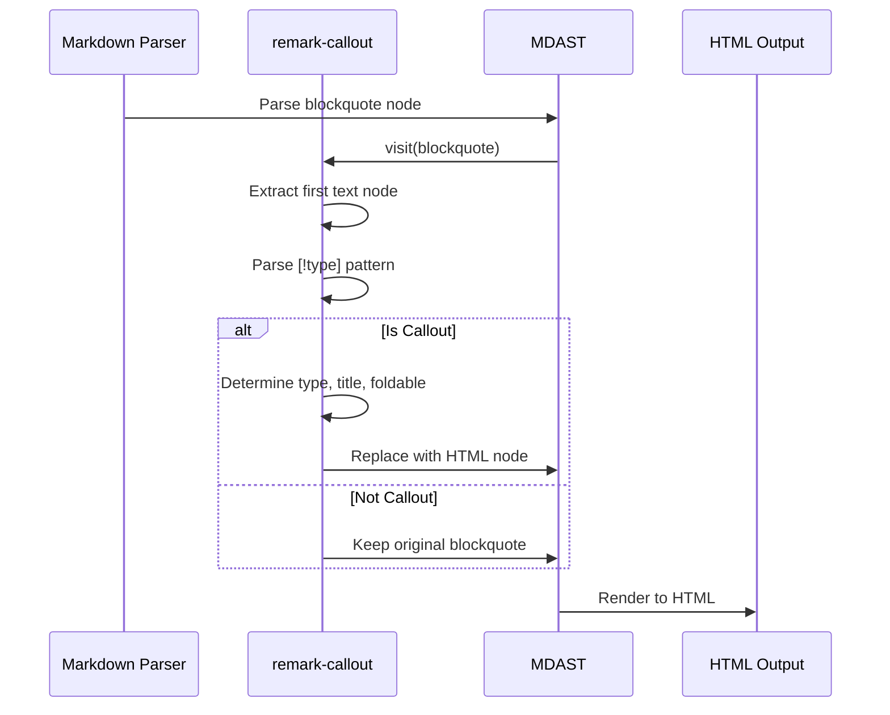
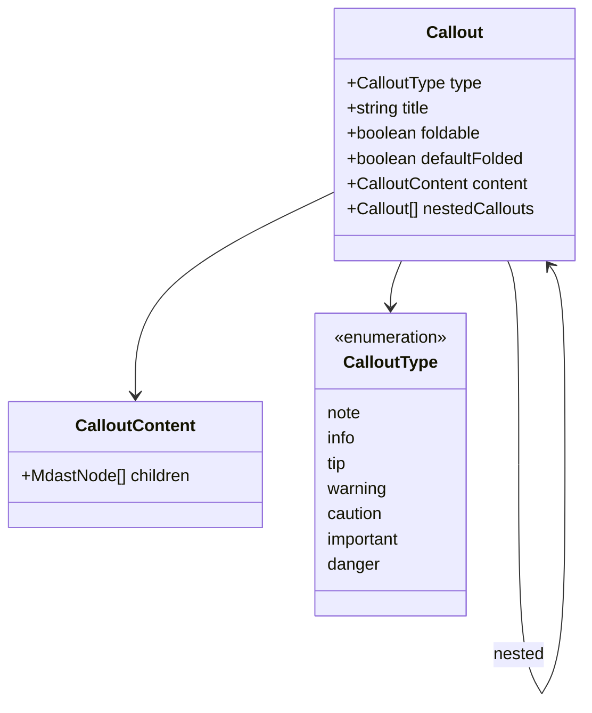

# Design Document: custom-callout

## Overview

**Purpose**: rehype-calloutsライブラリへの依存を排除し、プロジェクト独自のコールアウト処理を実現することで、外部依存削減とカスタマイズ性向上を達成する。

**Users**: コンテンツ作成者がObsidian形式のコールアウト記法（`[!type]`）をそのまま使用でき、サイト訪問者はライト/ダークモードで適切にスタイリングされたコールアウトを閲覧できる。

**Impact**: 現在のrehype-callouts依存を完全に置換し、`src/plugins/remark-callout/`に自前実装を配置。既存コンテンツとの完全な後方互換性を維持。

### Goals
- Obsidian互換のコールアウト構文（`[!type]`、折りたたみ、カスタムタイトル）を完全サポート
- 既存のremarkプラグインアーキテクチャとの一貫性維持
- OKLCHベースの7種類のコールアウトタイプ別カラースキーム実装
- rehype-callouts依存の完全削除

### Non-Goals
- GitHub風アラート構文のサポート（Obsidian構文のみ）
- 4レベル以上のネスト対応
- カスタムコールアウトタイプの動的追加機能

## Architecture

### Existing Architecture Analysis

現在のプロジェクトは3つの自前remarkプラグインを`src/plugins/`に配置：
- `remark-wikilink` — WikiLink記法処理
- `remark-mark-highlight` — ==ハイライト==記法処理
- `remark-tags` — #タグ記法処理

全プラグインが統一パターンを使用：
- `unist-util-visit`によるAST走査
- ESModuleスタイル
- `parent.children.splice()`によるノード置換

コールアウトは現在`rehype-callouts`（rehypeプラグイン）で処理されているが、プロジェクトの自前プラグインはすべてremarkで統一されている。

### Architecture Pattern & Boundary Map



**Architecture Integration**:
- **Selected pattern**: remarkプラグイン（既存パターン準拠）
- **Domain boundaries**: プラグインはMarkdown AST変換のみ担当、スタイリングはCSSに分離
- **Existing patterns preserved**: `unist-util-visit`、ESModule、`parent.children.splice()`
- **New components rationale**: 外部依存削除のため自前実装が必要
- **Steering compliance**: tech.mdの「カスタムremarkプラグイン」方針に準拠

### Technology Stack

| Layer | Choice / Version | Role in Feature | Notes |
|-------|------------------|-----------------|-------|
| Plugin | JavaScript (ES Module) | コールアウト変換ロジック | 既存プラグインと一貫性 |
| AST Utility | unist-util-visit | blockquoteノード走査 | 既存依存 |
| Styling | CSS (OKLCH) | タイプ別カラーリング | design-tokens.css準拠 |
| Icons | Inline SVG | タイプ別アイコン表示 | 外部依存なし |

## System Flows

### コールアウト変換フロー



**Key Decisions**:
- blockquoteの最初の段落の最初のテキストノードから`[!type]`をパース
- マッチしない場合は通常のblockquoteとして保持（非破壊的）
- 折りたたみは`<details>`/`<summary>`でネイティブ実装

## Requirements Traceability

| Requirement | Summary | Components | Interfaces | Flows |
|-------------|---------|------------|------------|-------|
| 1.1-1.5 | 構文パース | RemarkCalloutPlugin | parseCalloutHeader() | 変換フロー |
| 2.1-2.4 | 折りたたみ | RemarkCalloutPlugin | generateFoldableHTML() | 変換フロー |
| 3.1-3.5 | Markdownコンテンツ | RemarkCalloutPlugin | processContent() | - |
| 4.1-4.3 | ネスト | RemarkCalloutPlugin | processNested() | 変換フロー |
| 5.1-5.7 | スタイリング | CalloutStyles | CSS Variables | - |
| 6.1-6.2 | blockquote区別 | RemarkCalloutPlugin | isCallout() | 変換フロー |
| 7.1-7.5 | アーキテクチャ | All | - | - |
| 8.1-8.5 | 依存削除 | ConfigFiles | - | - |

## Components and Interfaces

| Component | Domain/Layer | Intent | Req Coverage | Key Dependencies | Contracts |
|-----------|--------------|--------|--------------|------------------|-----------|
| RemarkCalloutPlugin | Plugin | blockquoteをコールアウトに変換 | 1-4, 6-7 | unist-util-visit (P0) | Service |
| CalloutStyles | Style | タイプ別スタイリング | 5 | design-tokens.css (P0) | State |
| CalloutIcons | Plugin/Data | SVGアイコン定義 | 5.1 | None | - |
| ConfigUpdates | Config | 依存削除・設定更新 | 8 | astro.config.mjs (P0) | - |

### Plugin Layer

#### RemarkCalloutPlugin

| Field | Detail |
|-------|--------|
| Intent | blockquoteノードを検査し、コールアウト記法の場合はHTML構造に変換 |
| Requirements | 1.1-1.5, 2.1-2.4, 3.1-3.5, 4.1-4.3, 6.1-6.2, 7.1-7.5 |

**Responsibilities & Constraints**
- blockquoteノードの走査と`[!type]`パターン検出
- コールアウトタイプ、タイトル、折りたたみ状態のパース
- HTML構造の生成（div.callout構造）
- ネストされたblockquoteの再帰処理（最大3レベル）
- 通常のblockquoteは変更しない

**Dependencies**
- External: unist-util-visit — AST走査 (P0)
- Outbound: CalloutIcons — SVGアイコン取得 (P1)

**Contracts**: Service [x]

##### Service Interface

```typescript
/** コールアウトプラグインのエントリポイント */
interface RemarkCalloutPlugin {
  (options?: CalloutOptions): (tree: MdastRoot) => void;
}

/** プラグインオプション */
interface CalloutOptions {
  /** 最大ネスト深度（デフォルト: 3） */
  maxNestingDepth?: number;
}

/** パースされたコールアウトヘッダー情報 */
interface CalloutHeader {
  /** コールアウトタイプ（note, info, tip, warning, caution, important, danger） */
  type: CalloutType;
  /** カスタムタイトル（未指定の場合はnull） */
  title: string | null;
  /** 折りたたみ可能か */
  foldable: boolean;
  /** 初期状態で折りたたまれているか（+の場合true） */
  defaultFolded: boolean;
}

/** サポートされるコールアウトタイプ */
type CalloutType = 'note' | 'info' | 'tip' | 'warning' | 'caution' | 'important' | 'danger';

/** 内部関数: コールアウトヘッダーをパース */
function parseCalloutHeader(text: string): CalloutHeader | null;

/** 内部関数: コールアウトかどうか判定 */
function isCallout(node: MdastBlockquote): boolean;

/** 内部関数: HTML構造を生成 */
function generateCalloutHTML(
  header: CalloutHeader,
  content: string,
  depth: number
): string;

/** 内部関数: 折りたたみ可能なHTML構造を生成 */
function generateFoldableHTML(
  header: CalloutHeader,
  content: string,
  depth: number
): string;
```

- Preconditions: 有効なMDAST blockquoteノードが入力される
- Postconditions: コールアウトの場合HTMLノードに置換、それ以外は無変更
- Invariants: 最大ネスト深度を超えない、未知のタイプはnoteとして処理

**Implementation Notes**
- Integration: astro.config.mjsのremarkPlugins配列に追加
- Validation: `[!type]`パターンの正規表現マッチング
- Risks: 他のremarkプラグインとの処理順序依存（WikiLink等の後に実行推奨）

### Style Layer

#### CalloutStyles

| Field | Detail |
|-------|--------|
| Intent | 各コールアウトタイプに対応したOKLCHベースのスタイリング |
| Requirements | 5.1-5.7 |

**Responsibilities & Constraints**
- 7種類のコールアウトタイプ別カラー定義（OKLCH）
- ライトモード/ダークモード対応
- レスポンシブデザイン（モバイル/デスクトップ）
- 折りたたみ要素（details/summary）のスタイリング
- プロジェクトCSS変数（--space-*等）の使用

**Dependencies**
- External: design-tokens.css — スペーシング変数 (P0)

**Contracts**: State [x]

##### State Management

```css
/* コールアウトタイプ別カラー変数（OKLCH） */
:root {
  /* note: 青系 */
  --callout-note-color: oklch(0.65 0.2 260);
  --callout-note-bg: oklch(0.65 0.2 260 / 0.1);

  /* info: 水色系 */
  --callout-info-color: oklch(0.7 0.15 210);
  --callout-info-bg: oklch(0.7 0.15 210 / 0.1);

  /* tip: 緑系 */
  --callout-tip-color: oklch(0.7 0.2 150);
  --callout-tip-bg: oklch(0.7 0.2 150 / 0.1);

  /* warning: 黄色/オレンジ系 */
  --callout-warning-color: oklch(0.75 0.18 75);
  --callout-warning-bg: oklch(0.75 0.18 75 / 0.1);

  /* caution: オレンジ系 */
  --callout-caution-color: oklch(0.7 0.2 55);
  --callout-caution-bg: oklch(0.7 0.2 55 / 0.1);

  /* important: 紫系 */
  --callout-important-color: oklch(0.6 0.25 300);
  --callout-important-bg: oklch(0.6 0.25 300 / 0.1);

  /* danger: 赤系 */
  --callout-danger-color: oklch(0.65 0.25 25);
  --callout-danger-bg: oklch(0.65 0.25 25 / 0.1);
}

/* ダークモード調整（L値を上げて視認性確保） */
html.dark {
  --callout-note-color: oklch(0.75 0.18 260);
  --callout-info-color: oklch(0.8 0.13 210);
  --callout-tip-color: oklch(0.8 0.18 150);
  --callout-warning-color: oklch(0.85 0.16 75);
  --callout-caution-color: oklch(0.8 0.18 55);
  --callout-important-color: oklch(0.7 0.22 300);
  --callout-danger-color: oklch(0.75 0.22 25);
}
```

- State model: CSS変数によるテーマ状態管理
- Persistence: ブラウザCSS適用
- Concurrency: N/A

**Implementation Notes**
- Integration: global.cssからrehype-calloutsテーマインポートを削除し、callout.cssを全面改訂
- Validation: ブラウザのOKLCHサポート確認（フォールバック不要、対応済み）
- Risks: 既存のrehype-callouts固有CSS変数（--rc-*）への依存を完全に除去する必要あり

### Data Layer

#### CalloutIcons

| Field | Detail |
|-------|--------|
| Intent | 各コールアウトタイプに対応したSVGアイコンを提供 |
| Requirements | 5.1 |

**Icon Definitions**

```javascript
const CALLOUT_ICONS = {
  note: '<svg viewBox="0 0 24 24" width="20" height="20"><path fill="currentColor" d="M12 2C6.48 2 2 6.48 2 12s4.48 10 10 10 10-4.48 10-10S17.52 2 12 2zm1 15h-2v-6h2v6zm0-8h-2V7h2v2z"/></svg>',
  info: '<svg viewBox="0 0 24 24" width="20" height="20"><path fill="currentColor" d="M12 2C6.48 2 2 6.48 2 12s4.48 10 10 10 10-4.48 10-10S17.52 2 12 2zm1 15h-2v-6h2v6zm0-8h-2V7h2v2z"/></svg>',
  tip: '<svg viewBox="0 0 24 24" width="20" height="20"><path fill="currentColor" d="M9 21c0 .55.45 1 1 1h4c.55 0 1-.45 1-1v-1H9v1zm3-19C8.14 2 5 5.14 5 9c0 2.38 1.19 4.47 3 5.74V17c0 .55.45 1 1 1h6c.55 0 1-.45 1-1v-2.26c1.81-1.27 3-3.36 3-5.74 0-3.86-3.14-7-7-7z"/></svg>',
  warning: '<svg viewBox="0 0 24 24" width="20" height="20"><path fill="currentColor" d="M1 21h22L12 2 1 21zm12-3h-2v-2h2v2zm0-4h-2v-4h2v4z"/></svg>',
  caution: '<svg viewBox="0 0 24 24" width="20" height="20"><path fill="currentColor" d="M12 2C6.48 2 2 6.48 2 12s4.48 10 10 10 10-4.48 10-10S17.52 2 12 2zm1 15h-2v-2h2v2zm0-4h-2V7h2v6z"/></svg>',
  important: '<svg viewBox="0 0 24 24" width="20" height="20"><path fill="currentColor" d="M12 2C6.48 2 2 6.48 2 12s4.48 10 10 10 10-4.48 10-10S17.52 2 12 2zm-1 15v-2h2v2h-2zm2-4h-2l-.5-6h3l-.5 6z"/></svg>',
  danger: '<svg viewBox="0 0 24 24" width="20" height="20"><path fill="currentColor" d="M12 2C6.48 2 2 6.48 2 12s4.48 10 10 10 10-4.48 10-10S17.52 2 12 2zm1 15h-2v-2h2v2zm0-4h-2V7h2v6z"/></svg>'
};
```

**Implementation Notes**
- Integration: RemarkCalloutPluginのindex.js内で定数として定義
- Validation: SVGパスの有効性
- Risks: なし（静的データ）

## Data Models

### Domain Model



**Entities**:
- `Callout`: パースされたコールアウト情報を表現
- `CalloutContent`: コールアウト内のMarkdownコンテンツ

**Business Rules**:
- 未知のコールアウトタイプは`note`として扱う
- ネストは最大3レベルまで
- 折りたたみ記号なしの場合は折りたたみ不可

### Output HTML Structure

```html
<!-- 通常のコールアウト -->
<div class="callout callout-note" data-callout="note">
  <div class="callout-title">
    <div class="callout-icon">{SVG}</div>
    <div class="callout-title-inner">Note</div>
  </div>
  <div class="callout-content">
    <p>コンテンツ...</p>
  </div>
</div>

<!-- 折りたたみ可能なコールアウト -->
<details class="callout callout-warning" data-callout="warning" open>
  <summary class="callout-title">
    <div class="callout-icon">{SVG}</div>
    <div class="callout-title-inner">Warning</div>
    <div class="callout-fold-icon">{折りたたみアイコン}</div>
  </summary>
  <div class="callout-content">
    <p>コンテンツ...</p>
  </div>
</details>
```

## Error Handling

### Error Strategy
- **無効な構文**: 通常のblockquoteとして保持（非破壊的）
- **未知のタイプ**: `note`タイプとしてフォールバック
- **深すぎるネスト**: 最大深度でそれ以上の変換を停止

### Error Categories and Responses
- **User Errors**: 構文エラーは警告なしで通常blockquoteとして表示
- **System Errors**: AST処理エラーはコンソールログに出力、処理継続

## Testing Strategy

### Unit Tests
- `parseCalloutHeader()`: 各構文パターン（タイプ、タイトル、折りたたみ記号）
- `isCallout()`: コールアウト/非コールアウトの判定
- `generateCalloutHTML()`: 出力HTML構造の検証
- ネスト処理: 1〜3レベルのネスト

### Integration Tests
- Astroビルドパイプラインでの動作確認
- 他のremarkプラグイン（WikiLink等）との共存
- mdx/markdown両方での動作

### E2E/UI Tests
- 既存テストコンテンツ（callout-comprehensive-test）での視覚的検証
- ライト/ダークモード切り替え
- 折りたたみ操作

## Migration Strategy

### Phase 1: プラグイン実装
1. `src/plugins/remark-callout/index.js`を新規作成
2. ユニットテスト作成・実行

### Phase 2: スタイル実装
1. `src/styles/callout.css`を全面改訂
2. OKLCH変数定義
3. 視覚的テスト

### Phase 3: 統合・依存削除
1. `astro.config.mjs`でrehype-calloutsを新プラグインに置換
2. `global.css`からrehype-calloutsテーマインポート削除
3. `package.json`からrehype-callouts削除
4. `npm install`で依存更新

### Rollback Trigger
- 既存テストコンテンツで表示崩れが発生した場合
- ビルドエラーが発生した場合
