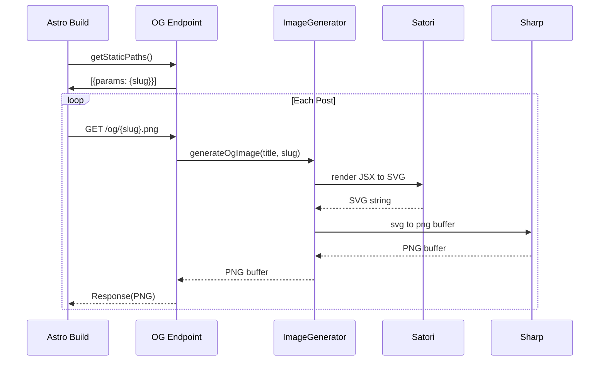
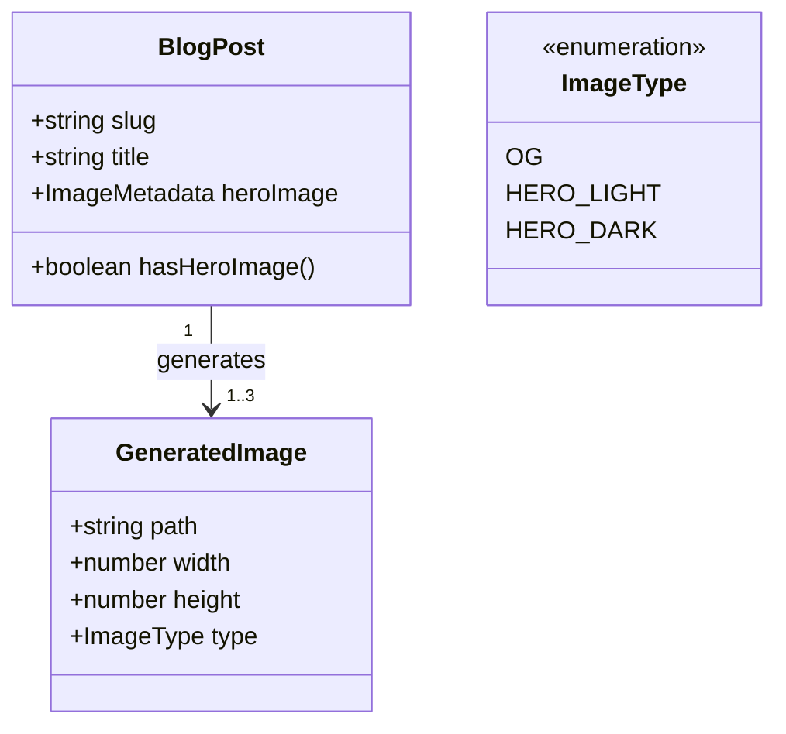

# Design Document: 動的OG画像・heroImage自動生成

## Overview

**Purpose**: 本機能は、ブログ記事ごとに記事タイトルを含むOG画像とheroImageを自動生成し、SNS共有時の視認性向上とサイト内でのビジュアル統一を実現します。

**Users**: サイト管理者（コンテンツ作成者）は、heroImageを手動で作成せずとも統一感のあるアイキャッチ画像を得られます。SNSユーザーは、記事内容が一目で分かるOG画像により、クリック判断が容易になります。

**Impact**: 現在の静的OG画像 (`public/og-image.png`) とデフォルトheroImage表示を、ビルド時に動的生成される記事固有の画像に置き換えます。

### Goals
- 各記事に固有のOG画像（1200x630px）を自動生成
- heroImage未設定の記事にタイトル入りアイキャッチを自動生成（ライト/ダーク両対応）
- 日本語タイトルの正確なレンダリング
- ビルド時の静的生成によるパフォーマンス維持

### Non-Goals
- 記事ごとのカスタムデザインテンプレート選択機能
- ランタイム（サーバーレス）での動的生成
- 画像のリアルタイムプレビュー機能

## Architecture

### Existing Architecture Analysis

現在のOG画像・heroImage処理:
- `BaseHead.astro`: OG画像のmeta tag出力。フォールバック順序は Props.image → siteConfig.seo.defaultOgImage → FallbackImage
- `BlogPost.astro`: heroImage表示。未設定時は `defaultHeroLight`/`defaultHeroDark` を表示しダークモード切り替え
- `site.config.ts`: `seo.defaultOgImage` で静的OG画像パスを指定
- `scripts/generate-logo.js`: ビルド前にロゴ/ファビコンをSVG生成するパターンが存在

### Architecture Pattern & Boundary Map

```mermaid
graph TB
    subgraph Build[Build Process]
        CC[Content Collection] --> OGEndpoint[OG Image Endpoint]
        CC --> HeroEndpoint[Hero Image Endpoint]
        OGEndpoint --> ImageGen[Image Generator]
        HeroEndpoint --> ImageGen
        ImageGen --> Satori[Satori SVG]
        Satori --> Sharp[Sharp PNG]
    end

    subgraph Output[Generated Assets]
        Sharp --> OGImages[/og/slug.png]
        Sharp --> HeroLight[/hero/slug-light.png]
        Sharp --> HeroDark[/hero/slug-dark.png]
    end

    subgraph Pages[Page Components]
        BaseHead[BaseHead.astro] --> OGImages
        BlogPost[BlogPost.astro] --> HeroLight
        BlogPost --> HeroDark
    end
```

**Architecture Integration**:
- **Selected pattern**: Astro Static Endpointパターン — ビルド時に画像を静的生成
- **Domain boundaries**: 画像生成ロジックは `src/utils/og-image/` に分離、エンドポイントは `src/pages/` 配下
- **Existing patterns preserved**: 既存のフォールバックロジック、ダークモード切り替えCSS
- **New components rationale**: 画像生成ユーティリティとAstroエンドポイントを新規追加
- **Steering compliance**: TypeScript strict mode、機能ベースディレクトリ構造

### Technology Stack

| Layer | Choice / Version | Role in Feature | Notes |
|-------|------------------|-----------------|-------|
| Image Generation | satori ^0.10.x | HTML/CSS → SVG変換 | 新規追加 |
| Image Processing | sharp ^0.34.2 | SVG → PNG変換 | 既存依存関係 |
| Font | Noto Sans JP (TTF) | 日本語テキストレンダリング | ローカルファイルとして追加 |
| Build Integration | Astro Endpoints | ビルド時静的生成 | prerender: true |

## System Flows

### OG画像生成フロー



**Key Decisions**:
- `getStaticPaths()` で全記事のスラッグを列挙し、ビルド時に全OG画像を生成
- heroImage設定済みの記事もOG画像は生成（SNS共有用途のため）

## Requirements Traceability

| Requirement | Summary | Components | Interfaces | Flows |
|-------------|---------|------------|------------|-------|
| 1.1, 1.2, 1.3, 1.4 | OG画像自動生成 | ImageGenerator, OgImageEndpoint | generateOgImage() | OG画像生成フロー |
| 2.1, 2.2, 2.3, 2.4 | タイトルテキスト表示 | OgImageTemplate | - | - |
| 3.1, 3.2, 3.3, 3.4 | ビルド時生成・既存統合 | OgImageEndpoint, BaseHead | getStaticPaths() | OG画像生成フロー |
| 4.1, 4.2, 4.3 | デフォルトOG画像 | DefaultOgImageEndpoint | - | - |
| 5.1, 5.2, 5.3 | 日本語フォント | FontLoader | loadFont() | - |
| 6.1, 6.2, 6.3, 6.4, 6.5, 6.6 | heroImage自動生成 | HeroImageEndpoint, BlogPost | generateHeroImage() | - |

## Components and Interfaces

| Component | Domain/Layer | Intent | Req Coverage | Key Dependencies | Contracts |
|-----------|--------------|--------|--------------|------------------|-----------|
| ImageGenerator | Utils | OG/hero画像生成コアロジック | 1, 2, 5, 6 | satori (P0), sharp (P0), FontLoader (P0) | Service |
| OgImageTemplate | Utils | OG画像JSXテンプレート | 2 | - | - |
| HeroImageTemplate | Utils | heroImage JSXテンプレート | 6 | - | - |
| FontLoader | Utils | フォントファイル読み込み | 5 | fs (P0) | Service |
| OgImageEndpoint | Pages | OG画像エンドポイント | 1, 3 | ImageGenerator (P0), ContentCollection (P0) | API |
| HeroImageEndpoint | Pages | heroImageエンドポイント | 6 | ImageGenerator (P0), ContentCollection (P0) | API |
| DefaultOgImageEndpoint | Pages | デフォルトOG画像生成 | 4 | ImageGenerator (P0) | API |
| BaseHead (修正) | Components | OG画像パス参照更新 | 3 | - | - |
| BlogPost (修正) | Layouts | heroImage参照更新 | 6 | - | - |

### Utils Layer

#### ImageGenerator

| Field | Detail |
|-------|--------|
| Intent | Satori + Sharpを使用してOG画像・heroImageを生成 |
| Requirements | 1.1, 1.2, 1.3, 1.4, 2.1, 2.2, 2.3, 2.4, 6.1, 6.3, 6.6 |

**Responsibilities & Constraints**
- OG画像（1200x630）とheroImage（1020x510）の生成
- ベース画像の読み込みとリサイズ
- タイトルテキストのオーバーレイ
- PNG形式での出力

**Dependencies**
- External: satori — JSX→SVG変換 (P0)
- External: sharp — SVG→PNG変換、画像処理 (P0)
- Inbound: FontLoader — フォントデータ取得 (P0)

**Contracts**: Service [x]

##### Service Interface
```typescript
interface ImageGeneratorService {
  generateOgImage(options: OgImageOptions): Promise<Buffer>;
  generateHeroImage(options: HeroImageOptions): Promise<Buffer>;
}

interface OgImageOptions {
  title: string;
  slug: string;
  width?: number;  // default: 1200
  height?: number; // default: 630
}

interface HeroImageOptions {
  title: string;
  slug: string;
  theme: 'light' | 'dark';
  width?: number;  // default: 1020
  height?: number; // default: 510
}
```
- Preconditions: title は空文字列でないこと
- Postconditions: 有効なPNG Buffer を返却
- Invariants: 出力サイズは指定値に一致

**Implementation Notes**
- Integration: ベース画像は `src/assets/` から読み込み、Astroのimportは使用せずfs直接読み込み
- Validation: タイトル長に応じてフォントサイズを動的調整
- Risks: 極端に長いタイトルの改行処理、フォントファイル読み込み失敗

#### FontLoader

| Field | Detail |
|-------|--------|
| Intent | Noto Sans JPフォントファイルをBufferとして読み込み |
| Requirements | 5.1, 5.2, 5.3 |

**Responsibilities & Constraints**
- TTFファイルの読み込みとキャッシュ
- Regular/Boldウェイトの提供

**Dependencies**
- External: fs/promises — ファイル読み込み (P0)

**Contracts**: Service [x]

##### Service Interface
```typescript
interface FontLoaderService {
  loadFonts(): Promise<SatoriFont[]>;
}

interface SatoriFont {
  name: string;
  data: Buffer;
  weight: 400 | 700;
  style: 'normal';
}
```
- Preconditions: フォントファイルが `src/assets/fonts/` に存在
- Postconditions: 2つのフォント（Regular, Bold）を含む配列を返却

**Implementation Notes**
- Integration: フォントファイルは `src/assets/fonts/NotoSansJP-Regular.ttf` 等に配置
- Risks: フォントファイルが大きい場合のメモリ使用量

#### OgImageTemplate / HeroImageTemplate

| Field | Detail |
|-------|--------|
| Intent | 画像生成用のJSXテンプレート定義 |
| Requirements | 2.1, 2.2, 2.3, 2.4, 6.6 |

**Implementation Notes**
- Satoriが解釈可能なCSS（Flexbox）を使用
- タイトルテキストは中央配置、長文は自動改行
- コントラスト確保のため半透明オーバーレイを使用

### Pages Layer

#### OgImageEndpoint

| Field | Detail |
|-------|--------|
| Intent | `/og/[...slug].png` エンドポイントでOG画像を提供 |
| Requirements | 1.1, 3.1, 3.2 |

**Contracts**: API [x]

##### API Contract
| Method | Endpoint | Request | Response | Errors |
|--------|----------|---------|----------|--------|
| GET | /og/{slug}.png | - | image/png | 404 |

**Implementation Notes**
- `export const prerender = true` で静的生成を保証
- `getStaticPaths()` でブログ記事一覧を取得

#### HeroImageEndpoint

| Field | Detail |
|-------|--------|
| Intent | `/hero/[...slug]-[theme].png` エンドポイントでheroImageを提供 |
| Requirements | 6.1, 6.2, 6.3 |

**Contracts**: API [x]

##### API Contract
| Method | Endpoint | Request | Response | Errors |
|--------|----------|---------|----------|--------|
| GET | /hero/{slug}-light.png | - | image/png | 404 |
| GET | /hero/{slug}-dark.png | - | image/png | 404 |

**Implementation Notes**
- heroImage未設定の記事のみを対象
- ライト/ダーク両テーマを生成

#### DefaultOgImageEndpoint

| Field | Detail |
|-------|--------|
| Intent | `/og/default.png` でサイト全体のデフォルトOG画像を提供 |
| Requirements | 4.1, 4.2, 4.3 |

**Contracts**: API [x]

##### API Contract
| Method | Endpoint | Request | Response | Errors |
|--------|----------|---------|----------|--------|
| GET | /og/default.png | - | image/png | - |

**Implementation Notes**
- サイト名「itzpapa」とタグラインを表示
- 記事用テンプレートと同じデザインテーマ

### Components Layer (修正)

#### BaseHead (修正)

| Field | Detail |
|-------|--------|
| Intent | OG画像パス参照を動的生成パスに更新 |
| Requirements | 3.3, 3.4 |

**Implementation Notes**
- 記事ページ: `/og/{slug}.png` を参照
- 非記事ページ: `/og/default.png` を参照
- カスタムOG画像が指定されている場合は従来通り優先

#### BlogPost (修正)

| Field | Detail |
|-------|--------|
| Intent | heroImage参照を動的生成パスに更新 |
| Requirements | 6.4, 6.5 |

**Implementation Notes**
- heroImage未設定時: `/hero/{slug}-light.png`, `/hero/{slug}-dark.png` を参照
- ダークモード切り替えCSSは既存ロジックを維持
- heroImage設定済みの場合は従来通り表示

## Data Models

### Domain Model



**Invariants**:
- OG画像は全記事に対して1つ生成
- heroImageは未設定記事に対してのみライト/ダーク2つ生成

## Error Handling

### Error Strategy
- フォントファイル読み込み失敗: ビルドエラーとして終了（必須依存）
- ベース画像読み込み失敗: ビルドエラーとして終了（必須依存）
- 画像生成失敗（Satori/Sharp）: エラーログ出力、該当記事のみスキップ

### Error Categories and Responses
- **Build Errors**: フォント/ベース画像の欠落 → 明確なエラーメッセージでビルド停止
- **Generation Errors**: 個別記事の生成失敗 → ログ出力、フォールバック画像を使用

## Testing Strategy

### Unit Tests
- `ImageGenerator.generateOgImage()`: 正常系、タイトル空文字、長文タイトル
- `ImageGenerator.generateHeroImage()`: ライト/ダークテーマ生成
- `FontLoader.loadFonts()`: フォント読み込み成功、ファイル欠落時のエラー

### Integration Tests
- OGエンドポイント: `/og/{slug}.png` が正しいContent-Typeで返却
- heroエンドポイント: ライト/ダーク両方の画像が生成
- BaseHead統合: 生成されたOG画像パスがmeta tagに反映

### E2E Tests
- ビルド完了後、生成された画像ファイルの存在確認
- 画像サイズ（1200x630、1020x510）の検証
- 日本語タイトルを含む記事のOG画像生成確認
