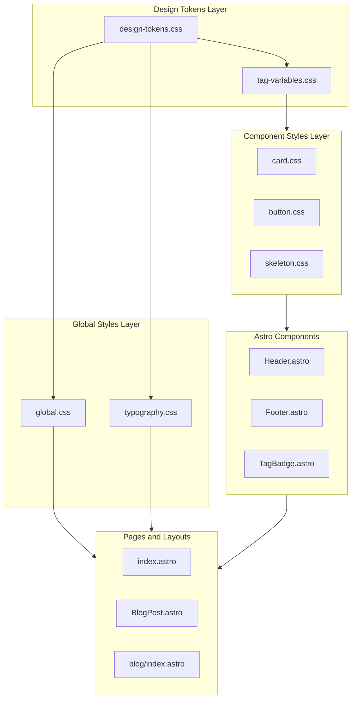
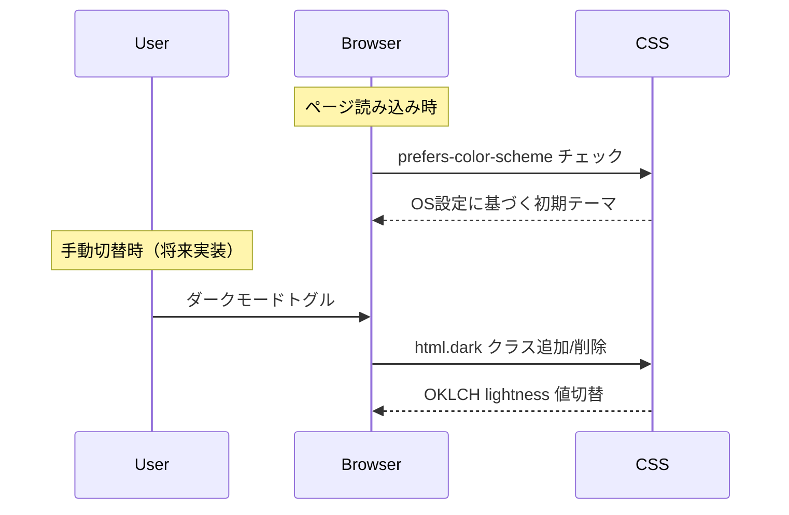
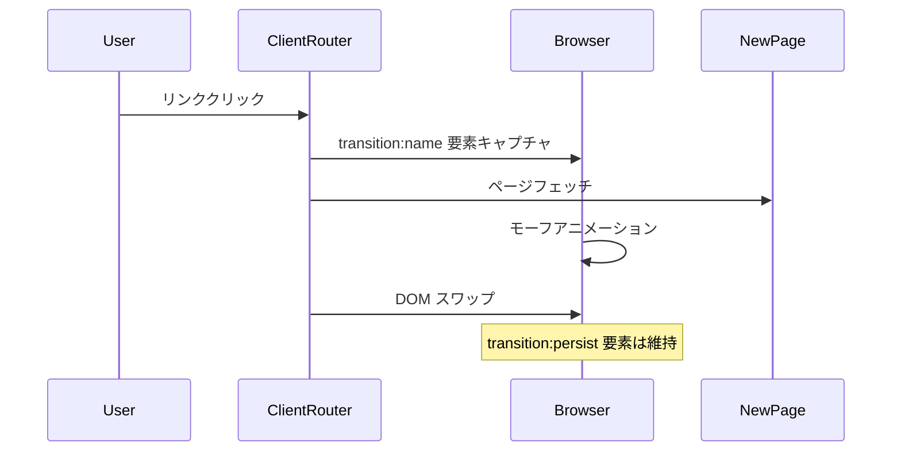

# Technical Design: design-renewal

## Overview

**Purpose**: itzpapaブログサイトのビジュアルデザインを全面刷新し、OKLCHベースの統一カラーシステム、モダンなタイポグラフィ、レスポンシブ対応を実現する。

**Users**: サイト訪問者（ブログ読者）、コンテンツ作成者、開発者がより魅力的で一貫性のあるUIを体験する。

**Impact**: 既存のスタイルシステム（tag-variables.css、global.css）を拡張し、ハードコードされたカラー値をOKLCH変数に置換。全コンポーネントに統一デザイントークンを適用。

### Goals
- OKLCHベースの紫カラーパレット（50-900）とダークモード対応の実現
- ホームページを中心とした視覚的リニューアル
- 統一されたコンポーネントスタイル（ボタン、カード、タグ）
- モバイルファーストのレスポンシブデザイン
- View Transitionsによる滑らかなページ遷移

### Non-Goals
- コンテンツ管理機能の変更
- バックエンド処理の変更
- 新規ページ・ルートの追加
- 認証・認可機能

## Architecture

### Existing Architecture Analysis

現在のスタイルシステムは以下の特徴を持つ:
- `tag-variables.css`: CSS変数の部分的定義（タグ系中心、hex/rgb形式）
- `global.css`: Bear Blog派生の基本スタイル
- 各コンポーネント: インラインCSS（特にindex.astro）
- ダークモード: タグ系のみ`html.dark`クラスで対応

**課題**:
- 紫カラー（#7c3aed）がハードコード
- ブレークポイントが不統一（640px, 720px, 767px, 768px混在）
- アニメーショントークンが散在

### Architecture Pattern & Boundary Map



**Architecture Integration**:
- **Selected pattern**: レイヤードCSS（Design Tokens → Global → Component）
- **Domain boundaries**: スタイル定義はCSSファイルに集約、Astroコンポーネントはスタイル参照のみ
- **Existing patterns preserved**: `html.dark`クラス方式、CSS変数参照
- **New components rationale**: design-tokens.cssで統一トークン管理、card.css/button.cssでコンポーネントスタイル分離
- **Steering compliance**: 機能ベースディレクトリ構造、スタイル分離原則を維持

### Technology Stack

| Layer | Choice / Version | Role in Feature | Notes |
|-------|------------------|-----------------|-------|
| Frontend | Astro v5 | 静的サイト生成 | 既存 |
| Styling | CSS Custom Properties (OKLCH) | デザイントークン | 新規追加 |
| Transitions | Astro View Transitions | ページ遷移 | ClientRouter使用 |
| Fonts | Google Fonts (Noto Sans JP) | 日本語タイポグラフィ | CDN経由 |

## System Flows

### ダークモード切替フロー



**Key Decisions**: OS設定を初期値として尊重し、`html.dark`クラスで手動オーバーライド可能。OKLCH lightness値の調整でダークモード色を生成。

### View Transitions フロー



## Requirements Traceability

| Requirement | Summary | Components | Interfaces | Flows |
|-------------|---------|------------|------------|-------|
| 1.1 | 紫パレット（OKLCH） | design-tokens.css | ColorTokens | - |
| 1.2 | 補完アクセントカラー | design-tokens.css | ColorTokens | - |
| 1.3 | CSS変数（全トークン） | design-tokens.css | AllTokens | - |
| 1.4 | ダークモード | design-tokens.css, global.css | DarkMode | ダークモード切替 |
| 1.5 | スペーシングスケール | design-tokens.css | SpacingTokens | - |
| 2.1 | ヒーローセクション | index.astro | - | - |
| 2.2 | ナビゲーションカード | index.astro, card.css | CardProps | - |
| 2.3 | 記事カード（サムネイル） | index.astro | PostCardProps | - |
| 2.4 | ホバーアニメーション | card.css, design-tokens.css | AnimationTokens | - |
| 2.5 | ビジュアルフロー | index.astro | - | - |
| 2.6 | モバイルレイアウト | index.astro | ResponsiveTokens | - |
| 3.1 | タイプスケール | design-tokens.css | TypographyTokens | - |
| 3.2 | 行の高さ | design-tokens.css | TypographyTokens | - |
| 3.3 | 日本語フォント | BaseHead.astro, global.css | - | - |
| 3.4 | 見出しスタイル | global.css | TypographyTokens | - |
| 3.5 | 最小フォントサイズ | global.css | TypographyTokens | - |
| 4.1 | ボタン状態 | button.css | ButtonProps | - |
| 4.2 | カードコンポーネント | card.css | CardProps | - |
| 4.3 | ナビゲーション現在地 | Header.astro | - | - |
| 4.4 | フォーカスインジケーター | design-tokens.css | FocusTokens | - |
| 4.5 | タグカラー | TagBadge.astro, tag-variables.css | - | - |
| 4.6 | スケルトンローダー | skeleton.css, Skeleton.astro | SkeletonProps | - |
| 5.1 | ヘッダーロゴ | Header.astro | - | - |
| 5.2 | ナビホバー・アクティブ | Header.astro | - | - |
| 5.3 | モバイルメニュー | Header.astro | MobileMenuState | - |
| 5.4 | フッターナビ | Footer.astro | - | - |
| 5.5 | フッタースタイル | Footer.astro | - | - |
| 5.6 | スティッキーヘッダー | Header.astro | - | - |
| 6.1 | ヒーロー画像 | BlogPost.astro | - | - |
| 6.2 | メタデータ表示 | BlogPost.astro | ArticleMetadata | - |
| 6.3 | 目次表示 | TableOfContents.astro | - | - |
| 6.4 | Markdownスタイル | global.css | - | - |
| 6.5 | コンテンツ分離 | BlogPost.astro | - | - |
| 6.6 | モバイル最適化 | BlogPost.astro | ResponsiveTokens | - |
| 7.1 | ブレークポイント | design-tokens.css | BreakpointTokens | - |
| 7.2 | スムーズ適応 | 全CSS | - | - |
| 7.3 | タッチターゲット | design-tokens.css | TouchTargetTokens | - |
| 7.4 | グリッド調整 | card.css, index.astro | - | - |
| 7.5 | 画像最適化 | Astro Image | - | - |
| 7.6 | 極小画面対応 | global.css | - | - |
| 8.1 | トランジション定義 | design-tokens.css | AnimationTokens | - |
| 8.2 | イージング関数 | design-tokens.css | AnimationTokens | - |
| 8.3 | ページトランジション | BaseHead.astro | - | View Transitions |
| 8.4 | reduced-motion | design-tokens.css | - | - |
| 8.5 | スクロールアニメーション | 将来実装 | - | - |
| 8.6 | パフォーマンス | 全CSS | - | - |

## Components and Interfaces

| Component | Domain/Layer | Intent | Req Coverage | Key Dependencies | Contracts |
|-----------|--------------|--------|--------------|------------------|-----------|
| design-tokens.css | Tokens | 統一デザイントークン定義 | 1.1-1.5, 3.1-3.2, 7.1, 7.3, 8.1-8.2, 8.4 | - | State |
| global.css | Global | グローバルスタイル、タイポグラフィ | 3.3-3.5, 6.4, 7.6 | design-tokens.css (P0) | - |
| card.css | Component | カードスタイル定義 | 2.2-2.4, 4.2, 7.4 | design-tokens.css (P0) | - |
| button.css | Component | ボタンスタイル定義 | 4.1 | design-tokens.css (P0) | - |
| skeleton.css | Component | スケルトンローダー | 4.6 | design-tokens.css (P0) | - |
| Header.astro | UI | ヘッダーコンポーネント | 4.3, 5.1-5.3, 5.6 | design-tokens.css (P0) | State |
| Footer.astro | UI | フッターコンポーネント | 5.4-5.5 | design-tokens.css (P0) | - |
| index.astro | Page | ホームページ | 2.1-2.6 | card.css (P0), design-tokens.css (P0) | - |
| BlogPost.astro | Layout | 記事レイアウト | 6.1-6.6 | design-tokens.css (P0), global.css (P0) | - |
| BaseHead.astro | Meta | メタ情報・フォント読み込み | 3.3, 8.3 | - | - |

### Design Tokens Layer

#### design-tokens.css

| Field | Detail |
|-------|--------|
| Intent | OKLCHカラー、スペーシング、タイポグラフィ、アニメーションの統一トークン定義 |
| Requirements | 1.1, 1.2, 1.3, 1.4, 1.5, 3.1, 3.2, 7.1, 7.3, 8.1, 8.2, 8.4 |

**Responsibilities & Constraints**
- 全サイトで使用されるデザイントークンの単一ソース
- OKLCHカラー形式で知覚的均一性を保証
- ダークモード値は同一変数名でlightness調整
- 既存tag-variables.cssとの互換性維持

**Dependencies**
- Outbound: tag-variables.css — 既存変数の参照元 (P1)

**Contracts**: State [x]

##### State Management

```css
/* Color Tokens - OKLCH形式 */
:root {
  /* Primary Purple Palette */
  --color-primary-50: oklch(97% 0.02 293);
  --color-primary-100: oklch(94% 0.05 293);
  --color-primary-200: oklch(88% 0.10 293);
  --color-primary-300: oklch(78% 0.16 293);
  --color-primary-400: oklch(68% 0.20 293);
  --color-primary-500: oklch(55% 0.24 293);  /* Base: #7c3aed */
  --color-primary-600: oklch(48% 0.22 293);
  --color-primary-700: oklch(40% 0.19 293);
  --color-primary-800: oklch(32% 0.15 293);
  --color-primary-900: oklch(25% 0.12 293);

  /* Neutral Gray Palette */
  --color-gray-50: oklch(98% 0.005 280);
  --color-gray-100: oklch(96% 0.008 280);
  --color-gray-200: oklch(92% 0.010 280);
  --color-gray-300: oklch(85% 0.012 280);
  --color-gray-400: oklch(70% 0.015 280);
  --color-gray-500: oklch(55% 0.015 280);
  --color-gray-600: oklch(45% 0.015 280);
  --color-gray-700: oklch(35% 0.015 280);
  --color-gray-800: oklch(25% 0.012 280);
  --color-gray-900: oklch(15% 0.010 280);

  /* Semantic Colors */
  --color-background: var(--color-gray-50);
  --color-surface: oklch(100% 0 0);
  --color-text-primary: var(--color-gray-900);
  --color-text-secondary: var(--color-gray-600);
  --color-accent: var(--color-primary-500);

  /* Spacing Scale (4px base) */
  --space-1: 0.25rem;   /* 4px */
  --space-2: 0.5rem;    /* 8px */
  --space-3: 0.75rem;   /* 12px */
  --space-4: 1rem;      /* 16px */
  --space-6: 1.5rem;    /* 24px */
  --space-8: 2rem;      /* 32px */
  --space-12: 3rem;     /* 48px */
  --space-16: 4rem;     /* 64px */

  /* Typography Scale */
  --font-size-xs: 0.75rem;    /* 12px */
  --font-size-sm: 0.875rem;   /* 14px */
  --font-size-base: 1rem;     /* 16px */
  --font-size-lg: 1.125rem;   /* 18px */
  --font-size-xl: 1.25rem;    /* 20px */
  --font-size-2xl: 1.5rem;    /* 24px */
  --font-size-3xl: 1.875rem;  /* 30px */
  --font-size-4xl: 2.25rem;   /* 36px */
  --font-size-5xl: 3rem;      /* 48px */

  --line-height-tight: 1.25;
  --line-height-normal: 1.5;
  --line-height-relaxed: 1.75;

  /* Animation Tokens */
  --duration-fast: 150ms;
  --duration-normal: 300ms;
  --duration-slow: 500ms;
  --easing-default: cubic-bezier(0.4, 0, 0.2, 1);
  --easing-in: cubic-bezier(0.4, 0, 1, 1);
  --easing-out: cubic-bezier(0, 0, 0.2, 1);

  /* Breakpoints (参照用、メディアクエリで直接使用) */
  --breakpoint-sm: 480px;
  --breakpoint-md: 768px;
  --breakpoint-lg: 1024px;
  --breakpoint-xl: 1440px;

  /* Touch Target */
  --touch-target-min: 44px;

  /* Focus Ring */
  --focus-ring-width: 2px;
  --focus-ring-offset: 2px;
  --focus-ring-color: var(--color-primary-500);

  /* Shadows */
  --shadow-sm: 0 1px 2px oklch(0% 0 0 / 0.05);
  --shadow-md: 0 4px 6px oklch(0% 0 0 / 0.07), 0 2px 4px oklch(0% 0 0 / 0.06);
  --shadow-lg: 0 10px 15px oklch(0% 0 0 / 0.1), 0 4px 6px oklch(0% 0 0 / 0.05);
  --shadow-xl: 0 20px 25px oklch(0% 0 0 / 0.1), 0 8px 10px oklch(0% 0 0 / 0.04);

  /* Border Radius */
  --radius-sm: 0.25rem;
  --radius-md: 0.5rem;
  --radius-lg: 0.75rem;
  --radius-xl: 1rem;
  --radius-full: 9999px;
}

/* Dark Mode */
html.dark {
  --color-background: var(--color-gray-900);
  --color-surface: var(--color-gray-800);
  --color-text-primary: var(--color-gray-100);
  --color-text-secondary: var(--color-gray-400);

  /* Primary調整（lightness上げる） */
  --color-primary-500: oklch(65% 0.20 293);
  --color-accent: var(--color-primary-500);

  /* Shadow調整 */
  --shadow-sm: 0 1px 2px oklch(0% 0 0 / 0.2);
  --shadow-md: 0 4px 6px oklch(0% 0 0 / 0.25);
}

/* OS設定によるダークモード初期化 */
@media (prefers-color-scheme: dark) {
  :root:not(.light) {
    /* html.lightクラスがない場合、OS設定に従う */
    --color-background: var(--color-gray-900);
    --color-surface: var(--color-gray-800);
    --color-text-primary: var(--color-gray-100);
    --color-text-secondary: var(--color-gray-400);
  }
}

/* Reduced Motion */
@media (prefers-reduced-motion: reduce) {
  :root {
    --duration-fast: 0ms;
    --duration-normal: 0ms;
    --duration-slow: 0ms;
  }
}
```

**Implementation Notes**
- Integration: tag-variables.cssの既存変数をdesign-tokens.cssからの参照に移行
- Validation: oklch値はoklch.fyiで検証
- Risks: 古いブラウザ（Safari 15未満等）での表示確認が必要

### Component Styles Layer

#### card.css

| Field | Detail |
|-------|--------|
| Intent | 統一カードスタイル（ナビカード、記事カード共通） |
| Requirements | 2.2, 2.3, 2.4, 4.2, 7.4 |

**Responsibilities & Constraints**
- カードの見た目（背景、ボーダー、シャドウ、角丸）を統一
- ホバー・フォーカス時のインタラクション定義
- グリッドレイアウトでのレスポンシブ対応

**Dependencies**
- Inbound: design-tokens.css — トークン参照 (P0)

**Contracts**: -

```css
/* card.css */
.card {
  background: var(--color-surface);
  border: 1px solid var(--color-gray-200);
  border-radius: var(--radius-xl);
  padding: var(--space-6);
  box-shadow: var(--shadow-sm);
  transition:
    transform var(--duration-normal) var(--easing-default),
    box-shadow var(--duration-normal) var(--easing-default),
    border-color var(--duration-normal) var(--easing-default);
}

.card:hover {
  transform: translateY(-4px);
  box-shadow: var(--shadow-lg);
  border-color: var(--color-primary-300);
}

.card:focus-within {
  outline: var(--focus-ring-width) solid var(--focus-ring-color);
  outline-offset: var(--focus-ring-offset);
}

/* Card with thumbnail */
.card--has-thumbnail {
  padding: 0;
  overflow: hidden;
}

.card__thumbnail {
  aspect-ratio: 16 / 9;
  object-fit: cover;
  width: 100%;
}

.card__content {
  padding: var(--space-6);
}

/* Card grid */
.card-grid {
  display: grid;
  gap: var(--space-6);
  grid-template-columns: repeat(auto-fit, minmax(300px, 1fr));
}

@media (max-width: 480px) {
  .card-grid {
    grid-template-columns: 1fr;
  }
}
```

**Implementation Notes**
- Integration: index.astro、blog/index.astroの既存カードスタイルを置換
- Validation: ホバーアニメーションがスムーズか確認

#### button.css

| Field | Detail |
|-------|--------|
| Intent | 統一ボタンスタイル（プライマリ、セカンダリ、ゴースト） |
| Requirements | 4.1 |

**Responsibilities & Constraints**
- ボタンの状態（default, hover, active, focus, disabled）を定義
- アクセシビリティ要件（タッチターゲット44px、フォーカスリング）

**Dependencies**
- Inbound: design-tokens.css — トークン参照 (P0)

**Contracts**: -

```css
/* button.css */
.btn {
  display: inline-flex;
  align-items: center;
  justify-content: center;
  min-height: var(--touch-target-min);
  padding: var(--space-3) var(--space-6);
  font-size: var(--font-size-base);
  font-weight: 600;
  line-height: var(--line-height-tight);
  text-decoration: none;
  border-radius: var(--radius-full);
  cursor: pointer;
  transition:
    background-color var(--duration-fast) var(--easing-default),
    transform var(--duration-fast) var(--easing-default),
    box-shadow var(--duration-fast) var(--easing-default);
}

.btn:focus-visible {
  outline: var(--focus-ring-width) solid var(--focus-ring-color);
  outline-offset: var(--focus-ring-offset);
}

.btn--primary {
  background: var(--color-primary-500);
  color: oklch(100% 0 0);
  border: none;
}

.btn--primary:hover {
  background: var(--color-primary-600);
  transform: translateY(-2px);
  box-shadow: var(--shadow-md);
}

.btn--primary:active {
  background: var(--color-primary-700);
  transform: translateY(0);
}

.btn--secondary {
  background: transparent;
  color: var(--color-primary-500);
  border: 2px solid var(--color-primary-500);
}

.btn--secondary:hover {
  background: var(--color-primary-50);
}
```

#### skeleton.css

| Field | Detail |
|-------|--------|
| Intent | コンテンツ読み込み中のスケルトンローダー |
| Requirements | 4.6 |

**Contracts**: -

```css
/* skeleton.css */
.skeleton {
  background: linear-gradient(
    90deg,
    var(--color-gray-200) 25%,
    var(--color-gray-100) 50%,
    var(--color-gray-200) 75%
  );
  background-size: 200% 100%;
  animation: skeleton-shimmer 1.5s ease-in-out infinite;
  border-radius: var(--radius-md);
}

@keyframes skeleton-shimmer {
  0% { background-position: 200% 0; }
  100% { background-position: -200% 0; }
}

.skeleton--text {
  height: 1em;
  margin-bottom: var(--space-2);
}

.skeleton--title {
  height: 2em;
  width: 60%;
}

.skeleton--image {
  aspect-ratio: 16 / 9;
  width: 100%;
}

@media (prefers-reduced-motion: reduce) {
  .skeleton {
    animation: none;
  }
}
```

### UI Components Layer

#### Header.astro

| Field | Detail |
|-------|--------|
| Intent | サイトヘッダー（ナビゲーション、モバイルメニュー、スティッキー） |
| Requirements | 4.3, 5.1, 5.2, 5.3, 5.6 |

**Responsibilities & Constraints**
- サイトロゴ/ブランド表示
- デスクトップナビゲーション（ホバー、アクティブ状態）
- モバイルハンバーガーメニュー（JS制御）
- スティッキーヘッダー動作

**Dependencies**
- Inbound: design-tokens.css (P0)
- Outbound: HeaderLink.astro — ナビリンク (P1)

**Contracts**: State [x]

##### State Management
```typescript
interface MobileMenuState {
  isOpen: boolean;
  toggle: () => void;
}
```

```html
<!-- Header.astro 構造 -->
<header class="header" transition:persist>
  <nav class="header__nav">
    <a href="/" class="header__brand">{SITE_TITLE}</a>

    <div class="header__links">
      <HeaderLink href="/">Home</HeaderLink>
      <HeaderLink href="/blog">Blog</HeaderLink>
      <HeaderLink href="/about">About</HeaderLink>
    </div>

    <button
      class="header__menu-toggle"
      aria-expanded="false"
      aria-controls="mobile-menu"
      aria-label="メニューを開く"
    >
      <span class="header__menu-icon"></span>
    </button>

    <div id="mobile-menu" class="header__mobile-menu" hidden>
      <!-- モバイルナビリンク -->
    </div>
  </nav>
</header>

<script>
  // モバイルメニュートグル
  const toggle = document.querySelector('.header__menu-toggle');
  const menu = document.getElementById('mobile-menu');

  toggle?.addEventListener('click', () => {
    const isOpen = toggle.getAttribute('aria-expanded') === 'true';
    toggle.setAttribute('aria-expanded', String(!isOpen));
    menu?.toggleAttribute('hidden', isOpen);
  });
</script>

<style>
  .header {
    position: sticky;
    top: 0;
    z-index: 100;
    background: var(--color-surface);
    box-shadow: var(--shadow-sm);
    transition: box-shadow var(--duration-normal) var(--easing-default);
  }

  .header__nav {
    display: flex;
    align-items: center;
    justify-content: space-between;
    max-width: 1200px;
    margin: 0 auto;
    padding: var(--space-4) var(--space-6);
  }

  .header__brand {
    font-size: var(--font-size-xl);
    font-weight: 700;
    color: var(--color-primary-500);
    text-decoration: none;
  }

  .header__menu-toggle {
    display: none;
  }

  @media (max-width: 768px) {
    .header__links {
      display: none;
    }

    .header__menu-toggle {
      display: flex;
      min-width: var(--touch-target-min);
      min-height: var(--touch-target-min);
    }

    .header__mobile-menu:not([hidden]) {
      display: flex;
      flex-direction: column;
      position: absolute;
      top: 100%;
      left: 0;
      right: 0;
      background: var(--color-surface);
      box-shadow: var(--shadow-lg);
      padding: var(--space-4);
    }
  }
</style>
```

**Implementation Notes**
- Integration: 既存Header.astroを拡張、transition:persistでView Transitions対応
- Validation: モバイルメニューのaria属性、フォーカストラップ
- Risks: JSが無効な環境でのフォールバック（display:noneのまま）

#### Footer.astro

| Field | Detail |
|-------|--------|
| Intent | サイトフッター（コピーライト、ソーシャルリンク、サイトナビ） |
| Requirements | 5.4, 5.5 |

**Responsibilities & Constraints**
- コピーライト表示
- ソーシャルリンク（既存継続）
- サイトナビゲーション追加

**Dependencies**
- Inbound: design-tokens.css (P0)

**Implementation Notes**
- Integration: 既存Footer.astroにサイトナビを追加
- transition:persistでView Transitions対応

### Pages Layer

#### index.astro (Homepage)

| Field | Detail |
|-------|--------|
| Intent | ホームページのリニューアル |
| Requirements | 2.1, 2.2, 2.3, 2.4, 2.5, 2.6 |

**Responsibilities & Constraints**
- ヒーローセクション（ブランドアイデンティティ）
- ナビゲーションカード（Blog, About）
- 最新記事カード（サムネイル付き）
- モバイルレスポンシブ

**Dependencies**
- Inbound: card.css (P0), design-tokens.css (P0)

**Implementation Notes**
- Integration: インラインCSSをdesign-tokensへの参照に置換
- 記事カードにheroImage表示を追加

#### BlogPost.astro (Layout)

| Field | Detail |
|-------|--------|
| Intent | ブログ記事レイアウトの刷新 |
| Requirements | 6.1, 6.2, 6.3, 6.4, 6.5, 6.6 |

**Responsibilities & Constraints**
- ヒーロー画像表示
- 記事メタデータ（日付、タグ、読了時間）
- 目次表示
- Markdownスタイル適用

**Dependencies**
- Inbound: design-tokens.css (P0), global.css (P0)
- Inbound: TableOfContents.astro (P1)

**Implementation Notes**
- Integration: 読了時間計算ユーティリティを追加
- Validation: 目次のアクティブ状態が正しく動作するか

#### BaseHead.astro

| Field | Detail |
|-------|--------|
| Intent | メタ情報、フォント読み込み、View Transitions有効化 |
| Requirements | 3.3, 8.3 |

**Responsibilities & Constraints**
- Google Fonts (Noto Sans JP) プリコネクト・プリロード
- ClientRouter有効化

**Changes**
```html
<!-- 追加: Noto Sans JP -->
<link rel="preconnect" href="https://fonts.googleapis.com" />
<link rel="preconnect" href="https://fonts.gstatic.com" crossorigin />
<link
  href="https://fonts.googleapis.com/css2?family=Noto+Sans+JP:wght@400;500;700&display=swap"
  rel="stylesheet"
/>

<!-- 追加: View Transitions -->
<ViewTransitions />
```

## Data Models

本フィーチャーはスタイルシステムの変更であり、データモデルの変更はない。

## Error Handling

### Error Strategy
CSSベースのフィーチャーのため、エラーハンドリングは主にフォールバックで対応。

### Error Categories and Responses
- **OKLCHサポートなし**: @supportsでhexフォールバック
- **View Transitions未サポート**: ClientRouterによる自動フォールバック
- **フォント読み込み失敗**: font-display:swapでシステムフォント表示

```css
/* OKLCH Fallback Example */
.element {
  background: #7c3aed; /* Fallback */
  background: oklch(55% 0.24 293);
}

/* Or using @supports */
@supports not (color: oklch(0% 0 0)) {
  :root {
    --color-primary-500: #7c3aed;
  }
}
```

## Testing Strategy

### Unit Tests
- OKLCHカラー値の正確性検証（oklch.fyiとの比較）
- CSS変数の継承が正しく動作するか
- ダークモードトークン切替

### Integration Tests
- コンポーネント間のスタイル一貫性
- View Transitionsの動作確認
- モバイルメニューの開閉

### E2E/UI Tests
- ホームページのビジュアル回帰テスト
- レスポンシブブレークポイントでのレイアウト確認
- ダークモード切替のビジュアル確認

### Performance Tests
- Lighthouseスコア（Performance, Accessibility）
- フォント読み込み時間
- CSSファイルサイズ

## Optional Sections

### Performance & Scalability

**Target Metrics**:
- First Contentful Paint (FCP): < 1.5s
- Cumulative Layout Shift (CLS): < 0.1
- フォント読み込み: display:swapで視覚的ブロックなし

**Optimization Techniques**:
- CSS変数によるランタイム計算削減
- preconnect/preloadによるフォント最適化
- will-changeの適切な使用（アニメーション要素のみ）

### Migration Strategy

```mermaid
graph LR
    subgraph Phase1[Phase 1: 基盤]
        DT[design-tokens.css作成]
        TV[tag-variables.css統合]
    end

    subgraph Phase2[Phase 2: ホームページ]
        HP[index.astro刷新]
        CC[card.css適用]
    end

    subgraph Phase3[Phase 3: 共通コンポーネント]
        HD[Header.astro刷新]
        FT[Footer.astro刷新]
        BT[button.css適用]
    end

    subgraph Phase4[Phase 4: 記事・仕上げ]
        BP[BlogPost.astro刷新]
        AN[アニメーション統一]
        A11Y[アクセシビリティ検証]
    end

    Phase1 --> Phase2
    Phase2 --> Phase3
    Phase3 --> Phase4
```



**Rollback Triggers**:
- Lighthouseスコアが現状より10%以上低下
- 重大なビジュアル崩れ

**Validation Checkpoints**:
- 各フェーズ完了時にビジュアル確認
- ブラウザ互換性テスト（Chrome, Firefox, Safari, Edge）

## Supporting References

詳細な調査結果は `research.md` を参照:
- OKLCHカラー生成の詳細
- View Transitions API調査
- 日本語フォント読み込み戦略
