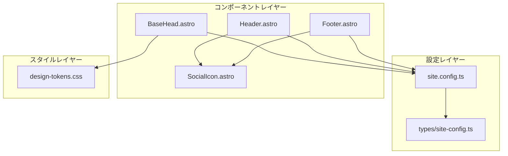
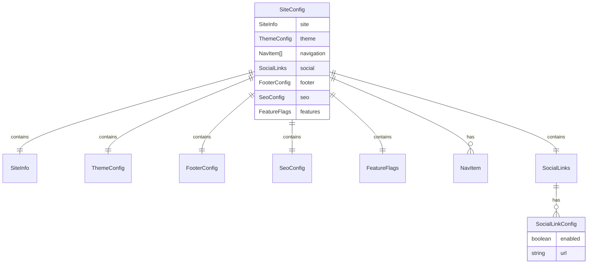

# Design Document: Developer Customization

## Overview

**Purpose**: 開発者が単一の設定ファイル（`site.config.ts`）を編集するだけで、サイト全体の外観・機能・コンテンツをカスタマイズできる機能を提供する。

**Users**: itzpapa を利用してブログを構築する開発者。サイトのブランディング、SNS プレゼンス、機能選択をコードを直接編集せずに行いたいユーザー。

**Impact**: 既存の `src/consts.ts` を `site.config.ts` に置き換え、Header/Footer コンポーネントを設定駆動に変更する。

### Goals
- すべてのカスタマイズ項目を単一ファイル `site.config.ts` に集約
- TypeScript による型安全な設定と IDE 補完の提供
- SNS リンク（GitHub、Twitter/X、YouTube、Bluesky 等）の個別 ON/OFF 設定
- `--primary-hue` CSS 変数によるカラーテーマのカスタマイズ
- 機能（目次、タグクラウド等）の有効/無効切り替え

### Non-Goals
- 実行時の動的設定変更（ビルド時のみ反映）
- GUI による設定編集インターフェース
- 複数テーマの切り替え機能

## Architecture

### Existing Architecture Analysis

現在のアーキテクチャ:
- `src/consts.ts`: SITE_TITLE, SITE_DESCRIPTION のみを export
- Header/Footer: SNS リンク、ナビゲーションがハードコード
- `src/styles/design-tokens.css`: `--primary-hue` CSS 変数でカラー制御

変更が必要なコンポーネント:
- `src/consts.ts` → `site.config.ts` に置き換え
- `src/components/Header.astro`: 設定からナビゲーション・SNS を読み込み
- `src/components/Footer.astro`: 設定から著作権・SNS を読み込み
- `src/components/BaseHead.astro`: 設定からカラー・SEO 情報を適用

### Architecture Pattern & Boundary Map



**Architecture Integration**:
- Selected pattern: 設定駆動アーキテクチャ（Configuration-Driven Architecture）
- Domain boundaries: 設定 → コンポーネント → スタイルの単方向依存
- Existing patterns preserved: Astro コンポーネントパターン、CSS カスタムプロパティ
- New components rationale: SocialIcon（SNS アイコンの一元管理）、型定義ファイル
- Steering compliance: TypeScript strict mode、機能ベースディレクトリ構造

### Technology Stack

| Layer | Choice / Version | Role in Feature | Notes |
|-------|------------------|-----------------|-------|
| Frontend | Astro v5 | コンポーネントから設定読み込み | 既存 |
| Language | TypeScript (strict) | 型安全な設定定義 | 既存 |
| Styling | CSS Custom Properties | カラーテーマ適用 | 既存の `--primary-hue` を活用 |

## Requirements Traceability

| Requirement | Summary | Components | Interfaces | Flows |
|-------------|---------|------------|------------|-------|
| 1.1-1.5 | 単一設定ファイル | site.config.ts, SiteConfig 型 | SiteConfig | 設定読み込みフロー |
| 2.1-2.3 | サイト基本情報 | site.config.ts, BaseHead, Header | SiteInfo | - |
| 3.1-3.5 | SNSリンク設定 | site.config.ts, SocialIcon, Footer, Header | SocialLinks, SocialLinkConfig | - |
| 4.1-4.4 | テーマカラー | site.config.ts, BaseHead | ThemeConfig | カラー適用フロー |
| 5.1-5.3 | ナビゲーション | site.config.ts, Header | NavItem[] | - |
| 6.1-6.3 | フッター情報 | site.config.ts, Footer | FooterConfig | - |
| 7.1-7.4 | SEO設定 | site.config.ts, BaseHead | SeoConfig | - |
| 8.1-8.3 | 機能ON/OFF | site.config.ts, 各コンポーネント | FeatureFlags | - |

## Components and Interfaces

| Component | Domain/Layer | Intent | Req Coverage | Key Dependencies | Contracts |
|-----------|--------------|--------|--------------|------------------|-----------|
| site.config.ts | Config | サイト設定の定義 | 1.1-1.5 | SiteConfig 型 (P0) | State |
| SiteConfig 型 | Config/Types | 設定の型定義 | 1.2 | - | Service |
| SocialIcon | UI | SNSアイコン表示 | 3.2-3.3 | - | Service |
| Header (更新) | UI | ナビゲーション・SNS表示 | 3.2, 5.1-5.3 | site.config.ts (P0), SocialIcon (P1) | - |
| Footer (更新) | UI | 著作権・SNS表示 | 3.2, 6.1-6.3 | site.config.ts (P0), SocialIcon (P1) | - |
| BaseHead (更新) | UI | メタ情報・カラー適用 | 4.1-4.4, 7.1-7.4 | site.config.ts (P0) | - |

### Config Layer

#### SiteConfig 型

| Field | Detail |
|-------|--------|
| Intent | サイト設定全体の型定義を提供 |
| Requirements | 1.2, 1.4 |

**Contracts**: Service [x]

##### Service Interface
```typescript
// src/types/site-config.ts

export interface SocialLinkConfig {
  enabled: boolean;
  url: string;
}

export interface SocialLinks {
  github: SocialLinkConfig;
  twitter: SocialLinkConfig;
  youtube: SocialLinkConfig;
  bluesky: SocialLinkConfig;
  instagram: SocialLinkConfig;
  linkedin: SocialLinkConfig;
  mastodon: SocialLinkConfig;
  threads: SocialLinkConfig;
}

export interface NavItem {
  label: string;
  href: string;
}

export interface SiteInfo {
  title: string;
  description: string;
  author: string;
  authorProfile?: string;
  baseUrl: string;
}

export interface ThemeConfig {
  primaryHue: number; // 0-360, default: 293 (purple)
}

export interface FooterConfig {
  copyrightText?: string;
  startYear?: number;
}

export interface SeoConfig {
  defaultOgImage?: string;
  defaultDescription?: string;
  googleAnalyticsId?: string;
}

export interface FeatureFlags {
  tableOfContents: boolean;
  tagCloud: boolean;
  relatedPosts: boolean;
  comments?: {
    enabled: boolean;
    provider?: 'giscus' | 'utterances';
    config?: Record<string, unknown>;
  };
}

export interface SiteConfig {
  site: SiteInfo;
  theme: ThemeConfig;
  navigation: NavItem[];
  social: SocialLinks;
  footer: FooterConfig;
  seo: SeoConfig;
  features: FeatureFlags;
}
```

- Preconditions: TypeScript strict mode enabled
- Postconditions: 型チェック・IDE 補完が有効
- Invariants: すべての必須フィールドが定義されている

#### site.config.ts

| Field | Detail |
|-------|--------|
| Intent | サイト設定値の定義（開発者が編集するファイル） |
| Requirements | 1.1, 1.3, 1.5 |

**Contracts**: State [x]

##### State Management
```typescript
// site.config.ts
import type { SiteConfig } from './src/types/site-config';

export const siteConfig: SiteConfig = {
  site: {
    title: 'itzpapa',
    description: 'ObsidianユーザーのためのAstroブログソリューション',
    author: 'Your Name',
    baseUrl: 'https://example.com',
  },

  theme: {
    primaryHue: 293, // Purple (0-360)
  },

  navigation: [
    { label: 'Home', href: '/' },
    { label: 'Blog', href: '/blog' },
    { label: 'Tags', href: '/tags' },
    { label: 'About', href: '/about' },
  ],

  social: {
    github: { enabled: true, url: 'https://github.com/username' },
    twitter: { enabled: false, url: '' },
    youtube: { enabled: false, url: '' },
    bluesky: { enabled: false, url: '' },
    instagram: { enabled: false, url: '' },
    linkedin: { enabled: false, url: '' },
    mastodon: { enabled: false, url: '' },
    threads: { enabled: false, url: '' },
  },

  footer: {
    copyrightText: 'All rights reserved.',
    startYear: 2024,
  },

  seo: {
    defaultOgImage: '/og-image.png',
    googleAnalyticsId: '', // 空の場合はスクリプト出力なし
  },

  features: {
    tableOfContents: true,
    tagCloud: true,
    relatedPosts: true,
    comments: {
      enabled: false,
    },
  },
};
```

- Persistence: ビルド時に読み込み、静的 HTML に反映
- Consistency: 単一ファイルで管理
- Concurrency: N/A（ビルド時のみ）

### UI Layer

#### SocialIcon

| Field | Detail |
|-------|--------|
| Intent | SNS タイプに応じたアイコン SVG を表示 |
| Requirements | 3.2, 3.3 |

**Contracts**: Service [x]

##### Service Interface
```typescript
// SocialIcon.astro Props
interface Props {
  type: 'github' | 'twitter' | 'youtube' | 'bluesky' | 'instagram' | 'linkedin' | 'mastodon' | 'threads';
  size?: number; // default: 24
  class?: string;
}
```

**Implementation Notes**:
- 各 SNS の公式 SVG アイコンを内蔵
- サイズは CSS で制御可能
- アクセシビリティ: aria-hidden="true" + sr-only テキスト

#### Header (更新)

| Field | Detail |
|-------|--------|
| Intent | 設定からナビゲーション・SNS を動的に表示 |
| Requirements | 3.2, 5.1-5.3 |

**Responsibilities & Constraints**:
- `siteConfig.navigation` からメニュー項目を生成
- `siteConfig.social` から有効な SNS リンクを表示
- 外部リンク（http/https で始まる）は `target="_blank"` を付与

**Dependencies**:
- Inbound: Pages — ヘッダー表示 (P0)
- Outbound: SocialIcon — SNS アイコン表示 (P1)

**Implementation Notes**:
- 現在のページ URL と href を比較してアクティブ状態を判定
- モバイルメニューも同様に設定駆動に変更

#### Footer (更新)

| Field | Detail |
|-------|--------|
| Intent | 設定から著作権・SNS を動的に表示 |
| Requirements | 3.2, 6.1-6.3 |

**Responsibilities & Constraints**:
- `siteConfig.footer` から著作権テキストを生成
- `siteConfig.social` から有効な SNS リンクを表示
- 年の表示ロジック: startYear が設定されていれば「startYear - currentYear」形式

**Dependencies**:
- Inbound: Layouts — フッター表示 (P0)
- Outbound: SocialIcon — SNS アイコン表示 (P1)

#### BaseHead (更新)

| Field | Detail |
|-------|--------|
| Intent | 設定からメタ情報・カラーテーマを適用 |
| Requirements | 4.1-4.4, 7.1-7.4 |

**Responsibilities & Constraints**:
- `siteConfig.theme.primaryHue` を CSS 変数として出力
- `siteConfig.seo` からデフォルト OG 画像、Analytics ID を適用
- Analytics ID が空の場合はスクリプトを出力しない

**Implementation Notes**:
- カラー適用: `<style>:root { --primary-hue: {value}; }</style>`
- 既存の design-tokens.css の OKLCH システムをそのまま活用

## Data Models

### Domain Model



**Business Rules & Invariants**:
- `primaryHue` は 0-360 の範囲
- SNS が enabled かつ url が空の場合は警告を出力し非表示
- `startYear` は現在年以下であること

## Error Handling

### Error Strategy

設定のバリデーションはビルド時に実施。TypeScript の型チェックで大部分をカバーし、実行時バリデーションは最小限に抑える。

### Error Categories and Responses

**User Errors (ビルド時)**:
- 必須フィールド欠落 → TypeScript コンパイルエラー
- 型不一致 → TypeScript コンパイルエラー

**Business Logic Errors (ビルド時警告)**:
- SNS enabled=true かつ URL 空 → console.warn で警告、リンク非表示
- primaryHue が範囲外 → デフォルト値（293）にフォールバック

## Testing Strategy

### Unit Tests
- SiteConfig 型のバリデーションロジック
- 年表示ロジック（startYear - currentYear）
- 外部リンク判定ロジック

### Integration Tests
- Header が設定から正しくメニューを生成するか
- Footer が設定から正しく著作権・SNS を表示するか
- BaseHead が primaryHue を正しく CSS 変数として出力するか

### E2E Tests
- ナビゲーションリンクのクリックで正しいページに遷移
- 外部リンクが新しいタブで開く
- SNS リンクの有効/無効が正しく反映される
