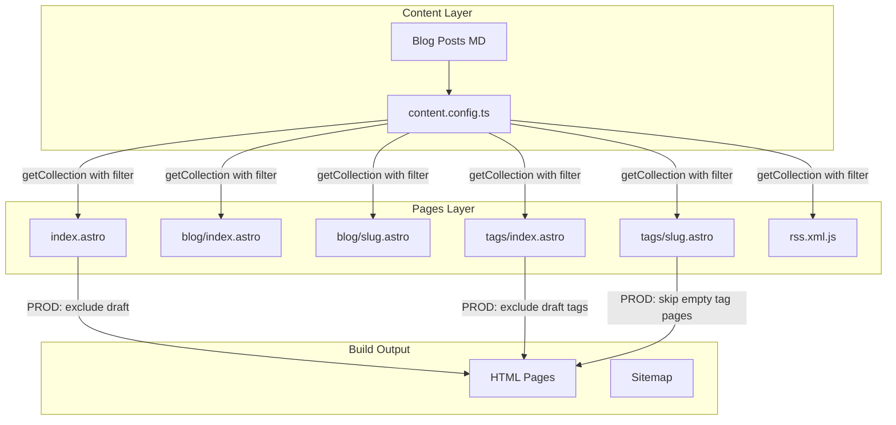

# Design Document

## Overview

**Purpose**: 本番ビルド時にdraft記事とその関連タグがビルド出力に含まれないようにすることで、サイト訪問者に公開済みコンテンツのみを表示する。

**Users**: サイト訪問者（公開記事のみ閲覧）、開発者（draft記事をプレビュー可能）

**Impact**: `src/pages/index.astro`、`src/pages/tags/index.astro`、`src/pages/tags/[...slug].astro` の3ファイルに既存パターンを適用。

### Goals
- 本番ビルドでdraft記事をトップページ・タグページから除外
- draft記事のみに紐づくタグをタグ一覧・タグページ生成から除外
- 開発モードでの全記事プレビュー機能を維持
- 既存のdraftフィルターパターンとの一貫性確保

### Non-Goals
- 共通ユーティリティ関数の新規作成（シンプルさ優先）
- RSSフィード処理の変更（既に正しく実装済み）
- draftフラグのスキーマ変更

## Architecture

### Existing Architecture Analysis

**既存インフラ（変更なし）**:
- `src/content.config.ts`: `draft` フィールド定義済み（`z.boolean().optional().default(false)`）
- `src/pages/blog/index.astro`: 本番環境でdraft除外ロジック実装済み
- `src/pages/blog/[...slug].astro`: 同上
- `src/pages/rss.xml.js`: draft記事を常に除外

**修正対象**:
- `src/pages/index.astro`: draftフィルターなし → 追加
- `src/pages/tags/index.astro`: draftフィルターなし → 追加
- `src/pages/tags/[...slug].astro`: draftフィルターなし → 追加 + 公開記事0件タグのスキップ

### Architecture Pattern & Boundary Map



**Architecture Integration**:
- Selected pattern: 既存パターン維持（インラインフィルター）
- Domain/feature boundaries: ページ層のみ影響、コンテンツ層は変更なし
- Existing patterns preserved: Astro Content Collections、`getCollection` フィルター機能
- New components rationale: なし（既存コンポーネントの修正のみ）
- Steering compliance: `src/pages/` 配下のファイルベースルーティングを遵守

### Technology Stack

| Layer | Choice / Version | Role in Feature | Notes |
|-------|------------------|-----------------|-------|
| Framework | Astro v5 | 静的サイト生成 | `getCollection` フィルター機能を使用 |
| Runtime | Node.js | ビルド実行環境 | `import.meta.env.PROD` で環境判定 |

## Requirements Traceability

| Requirement | Summary | Components | Interfaces | Flows |
|-------------|---------|------------|------------|-------|
| 1.1 | トップページでdraft除外 | index.astro | getCollection filter | BuildFlow |
| 1.2 | 開発モードでdraft表示 | index.astro | import.meta.env | — |
| 1.3 | 最新記事に公開記事のみ | index.astro | — | — |
| 2.1 | タグ一覧でdraft除外 | tags/index.astro | getCollection filter | BuildFlow |
| 2.2 | 開発モードでdraftタグ表示 | tags/index.astro | import.meta.env | — |
| 2.3 | タグカウントからdraft除外 | tags/index.astro | TagService | — |
| 2.4 | draft-onlyタグ除外 | tags/index.astro | TagService | BuildFlow |
| 3.1 | 個別タグでdraft除外 | tags/slug.astro | getCollection filter | BuildFlow |
| 3.2 | 開発モードでdraft表示 | tags/slug.astro | import.meta.env | — |
| 3.3 | 公開記事0件タグページ非生成 | tags/slug.astro | getStaticPaths | BuildFlow |
| 3.4 | タグページ記事カウント正確化 | tags/slug.astro | — | — |
| 4.1 | 一貫したフィルターパターン | 全対象ページ | — | — |
| 4.2 | RSSロジック維持 | — | — | — |
| 4.3 | 新規ページでの同パターン使用 | — | — | — |

## Components and Interfaces

| Component | Domain/Layer | Intent | Req Coverage | Key Dependencies | Contracts |
|-----------|--------------|--------|--------------|------------------|-----------|
| index.astro | Pages | トップページ最新記事表示 | 1.1, 1.2, 1.3 | getCollection (P0) | — |
| tags/index.astro | Pages | タグ一覧表示 | 2.1, 2.2, 2.3, 2.4 | getCollection (P0), TagService (P0) | — |
| tags/[...slug].astro | Pages | 個別タグページ生成 | 3.1, 3.2, 3.3, 3.4 | getCollection (P0), TagService (P0) | — |

### Pages Layer

#### index.astro

| Field | Detail |
|-------|--------|
| Intent | トップページの最新記事セクションからdraft記事を除外 |
| Requirements | 1.1, 1.2, 1.3 |

**Responsibilities & Constraints**
- `getCollection('blog')` 呼び出しにフィルター関数を追加
- 本番環境（`import.meta.env.PROD`）でのみdraft除外
- 開発モードでは全記事を表示

**Dependencies**
- Inbound: なし
- Outbound: `astro:content` — getCollection (P0)
- External: なし

**Implementation Notes**
- Integration: 既存の `allPosts` 取得ロジックにフィルター追加
- Validation: 本番ビルド後に最新記事セクションにdraft記事が含まれないことを確認
- Risks: なし（既存パターンの適用）

#### tags/index.astro

| Field | Detail |
|-------|--------|
| Intent | タグ一覧ページからdraft記事のタグを除外 |
| Requirements | 2.1, 2.2, 2.3, 2.4 |

**Responsibilities & Constraints**
- `getCollection('blog')` 呼び出しにフィルター関数を追加
- フィルター後の記事からタグを収集
- draft-onlyタグは自動的にタグ一覧から除外される

**Dependencies**
- Inbound: なし
- Outbound: `astro:content` — getCollection (P0), TagService — タグ収集 (P0)
- External: なし

**Implementation Notes**
- Integration: 既存の `posts` 取得ロジックにフィルター追加
- Validation: タグカウントがdraft記事を含まないことを確認
- Risks: なし

#### tags/[...slug].astro

| Field | Detail |
|-------|--------|
| Intent | 個別タグページからdraft記事を除外し、空タグページを生成しない |
| Requirements | 3.1, 3.2, 3.3, 3.4 |

**Responsibilities & Constraints**
- `getStaticPaths()` 内で `getCollection('blog')` にフィルター関数を追加
- フィルター後の記事からタグを収集
- 公開記事が0件のタグはパス生成をスキップ

**Dependencies**
- Inbound: なし
- Outbound: `astro:content` — getCollection (P0), TagService — タグ収集 (P0)
- External: なし

**Implementation Notes**
- Integration: `getStaticPaths()` 内のフィルター追加 + タグごとの記事数チェック
- Validation: 公開記事0件のタグページが生成されないことを確認
- Risks: `getStaticPaths()` の戻り値から空タグを除外する追加ロジックが必要

## Data Models

### Domain Model

**BlogPost Aggregate**（変更なし）:
```
BlogPost:
  id: string
  title: string
  pubDate: Date
  description: string
  heroImage: ImageMetadata (optional)
  tags: string[] (optional)
  draft: boolean (optional, default: false)  # フィルター対象
```

**Invariants**:
- `draft: true` の記事は本番ビルドで除外
- `draft: false` または未設定の記事は公開対象

## Error Handling

### Error Strategy
本機能はビルド時のフィルタリングであり、ランタイムエラーは発生しない。

### Error Categories and Responses
**Build Errors**: フィルター関数の構文エラー → ビルド失敗時にAstroがエラーメッセージ表示

## Testing Strategy

### Unit Tests
- 対象外（ページコンポーネントの修正のみ）

### Integration Tests
1. 本番ビルド実行後、トップページHTMLにdraft記事タイトルが含まれないことを確認
2. 本番ビルド実行後、タグ一覧HTMLにdraft-onlyタグが含まれないことを確認
3. 本番ビルド実行後、draft-onlyタグの個別ページHTMLが存在しないことを確認
4. 開発モードで全記事・全タグが表示されることを確認

### E2E Tests
1. 本番ビルドサイトでタグ一覧 → 個別タグ → 記事詳細のナビゲーションフロー確認
2. 存在しないタグURLへのアクセスで404が返ることを確認
