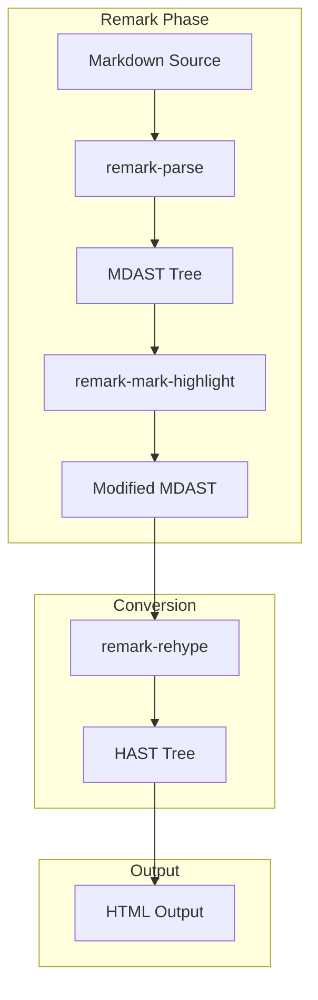
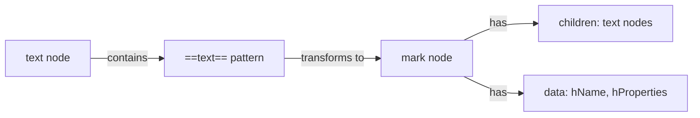

# Technical Design Document

## Overview

**Purpose**: この機能はObsidianユーザーに対し、マークハイライト記法（`==text==`）と他のインラインスタイリング（strong/emphasis/inlineCode）の組み合わせを正しく動作させる価値を提供します。

**Users**: Obsidianでブログ記事を執筆するコンテンツ作成者が、強調表現の組み合わせ（`**==重要==**`など）を使用する際にこの機能を利用します。

**Impact**: 現在の`remark-mark-highlight`プラグインの出力方式を`type: 'html'`からカスタムMDATノード方式に変更します。

### Goals
- `**==text==**`（strong + mark）が正しく`<strong><mark>text</mark></strong>`に変換される
- `*==text==*`（emphasis + mark）が正しく`<em><mark>text</mark></em>`に変換される
- `` ==`code`== ``（mark + inlineCode）が正しく`<mark><code>code</code></mark>`に変換される
- 既存の単独マークハイライト機能との後方互換性を維持

### Non-Goals
- 新しいマークアップ記法の追加
- パフォーマンスの大幅な改善（現状維持が目標）
- CSSスタイリングの変更

## Architecture

### Existing Architecture Analysis

現在の`remark-mark-highlight`プラグインは以下の構造で動作しています：

1. `visit(tree, 'text', ...)`でテキストノードを走査
2. 正規表現`/==([^=]+)==/g`でマークハイライト記法を検出
3. `type: 'html'`ノード（raw HTML文字列）を生成

**問題点**: `type: 'html'`ノードはremark-rehype変換時に「raw」として扱われ、親ノード（strong/emphasis）のセマンティクスが失われます。

### Architecture Pattern & Boundary Map



**Architecture Integration**:
- Selected pattern: カスタムMDATノード + `data.hName`方式（mdast-util-to-hastの標準機能）
- Domain/feature boundaries: remarkプラグインのみの変更、rehypeフェーズへの影響なし
- Existing patterns preserved: `visit`によるAST走査、`parent.children.splice`によるノード置換
- New components rationale: 新規コンポーネントなし、既存プラグインの内部実装変更のみ
- Steering compliance: カスタムremarkプラグインのJavaScript記述パターンを維持

### Technology Stack

| Layer | Choice / Version | Role in Feature | Notes |
|-------|------------------|-----------------|-------|
| AST Processing | unist-util-visit | テキストノード走査 | 既存利用 |
| AST Conversion | mdast-util-to-hast | カスタムノード→HTML変換 | data.hName機能を活用 |
| Framework | Astro v5 | ビルド時Markdown処理 | 設定変更不要 |

## Requirements Traceability

| Requirement | Summary | Components | Interfaces | Flows |
|-------------|---------|------------|------------|-------|
| 1.1 | `**==text==**`の変換 | remarkMarkHighlight | processTextNode | テキスト処理フロー |
| 1.2 | `==**text**==`の変換 | remarkMarkHighlight | processTextNode | テキスト処理フロー |
| 1.3 | strong内複数mark | remarkMarkHighlight | processTextNode | テキスト処理フロー |
| 2.1 | `*==text==*`の変換 | remarkMarkHighlight | processTextNode | テキスト処理フロー |
| 2.2 | `==*text*==`の変換 | remarkMarkHighlight | processTextNode | テキスト処理フロー |
| 2.3 | emphasis内複数mark | remarkMarkHighlight | processTextNode | テキスト処理フロー |
| 3.1 | `` ==`code`== ``の変換 | remarkMarkHighlight | processTextNode | テキスト処理フロー |
| 3.2 | inlineCode内の`==`保護 | remarkMarkHighlight | 親ノードチェック | スキップロジック |
| 3.3 | strong+mark+code | remarkMarkHighlight | processTextNode | テキスト処理フロー |
| 3.4 | emphasis+mark+code | remarkMarkHighlight | processTextNode | テキスト処理フロー |
| 4.1 | 3重入れ子処理 | remarkMarkHighlight | processTextNode | テキスト処理フロー |
| 4.2 | 別記法入れ子 | remarkMarkHighlight | processTextNode | テキスト処理フロー |
| 4.3 | maxNestingDepth制限 | remarkMarkHighlight | オプション設定 | 設定適用 |
| 5.1 | 単独mark後方互換 | remarkMarkHighlight | processTextNode | テキスト処理フロー |
| 5.2 | エスケープ後方互換 | remarkMarkHighlight | escapeHandling | エスケープ処理 |
| 5.3 | カスタム属性後方互換 | remarkMarkHighlight | attributeParsing | 属性処理 |
| 5.4 | アクセシビリティ維持 | remarkMarkHighlight | hProperties生成 | 属性適用 |
| 5.5 | 不正入れ子フェイルセーフ | remarkMarkHighlight | processTextNode | エラーハンドリング |
| 6.1 | キャッシュ活用 | SimpleCache | get/set | キャッシュフロー |
| 6.2 | 処理時間制限 | remarkMarkHighlight | 実装全体 | パフォーマンス |
| 6.3 | maxInputLength制限 | remarkMarkHighlight | セキュリティチェック | 入力検証 |

## Components and Interfaces

| Component | Domain/Layer | Intent | Req Coverage | Key Dependencies | Contracts |
|-----------|--------------|--------|--------------|-----------------|-----------|
| remarkMarkHighlight | Remark Plugin | テキストノード内のmark記法を検出しカスタムノードに変換 | 1.1-6.3 | unist-util-visit (P0), escapeHtml (P1) | Service |
| SimpleCache | Utility | 処理結果のLRUキャッシュ | 6.1 | なし | State |
| escapeHtml | Utility | HTMLエスケープ処理 | 5.4 | なし | Service |

### Remark Plugin Layer

#### remarkMarkHighlight

| Field | Detail |
|-------|--------|
| Intent | テキストノード内の`==text==`記法を検出し、カスタムMDATノードに変換する |
| Requirements | 1.1-1.3, 2.1-2.3, 3.1-3.4, 4.1-4.3, 5.1-5.5, 6.1-6.3 |

**Responsibilities & Constraints**
- テキストノードの走査と`==text==`パターンの検出
- カスタム`mark`ノードの生成（`data.hName`、`data.hProperties`付き）
- 親ノードタイプによるスキップ判定（link, inlineCode, code等）
- エスケープ処理（`\==`）とカスタム属性パース（`{.class}`）

**Dependencies**
- Inbound: Astro Markdown処理パイプライン — remarkプラグインとして呼び出し (P0)
- Outbound: なし
- External: unist-util-visit — AST走査 (P0)
- External: escapeHtml — HTMLエスケープ (P1)

**Contracts**: Service [x] / API [ ] / Event [ ] / Batch [ ] / State [ ]

##### Service Interface

```javascript
/**
 * @typedef {Object} MarkHighlightOptions
 * @property {string} [className=''] - デフォルトのCSSクラス名
 * @property {boolean} [enabled=true] - プラグイン有効/無効
 * @property {boolean} [accessibility=true] - role属性付与
 * @property {boolean} [focusable=false] - tabindex付与
 * @property {boolean} [cache=true] - キャッシュ有効/無効
 * @property {number} [maxInputLength=100000] - 最大入力長
 * @property {number} [maxNestingDepth=10] - 最大ネスト深度
 * @property {'auto'|'strict'|'disabled'} [securityMode='auto'] - セキュリティモード
 */

/**
 * @typedef {Object} MarkNode
 * @property {'mark'} type - ノードタイプ
 * @property {Array<{type: 'text', value: string}>} children - 子ノード
 * @property {Object} data - メタデータ
 * @property {'mark'} data.hName - hast変換時のタグ名
 * @property {Object} data.hProperties - hast変換時の属性
 */

/**
 * remarkMarkHighlightプラグイン
 * @param {MarkHighlightOptions} options - オプション
 * @returns {(tree: Node) => void} transformer関数
 */
function remarkMarkHighlight(options) { /* ... */ }
```

- Preconditions: MDAST treeが有効なMarkdownパース結果であること
- Postconditions: `==text==`パターンが`type: 'mark'`ノードに変換されていること
- Invariants: 親ノード（strong/emphasis等）の構造は変更されない

**Implementation Notes**
- Integration: 既存のastro.config.mjsのremarkPlugins設定で動作、設定変更不要
- Validation: 入力長チェック（maxInputLength）、セキュリティモードによるHTMLエスケープ
- Risks: キャッシュキー形式の変更により、ビルドキャッシュが無効化される可能性あり

## Data Models

### Domain Model



**Entities**:
- `MarkNode`: カスタムMDATノード（`type: 'mark'`）
  - `children`: 子テキストノードの配列
  - `data.hName`: `'mark'`（hast変換時のタグ名）
  - `data.hProperties`: `{ role, class, tabindex }`（HTML属性）

**Invariants**:
- `MarkNode.children`は必ず1つ以上のノードを持つ
- `data.hName`は常に`'mark'`
- `data.hProperties.role`はaccessibility=trueの場合`'mark'`

### Logical Data Model

**ノード変換前後の比較**:

| Before | After |
|--------|-------|
| `{ type: 'html', value: '<mark>text</mark>' }` | `{ type: 'mark', children: [{type: 'text', value: 'text'}], data: {hName: 'mark', hProperties: {role: 'mark'}} }` |

**キャッシュキー形式**:
- 変更前: `${text}:${className}:${accessibility}:${focusable}`
- 変更後: 同一（キャッシュ値の構造のみ変更）

## Error Handling

### Error Strategy

| Error Type | Detection | Response |
|------------|-----------|----------|
| 入力長超過 | `text.length > maxInputLength` | console.warn + スキップ（処理停止） |
| 無効なネスト | パース時検出 | 元テキストをそのまま出力 |
| 空のハイライト | `====`パターン | 元テキストをそのまま出力 |

### Monitoring

- エラー発生時は`console.warn`でログ出力
- ビルド失敗を引き起こさないよう、エラー時は安全にフォールバック

## Testing Strategy

### Unit Tests
- `==text==`の単独変換
- `**==text==**`のstrong内変換
- `*==text==*`のemphasis内変換
- `` ==`code`== ``のinlineCode併用
- `\==`エスケープ処理
- カスタム属性パース`{.class}`

### Integration Tests
- Astroビルドでの実際のHTML出力検証
- 既存ブログ記事の表示確認
- テスト記事`mark-inline-styling-test`での動作確認

### Regression Tests
- 既存の`mark-highlight-test`記事の表示が変わらないこと
- パフォーマンス測定（処理時間が150%以内）
