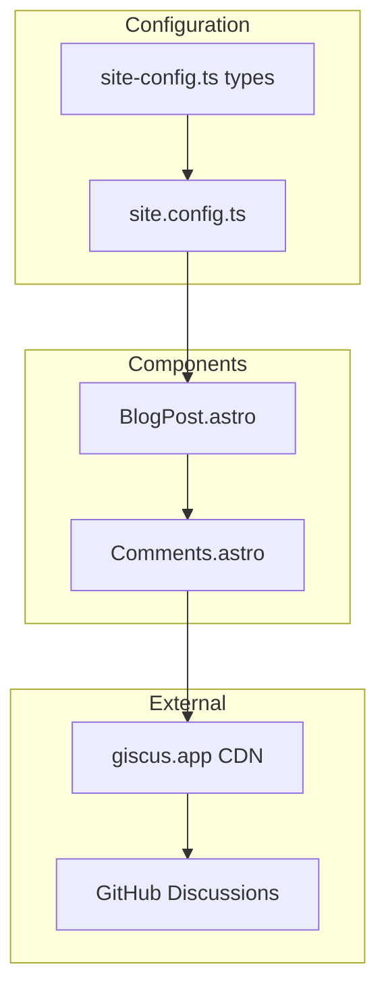
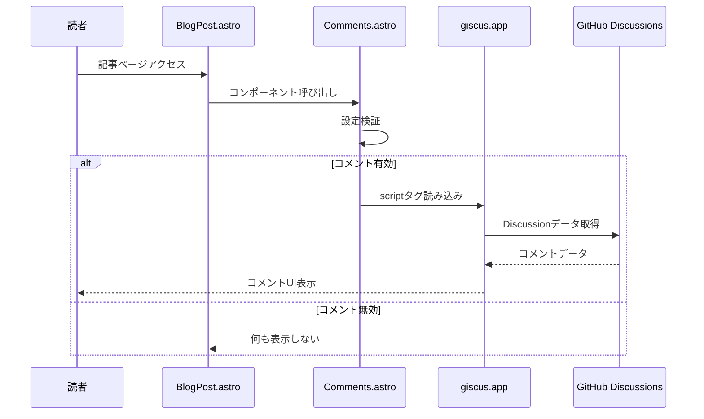
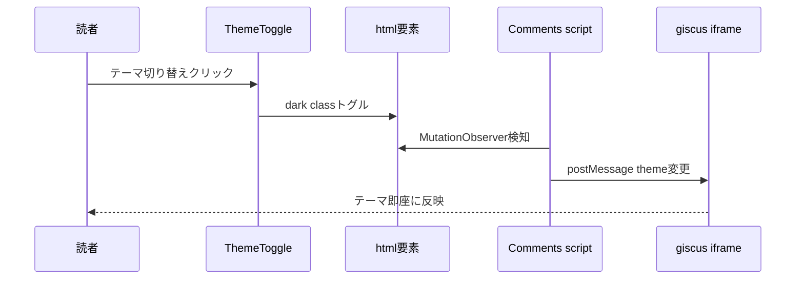

# Design Document: giscus-comments

## Overview

**Purpose**: ブログ記事にGitHub Discussionsベースのコメント機能を提供し、読者と著者のエンゲージメントを促進する。

**Users**: ブログ読者はコメントの閲覧・投稿を行い、サイト管理者はsite.config.tsで機能を設定する。

**Impact**: 既存のBlogPost.astroレイアウトにCommentsコンポーネントを追加し、site-config.ts型定義を拡張する。

### Goals
- giscusウィジェットをAstroコンポーネントとして実装
- サイトのダーク/ライトテーマと自動同期
- 型安全な設定インターフェースの提供
- ページパフォーマンスへの影響を最小化（遅延読み込み）

### Non-Goals
- utterancesプロバイダーの実装（将来対応）
- コメントのモデレーション機能（GitHub Discussionsで管理）
- カスタムコメントUI（giscusデフォルトUIを使用）

## Architecture

### Existing Architecture Analysis

現在のプロジェクトには以下の関連構造が存在する：

- **site.config.ts**: 全サイト設定の一元管理（`features.comments`は定義済みだが未使用）
- **src/types/site-config.ts**: `CommentsConfig`型が定義済み（`config: Record<string, unknown>`）
- **src/layouts/BlogPost.astro**: 記事レイアウト（コメントセクション未実装）
- **src/components/ThemeToggle.astro**: テーマ切り替え（`html.dark`クラスで管理）

### Architecture Pattern & Boundary Map



**Architecture Integration**:
- **Selected pattern**: コンポーネント統合パターン（既存レイアウトへの機能追加）
- **Domain boundaries**: CommentsコンポーネントはUI表示のみ担当、設定はsite.config.tsで一元管理
- **Existing patterns preserved**: 機能フラグによる有効/無効制御、型安全な設定
- **New components rationale**: Commentsコンポーネントはgiscus埋め込みを抽象化
- **Steering compliance**: TypeScript strict mode、既存のコンポーネントパターンに準拠

### Technology Stack

| Layer | Choice / Version | Role in Feature | Notes |
|-------|------------------|-----------------|-------|
| Frontend | Astro v5 | コンポーネントレンダリング | 既存スタック |
| External Script | giscus CDN | コメントウィジェット | 追加依存なし |
| Type System | TypeScript strict | 設定の型安全性 | 既存スタック |

## System Flows

### コメント表示フロー



### テーマ同期フロー



## Requirements Traceability

| Requirement | Summary | Components | Interfaces | Flows |
|-------------|---------|------------|------------|-------|
| 1.1 | giscusウィジェット表示 | Comments | GiscusConfig | コメント表示 |
| 1.2 | 有効時にコメント表示 | Comments, BlogPost | CommentsConfig | コメント表示 |
| 1.3 | 無効時に非表示 | Comments | CommentsConfig | - |
| 1.4 | 設定値の使用 | Comments | GiscusConfig | コメント表示 |
| 2.1 | BlogPostへの配置 | BlogPost | - | コメント表示 |
| 2.2 | RelatedPosts前に配置 | BlogPost | - | - |
| 2.3 | URL/タイトル渡し | Comments | - | コメント表示 |
| 3.1 | ライトテーマ表示 | Comments | - | テーマ同期 |
| 3.2 | ダークテーマ表示 | Comments | - | テーマ同期 |
| 3.3 | テーマ動的切り替え | Comments | - | テーマ同期 |
| 4.1 | 必須プロパティ定義 | - | GiscusConfig | - |
| 4.2 | オプショナルプロパティ | - | GiscusConfig | - |
| 4.3 | 型適用 | - | CommentsConfig | - |
| 5.1 | 遅延読み込み | Comments | - | コメント表示 |
| 5.3 | loading属性設定 | Comments | - | - |

## Components and Interfaces

| Component | Domain/Layer | Intent | Req Coverage | Key Dependencies | Contracts |
|-----------|--------------|--------|--------------|------------------|-----------|
| Comments.astro | UI/Component | giscusウィジェット表示 | 1.1-1.4, 2.3, 3.1-3.3, 5.1, 5.3 | siteConfig (P0) | Props |
| BlogPost.astro | UI/Layout | コメントセクション統合 | 2.1, 2.2 | Comments (P1) | - |
| GiscusConfig | Types | giscus設定の型定義 | 4.1, 4.2 | - | Interface |
| CommentsConfig | Types | コメント設定の型拡張 | 4.3 | GiscusConfig (P0) | Interface |

### UI/Component Layer

#### Comments.astro

| Field | Detail |
|-------|--------|
| Intent | giscusウィジェットを表示し、テーマ同期を管理 |
| Requirements | 1.1, 1.2, 1.3, 1.4, 2.3, 3.1, 3.2, 3.3, 5.1, 5.3 |

**Responsibilities & Constraints**
- giscus scriptタグの生成と埋め込み
- サイトテーマとgiscusテーマの同期
- 設定不足時の安全な非表示処理

**Dependencies**
- Inbound: BlogPost.astro — レイアウトからの呼び出し (P0)
- External: giscus.app CDN — コメントウィジェット (P0)

**Contracts**: Props [x]

##### Props Interface

```typescript
interface CommentsProps {
  /** 記事のURL（giscus mapping用） */
  articleUrl: string;
  /** 記事のタイトル（giscus mapping用） */
  articleTitle: string;
}
```

**Implementation Notes**
- giscus scriptは`loading="lazy"`で遅延読み込み
- MutationObserverで`html.dark`クラス変更を監視
- postMessageでiframe内のgiscusテーマを更新
- 設定不足時（repo未設定等）はコンポーネントを非表示

### Types Layer

#### GiscusConfig

| Field | Detail |
|-------|--------|
| Intent | giscus固有の設定を型安全に定義 |
| Requirements | 4.1, 4.2 |

**Contracts**: Interface [x]

##### Type Definition

```typescript
/**
 * giscusプロバイダー固有の設定
 * @see https://giscus.app/ for configuration options
 */
export interface GiscusConfig {
  /** GitHubリポジトリ（例: "owner/repo"） */
  repo: string;
  /** リポジトリID */
  repoId: string;
  /** ディスカッションカテゴリ名 */
  category: string;
  /** カテゴリID */
  categoryId: string;

  /** マッピング方式（デフォルト: "pathname"） */
  mapping?: 'pathname' | 'url' | 'title' | 'og:title' | 'specific' | 'number';
  /** 厳密マッチング（デフォルト: false） */
  strict?: boolean;
  /** リアクション表示（デフォルト: true） */
  reactionsEnabled?: boolean;
  /** メタデータ送信（デフォルト: false） */
  emitMetadata?: boolean;
  /** 入力位置（デフォルト: "bottom"） */
  inputPosition?: 'top' | 'bottom';
  /** 言語（デフォルト: サイト言語） */
  lang?: string;
}
```

#### CommentsConfig（拡張）

```typescript
/**
 * コメントシステム設定
 * providerに応じてconfigの型が決まる
 */
export interface CommentsConfig {
  enabled: boolean;
  provider?: 'giscus' | 'utterances';
  config?: GiscusConfig;  // Record<string, unknown>から変更
}
```

## Data Models

### Configuration Data

**Structure Definition**:
- `GiscusConfig`: giscus API属性に対応する設定オブジェクト
- 必須属性（repo, repoId, category, categoryId）と任意属性で構成

**Consistency & Integrity**:
- TypeScriptコンパイル時に必須属性の欠落を検出
- 実行時はCommentsコンポーネントで設定検証

## Error Handling

### Error Strategy

コメント機能はオプショナルなため、エラー時は機能を無効化しページ表示を維持する。

### Error Categories and Responses

**設定エラー（開発時）**:
- 必須設定欠落 → TypeScriptコンパイルエラー
- 型不一致 → TypeScriptコンパイルエラー

**ランタイムエラー（本番）**:
- giscusスクリプト読み込み失敗 → コメントセクション非表示、コンソール警告
- GitHub Discussions未設定 → giscus側でエラー表示（ユーザーにはgiscusのエラーメッセージ）

### Monitoring

- コンソール警告: 設定不足時に開発者向けメッセージ出力
- ブラウザネットワークタブ: giscusスクリプト読み込み状況確認

## Testing Strategy

### Unit Tests
- GiscusConfig型の必須/オプショナルプロパティ検証
- CommentsConfig型のprovider別config型推論

### Integration Tests
- BlogPost + Comments統合時のレンダリング確認
- テーマ切り替え時のpostMessage送信確認

### E2E Tests
- コメント有効時のgiscusウィジェット表示確認
- コメント無効時の非表示確認
- ダーク/ライトテーマ切り替え時のgiscusテーマ同期
