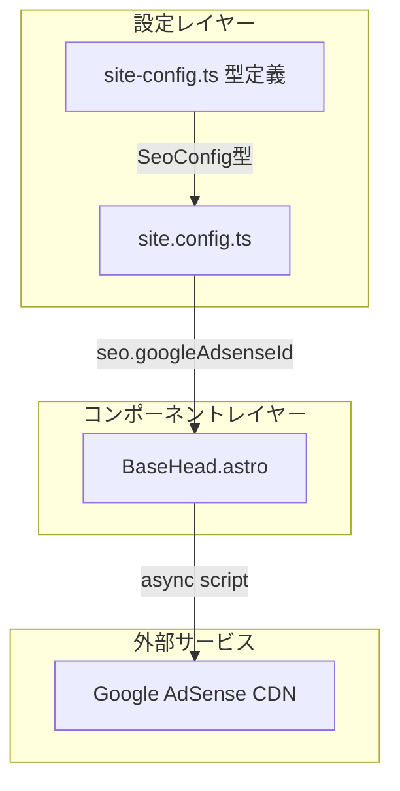

# Design Document: Google AdSense Integration

## Overview

**Purpose**: この機能は、itzpapaブログにGoogle AdSense自動広告を統合し、サイト運営者が収益化を実現できるようにする。

**Users**: サイト運営者が`site.config.ts`を通じてAdSenseパブリッシャーIDを設定し、サイト訪問者に広告を表示する。

**Impact**: 既存の`SeoConfig`と`BaseHead.astro`に最小限の変更を加え、Google Analytics統合と同一のパターンで実装する。

### Goals
- `site.config.ts`での設定によるAdSense有効化/無効化
- 非同期スクリプト読み込みによるパフォーマンス維持
- Google Analyticsと一貫した設定パターン

### Non-Goals
- 手動広告ユニット配置（自動広告のみ対応）
- 特定ページでの広告非表示制御
- AdSenseのパフォーマンスレポート統合

## Architecture

### Existing Architecture Analysis

現在のプロジェクトは以下のパターンを採用している：
- **設定の中央管理**: `site.config.ts`で全サイト設定を管理
- **型安全な設定**: `src/types/site-config.ts`で型定義
- **SEO/Analytics統合**: `BaseHead.astro`でGoogle Analyticsスクリプトを条件付き出力

これらのパターンをそのまま踏襲し、AdSense統合を追加する。

### Architecture Pattern & Boundary Map



**Architecture Integration**:
- **Selected pattern**: 既存パターンの拡張（Google Analytics同様）
- **Domain boundaries**: 設定→コンポーネント→外部サービスの単方向依存
- **Existing patterns preserved**: 条件付きスクリプト出力、空文字による無効化
- **New components rationale**: 新規コンポーネント不要（BaseHead拡張のみ）
- **Steering compliance**: tech.mdのTypeScript strict mode準拠

### Technology Stack

| Layer | Choice / Version | Role in Feature | Notes |
|-------|------------------|-----------------|-------|
| Frontend | Astro v5 | 静的サイト生成、条件付きスクリプト出力 | 既存 |
| Runtime | TypeScript strict | 型安全な設定管理 | 既存 |
| External | Google AdSense CDN | 自動広告スクリプト配信 | 新規依存 |

## Requirements Traceability

| Requirement | Summary | Components | Interfaces | Flows |
|-------------|---------|------------|------------|-------|
| 1.1-1.5 | AdSense設定管理 | SeoConfig, site.config.ts | SeoConfig interface | - |
| 2.1-2.3 | スクリプト読み込み | BaseHead.astro | - | Script Injection |
| 3.1-3.2 | 自動広告表示 | BaseHead.astro | - | Script Injection |
| 4.1-4.2 | 開発環境対応 | BaseHead.astro | - | - |
| 5.1-5.2 | パフォーマンス配慮 | BaseHead.astro | - | Script Injection |

## Components and Interfaces

| Component | Domain/Layer | Intent | Req Coverage | Key Dependencies | Contracts |
|-----------|--------------|--------|--------------|------------------|-----------|
| SeoConfig | Types | AdSense ID設定の型定義 | 1.1-1.5 | - | State |
| site.config.ts | Config | AdSense ID値の保持 | 1.1-1.5 | SeoConfig (P0) | - |
| BaseHead.astro | UI | AdSenseスクリプト出力 | 2.1-3.2, 4.1-5.2 | siteConfig (P0) | - |

### Types Layer

#### SeoConfig Interface

| Field | Detail |
|-------|--------|
| Intent | SEO関連設定の型定義を提供 |
| Requirements | 1.1, 1.3, 1.4, 1.5 |

**Responsibilities & Constraints**
- `googleAdsenseId`プロパティをオプショナルで追加
- 既存の`googleAnalyticsId`と同一パターンを維持

**Contracts**: State [x]

##### State Management

```typescript
export interface SeoConfig {
  /** デフォルトの説明文 */
  defaultDescription?: string;
  /** Google Analytics トラッキング ID（空の場合はスクリプト出力なし） */
  googleAnalyticsId?: string;
  /** Google AdSense パブリッシャー ID（空の場合はスクリプト出力なし） */
  googleAdsenseId?: string;
}
```

- State model: オプショナルstring（空文字または未定義で無効化）
- Persistence: `site.config.ts`での静的設定
- Consistency: ビルド時に解決

**Implementation Notes**
- Validation: `ca-pub-`プレフィックスの検証は実施しない（ユーザー責任）
- Risks: なし

### UI Layer

#### BaseHead.astro

| Field | Detail |
|-------|--------|
| Intent | ページ共通の`<head>`要素を出力（AdSenseスクリプト含む） |
| Requirements | 2.1, 2.2, 2.3, 3.1, 3.2, 4.1, 4.2, 5.1, 5.2 |

**Responsibilities & Constraints**
- `googleAdsenseId`が設定されている場合のみAdSenseスクリプトを出力
- 空文字または未定義の場合はスクリプトを出力しない
- Google Analyticsと同一のレンダリングパターンを使用

**Dependencies**
- Inbound: Astro pages — BaseHeadコンポーネント使用 (P0)
- Outbound: siteConfig — SEO設定取得 (P0)
- External: pagead2.googlesyndication.com — AdSenseスクリプト (P0)

**Contracts**: 追加コントラクトなし（テンプレート出力のみ）

**Implementation Notes**
- Integration: Google Analytics出力ブロックの直後に配置
- Validation: `googleAdsenseId`の存在チェックのみ（truthy判定）
- Risks: なし

## Data Models

### Domain Model

本機能で扱うデータは設定値のみであり、ドメインモデルは不要。

### Logical Data Model

**SeoConfig拡張**:
- `googleAdsenseId`: string | undefined
- 形式: `ca-pub-XXXXXXXXXXXXXXXX`（16桁の数字）
- 空文字は無効化として扱う

## Error Handling

### Error Strategy

本機能では特別なエラー処理は不要。

**設定ミス（無効なID形式）**:
- 動作: スクリプトは出力されるが、AdSenseコンソールでエラー表示
- 対応: ユーザーがAdSenseダッシュボードで確認

### Monitoring

- ビルドエラー: TypeScript型チェックで設定構造の誤りを検出
- ランタイムエラー: ブラウザのAdSenseエラーはGoogleのAdSenseダッシュボードで確認

## Testing Strategy

### Unit Tests
- `SeoConfig`型に`googleAdsenseId`プロパティが存在することを確認
- `googleAdsenseId`が空文字の場合のfalsy判定

### Integration Tests
- `googleAdsenseId`設定時にAdSenseスクリプトタグが出力されることを確認
- `googleAdsenseId`未設定時にスクリプトが出力されないことを確認
- スクリプトタグに`async`と`crossorigin="anonymous"`属性が含まれることを確認

### E2E Tests
- ビルド後のHTMLにAdSenseスクリプトが正しく含まれることを確認

## Performance & Scalability

**パフォーマンス目標**:
- AdSenseスクリプトはページレンダリングをブロックしない
- Lighthouse Performance スコアへの影響を最小限に抑制

**実現方法**:
- `async`属性による非同期読み込み
- `crossorigin="anonymous"`によるCORS最適化
