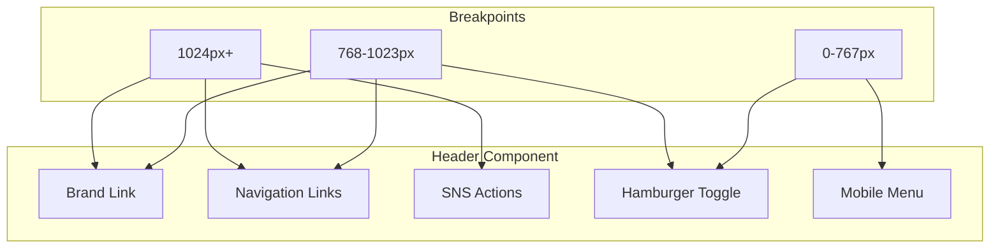

# Design Document: header-scroll-prevention

## Overview

**Purpose**: ヘッダーコンポーネントの横スクロール発生を防止し、任意の設定でも一貫した表示品質を保証する。

**Users**: サイト管理者および閲覧者が、デバイス幅に関わらず快適にナビゲーションを利用できる。

**Impact**: 既存のHeader.astroにCSSメディアクエリを追加し、中間ブレークポイント（768px〜1023px）でSNSアイコンを非表示化する。

### Goals
- ビューポート幅を超えないヘッダーレイアウトの実現
- 既存のモバイルメニュー機能を活用した段階的なレスポンシブ対応
- スティッキーヘッダー、ダークモード、View Transitionsの維持

### Non-Goals
- ナビゲーション項目数の動的な制限
- ドロップダウンメニューの新規実装
- JavaScriptによる動的なレイアウト調整

## Architecture

### Existing Architecture Analysis

現在のヘッダー構造:
- **HTML**: `header.header__nav` > `header__brand` + `header__links` + `header__menu-toggle` + `header__mobile-menu` + `header__actions`
- **CSS**: 768px未満で`.header__links`と`.header__actions`を非表示、ハンバーガーメニューを表示
- **問題点**: 768px以上ではすべての項目が表示され、項目数が多い場合に幅を超過

### Architecture Pattern & Boundary Map



**Architecture Integration**:
- Selected pattern: 段階的レスポンシブ（Progressive Responsive）
- Domain/feature boundaries: CSSのみの変更、JavaScript変更なし
- Existing patterns preserved: ハンバーガーメニュー、スティッキーヘッダー
- New components rationale: 新規コンポーネントなし
- Steering compliance: 既存のブレークポイントパターンに準拠

### Technology Stack

| Layer | Choice / Version | Role in Feature | Notes |
|-------|------------------|-----------------|-------|
| Frontend | Astro v5 | コンポーネントフレームワーク | 変更なし |
| Styling | CSS (Scoped) | レスポンシブ制御 | メディアクエリ追加 |

## Requirements Traceability

| Requirement | Summary | Components | Interfaces | Flows |
|-------------|---------|------------|------------|-------|
| 1.1 | ビューポート幅制約 | Header.astro CSS | - | - |
| 1.2 | ナビ多数時の表示 | Header.astro CSS | - | - |
| 1.3 | SNS多数時の表示 | Header.astro CSS | - | - |
| 2.1 | ナビ省略/折り返し | Header.astro CSS | - | - |
| 2.2 | SNS省略/折り返し | Header.astro CSS | - | - |
| 2.3 | 全デバイス対応 | Header.astro CSS | - | - |
| 3.1 | スティッキー維持 | - | - | - |
| 3.2 | モバイルメニュー維持 | - | - | - |
| 3.3 | ダークモード維持 | - | - | - |
| 3.4 | View Transitions維持 | - | - | - |

## Components and Interfaces

| Component | Domain/Layer | Intent | Req Coverage | Key Dependencies | Contracts |
|-----------|--------------|--------|--------------|------------------|-----------|
| Header.astro | UI/Presentation | ヘッダーレイアウト制御 | 1.1-1.3, 2.1-2.3, 3.1-3.4 | site.config (P1) | State |

### UI Layer

#### Header.astro CSS Changes

| Field | Detail |
|-------|--------|
| Intent | 中間ブレークポイント追加によるレスポンシブ制御 |
| Requirements | 1.1, 1.2, 1.3, 2.1, 2.2, 2.3 |

**Responsibilities & Constraints**
- 768px〜1023pxで`.header__actions`を非表示化
- ハンバーガーメニューを768px〜1023pxでも表示
- 既存の768px未満の挙動は維持

**Dependencies**
- Inbound: site.config.ts — ナビゲーション・SNS設定 (P1)

**Contracts**: State [x]

##### State Management
- State model: CSSメディアクエリによる表示状態制御
- Persistence: なし（CSS状態のみ）
- Concurrency: なし

**Implementation Notes**
- Integration: 既存の`@media (max-width: 767px)`ブロックの前に中間ブレークポイントを追加
- Validation: 各ブレークポイントでの表示確認
- Risks: 既存スタイルとの競合（優先度で対応）

## CSS Design Specification

### New Media Query: Tablet (768px〜1023px)

```css
/* タブレット対応 (768px〜1023px) */
@media (min-width: 768px) and (max-width: 1023px) {
  .header__actions {
    display: none;
  }

  .header__menu-toggle {
    display: flex;
  }
}
```

### Overflow Prevention

```css
.header {
  overflow-x: hidden;
}

.header__nav {
  overflow: hidden;
}
```

### Breakpoint Summary

| Breakpoint | Navigation | SNS Actions | Hamburger | Mobile Menu |
|------------|------------|-------------|-----------|-------------|
| 0-767px | Hidden | Hidden | Visible | Toggle |
| 768-1023px | Visible | **Hidden** | **Visible** | Toggle |
| 1024px+ | Visible | Visible | Hidden | Hidden |

## Testing Strategy

### Visual Tests
- 320px幅: モバイル表示、横スクロールなし
- 768px幅: タブレット表示、SNS非表示、ハンバーガー表示
- 1024px幅: デスクトップ表示、全項目表示
- 1200px幅: 最大幅コンテナ内で収まることを確認

### Functional Tests
- ハンバーガーメニューの開閉（768px〜1023px）
- モバイルメニュー内SNSアイコンのアクセス確認
- スティッキーヘッダーの動作確認
- ダークモード切り替え確認

### Regression Tests
- 既存の767px以下の挙動が変わらないこと
- 1024px以上の挙動が変わらないこと
- View Transitionsの動作確認
