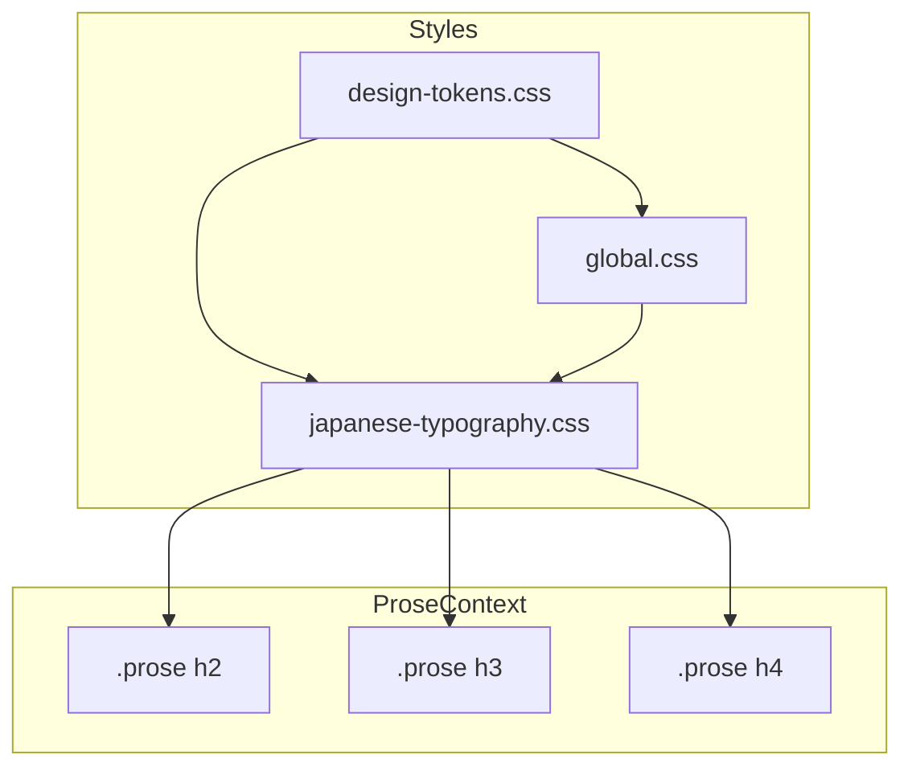

# Design Document: heading-design-change

## Overview
**Purpose**: ブログ記事内のh2-h4見出しに視覚的な装飾を追加し、階層構造を直感的に理解できるようにする。

**Users**: ブログ読者が記事の構造を把握しやすくなり、目的のセクションへ素早くアクセスできる。

**Impact**: 既存の`japanese-typography.css`に見出し装飾スタイルを追加。既存のフォントサイズ・ウェイト設定は維持。

### Goals
- h2-h4の視覚的階層を明確化
- 既存デザイントークンを活用した一貫性のあるスタイル
- ライト/ダークモード両対応

### Non-Goals
- h1（ページタイトル）の装飾変更
- h5-h6の装飾追加
- アニメーション効果の追加

## Architecture

### Existing Architecture Analysis
- **現在のパターン**: `.prose`クラス内で見出しスタイルを定義（`japanese-typography.css`）
- **既存の境界**: グローバル見出しスタイル（`global.css`）と`.prose`内スタイルの分離
- **維持すべきポイント**: フォントサイズ、ウェイト、行間、スクロールマージンは既存設定を継承

### Architecture Pattern & Boundary Map

**Architecture Integration**:
- **Selected pattern**: 既存の`.prose`コンテキスト拡張
- **Domain boundaries**: 見出し装飾は`japanese-typography.css`に集約
- **Existing patterns preserved**: デザイントークン参照、ダークモード切り替え
- **Steering compliance**: OKLCHベースの色システム維持

### Technology Stack

| Layer | Choice / Version | Role in Feature | Notes |
|-------|------------------|-----------------|-------|
| Styling | CSS Custom Properties | デザイントークン参照 | 既存の`design-tokens.css`を活用 |
| Framework | Astro v5 | ビルド時CSS最適化 | 変更なし |

## Requirements Traceability

| Requirement | Summary | Components | Interfaces | Flows |
|-------------|---------|------------|------------|-------|
| 1.1-1.4 | h2装飾（左ボーダー+背景） | `.prose h2` | CSS Properties | - |
| 2.1-2.4 | h3装飾（左ボーダーのみ） | `.prose h3` | CSS Properties | - |
| 3.1-3.4 | h4装飾（下線のみ） | `.prose h4` | CSS Properties | - |
| 4.1-4.3 | 階層の視覚的区別 | 全見出しスタイル | CSS Properties | - |
| 5.1-5.3 | デザインの一貫性 | デザイントークン参照 | CSS Variables | - |
| 6.1-6.3 | レスポンシブ対応 | メディアクエリ | CSS Properties | - |

## Components and Interfaces

| Component | Domain/Layer | Intent | Req Coverage | Key Dependencies | Contracts |
|-----------|--------------|--------|--------------|------------------|-----------|
| `.prose h2` Style | Styling | h2に左ボーダー+背景装飾を適用 | 1.1-1.4, 4.1-4.3 | design-tokens.css (P0) | CSS |
| `.prose h3` Style | Styling | h3に左ボーダー装飾を適用 | 2.1-2.4, 4.1-4.3 | design-tokens.css (P0) | CSS |
| `.prose h4` Style | Styling | h4に下線装飾を適用 | 3.1-3.4, 4.1-4.3 | design-tokens.css (P0) | CSS |
| Dark Mode Styles | Styling | ダークモード用の色調整 | 1.4, 2.4, 3.4 | design-tokens.css (P0) | CSS |
| Responsive Styles | Styling | モバイル向けパディング調整 | 6.1-6.3 | - | CSS |

### Styling Layer

#### `.prose h2` Style

| Field | Detail |
|-------|--------|
| Intent | h2要素に最も目立つ装飾（左ボーダー+背景）を適用 |
| Requirements | 1.1, 1.2, 1.3, 1.4, 4.1, 4.2 |

**Responsibilities & Constraints**
- 左ボーダー（太め、4px）+ 薄い背景色の組み合わせ
- 既存のフォントサイズ・ウェイト設定を維持
- `.prose`コンテキスト内でのみ適用

**Dependencies**
- Inbound: design-tokens.css — 色変数、スペーシング変数 (P0)

**Contracts**: State [x]

##### State Management
- **CSS Properties**:
  - `border-left`: 4px solid var(--color-accent)
  - `background-color`: var(--color-primary-500-alpha05)
  - `padding`: var(--space-2) var(--space-4)
  - `border-radius`: var(--radius-sm)
  - `margin-top`: var(--space-8)

**Implementation Notes**
- Integration: 既存の`.prose h2`セレクタに追記
- Validation: ライト/ダークモード両方で視認性を確認

#### `.prose h3` Style

| Field | Detail |
|-------|--------|
| Intent | h3要素に中程度の装飾（左ボーダーのみ）を適用 |
| Requirements | 2.1, 2.2, 2.3, 2.4, 4.1, 4.2 |

**Responsibilities & Constraints**
- 左ボーダー（細め、3px）のみ、背景なし
- h2より控えめな視覚的ボリューム

**Dependencies**
- Inbound: design-tokens.css — 色変数、スペーシング変数 (P0)

**Contracts**: State [x]

##### State Management
- **CSS Properties**:
  - `border-left`: 3px solid var(--color-primary-400)
  - `padding-left`: var(--space-3)
  - `margin-top`: var(--space-6)

**Implementation Notes**
- Integration: 既存の`.prose h3`セレクタに追記
- Validation: h2と並べて階層差が明確か確認

#### `.prose h4` Style

| Field | Detail |
|-------|--------|
| Intent | h4要素に控えめな装飾（下線）を適用 |
| Requirements | 3.1, 3.2, 3.3, 3.4, 4.1, 4.2 |

**Responsibilities & Constraints**
- 下線（破線または細い実線）のみ、左ボーダーなし
- 最も控えめな視覚的ボリューム

**Dependencies**
- Inbound: design-tokens.css — 色変数、スペーシング変数 (P0)

**Contracts**: State [x]

##### State Management
- **CSS Properties**:
  - `border-bottom`: 1px dashed var(--color-gray-300)
  - `padding-bottom`: var(--space-1)
  - `margin-top`: var(--space-5)

**Implementation Notes**
- Integration: 既存の`.prose h4`セレクタに追記
- Validation: h3と並べて階層差が明確か確認

#### Dark Mode Styles

| Field | Detail |
|-------|--------|
| Intent | ダークモード時の見出し装飾色を調整 |
| Requirements | 1.4, 2.4, 3.4 |

**Responsibilities & Constraints**
- `html.dark`および`@media (prefers-color-scheme: dark)`で適用
- 背景色・ボーダー色をダークモード用に調整

**Dependencies**
- Inbound: design-tokens.css — ダークモード用色変数 (P0)

**Contracts**: State [x]

##### State Management
- **CSS Properties** (Dark Mode):
  - h2 `background-color`: var(--color-primary-dark-alpha08)
  - h4 `border-bottom-color`: var(--color-gray-600)

#### Responsive Styles

| Field | Detail |
|-------|--------|
| Intent | モバイル画面でのパディング調整 |
| Requirements | 6.1, 6.2, 6.3 |

**Responsibilities & Constraints**
- 768px未満でパディングを縮小
- コンテンツの可読性を維持

**Contracts**: State [x]

##### State Management
- **CSS Properties** (max-width: 767px):
  - h2 `padding`: var(--space-1) var(--space-3)
  - h3 `padding-left`: var(--space-2)

## Testing Strategy

### Visual Tests
- ライトモードでh2-h4の装飾が正しく表示される
- ダークモードでh2-h4の装飾が正しく表示される
- モバイル画面（767px以下）でパディングが適切に縮小される
- h2, h3, h4を連続して配置した際に階層が明確に区別できる

### Integration Tests
- 既存のブログ記事で見出しスタイルが正しく適用される
- Callout内の見出しに影響がないこと
- 目次（ToC）からのアンカーリンクが正常に機能すること
