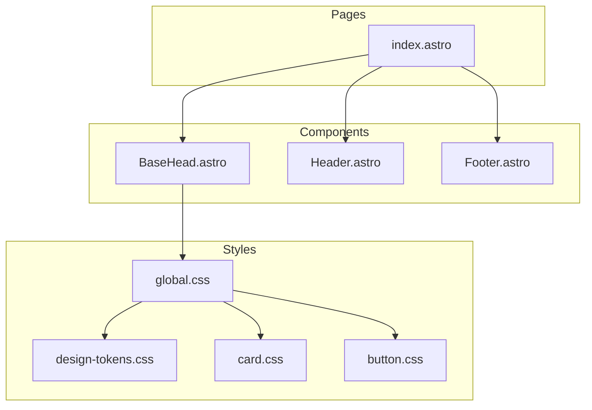

# Design Document: Homepage Redesign

## Overview

**Purpose**: itzpapaブログのホームページを刷新し、視覚的魅力の向上、パフォーマンス最適化、アクセシビリティ強化を実現する。

**Users**: ブログ訪問者（一般読者、技術者、Obsidianユーザー）がホームページから記事を探索し、サイトの価値を理解するために利用する。

**Impact**: 既存のホームページ（`src/pages/index.astro`）のスタイルを更新し、デザインシステム（`design-tokens.css`、`card.css`）との整合性を高める。機能的な変更は最小限に抑え、視覚的・非機能的品質を向上させる。

### Goals
- ヒーローセクションにフェードインアニメーションを追加し、視覚的インパクトを向上
- カードコンポーネントの統一スタイル適用とインタラクション強化
- Lighthouse Performance 90+、LCP 2.5秒以内の達成
- WCAG 2.1 AA準拠のアクセシビリティ確保
- 320px〜1920pxの全画面幅でのレスポンシブ対応

### Non-Goals
- ホームページの構成変更（セクション追加・削除）
- 新規コンポーネントファイルの作成
- サーバーサイドロジックの変更
- 検索機能やフィルタリング機能の追加

## Architecture

### Existing Architecture Analysis

**現在のアーキテクチャ**:
- Astro v5による静的サイトジェネレーション
- コンテンツコレクション（`src/content/blog/`）からの記事取得
- デザイントークンベースのCSS設計（`design-tokens.css`）
- コンポーネントスタイルの分離（`card.css`、`button.css`）

**維持すべきパターン**:
- CSS変数によるデザイントークン参照
- `html.dark`クラスによるダークモード切り替え
- `prefers-reduced-motion`メディアクエリによるアニメーション制御
- Astro Imageコンポーネントによる画像最適化

**技術的制約**:
- スコープドCSSはページ単位で定義
- View Transitionsとの共存が必要

### Architecture Pattern & Boundary Map

**Architecture Integration**:
- **Selected pattern**: 既存拡張 — `index.astro`のスコープドCSSを調整し、`card.css`の共通スタイルを活用
- **Domain boundaries**: ページ固有スタイルはスコープドCSS、共通スタイルはグローバルCSS
- **Existing patterns preserved**: デザイントークン参照、BEM-like命名規則、ダークモード対応
- **New components rationale**: 新規コンポーネントは不要（既存で十分）
- **Steering compliance**: tech.mdのAstro/TypeScript strict mode、カスタムプラグイン分離の原則を維持

### Technology Stack

| Layer | Choice / Version | Role in Feature | Notes |
|-------|------------------|-----------------|-------|
| Frontend | Astro v5 | 静的ページ生成、画像最適化 | 既存 |
| Styling | CSS (design-tokens) | デザイントークン、アニメーション | 既存を拡張 |
| Images | Astro Image + sharp | WebP変換、サイズ最適化 | 既存 |

## Requirements Traceability

| Requirement | Summary | Components | Interfaces | Flows |
|-------------|---------|------------|------------|-------|
| 1.1 | グラデーション背景とアニメーション | HeroSection | CSS animation | - |
| 1.2 | フェードインアニメーション | HeroSection | CSS animation class | - |
| 1.3 | ロゴホバー効果 | HeroSection | CSS :hover | - |
| 1.4 | モバイルレイアウト | HeroSection | CSS media query | - |
| 2.1 | カードホバー効果 | NavCards | card.css | - |
| 2.2 | フォーカスインジケーター | NavCards | card.css :focus-within | - |
| 2.3 | カードアイコン | NavCards | CSS styling | - |
| 2.4 | ダークモード対応 | NavCards | html.dark selector | - |
| 3.1 | 記事カード表示 | PostCards | card.css | - |
| 3.2 | カードホバー効果 | PostCards | card.css | - |
| 3.3 | グリッドレスポンシブ | PostCards | CSS grid | - |
| 3.4 | サムネイルなし対応 | PostCards | CSS fallback | - |
| 4.1 | Lighthouse 90+ | - | - | Performance audit |
| 4.2 | 画像最適化 | - | Astro Image | - |
| 4.3 | loading属性 | - | HTML attribute | - |
| 4.4 | CSS最適化 | - | Astro build | - |
| 4.5 | LCP 2.5秒以内 | - | - | Performance audit |
| 5.1 | WCAG 2.1 AA | All | - | Accessibility audit |
| 5.2 | キーボード操作 | All interactive | tabindex, focus | - |
| 5.3 | 見出し階層 | All | h1/h2/h3 | - |
| 5.4 | alt属性 | Images | HTML alt | - |
| 5.5 | フォーカスインジケーター | All interactive | CSS :focus-visible | - |
| 5.6 | カラーコントラスト | All | design-tokens | - |
| 5.7 | reduced-motion | Animations | CSS media query | - |
| 6.1 | 全画面幅対応 | All | CSS media queries | - |
| 6.2 | タッチターゲット | All interactive | min 44x44px | - |
| 6.3 | モバイル最適化 | All | CSS media queries | - |
| 6.4 | グリッド自動調整 | PostCards | CSS grid auto-fit | - |

## Components and Interfaces

| Component | Domain/Layer | Intent | Req Coverage | Key Dependencies | Contracts |
|-----------|--------------|--------|--------------|------------------|-----------|
| HeroSection | UI/Page | ヒーローエリアの表示とアニメーション | 1.1-1.4 | design-tokens (P0) | State |
| NavCards | UI/Page | ナビゲーションカードの表示 | 2.1-2.4 | card.css (P0) | State |
| PostCards | UI/Page | 最新記事カードの表示 | 3.1-3.4 | card.css (P0), Astro Image (P0) | State |

### UI Layer

#### HeroSection

| Field | Detail |
|-------|--------|
| Intent | ページ読み込み時にフェードインアニメーションでヒーローセクションを表示し、ブランドイメージを訴求 |
| Requirements | 1.1, 1.2, 1.3, 1.4 |

**Responsibilities & Constraints**
- ヒーローセクション（ロゴ、タイトル、説明文）の視覚的表示
- ページロード時のフェードインアニメーション制御
- レスポンシブレイアウト（768px未満で縦方向）
- `prefers-reduced-motion`設定時のアニメーション無効化

**Dependencies**
- Inbound: None
- Outbound: design-tokens.css — アニメーション変数 (P0)
- External: None

**Contracts**: State [x]

##### State Management
- **State model**: CSSアニメーションクラス（`.hero--animated`）
- **Persistence**: なし（ページロード時のみ）
- **Concurrency**: なし

**Implementation Notes**
- Integration: 既存のヒーローセクションHTMLに`.hero--animated`クラスを追加
- Validation: アニメーション後の最終状態がアニメーションなしと同一であることを確認
- Risks: LCPへの影響 — `animation-delay`でLCP測定後に開始

#### NavCards

| Field | Detail |
|-------|--------|
| Intent | ブログとAboutへのナビゲーションカードを表示し、インタラクティブなフィードバックを提供 |
| Requirements | 2.1, 2.2, 2.3, 2.4 |

**Responsibilities & Constraints**
- ナビゲーションカードの表示（アイコン、タイトル、説明）
- ホバー/フォーカス時のビジュアルフィードバック
- ダークモード時のカラー調整
- キーボードナビゲーション対応

**Dependencies**
- Inbound: None
- Outbound: card.css — カードスタイル (P0)
- External: None

**Contracts**: State [x]

##### State Management
- **State model**: CSSステート（`:hover`, `:focus-within`）
- **Persistence**: なし
- **Concurrency**: なし

**Implementation Notes**
- Integration: 既存の`.card--nav`クラスを活用し、card.cssのスタイルを適用
- Validation: フォーカスインジケーターの視認性（コントラスト比）を確認
- Risks: なし（既存パターンの適用）

#### PostCards

| Field | Detail |
|-------|--------|
| Intent | 最新記事をカードグリッドで表示し、記事への誘導を促進 |
| Requirements | 3.1, 3.2, 3.3, 3.4 |

**Responsibilities & Constraints**
- 記事カードの表示（サムネイル、タイトル、説明、日付）
- レスポンシブグリッドレイアウト（1〜3列）
- サムネイルなし記事の適切な表示
- 遅延読み込みによるパフォーマンス最適化

**Dependencies**
- Inbound: None
- Outbound: card.css — カードスタイル (P0), Astro Image — 画像最適化 (P0)
- External: None

**Contracts**: State [x]

##### State Management
- **State model**: CSSステート（`:hover`）、グリッドレイアウト
- **Persistence**: なし
- **Concurrency**: なし

**Implementation Notes**
- Integration: `.card--has-thumbnail`、`.card-grid--3`クラスを活用
- Validation: サムネイルなし時のレイアウト崩れがないことを確認
- Risks: なし（既存パターンの適用）

## Data Models

本フィーチャーはデータモデルの変更を含まない。既存のブログ記事コンテンツコレクションスキーマを使用。

## Error Handling

### Error Strategy
本フィーチャーはUIスタイリングの変更のみであり、エラー処理の追加は不要。

### Monitoring
- Lighthouseによるパフォーマンス・アクセシビリティ監査
- Core Web Vitals（LCP、CLS）の継続的監視

## Testing Strategy

### Visual/Manual Tests
- ヒーローセクションのフェードインアニメーション動作確認
- ダークモード切り替え時のスタイル確認
- 各ブレークポイント（320px, 480px, 768px, 1024px, 1920px）でのレイアウト確認
- `prefers-reduced-motion`設定時のアニメーション無効化確認

### Accessibility Tests
- Lighthouse Accessibility スコア90以上
- axe DevToolsによるWCAG 2.1 AA準拠チェック
- キーボードナビゲーションの動作確認（Tab順序、フォーカスインジケーター）
- スクリーンリーダー（VoiceOver/NVDA）での読み上げ確認

### Performance Tests
- Lighthouse Performance スコア90以上
- LCP 2.5秒以内（モバイル/デスクトップ）
- CLS 0.1以下

### Cross-Browser Tests
- Chrome, Firefox, Safari, Edgeでの表示確認
- iOS Safari, Android Chromeでのモバイル表示確認

## Performance & Scalability

### Target Metrics
| Metric | Target | Measurement |
|--------|--------|-------------|
| Lighthouse Performance | 90+ | Lighthouse CI |
| LCP | < 2.5s | Web Vitals |
| CLS | < 0.1 | Web Vitals |
| FCP | < 1.8s | Web Vitals |

### Optimization Techniques
- ヒーロー画像: `loading="eager"`, `fetchpriority="high"`
- 記事サムネイル: `loading="lazy"`
- CSSアニメーション: `will-change`の適切な使用
- フォント: `font-display: swap`（既存）

### Performance Risks
- **Risk**: フェードインアニメーションがLCPを遅延させる可能性
- **Mitigation**: アニメーションは視覚的な演出のみとし、コンテンツ表示を妨げない。`animation-delay`を使用してLCP測定後に開始
