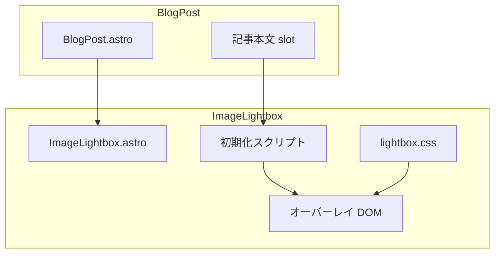
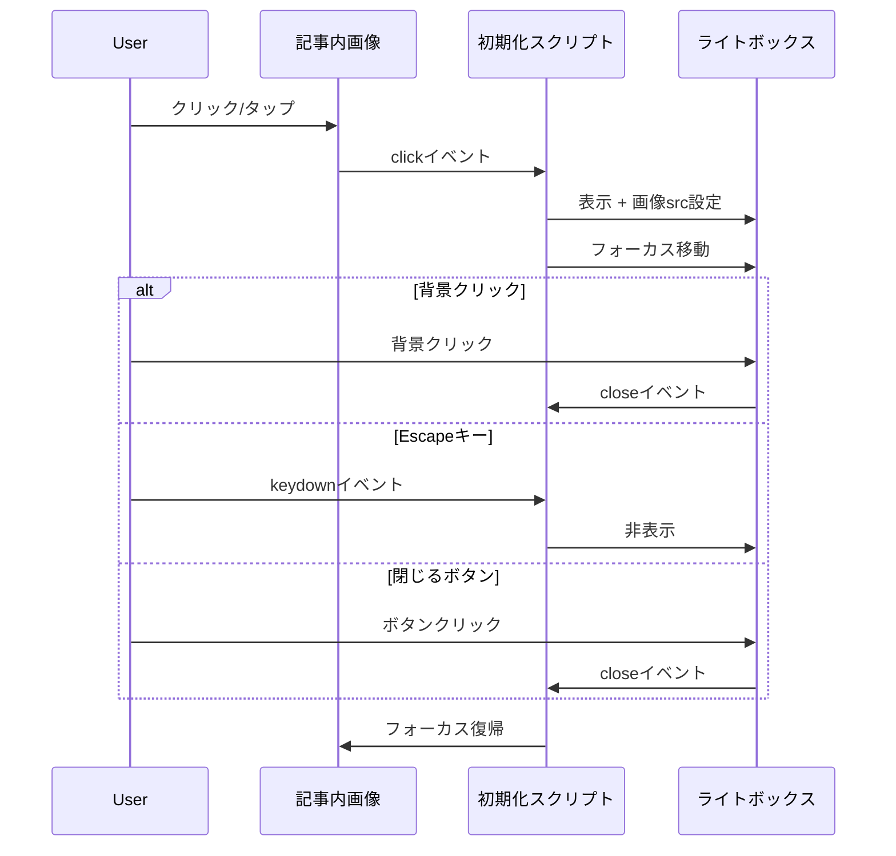

# Design Document: Image Click Behavior (Lightbox)

## Overview

**Purpose**: ブログ記事内の画像をクリックした際にフルスクリーンオーバーレイで拡大表示するライトボックス機能を提供する。

**Users**: ブログ閲覧者が記事内の画像詳細を確認するために使用する。

**Impact**: BlogPost.astroレイアウトにライトボックスコンポーネントを追加し、記事本文内の画像にクリックハンドラーを設定する。

### Goals
- 画像クリックで拡大表示（ライトボックス）
- キーボード・タッチ操作対応
- ダークモード対応
- アクセシビリティ準拠（ARIA属性、フォーカス管理）

### Non-Goals
- 複数画像のギャラリー/スライドショー機能
- 画像ズーム（ピンチズーム）
- 画像ダウンロード機能

## Architecture

### Architecture Pattern & Boundary Map

**Architecture Integration**:
- Selected pattern: コンポーネント分離（Astroコンポーネント + クライアントサイドスクリプト）
- Domain boundaries: UIレイヤーのみ。データ層・サービス層への影響なし
- Existing patterns preserved: Callout folding、ThemeToggleと同じスクリプト注入パターン
- Steering compliance: TypeScript strict mode、コンポーネント分離原則

### Technology Stack

| Layer | Choice / Version | Role in Feature | Notes |
|-------|------------------|-----------------|-------|
| Frontend | Astro v5 | コンポーネント定義 | 既存 |
| Styling | CSS（OKLCHカラー） | ライトボックススタイル | design-tokens.css準拠 |
| Script | Vanilla JavaScript | イベントハンドリング | TypeScriptは不要（シンプルなDOM操作） |

## System Flows

### ライトボックス表示・非表示フロー

## Requirements Traceability

| Requirement | Summary | Components | Interfaces | Flows |
|-------------|---------|------------|------------|-------|
| 1.1 | 画像クリックで拡大表示 | ImageLightbox, lightbox.css | openLightbox() | 表示フロー |
| 1.2 | 背景クリックで閉じる | ImageLightbox | closeLightbox() | 非表示フロー |
| 1.3 | Escapeキーで閉じる | ImageLightbox | keydownハンドラ | 非表示フロー |
| 1.4 | 背景オーバーレイ表示 | lightbox.css | - | - |
| 1.5 | alt属性をキャプション表示 | ImageLightbox | - | 表示フロー |
| 2.1 | 閉じるボタン表示 | ImageLightbox, lightbox.css | - | - |
| 2.2 | 閉じるボタンクリック | ImageLightbox | closeLightbox() | 非表示フロー |
| 3.1 | ダークモード対応 | lightbox.css | - | - |
| 3.2 | ライトモード対応 | lightbox.css | - | - |
| 4.1 | フォーカス移動（開く） | ImageLightbox | openLightbox() | 表示フロー |
| 4.2 | フォーカス復帰（閉じる） | ImageLightbox | closeLightbox() | 非表示フロー |
| 4.3 | aria-label設定 | ImageLightbox | - | - |
| 5.1 | レスポンシブ画像サイズ | lightbox.css | - | - |
| 5.2 | タッチデバイス対応 | ImageLightbox | clickイベント | 表示フロー |

## Components and Interfaces

| Component | Domain/Layer | Intent | Req Coverage | Key Dependencies | Contracts |
|-----------|--------------|--------|--------------|------------------|-----------|
| ImageLightbox.astro | UI | ライトボックスオーバーレイとスクリプト | 1.1-1.5, 2.1-2.2, 4.1-4.3, 5.2 | BlogPost.astro (P0) | State |
| lightbox.css | Style | ライトボックススタイル定義 | 1.4, 2.1, 3.1-3.2, 5.1 | design-tokens.css (P0) | - |

### UI Layer

#### ImageLightbox.astro

| Field | Detail |
|-------|--------|
| Intent | 画像ライトボックスのオーバーレイUI・イベント処理 |
| Requirements | 1.1-1.5, 2.1-2.2, 4.1-4.3, 5.2 |

**Responsibilities & Constraints**
- ライトボックスオーバーレイDOMのレンダリング
- 記事内画像へのクリックイベントリスナー登録
- キーボード操作（Escape）のハンドリング
- フォーカス管理（開閉時のフォーカス移動・復帰）

**Dependencies**
- Inbound: BlogPost.astro — コンポーネント呼び出し (P0)
- External: design-tokens.css — CSS変数 (P0)

**Contracts**: State [x]

##### State Management
- **State model**:
  - `isOpen: boolean` — ライトボックス表示状態
  - `currentImageSrc: string` — 表示中の画像URL
  - `currentImageAlt: string` — 表示中の画像alt属性
  - `previouslyFocused: HTMLElement | null` — フォーカス復帰先
- **Persistence**: なし（DOM状態のみ）
- **Concurrency**: 単一モーダルのため競合なし

**Implementation Notes**
- Integration: BlogPost.astroのbody末尾に配置（Callout scriptと同様）
- Validation: 画像クリック時にsrc属性の存在確認
- Risks: View Transition後のイベント再登録（`astro:page-load`で対応）

### Style Layer

#### lightbox.css

| Field | Detail |
|-------|--------|
| Intent | ライトボックスオーバーレイの視覚スタイル定義 |
| Requirements | 1.4, 2.1, 3.1-3.2, 5.1 |

**Responsibilities & Constraints**
- オーバーレイ背景（半透明ダーク）
- 画像の中央配置・最大サイズ制限
- 閉じるボタンスタイル
- ダークモード対応
- レスポンシブ対応

**Dependencies**
- External: design-tokens.css — z-index, カラー, アニメーション変数 (P0)

**Implementation Notes**
- Integration: global.cssにインポート追加
- Validation: OKLCHフォールバック確認
- Risks: z-indexの競合（`--z-modal`使用で回避）

## Data Models

### Domain Model

本機能はUIのみでデータ永続化なし。

**State Entity**:
- `LightboxState`: 現在の表示状態（open/closed）と表示画像情報

### Logical Data Model

N/A（サーバーサイドデータなし）

## Error Handling

### Error Strategy

ユーザー操作起点のUI機能のため、致命的エラーは発生しにくい。

### Error Categories and Responses

**User Errors**:
- 画像srcが無効 → ライトボックスを開かない（静かに無視）

**System Errors**:
- スクリプト実行エラー → console.errorでログ、機能は無効化されるが記事閲覧に影響なし

## Testing Strategy

### Unit Tests
- 画像クリックでライトボックスが開く
- 背景クリックでライトボックスが閉じる
- Escapeキーでライトボックスが閉じる
- 閉じるボタンクリックで閉じる
- alt属性がキャプションに表示される

### E2E Tests
- 記事ページで画像をクリックしてライトボックス表示確認
- ダークモードでのスタイル確認
- モバイルビューポートでのタップ操作確認
- キーボードナビゲーション（Tab、Escape）確認

## Optional Sections

### Security Considerations
- 外部画像URLを表示する可能性があるが、既存のimg要素を再利用するため追加リスクなし

### Performance & Scalability
- 画像は既にAstroの最適化（sharp）を通過している
- ライトボックスDOMは事前レンダリング、表示/非表示のみで操作
- アニメーションはCSSトランジション使用（GPU最適化）
