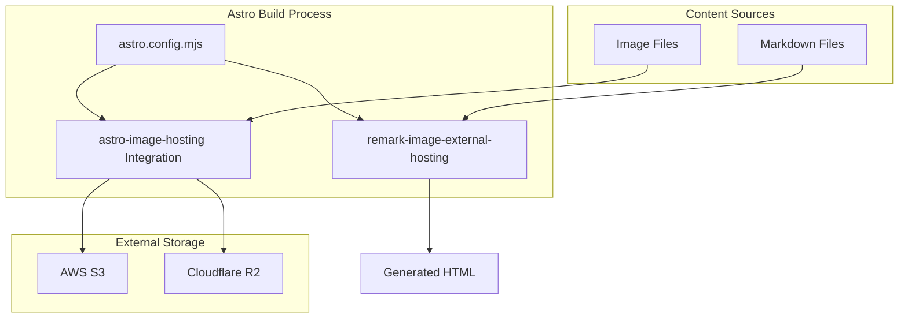
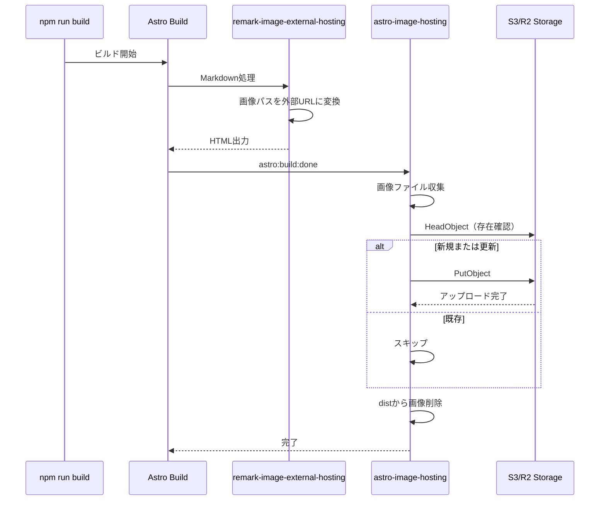
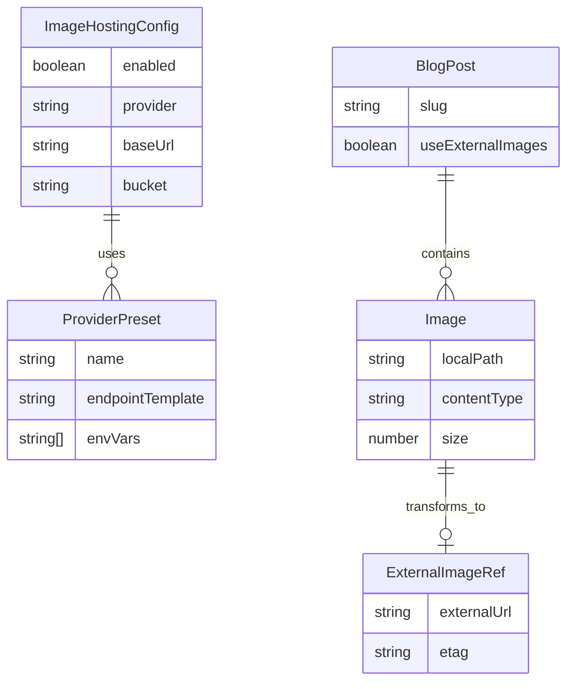

# Design Document: Image External Hosting

## Overview

**Purpose**: itzpapaブログの画像をS3/Cloudflare R2などの外部ストレージから配信し、ビルド時に自動アップロードする機能を提供する。

**Users**: サイト運営者がCDN活用によるパフォーマンス向上と、ビルド出力サイズの削減を実現できる。

**Impact**: 現在の画像処理パイプライン（ローカル画像参照）に外部ホスティングオプションを追加。既存動作はデフォルトで維持。

### Goals
- S3/Cloudflare R2への画像自動アップロード
- Markdown内の画像参照を外部URLに自動変換
- ビルド出力から画像を除外（外部ホスティング時）
- 差分アップロードによる効率化

### Non-Goals
- 画像リサイズ・最適化（Astro標準機能を使用）
- リアルタイム画像変換（CDN側で対応）
- 動画ファイルのサポート

## Architecture

### Architecture Pattern & Boundary Map



**Architecture Integration**:
- **Selected pattern**: Astroインテグレーション + Remarkプラグインの組み合わせ
- **Domain boundaries**:
  - Remarkプラグイン: Markdown→HTML変換時のURL書き換え
  - Astroインテグレーション: ビルド後の画像アップロード
- **Existing patterns preserved**: 既存のremark-wikilinkはそのまま維持
- **New components rationale**: 責務分離のため新規プラグインとインテグレーションを作成
- **Steering compliance**: TypeScript strict mode、カスタムプラグインはJavaScript

### Technology Stack

| Layer | Choice / Version | Role in Feature | Notes |
|-------|------------------|-----------------|-------|
| SDK | @aws-sdk/client-s3 ^3.x | S3/R2へのアップロード | S3互換APIでR2も対応 |
| SDK | @aws-sdk/lib-storage ^3.x | マルチパートアップロード | 大容量ファイル対応 |
| Integration | Astro Integration API | ビルドフック | astro:build:done使用 |
| Plugin | Remark Plugin | 画像URL変換 | 既存プラグイン構造に準拠 |

## System Flows

### ビルド時画像アップロードフロー



**Key Decisions**:
- HeadObjectで事前に存在確認し、差分のみアップロード
- アップロード完了後にdistから画像を削除してビルドサイズ削減

## Requirements Traceability

| Requirement | Summary | Components | Interfaces | Flows |
|-------------|---------|------------|------------|-------|
| 1.1 | ベースURL設定 | ImageHostingConfig | ConfigInterface | - |
| 1.2 | ローカル→外部URL変換 | remark-image-external-hosting | - | ビルドフロー |
| 1.3 | 外部ホスティング無効時の動作 | ImageHostingConfig | ConfigInterface | - |
| 1.4 | 記事/画像単位の制御 | remark-image-external-hosting | - | - |
| 2.1 | 相対パス画像の変換 | remark-image-external-hosting | RemarkPlugin | ビルドフロー |
| 2.2 | 絶対URL維持 | remark-image-external-hosting | - | - |
| 2.3 | フォールバック動作 | remark-image-external-hosting | ConfigInterface | - |
| 3.1 | 外部URL画像読み込み | - | - | Astro標準対応 |
| 3.2 | width/height処理 | - | - | Astro標準対応 |
| 3.3 | 読み込み失敗時処理 | - | - | ブラウザ標準動作 |
| 4.1 | ビルド時パス解決 | remark-image-external-hosting, Integration | - | ビルドフロー |
| 4.2 | URL形式検証 | ImageHostingConfig | ConfigInterface | - |
| 4.3 | 開発モード対応 | remark-image-external-hosting | - | - |
| 4.4 | distから画像除外 | astro-image-hosting | IntegrationHooks | ビルドフロー |
| 4.5 | 無効時はdistに含める | astro-image-hosting | IntegrationHooks | - |
| 5.1 | S3/R2プリセット | ImageHostingConfig | ConfigInterface | - |
| 5.2 | 環境変数サポート | ImageHostingConfig | - | - |
| 5.3 | カスタムCDN対応 | ImageHostingConfig | ConfigInterface | - |
| 6.1 | ビルド時自動アップロード | astro-image-hosting | S3ClientInterface | アップロードフロー |
| 6.2 | APIキー環境変数設定 | ImageHostingConfig | - | - |
| 6.3 | 差分アップロード | astro-image-hosting | S3ClientInterface | アップロードフロー |
| 6.4 | アップロード失敗時動作 | astro-image-hosting | IntegrationHooks | - |
| 6.5 | 対象ファイルフィルタ | ImageHostingConfig | ConfigInterface | - |
| 6.6 | 進捗表示 | astro-image-hosting | - | - |
| 7.1 | 環境変数からAPIキー読み取り | ImageHostingConfig | - | - |
| 7.2 | 設定ファイルに認証情報なし | ImageHostingConfig | - | - |
| 7.3 | 認証情報未設定時の動作 | astro-image-hosting | - | - |

## Components and Interfaces

| Component | Domain/Layer | Intent | Req Coverage | Key Dependencies | Contracts |
|-----------|--------------|--------|--------------|------------------|-----------|
| ImageHostingConfig | Configuration | 外部ホスティング設定管理 | 1.1, 1.3, 4.2, 5.1-5.3, 6.2, 6.5, 7.1-7.2 | - | Service |
| remark-image-external-hosting | Plugin | Markdown画像URL変換 | 1.2, 1.4, 2.1-2.3, 4.1, 4.3 | ImageHostingConfig (P0) | Service |
| astro-image-hosting | Integration | ビルド時アップロード・画像除外 | 4.4-4.5, 6.1, 6.3-6.4, 6.6, 7.3 | @aws-sdk/client-s3 (P0), ImageHostingConfig (P0) | Service |
| S3UploadService | Service | S3/R2アップロード処理 | 6.1, 6.3 | @aws-sdk/client-s3 (P0) | Service |

### Configuration Layer

#### ImageHostingConfig

| Field | Detail |
|-------|--------|
| Intent | 外部画像ホスティングの設定を管理し、プロバイダー固有の設定を抽象化 |
| Requirements | 1.1, 1.3, 4.2, 5.1, 5.2, 5.3, 6.2, 6.5, 7.1, 7.2 |

**Responsibilities & Constraints**
- プロバイダー設定（S3/R2）の検証と正規化
- 環境変数からの認証情報読み取り
- 設定ファイルに認証情報を含めない設計

**Dependencies**
- Inbound: astro-image-hosting, remark-image-external-hosting — 設定取得 (P0)
- External: process.env — 環境変数読み取り (P0)

**Contracts**: Service [x]

##### Service Interface

```typescript
interface ImageHostingConfig {
  /** 外部ホスティングを有効化するか */
  enabled: boolean;

  /** プロバイダー種別 */
  provider: 'S3' | 'R2' | 'custom';

  /** 画像配信用のベースURL（例: https://cdn.example.com/images） */
  baseUrl: string;

  /** S3/R2バケット名 */
  bucket: string;

  /** S3リージョン（S3の場合のみ必須） */
  region?: string;

  /** R2アカウントID（R2の場合のみ必須） */
  accountId?: string;

  /** アップロード対象のファイルパターン */
  include: string[];

  /** アップロード除外のファイルパターン */
  exclude: string[];

  /** アップロード失敗時にビルドを中断するか */
  failOnError: boolean;

  /** 開発モードでも外部URLを使用するか */
  useExternalUrlInDev: boolean;
}

interface ImageHostingCredentials {
  accessKeyId: string;
  secretAccessKey: string;
}

function loadConfig(options: Partial<ImageHostingConfig>): ImageHostingConfig;
function loadCredentials(provider: 'S3' | 'R2'): ImageHostingCredentials | null;
function validateConfig(config: ImageHostingConfig): ValidationResult;
```

- Preconditions: オプションが部分的に提供される
- Postconditions: 完全な設定オブジェクトを返す、無効な設定はエラー
- Invariants: 認証情報は環境変数からのみ取得

### Plugin Layer

#### remark-image-external-hosting

| Field | Detail |
|-------|--------|
| Intent | Markdown処理時に画像参照を外部URLに変換 |
| Requirements | 1.2, 1.4, 2.1, 2.2, 2.3, 4.1, 4.3 |

**Responsibilities & Constraints**
- 相対パス画像参照の検出と変換
- 絶対URLはスキップ
- フロントマターによる記事単位の制御
- 開発モードではローカルパス維持（設定による）

**Dependencies**
- Inbound: Astro Markdown Pipeline — プラグイン呼び出し (P0)
- Outbound: ImageHostingConfig — 設定参照 (P0)
- External: unist-util-visit — AST走査 (P1)

**Contracts**: Service [x]

##### Service Interface

```typescript
interface RemarkImageExternalHostingOptions {
  config: ImageHostingConfig;
}

interface ImageNode {
  type: 'image';
  url: string;
  alt: string | null;
  title: string | null;
}

function remarkImageExternalHosting(
  options: RemarkImageExternalHostingOptions
): (tree: Root, file: VFile) => void;

function transformImageUrl(
  localPath: string,
  baseUrl: string,
  slug: string
): string;

function shouldTransform(
  node: ImageNode,
  frontmatter: Record<string, unknown>
): boolean;
```

- Preconditions: ImageHostingConfigが有効化されている
- Postconditions: 相対パス画像URLが外部URLに変換される
- Invariants: 絶対URL（http/https）は変更しない

**Implementation Notes**
- Integration: remark-wikilinkの後に実行（処理順序の依存）
- Validation: URLパターンの妥当性チェック
- Risks: 画像パスに特殊文字が含まれる場合のエンコード処理

### Integration Layer

#### astro-image-hosting

| Field | Detail |
|-------|--------|
| Intent | ビルド完了後に画像をS3/R2にアップロードし、distから画像を削除 |
| Requirements | 4.4, 4.5, 6.1, 6.3, 6.4, 6.6, 7.3 |

**Responsibilities & Constraints**
- `astro:build:done`フックでのアップロード実行
- 差分チェックによる効率的なアップロード
- distディレクトリからの画像削除
- 進捗表示とエラーハンドリング

**Dependencies**
- Inbound: Astro Build — フック呼び出し (P0)
- Outbound: S3UploadService — アップロード処理 (P0)
- Outbound: ImageHostingConfig — 設定参照 (P0)

**Contracts**: Service [x]

##### Service Interface

```typescript
import type { AstroIntegration } from 'astro';

interface AstroImageHostingOptions {
  config: Partial<ImageHostingConfig>;
}

function astroImageHosting(
  options: AstroImageHostingOptions
): AstroIntegration;

interface UploadResult {
  uploaded: string[];
  skipped: string[];
  failed: Array<{ path: string; error: Error }>;
}

interface IntegrationHooks {
  'astro:config:setup': (options: { config: AstroConfig; updateConfig: Function }) => void;
  'astro:build:done': (options: { dir: URL }) => Promise<void>;
}
```

- Preconditions: ビルドが正常に完了している
- Postconditions: 対象画像がS3/R2にアップロードされ、distから削除される
- Invariants: 認証情報未設定時はアップロードをスキップ

**Implementation Notes**
- Integration: `astro:build:done`でdir（出力ディレクトリ）を受け取る
- Validation: 認証情報の存在確認を最初に実行
- Risks: 大量画像の並列アップロード時のレート制限

### Service Layer

#### S3UploadService

| Field | Detail |
|-------|--------|
| Intent | S3/R2への画像アップロードを抽象化し、差分チェックと並列処理を提供 |
| Requirements | 6.1, 6.3 |

**Responsibilities & Constraints**
- S3クライアントの初期化（S3/R2切り替え）
- HeadObjectによる存在確認
- PutObjectによるアップロード
- 並列アップロード制御

**Dependencies**
- Inbound: astro-image-hosting — アップロード依頼 (P0)
- External: @aws-sdk/client-s3 — S3 API (P0)
- External: @aws-sdk/lib-storage — マルチパートアップロード (P1)

**Contracts**: Service [x]

##### Service Interface

```typescript
import { S3Client } from '@aws-sdk/client-s3';

interface S3UploadServiceConfig {
  client: S3Client;
  bucket: string;
  prefix?: string;
}

interface UploadOptions {
  key: string;
  body: Buffer | Readable;
  contentType: string;
  cacheControl?: string;
}

interface S3UploadService {
  upload(options: UploadOptions): Promise<void>;
  exists(key: string): Promise<boolean>;
  getETag(key: string): Promise<string | null>;
}

function createS3Client(
  provider: 'S3' | 'R2',
  credentials: ImageHostingCredentials,
  config: { region?: string; accountId?: string }
): S3Client;

function createUploadService(config: S3UploadServiceConfig): S3UploadService;
```

- Preconditions: 有効な認証情報とバケット名が提供される
- Postconditions: ファイルがS3/R2に保存される
- Invariants: R2はS3互換エンドポイントを使用

## Data Models

### Domain Model



### Logical Data Model

**Configuration Structure** (site.config.ts or astro.config.mjs):

```typescript
interface SiteImageHostingConfig {
  imageHosting: {
    enabled: boolean;
    provider: 'S3' | 'R2' | 'custom';
    baseUrl: string;
    bucket: string;
    region?: string;
    accountId?: string;
    include: string[];
    exclude: string[];
    failOnError: boolean;
    useExternalUrlInDev: boolean;
  };
}
```

**Environment Variables**:

| Variable | Provider | Description |
|----------|----------|-------------|
| AWS_ACCESS_KEY_ID | S3 | AWSアクセスキー |
| AWS_SECRET_ACCESS_KEY | S3 | AWSシークレットキー |
| R2_ACCESS_KEY_ID | R2 | R2アクセスキー |
| R2_SECRET_ACCESS_KEY | R2 | R2シークレットキー |
| IMAGE_HOST_URL | 共通 | 配信用ベースURL（オプション上書き） |

### Data Contracts & Integration

**S3/R2ファイルツリー構造**:

ローカルの記事スラッグをディレクトリ構造として維持：

```
{bucket}/
└── images/
    ├── my-post/
    │   ├── image1.png
    │   └── screenshot.jpg
    ├── another-post/
    │   └── photo.webp
    └── image-test/
        ├── test-image.png
        └── another-image.jpg
```

**S3 Key生成ルール**:
- プレフィックス: `images/`（設定で変更可能）
- スラッグ: 記事のディレクトリ名（日付プレフィックスは除去）
- ファイル名: 元のファイル名を維持

| ローカルパス | 記事スラッグ | S3 Key |
|-------------|-------------|--------|
| `./image1.png` | my-post | `images/my-post/image1.png` |
| `./screenshot.jpg` | my-post | `images/my-post/screenshot.jpg` |
| `../another-post/photo.webp` | another-post | `images/another-post/photo.webp` |

**URL Transformation Contract**:

```
Input:  ./image.png (in blog/my-post/index.md)
Output: https://cdn.example.com/images/my-post/image.png

Input:  ../other-post/photo.jpg
Output: https://cdn.example.com/images/other-post/photo.jpg

Input:  https://external.com/image.png
Output: https://external.com/image.png (変換なし)
```

## Error Handling

### Error Categories and Responses

**User Errors (Configuration)**:
- 無効なベースURL形式 → 設定検証時にエラーメッセージ表示
- 未対応プロバイダー指定 → サポートプロバイダー一覧を提示

**System Errors (Upload)**:
- 認証失敗 → 明確なエラーメッセージ、環境変数の確認を促す
- ネットワークエラー → リトライ（最大3回）、その後failOnError設定に従う
- バケット不在 → バケット名の確認を促すエラー

**Business Logic Errors**:
- 認証情報未設定 → 警告を表示してアップロードスキップ（ビルドは継続）
- 画像ファイルが見つからない → 警告ログを出力

### Monitoring

- アップロード成功/スキップ/失敗の件数をコンソール出力
- 処理時間の表示
- 詳細ログは`--verbose`オプションで有効化

## Testing Strategy

### Unit Tests
- `loadConfig`: デフォルト値のマージ、バリデーション
- `transformImageUrl`: パス変換ロジック
- `shouldTransform`: 変換条件判定
- `createS3Client`: プロバイダー別クライアント生成

### Integration Tests
- remark-image-external-hosting: Markdown→HTML変換での画像URL書き換え
- astro-image-hosting: モックS3クライアントでのアップロードフロー
- 設定ファイルと環境変数の組み合わせ

### E2E Tests
- 実際のS3/R2へのアップロード（CI環境でのみ実行）
- ビルド→アップロード→画像削除の一連のフロー

## Security Considerations

- **認証情報管理**: 環境変数のみから読み取り、設定ファイルに含めない
- **アクセス権限**: S3/R2バケットへの書き込み権限のみ必要（最小権限原則）
- **公開バケット**: 画像配信用バケットは公開読み取りを想定
- **入力検証**: ファイルパスの正規化でディレクトリトラバーサル防止

## Performance & Scalability

- **並列アップロード**: デフォルト5並列、設定で調整可能
- **差分チェック**: ETagベースで変更なしファイルをスキップ
- **大容量ファイル**: 5MB以上はマルチパートアップロード
- **ビルド時間目標**: 100画像で30秒以内（ネットワーク状況による）
