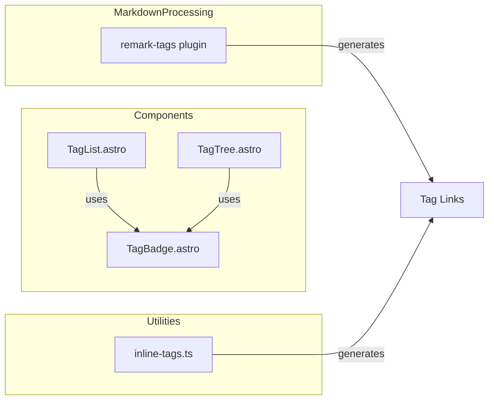

# Design Document

## Overview
**Purpose**: remark-tagsプラグインが生成するインラインタグリンクに末尾スラッシュを付与し、サイト全体でURLの一貫性を確保する。

**Users**: ブログ読者がインラインタグをクリックしてタグページに遷移する際、正しいURL形式でアクセスできる。

**Impact**: `src/plugins/remark-tags/index.js`のURL生成箇所を修正し、`/tags/test`から`/tags/test/`形式に変更する。

### Goals
- インラインタグリンクに末尾スラッシュを付与
- 既存のタグ関連コンポーネントとURL形式を統一
- 既存ブログ記事のビルドに影響を与えない

### Non-Goals
- 末尾スラッシュなしURLへのリダイレクト設定（Astro設定のスコープ）
- `tagToSlug`関数の責務変更
- 他のタグ関連コンポーネントの修正（既に正しい形式）

## Architecture

### Existing Architecture Analysis
現在のタグURL生成は複数の箇所で行われているが、形式が不統一：

| コンポーネント | 関数 | URL形式 |
|--------------|------|---------|
| `inline-tags.ts` | `generateTagUrl` | `/tags/test/` ✅ |
| `TagList.astro` | `tagToSlug` + URL結合 | `/tags/test/` ✅ |
| `TagTree.astro` | 直接URL結合 | `/tags/test/` ✅ |
| `remark-tags/index.js` | `tagToSlug` + URL結合 | `/tags/test` ❌ |

### Architecture Pattern & Boundary Map



**Architecture Integration**:
- Selected pattern: 既存パターンの踏襲（URL結合時に末尾スラッシュ追加）
- 新規コンポーネント: なし（既存コードの修正のみ）
- Steering compliance: カスタムremarkプラグインのパターンを維持

### Technology Stack

| Layer | Choice / Version | Role in Feature | Notes |
|-------|------------------|-----------------|-------|
| Plugins | remark (unified) | Markdown AST処理 | 既存プラグインの修正 |

## Requirements Traceability

| Requirement | Summary | Components | Interfaces | Flows |
|-------------|---------|------------|------------|-------|
| 1.1 | 単一タグの末尾スラッシュ | remark-tags/index.js | URL生成 | Markdown→HTML |
| 1.2 | 階層タグの末尾スラッシュ | remark-tags/index.js | URL生成 | Markdown→HTML |
| 1.3 | 日本語タグの末尾スラッシュ | remark-tags/index.js | URL生成 | Markdown→HTML |
| 2.1 | inline-tags.tsとの整合性 | remark-tags/index.js | URL形式 | - |
| 2.2 | TagBadgeとの整合性 | remark-tags/index.js | URL形式 | - |
| 2.3 | タグページへの遷移 | remark-tags/index.js | リンク動作 | ユーザー操作 |
| 3.1 | ビルド正常完了 | remark-tags/index.js | - | ビルドプロセス |
| 3.2 | ルーティング正常動作 | remark-tags/index.js | - | ページ遷移 |

## Components and Interfaces

| Component | Domain/Layer | Intent | Req Coverage | Key Dependencies | Contracts |
|-----------|--------------|--------|--------------|------------------|-----------|
| remark-tags/index.js | Plugins | インラインタグをリンクに変換 | 1.1-1.3, 2.1-2.3, 3.1-3.2 | unified/remark (P0) | Service |

### Plugins Layer

#### remark-tags/index.js

| Field | Detail |
|-------|--------|
| Intent | Markdown本文中の`#タグ`をタグページへのリンクに変換 |
| Requirements | 1.1, 1.2, 1.3, 2.1, 2.2, 2.3, 3.1, 3.2 |

**Responsibilities & Constraints**
- Markdown AST内のテキストノードからタグパターンを検出
- タグをリンクノードに変換（URL生成含む）
- 既存の`tagToSlug`関数の責務（スラッグ変換）は維持

**Dependencies**
- External: unified/remark — Markdown AST処理基盤 (P0)

**Contracts**: Service [x]

##### Service Interface
```javascript
// 修正箇所: 119行目
// Before:
url: `${config.tagBasePath}${slug}`,

// After:
url: `${config.tagBasePath}${slug}/`,
```

- Preconditions: `config.tagBasePath`は末尾スラッシュ付き（デフォルト: `/tags/`）
- Postconditions: 生成されるURLは`/tags/{slug}/`形式
- Invariants: `tagToSlug`関数は変更しない（スラッグ生成のみの責務を維持）

**Implementation Notes**
- Integration: 119行目のURL結合部分に末尾スラッシュを追加
- Validation: 既存テストの期待値も末尾スラッシュ付きに更新
- Risks: テストファイル`tests/integration/inline-tags-test.js`の`generateTagUrlMock`も同様に修正が必要

## Testing Strategy

### Unit Tests
- remark-tagsプラグインのURL生成が末尾スラッシュ付きであることを確認
- 単一タグ、階層タグ、日本語タグの各パターンをテスト

### Integration Tests
- `tests/integration/inline-tags-test.js`の期待値を末尾スラッシュ付きに更新
- ビルドプロセスが正常完了することを確認

### E2E Tests
- インラインタグリンクをクリックしてタグページに遷移できることを確認
