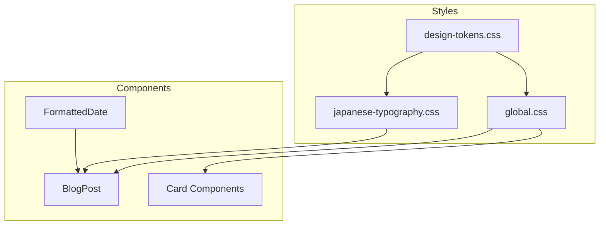

# Technical Design: Japanese Page Design

## Overview

**Purpose**: itzpapaブログに日本語コンテンツ向けの最適化されたタイポグラフィとUIを提供する。

**Users**: 日本語ブログの読者およびコンテンツ作成者が、Zenn/Qiita/noteと同等の読みやすさでコンテンツを閲覧・作成できる。

**Impact**: 現在のフォントサイズ（20px）を18px（デスクトップ）/16px（モバイル）に変更し、行間を1.9に拡大。日付表示をYYYY/MM/DD形式に統一。

### Goals
- 競合サービス（note.com, Zenn, Qiita）と同等のタイポグラフィ品質を実現
- 日本語テキストの可読性を向上させるCSS設定を適用
- 日付表示を日本で一般的なYYYY/MM/DD形式に変更
- 既存のデザインシステムパターンを維持しながら拡張

### Non-Goals
- 縦書きレイアウトのサポート
- ルビ（ふりがな）のサポート
- 多言語対応（日本語以外の言語）

## Architecture

### Existing Architecture Analysis

現在のスタイルシステム：
- `src/styles/design-tokens.css`: CSS変数によるデザイントークン定義
- `src/styles/global.css`: グローバルスタイル、メディアクエリ
- `src/layouts/BlogPost.astro`: 記事レイアウト
- `src/components/FormattedDate.astro`: 日付表示コンポーネント

既存パターン：
- CSS変数ベースのデザインシステム
- メディアクエリによるレスポンシブ対応
- `.prose`クラスによる本文スタイリング

### Architecture Pattern & Boundary Map



**Architecture Integration**:
- Selected pattern: CSSトークン拡張 + 新規スタイルファイル追加
- Domain boundaries: タイポグラフィはdesign-tokens.css、日本語特有設定はjapanese-typography.css
- Existing patterns preserved: CSS変数、メディアクエリ、.proseクラス
- New components rationale: japanese-typography.cssで日本語固有のスタイルを分離管理
- Steering compliance: 機能ごとに個別CSSファイル（structure.md準拠）

### Technology Stack

| Layer | Choice / Version | Role in Feature | Notes |
|-------|------------------|-----------------|-------|
| Styling | CSS Custom Properties | デザイントークン管理 | 既存パターン継続 |
| Layout | CSS Media Queries | レスポンシブ対応 | 768px / 1024px breakpoints |
| Typography | Noto Sans JP | 日本語フォント | 既存設定維持 |
| Date Formatting | JavaScript | YYYY/MM/DD形式生成 | toLocaleDateStringから変更 |

## Requirements Traceability

| Requirement | Summary | Components | Interfaces | Flows |
|-------------|---------|------------|------------|-------|
| 1.1 | 本文フォントサイズ16-18px | design-tokens.css, global.css | CSS Variables | - |
| 1.2 | line-height 1.8-2.0 | design-tokens.css | CSS Variables | - |
| 1.3 | デスクトップ18px | global.css | Media Query | - |
| 1.4 | モバイル16px | global.css | Media Query | - |
| 1.5 | 見出しサイズ比率 | design-tokens.css | CSS Variables | - |
| 2.1 | letter-spacing最適化 | japanese-typography.css | CSS Class | - |
| 2.2 | 見出しフォントウェイト | design-tokens.css, global.css | CSS Variables | - |
| 2.3 | 約物配置最適化 | japanese-typography.css | font-feature-settings | - |
| 2.4 | モバイル行間維持 | global.css | Media Query | - |
| 3.1 | 段落余白調整 | global.css | CSS Class | - |
| 3.2 | カード幅最適化 | card.css | CSS Class | - |
| 3.3 | テキストオーバーフロー処理 | global.css | CSS Properties | - |
| 3.4 | text-wrap: balance | japanese-typography.css | CSS Property | - |
| 4.1 | 日付YYYY/MM/DD形式 | FormattedDate.astro | formatDate() | - |
| 4.2 | 曜日日本語表示 | FormattedDate.astro | formatDate() | - |
| 4.3 | 更新日時表示 | BlogPost.astro | Props | - |
| 5.1 | パンくずリスト区切り | Breadcrumb（新規） | Props | - |
| 5.2 | ボタンラベル日本語 | button.css, pages | - | - |
| 5.3 | 404ページ日本語 | 404.astro | - | 実装済み |
| 5.4 | aria-label日本語 | Header.astro | - | 実装済み |

## Components and Interfaces

| Component | Domain/Layer | Intent | Req Coverage | Key Dependencies | Contracts |
|-----------|--------------|--------|--------------|------------------|-----------|
| design-tokens.css | Styles | タイポグラフィトークン定義 | 1.1, 1.2, 1.5, 2.2 | - | CSS Variables |
| global.css | Styles | グローバルスタイル適用 | 1.3, 1.4, 2.4, 3.1, 3.3 | design-tokens.css (P0) | CSS Rules |
| japanese-typography.css | Styles | 日本語特有のスタイル | 2.1, 2.3, 3.4 | design-tokens.css (P0) | CSS Rules |
| FormattedDate.astro | Components | 日付フォーマット表示 | 4.1, 4.2 | - | Props Interface |
| BlogPost.astro | Layouts | 記事レイアウト | 4.3 | FormattedDate (P0) | Props Interface |
| Breadcrumb.astro | Components | パンくずナビゲーション | 5.1 | - | Props Interface |

### Styles Layer

#### design-tokens.css

| Field | Detail |
|-------|--------|
| Intent | 日本語最適化タイポグラフィトークンの定義 |
| Requirements | 1.1, 1.2, 1.5, 2.2 |

**Responsibilities & Constraints**
- フォントサイズ、行間、フォントウェイトのCSS変数を定義
- 既存の変数構造を維持しながら値を調整
- ダークモード対応の維持

**Dependencies**
- Inbound: global.css, japanese-typography.css — トークン参照 (P0)
- Outbound: なし
- External: なし

**Contracts**: State [x]

##### State Management
```css
/* Typography Scale - 変更 */
--font-size-base: 1rem;       /* 16px - 維持 */
--font-size-lg: 1.125rem;     /* 18px - 維持 */

/* Line Heights - 変更 */
--line-height-loose: 1.9;     /* 1.85 → 1.9 日本語本文用 */

/* Heading Scale - 新規追加 */
--heading-scale-h1: 2.5em;
--heading-scale-h2: 2em;
--heading-scale-h3: 1.5em;
--heading-scale-h4: 1.25em;
```

**Implementation Notes**
- 既存の`--line-height-loose`を1.85から1.9に変更
- 見出しスケールは相対単位（em）で定義し、本文サイズに連動

---

#### global.css

| Field | Detail |
|-------|--------|
| Intent | レスポンシブタイポグラフィとグローバルスタイル適用 |
| Requirements | 1.3, 1.4, 2.4, 3.1, 3.3 |

**Responsibilities & Constraints**
- bodyのフォントサイズをレスポンシブに設定
- .prose段落の余白調整
- テキストオーバーフロー処理

**Dependencies**
- Inbound: design-tokens.css — トークン参照 (P0)
- Outbound: なし
- External: なし

**Contracts**: State [x]

##### State Management
```css
/* Body Typography - 変更 */
body {
  font-size: var(--font-size-lg);         /* 20px → 18px */
  line-height: var(--line-height-loose);  /* 1.625 → 1.9 */
  overflow-wrap: break-word;              /* 維持 */
  word-break: normal;                     /* break-all回避 */
}

/* Prose Paragraph - 変更 */
.prose p {
  margin-bottom: 1.75em;  /* var(--space-8) → 相対単位 */
}

/* Mobile - 変更 */
@media (max-width: 767px) {
  body {
    font-size: var(--font-size-base);  /* 18px → 16px */
  }
}
```

**Implementation Notes**
- デスクトップ（768px以上）: 18px、モバイル（768px未満）: 16px
- word-break: normalで全角文字の不自然な折り返しを防止

---

#### japanese-typography.css（新規）

| Field | Detail |
|-------|--------|
| Intent | 日本語特有のタイポグラフィ設定を分離管理 |
| Requirements | 2.1, 2.3, 3.4 |

**Responsibilities & Constraints**
- 和文に最適化されたletter-spacing
- 約物（句読点、括弧）の配置最適化
- 見出しの自然な折り返し

**Dependencies**
- Inbound: global.css — @import (P0)
- Outbound: なし
- External: なし

**Contracts**: State [x]

##### State Management
```css
/* Japanese Typography Optimization */
.prose {
  letter-spacing: 0.03em;
  font-feature-settings: "palt" 1;
}

/* Heading Text Wrap */
.prose h1,
.prose h2,
.prose h3,
.prose h4 {
  text-wrap: balance;
  font-weight: var(--font-weight-semibold);
}

/* Heading Scale */
.prose h1 { font-size: var(--heading-scale-h1); }
.prose h2 { font-size: var(--heading-scale-h2); }
.prose h3 { font-size: var(--heading-scale-h3); }
.prose h4 { font-size: var(--heading-scale-h4); }
```

**Implementation Notes**
- font-feature-settings: "palt"はプロポーショナル約物配置を有効化
- text-wrap: balanceはChrome 114+でサポート、非対応ブラウザは通常の折り返し
- letter-spacing: 0.03emは和文の標準的な字間

---

### Components Layer

#### FormattedDate.astro

| Field | Detail |
|-------|--------|
| Intent | 日付をYYYY/MM/DD形式でフォーマット表示 |
| Requirements | 4.1, 4.2 |

**Responsibilities & Constraints**
- 日付オブジェクトをYYYY/MM/DD形式の文字列に変換
- オプションで曜日を日本語表示
- datetime属性はISO 8601形式を維持

**Dependencies**
- Inbound: BlogPost.astro — コンポーネント使用 (P0)
- Outbound: なし
- External: なし

**Contracts**: Service [x]

##### Service Interface
```typescript
interface FormattedDateProps {
  date: Date;
  showWeekday?: boolean;  // デフォルト: false
}

// Output examples:
// showWeekday=false: "2025/01/15"
// showWeekday=true: "2025/01/15（水）"
```

**Implementation Notes**
- toLocaleDateStringを使用せず、カスタムフォーマット関数を実装
- datetime属性には`date.toISOString()`を維持（SEO/アクセシビリティ）

---

#### BlogPost.astro

| Field | Detail |
|-------|--------|
| Intent | 記事レイアウトで更新日時を適切に表示 |
| Requirements | 4.3 |

**Responsibilities & Constraints**
- 更新日がある場合に「（更新：YYYY/MM/DD）」形式で表示
- 既存のレイアウト構造を維持

**Dependencies**
- Inbound: FormattedDate.astro — 日付表示 (P0)
- Outbound: なし
- External: なし

**Contracts**: State [x]

##### State Management
```typescript
interface BlogPostProps {
  // 既存props維持
  pubDate: Date;
  updatedDate?: Date;
  // ...
}

// 更新日表示: "（更新：2025/01/20）"
```

**Implementation Notes**
- 既存の更新日表示部分のフォーマットを変更
- FormattedDateコンポーネントの新しいPropsを活用

---

#### Breadcrumb.astro（新規）

| Field | Detail |
|-------|--------|
| Intent | パンくずナビゲーションを日本語区切り文字で表示 |
| Requirements | 5.1 |

**Responsibilities & Constraints**
- ナビゲーションパスを区切り文字「›」で表示
- アクセシビリティ対応（nav要素、aria-label）

**Dependencies**
- Inbound: BlogPost.astro, pages — 使用箇所 (P1)
- Outbound: なし
- External: なし

**Contracts**: Service [x]

##### Service Interface
```typescript
interface BreadcrumbItem {
  label: string;
  href?: string;  // undefinedの場合は現在のページ
}

interface BreadcrumbProps {
  items: BreadcrumbItem[];
  separator?: string;  // デフォルト: "›"
}
```

**Implementation Notes**
- セマンティックなHTML構造（ol/li）を使用
- 最後の項目はリンクなし（現在のページ）
- 将来的にはJSON-LD構造化データの追加を検討

## Data Models

### Domain Model

本機能はCSSとコンポーネントの変更のみで、永続化データモデルの変更なし。

### Data Contracts & Integration

**FormattedDate Output Format**:
```
YYYY/MM/DD
YYYY/MM/DD（曜日）
```

**datetime Attribute**:
```
ISO 8601: 2025-01-15T00:00:00.000Z
```

## Error Handling

### Error Strategy
本機能はCSS/UIの変更のみで、エラー発生の可能性は低い。

### Error Categories and Responses
- **CSS不具合**: ブラウザDevToolsで検証、フォールバックスタイルを用意
- **日付フォーマットエラー**: Invalid Dateの場合は空文字を返す

## Testing Strategy

### Unit Tests
1. FormattedDate: 日付フォーマットのテスト（通常/曜日付き）
2. FormattedDate: Invalid Date入力時の処理
3. Breadcrumb: items配列からの正しいレンダリング

### Integration Tests
1. BlogPost: 更新日表示の形式確認
2. global.css: メディアクエリによるフォントサイズ切り替え

### E2E/UI Tests
1. トップページ: フォントサイズがデスクトップ18px、モバイル16px
2. 記事ページ: 日付がYYYY/MM/DD形式で表示
3. 記事ページ: 見出しの折り返しがbalance

### Visual Regression (Optional)
1. 主要ページのスクリーンショット比較（変更前後）

## Optional Sections

### Performance & Scalability

**Target Metrics**:
- CLS (Cumulative Layout Shift): フォントサイズ変更による影響を最小化
- font-display: swap維持でFOUT対応

**Optimization**:
- japanese-typography.cssは軽量（<1KB）
- CSS変数の変更のみで再計算コストは最小
