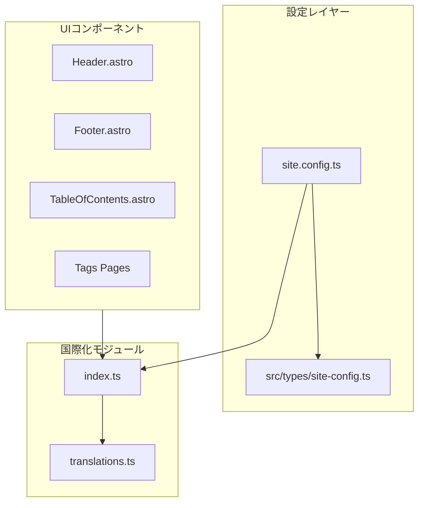
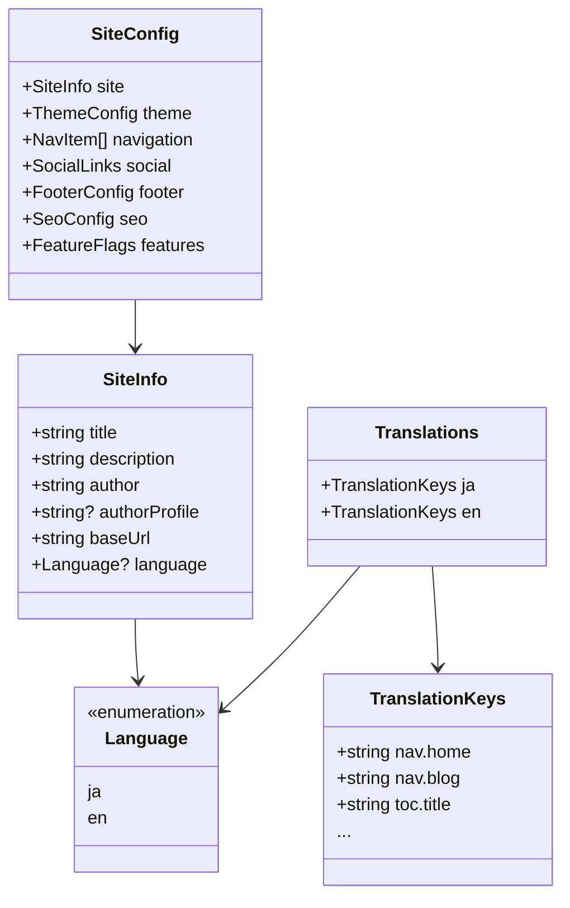

# Design Document: language-switch-config

## Overview

**Purpose**: この機能は、サイト管理者が `site.config.ts` で言語設定（日本語/英語）を切り替えることで、サイト全体のUIテキストを一貫して変更できる機能を提供します。

**Users**: サイト管理者がサイト設定時に言語を選択し、サイト訪問者が選択された言語でUIを閲覧します。

**Impact**: 既存の設定構造に `language` プロパティを追加し、ハードコードされたUIテキストを翻訳システムから取得するよう変更します。

### Goals
- `site.config.ts` に `language: 'ja' | 'en'` オプションを追加
- UIテキスト（目次、タグ一覧、メニュー操作等）を選択言語で表示
- 既存設定との完全な後方互換性を維持
- 型安全な翻訳システムの構築

### Non-Goals
- ルーティングベースの多言語対応（`/en/`, `/ja/` 等のパス切り替え）
- コンテンツ（ブログ記事）の翻訳機能
- 日付表示形式の変更（YYYY/MM/DD 固定）
- 3言語以上のサポート（将来の拡張として検討）

## Architecture

### Existing Architecture Analysis
- **現在の設定構造**: `site.config.ts` で `SiteConfig` 型のオブジェクトをエクスポート
- **型定義**: `src/types/site-config.ts` で全ての設定型を定義
- **UIテキスト**: 各コンポーネント内にハードコード（日本語）
- **維持すべきパターン**: 既存の `navigation` 配列形式、`siteConfig` オブジェクト構造

### Architecture Pattern & Boundary Map



**Architecture Integration**:
- **Selected pattern**: 翻訳オブジェクト + ヘルパー関数パターン（軽量i18n）
- **Domain boundaries**: 設定（Config）、翻訳（I18n）、表示（Components）を分離
- **Existing patterns preserved**: `siteConfig` オブジェクト構造、型定義ファイル
- **New components rationale**: `src/i18n/` モジュールを新設し、翻訳ロジックを一元管理
- **Steering compliance**: TypeScript strict mode、機能ベースのディレクトリ構造を維持

### Technology Stack

| Layer | Choice / Version | Role in Feature | Notes |
|-------|------------------|-----------------|-------|
| Frontend | Astro v5 | コンポーネント内で翻訳テキストを取得・表示 | 既存 |
| Language | TypeScript (strict) | 翻訳キーの型安全性を保証 | 既存 |
| I18n | 独自実装 | 翻訳オブジェクトとヘルパー関数 | 新規追加 |

## Requirements Traceability

| Requirement | Summary | Components | Interfaces | Flows |
|-------------|---------|------------|------------|-------|
| 1.1, 1.2, 1.3 | 言語設定オプション | SiteConfig, TypeDefs | SiteInfo, Language | - |
| 2.1, 2.2, 2.3 | ナビゲーション国際化 | Header, Footer | NavItem | - |
| 3.1, 3.2, 3.3 | フッター国際化 | Footer | FooterConfig | - |
| 4.1, 4.2 | UIコンポーネント国際化 | TOC, TagPages, Header | Translations | - |
| 5.1, 5.2, 5.3 | 型安全性 | TypeDefs, I18n | Language, TranslationKeys | - |
| 6.1, 6.2, 6.3 | 翻訳リソース管理 | Translations | Translations | - |
| 7.1, 7.2, 7.3 | 後方互換性 | SiteConfig, TypeDefs | - | - |

## Components and Interfaces

| Component | Domain/Layer | Intent | Req Coverage | Key Dependencies | Contracts |
|-----------|--------------|--------|--------------|------------------|-----------|
| SiteInfo | Config | 言語プロパティを保持 | 1.1, 1.2, 1.3 | - | State |
| Language | Config | 言語リテラル型定義 | 5.1, 5.2 | - | - |
| translations.ts | I18n | 翻訳テキスト定義 | 6.1, 6.2, 6.3 | - | State |
| index.ts | I18n | 翻訳取得ヘルパー | 4.1, 5.3 | translations.ts, siteConfig | Service |
| Header.astro | UI | メニュー操作テキスト国際化 | 2.1, 2.2, 4.1 | I18n | - |
| Footer.astro | UI | 著作権テキスト国際化 | 3.1, 3.2, 3.3 | I18n | - |
| TableOfContents.astro | UI | 目次テキスト国際化 | 4.1 | I18n | - |
| Tags Pages | UI | タグ関連テキスト国際化 | 4.1 | I18n | - |

### Config Layer

#### Language Type

| Field | Detail |
|-------|--------|
| Intent | サポート言語のリテラル型定義 |
| Requirements | 5.1, 5.2 |

**Contracts**: State

##### State Management
```typescript
/**
 * サポートする言語コード
 */
export type Language = 'ja' | 'en';
```

#### SiteInfo Extension

| Field | Detail |
|-------|--------|
| Intent | 言語設定プロパティを既存のSiteInfo型に追加 |
| Requirements | 1.1, 1.2, 1.3, 7.1 |

**Contracts**: State

##### State Management
```typescript
export interface SiteInfo {
  title: string;
  description: string;
  author: string;
  authorProfile?: string;
  baseUrl: string;
  /** 表示言語（デフォルト: 'ja'） */
  language?: Language;
}
```

- **後方互換性**: `language` はオプショナル。未設定時は `'ja'` として扱う

### I18n Layer

#### translations.ts

| Field | Detail |
|-------|--------|
| Intent | 全UIテキストの翻訳定義を一元管理 |
| Requirements | 6.1, 6.2, 6.3 |

**Contracts**: State

##### State Management
```typescript
/**
 * 翻訳キーの型定義
 * 新しいキー追加時は全言語のエントリが必須
 */
export interface TranslationKeys {
  // ナビゲーション関連
  'nav.home': string;
  'nav.blog': string;
  'nav.tags': string;
  'nav.about': string;

  // 目次関連
  'toc.title': string;
  'toc.ariaLabel': string;
  'toc.toggle': string;

  // タグ関連
  'tags.title': string;
  'tags.backToList': string;
  'tags.ariaLabel': string;

  // メニュー操作
  'menu.open': string;
  'menu.close': string;

  // フッター
  'footer.allRightsReserved': string;
}

export type Translations = Record<Language, TranslationKeys>;

export const translations: Translations = {
  ja: {
    'nav.home': 'ホーム',
    'nav.blog': 'ブログ',
    'nav.tags': 'タグ',
    'nav.about': 'このサイトについて',
    'toc.title': '目次',
    'toc.ariaLabel': '目次',
    'toc.toggle': '目次の表示/非表示を切り替え',
    'tags.title': 'タグ一覧',
    'tags.backToList': 'タグ一覧に戻る',
    'tags.ariaLabel': 'タグ一覧',
    'menu.open': 'メニューを開く',
    'menu.close': 'メニューを閉じる',
    'footer.allRightsReserved': 'All rights reserved.',
  },
  en: {
    'nav.home': 'Home',
    'nav.blog': 'Blog',
    'nav.tags': 'Tags',
    'nav.about': 'About',
    'toc.title': 'Table of Contents',
    'toc.ariaLabel': 'Table of Contents',
    'toc.toggle': 'Toggle table of contents',
    'tags.title': 'Tags',
    'tags.backToList': 'Back to Tags',
    'tags.ariaLabel': 'Tag list',
    'menu.open': 'Open menu',
    'menu.close': 'Close menu',
    'footer.allRightsReserved': 'All rights reserved.',
  },
};
```

#### index.ts (I18n Helper)

| Field | Detail |
|-------|--------|
| Intent | 翻訳テキスト取得のヘルパー関数を提供 |
| Requirements | 4.1, 5.3 |

**Dependencies**:
- Inbound: Components — 翻訳テキスト取得 (P0)
- Outbound: translations.ts — 翻訳データ参照 (P0)
- Outbound: siteConfig — 言語設定参照 (P0)

**Contracts**: Service

##### Service Interface
```typescript
import { siteConfig } from '../../site.config';
import { translations, type TranslationKeys } from './translations';
import type { Language } from '../types/site-config';

/**
 * 現在の言語設定を取得
 * @returns 設定された言語、未設定の場合は 'ja'
 */
export function getLanguage(): Language {
  return siteConfig.site.language ?? 'ja';
}

/**
 * 翻訳テキストを取得
 * @param key - 翻訳キー
 * @returns 現在の言語に対応する翻訳テキスト
 */
export function t(key: keyof TranslationKeys): string {
  const lang = getLanguage();
  return translations[lang][key];
}

/**
 * 全翻訳キーのオブジェクトを取得（コンポーネント用）
 * @returns 現在の言語の全翻訳
 */
export function getTranslations(): TranslationKeys {
  return translations[getLanguage()];
}
```

- Preconditions: `siteConfig` が読み込み可能であること
- Postconditions: 有効な翻訳テキストを返す
- Invariants: 未定義のキーはTypeScriptコンパイルエラー

### UI Components

#### Header.astro (修正)

| Field | Detail |
|-------|--------|
| Intent | メニュー操作テキストを国際化 |
| Requirements | 4.1 |

**Implementation Notes**:
- `t('menu.open')`, `t('menu.close')` を使用してaria-labelを設定
- JavaScript側でも翻訳関数を使用（`<script>` 内）

#### Footer.astro (修正)

| Field | Detail |
|-------|--------|
| Intent | 著作権テキストを国際化 |
| Requirements | 3.1, 3.2, 3.3 |

**Implementation Notes**:
- `copyrightText` が未設定の場合のみ `t('footer.allRightsReserved')` を使用
- ユーザー定義の `copyrightText` は翻訳より優先

#### TableOfContents.astro (修正)

| Field | Detail |
|-------|--------|
| Intent | 目次タイトルとaria-labelを国際化 |
| Requirements | 4.1 |

**Implementation Notes**:
- `t('toc.title')`, `t('toc.ariaLabel')`, `t('toc.toggle')` を使用
- CSSの `content` プロパティで設定されたテキストはコンポーネント側で上書き

#### Tags Pages (修正)

| Field | Detail |
|-------|--------|
| Intent | タグ関連ページのテキストを国際化 |
| Requirements | 4.1 |

**Implementation Notes**:
- `src/pages/tags/index.astro`: `t('tags.title')` を使用
- `src/pages/tags/[...slug].astro`: `t('tags.backToList')` を使用

## Data Models

### Domain Model



**Business Rules & Invariants**:
- `Language` は `'ja'` または `'en'` のみ許可
- `language` が未設定の場合、デフォルト `'ja'` を適用
- `TranslationKeys` のすべてのキーは両言語で定義必須

## Error Handling

### Error Strategy
- **型エラー**: 無効な言語コードはTypeScriptコンパイル時に検出
- **翻訳キー不足**: `TranslationKeys` 型により全言語での定義を強制
- **設定未定義**: デフォルト値 `'ja'` にフォールバック

### Error Categories and Responses
- **設定エラー**: 無効な言語コード → TypeScriptコンパイルエラー
- **ランタイムエラー**: `siteConfig` 読み込み失敗 → Astroビルドエラー（既存動作）

## Testing Strategy

### Unit Tests
- `getLanguage()`: デフォルト値 `'ja'` の返却確認
- `t(key)`: 各言語での正しい翻訳取得
- `getTranslations()`: 全キーの存在確認

### Integration Tests
- `site.config.ts` に `language: 'en'` 設定時の全コンポーネント表示確認
- `language` 未設定時の後方互換性確認

### E2E Tests
- 日本語設定でのナビゲーション・目次・タグ表示確認
- 英語設定でのナビゲーション・目次・タグ表示確認
