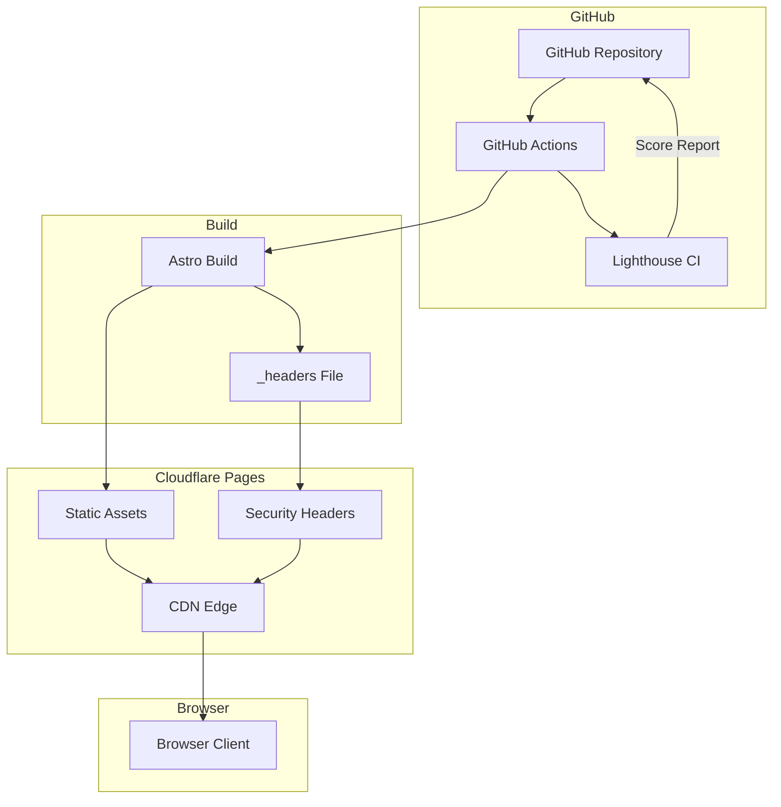
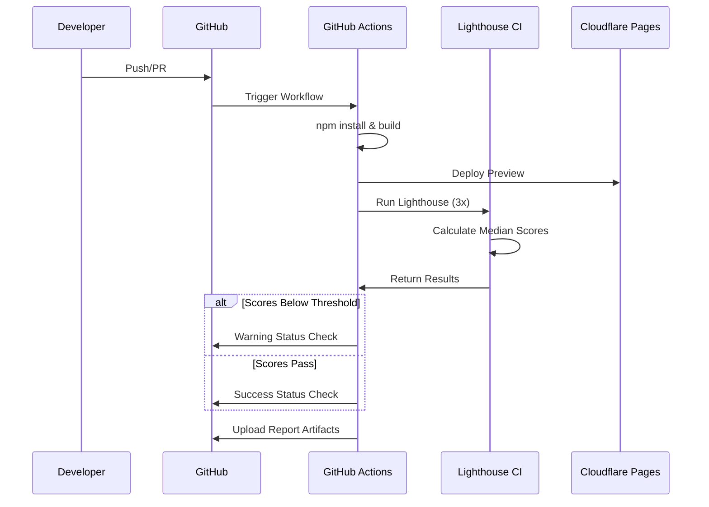

# Design Document: Lighthouse Performance Improvement

## Overview

**Purpose**: 本機能は、itzpapa（Astro v5ベースの静的ブログサイト）のLighthouseスコアを改善し、Performance、Accessibility、Best Practices、SEOの4カテゴリすべてで高スコアを達成することを目的とする。

**Users**: サイト訪問者（高速なページ読み込み体験）、開発者（継続的なパフォーマンス監視）、コンテンツ作成者（SEO最適化されたコンテンツ配信）

**Impact**: 既存のAstro静的サイトにセキュリティヘッダー設定とCI/CDパイプラインを追加し、継続的なパフォーマンス監視体制を構築する。

### Goals
- Lighthouseスコア90+をすべてのカテゴリで達成
- セキュリティヘッダー（CSP, HSTS等）の適切な設定
- GitHub ActionsによるLighthouse CI自動化
- パフォーマンスガイドラインの文書化

### Non-Goals
- SSR（サーバーサイドレンダリング）への移行
- CDN変更（Cloudflare Pagesを継続使用）
- 既存コンポーネントの大規模リファクタリング
- リアルタイムユーザー監視（RUM）の導入

## Architecture

### Existing Architecture Analysis

現在のitzpapaは以下の構成で動作している：

- **フレームワーク**: Astro v5（静的サイトジェネレーター）
- **ホスティング**: Cloudflare Pages
- **画像最適化**: Astro Image + sharp + WebP形式
- **SEO**: BaseHead.astro（OGP, canonical, JSON-LD実装済）
- **アクセシビリティ**: セマンティックHTML、ARIA属性、44pxタッチターゲット

**既存の強み**:
- 画像最適化は既に高水準
- SEOメタタグは包括的に実装済
- アクセシビリティ基盤が整備されている

**ギャップ領域**:
- セキュリティヘッダー未設定
- CI/CD未構築
- パフォーマンス継続監視なし

### Architecture Pattern & Boundary Map



**Architecture Integration**:
- **Selected pattern**: 静的サイト + CDNエッジ配信 + CI/CD監視
- **Domain boundaries**: ビルド（Astro）、配信（Cloudflare）、監視（GitHub Actions）の3層
- **Existing patterns preserved**: Astro標準ビルドプロセス、Cloudflare Pagesデプロイ
- **New components rationale**: `_headers`（セキュリティ）、GitHub Actions（監視）追加
- **Steering compliance**: TypeScript strict mode、既存のコード品質基準を維持

### Technology Stack

| Layer | Choice / Version | Role in Feature | Notes |
|-------|------------------|-----------------|-------|
| Frontend | Astro v5 | 静的サイト生成、既存維持 | 変更なし |
| CI/CD | GitHub Actions | Lighthouse CI実行 | 新規追加 |
| CI Tool | treosh/lighthouse-ci-action v12 | パフォーマンス計測 | 新規追加 |
| Hosting | Cloudflare Pages | CDN配信、セキュリティヘッダー適用 | _headers設定追加 |

## System Flows

### Lighthouse CI実行フロー



**Key Decisions**:
- 3回実行で中央値を取得（信頼性と実行時間のバランス）
- 閾値未達はWarning（ブロックしない）、将来的にError化検討

## Requirements Traceability

| Requirement | Summary | Components | Interfaces | Flows |
|-------------|---------|------------|------------|-------|
| 1.1-1.5 | Performance最適化 | 既存Astro設定 | - | - |
| 1.6-1.8 | Core Web Vitals | Lighthouse CI | lighthouserc.json | CI Flow |
| 2.1-2.7 | Accessibility | 既存コンポーネント | - | - |
| 3.1 | HTTPS | Cloudflare Pages | - | - |
| 3.6 | セキュリティヘッダー | _headers | - | - |
| 3.7 | SRI | CSP設定（GA4例外） | - | - |
| 4.1-4.7 | SEO | 既存BaseHead.astro | - | - |
| 5.1-5.4 | 継続的監視 | GitHub Actions, Lighthouse CI | Workflow YAML | CI Flow |

## Components and Interfaces

### Summary

| Component | Domain/Layer | Intent | Req Coverage | Key Dependencies | Contracts |
|-----------|--------------|--------|--------------|------------------|-----------|
| _headers | Infrastructure | セキュリティヘッダー設定 | 3.6, 3.7 | Cloudflare Pages (P0) | Config |
| lighthouse.yml | CI/CD | Lighthouse自動実行 | 5.1-5.4 | GitHub Actions (P0), treosh/lighthouse-ci-action (P0) | Workflow |
| lighthouserc.json | CI/CD | Lighthouse設定・閾値 | 5.1, 5.2 | Lighthouse CI (P0) | Config |
| performance-guidelines.md | Documentation | パフォーマンスガイドライン | 5.3 | - | Doc |

### Infrastructure Layer

#### _headers File

| Field | Detail |
|-------|--------|
| Intent | Cloudflare Pagesでセキュリティヘッダーを設定 |
| Requirements | 3.6, 3.7 |

**Responsibilities & Constraints**
- HTTPレスポンスヘッダーの設定
- 全ページ（/*）に共通ヘッダーを適用
- CSPはレポートモードで段階的導入

**Dependencies**
- Inbound: Astro Build — ビルド成果物の一部として配置 (P0)
- External: Cloudflare Pages — ヘッダー解釈・適用 (P0)

**Contracts**: Config [x]

##### Configuration Contract

```
/*
  X-Frame-Options: DENY
  X-Content-Type-Options: nosniff
  Referrer-Policy: strict-origin-when-cross-origin
  Permissions-Policy: camera=(), microphone=(), geolocation=()
  Strict-Transport-Security: max-age=31536000; includeSubDomains
  Content-Security-Policy-Report-Only: default-src 'self'; script-src 'self' 'unsafe-inline' https://www.googletagmanager.com https://static.cloudflareinsights.com; style-src 'self' 'unsafe-inline' https://fonts.googleapis.com; font-src 'self' https://fonts.gstatic.com; img-src 'self' data: https:; connect-src 'self' https://www.google-analytics.com https://region1.google-analytics.com
```

**Implementation Notes**
- Integration: `public/_headers`として配置、Astroビルドでそのままコピー
- Validation: デプロイ後にsecurityheaders.comで検証
- Risks: CSP設定ミスによる機能破損 → Report-Onlyモードで段階導入

### CI/CD Layer

#### lighthouse.yml (GitHub Actions Workflow)

| Field | Detail |
|-------|--------|
| Intent | PRおよびmainブランチでLighthouse CIを自動実行 |
| Requirements | 5.1, 5.2, 5.4 |

**Responsibilities & Constraints**
- PRとmainブランチへのpushでトリガー
- ビルド完了後にLighthouse実行
- レポートをArtifactとして保存

**Dependencies**
- Inbound: GitHub Events — push/PRイベント (P0)
- External: treosh/lighthouse-ci-action@v12 — Lighthouse実行 (P0)
- External: actions/checkout@v4, actions/setup-node@v4 — 標準Actions (P0)

**Contracts**: Workflow [x]

##### Workflow Contract

```yaml
name: Lighthouse CI
on:
  push:
    branches: [main]
  pull_request:
    branches: [main]

jobs:
  lighthouse:
    runs-on: ubuntu-latest
    steps:
      - uses: actions/checkout@v4
      - uses: actions/setup-node@v4
        with:
          node-version: 20
          cache: npm
      - run: npm ci
      - run: npm run build
      - uses: treosh/lighthouse-ci-action@v12
        with:
          configPath: ./lighthouserc.json
          uploadArtifacts: true
          runs: 3
```

**Implementation Notes**
- Integration: `.github/workflows/lighthouse.yml`として配置
- Validation: Workflow実行ログで成功確認
- Risks: 実行時間増加 → runs: 3で最小限に抑制

#### lighthouserc.json (Lighthouse CI Configuration)

| Field | Detail |
|-------|--------|
| Intent | Lighthouse CIの実行設定と閾値を定義 |
| Requirements | 5.1, 5.2 |

**Responsibilities & Constraints**
- テスト対象URL指定
- スコア閾値設定（Warning用）
- 実行オプション設定

**Dependencies**
- Inbound: lighthouse.yml — 設定ファイル参照 (P0)

**Contracts**: Config [x]

##### Configuration Contract

```json
{
  "ci": {
    "collect": {
      "staticDistDir": "./dist",
      "url": [
        "http://localhost/",
        "http://localhost/blog/",
        "http://localhost/tags/"
      ]
    },
    "assert": {
      "preset": "lighthouse:recommended",
      "assertions": {
        "categories:performance": ["warn", { "minScore": 0.9 }],
        "categories:accessibility": ["warn", { "minScore": 0.9 }],
        "categories:best-practices": ["warn", { "minScore": 0.9 }],
        "categories:seo": ["warn", { "minScore": 0.9 }]
      }
    },
    "upload": {
      "target": "temporary-public-storage"
    }
  }
}
```

**Implementation Notes**
- Integration: プロジェクトルートに配置
- Validation: ローカルでlhci autorunで検証可能
- Risks: 閾値が厳しすぎると常時Warning → 0.9（90点）で開始

### Documentation Layer

#### performance-guidelines.md

| Field | Detail |
|-------|--------|
| Intent | パフォーマンス維持のためのガイドラインを文書化 |
| Requirements | 5.3 |

**Responsibilities & Constraints**
- Lighthouseスコア維持のベストプラクティス
- 画像・CSS・JS最適化のガイドライン
- トラブルシューティング手順

**Dependencies**
- None

**Contracts**: Doc [x]

**Implementation Notes**
- Integration: `docs/performance-guidelines.md`として配置
- 主要セクション: 画像最適化、CSS最適化、JS最適化、Lighthouse CI使用方法

## Data Models

本機能はデータモデルの変更を伴わない。設定ファイルのみを追加する。

## Error Handling

### Error Strategy

CI/CDパイプラインでのエラーは以下の戦略で対応：

### Error Categories and Responses

**Build Errors**:
- Astroビルド失敗 → Workflow失敗、PRブロック
- 依存関係インストール失敗 → Workflow失敗、キャッシュクリア

**Lighthouse Errors**:
- スコア閾値未達 → Warning（ブロックしない）
- Lighthouse実行失敗 → Workflow失敗、再実行

**Configuration Errors**:
- _headers構文エラー → Cloudflareデプロイ失敗
- lighthouserc.json構文エラー → CI実行失敗

### Monitoring

- GitHub Actions実行ログで監視
- Lighthouse CIレポートをArtifactとして保存
- 閾値未達時はGitHub Status Checkで可視化

## Testing Strategy

### Unit Tests
本機能は設定ファイルの追加が中心のため、ユニットテストは不要。

### Integration Tests
1. `_headers`ファイルがビルド成果物に含まれることを確認
2. Lighthouse CI workflowが正常に実行されることを確認
3. lighthouserc.jsonの設定が正しく読み込まれることを確認

### E2E Tests
1. デプロイ後にsecurityheaders.comでセキュリティヘッダーを検証
2. Lighthouse CIレポートでスコアが90+であることを確認
3. CSPがReport-Onlyモードで機能していることを確認

## Security Considerations

### セキュリティヘッダー設計

- **X-Frame-Options: DENY** - クリックジャッキング防止
- **X-Content-Type-Options: nosniff** - MIMEスニッフィング防止
- **Strict-Transport-Security** - HTTPS強制（1年間）
- **Content-Security-Policy** - XSS防止（段階的導入）

### CSP設計方針

1. **Phase 1**: Report-Onlyモードで導入、違反をモニタリング
2. **Phase 2**: 違反がないことを確認後、本番CSPに切り替え

### GA4のSRI例外

Google Analytics 4（gtag.js）はSRI非対応（動的更新されるため）。CSPでドメイン制限を適用し、リスクを軽減。

## Performance & Scalability

### Target Metrics

| Metric | Target | Current (Estimated) |
|--------|--------|---------------------|
| Performance Score | 90+ | 未計測 |
| Accessibility Score | 90+ | 未計測 |
| Best Practices Score | 90+ | 未計測 |
| SEO Score | 90+ | 未計測 |
| LCP | < 2.5s | 未計測 |
| CLS | < 0.1 | 未計測 |
| INP | < 200ms | 未計測 |

### 最適化アプローチ

- **既存維持**: 画像最適化、CSS code splitting、フォント非同期読み込み
- **追加検討**: Critical CSS導入はスコア計測後に判断（research.md参照）

## Supporting References

詳細な調査結果と設計決定の根拠は`research.md`を参照。

- Cloudflareセキュリティヘッダー設定方法
- Lighthouse CI GitHub Actions統合手順
- Critical CSS最適化の検討結果
- Google Analytics SRI対応の制約
