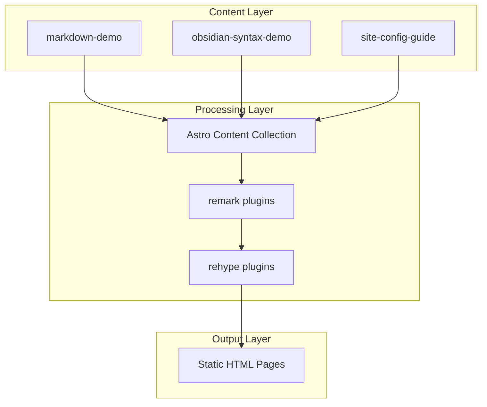

# Design Document: markdown-demo-article

## Overview

**Purpose**: GitHub公開用のMarkdownデモ記事を3本作成し、itzpapaブログでサポートされる記法と設定方法を開発者・ユーザーに示す。

**Users**: GitHubリポジトリ訪問者、Obsidianユーザー、itzpapa導入検討者がブログ機能の確認に使用。

**Impact**: 既存のテスト記事（draft: true）は維持し、新規に公開用記事を追加する。

### Goals
- 基本Markdown記法の網羅的なデモを提供
- Obsidian互換記法（WikiLink、ハイライト、Callout）の動作例を提示
- site.config.tsの全設定項目をわかりやすく解説

### Non-Goals
- 既存テスト記事の削除・改変
- 新機能の実装（記法処理はすべて既存プラグインで対応済み）
- 英語版記事の作成（日本語のみ）

## Architecture

### Existing Architecture Analysis

itzpapaはAstro v5のコンテンツコレクション機能を使用。記事は `src/content/blog/{slug}/index.md` に配置され、同一フォルダに画像を格納する。

**既存パターン**:
- frontmatter: title, pubDate, description, heroImage, categories, tags, draft
- Markdownプラグイン: remark-wikilink, remark-mark-highlight, remark-tags, rehype-callouts

### Architecture Pattern & Boundary Map



**Architecture Integration**:
- Selected pattern: コンテンツ追加のみ（既存アーキテクチャ変更なし）
- Domain/feature boundaries: コンテンツ層のみ影響
- Existing patterns preserved: フォルダベース記事構造、frontmatterスキーマ
- New components rationale: 不要（記事ファイルのみ追加）
- Steering compliance: structure.md のコンテンツコレクションパターンに準拠

### Technology Stack

| Layer | Choice / Version | Role in Feature | Notes |
|-------|------------------|-----------------|-------|
| Content | Markdown (.md) | 記事コンテンツ | Astro Content Collection |
| Processing | Astro v5 + remark/rehype | Markdown→HTML変換 | 既存設定を使用 |

## Requirements Traceability

| Requirement | Summary | Components | Notes |
|-------------|---------|------------|-------|
| 1.1-1.11 | 基本Markdown記法 | markdown-demo/index.md | 既存記事ベース |
| 2.1-2.6 | Obsidian互換記法 | obsidian-syntax-demo/index.md | 新規作成 |
| 3.1-3.5 | frontmatterタグ設定 | 全3記事 | 適切なタグを付与 |
| 4.1-4.9 | site.config.ts解説 | site-config-guide/index.md | 新規作成 |

## Components and Interfaces

| Component | Domain/Layer | Intent | Req Coverage | Notes |
|-----------|--------------|--------|--------------|-------|
| markdown-demo | Content | 基本Markdown記法のデモ | 1.1-1.11, 3.1-3.3 | 既存記事ベース |
| obsidian-syntax-demo | Content | Obsidian互換記法のデモ | 2.1-2.6, 3.1-3.2, 3.4 | 新規作成 |
| site-config-guide | Content | site.config.ts設定ガイド | 4.1-4.9, 3.1-3.2, 3.5 | 新規作成 |

### Content Layer

#### markdown-demo/index.md

| Field | Detail |
|-------|--------|
| Intent | 標準Markdown記法の網羅的なデモンストレーション |
| Requirements | 1.1-1.11, 3.1-3.3 |

**Responsibilities & Constraints**
- 各記法のSyntaxとOutputを並列表示
- 見出し、段落、強調、リスト、リンク、引用、コード、テーブル、画像をカバー
- 公開用として `draft: false` または省略

**Implementation Notes**
- 既存 `markdown-basic-test/index.md` を参考に構成
- タグ: `markdown`, `tutorial`, `demo`

---

#### obsidian-syntax-demo/index.md

| Field | Detail |
|-------|--------|
| Intent | Obsidian互換およびitzpapa独自拡張記法のデモンストレーション |
| Requirements | 2.1-2.6, 3.1-3.2, 3.4 |

**Responsibilities & Constraints**
- WikiLink（`[[ページ名]]`）、マークハイライト（`==テキスト==`）、Callout各種、タグ記法のデモ
- 各記法の用途・使い方の解説を含む

**Implementation Notes**
- タグ: `obsidian`, `itzpapa`, `demo`
- Calloutは各タイプ（note, warning, info, tip, caution等）のサンプルを含む

---

#### site-config-guide/index.md

| Field | Detail |
|-------|--------|
| Intent | site.config.tsの設定方法ガイド |
| Requirements | 4.1-4.9, 3.1-3.2, 3.5 |

**Responsibilities & Constraints**
- site.config.tsの8セクション（site, theme, navigation, social, footer, seo, features）を解説
- 各設定項目のコード例と説明を提示
- 多言語対応の設定例を含む

**Implementation Notes**
- タグ: `config`, `setup`, `guide`
- コードブロックでTypeScript設定例を表示

## Data Models

### Domain Model

**Article Entity**:
- slug: string（フォルダ名）
- frontmatter: ArticleFrontmatter
- content: Markdown string

**ArticleFrontmatter**:
```typescript
interface ArticleFrontmatter {
  title: string;
  pubDate: Date;
  description: string;
  heroImage?: string;
  categories?: string[];
  tags?: string[];
  draft?: boolean;
}
```

## Testing Strategy

### Manual Verification
- ビルド確認: `npm run build` が成功すること
- 各記事がブログ一覧に表示されること（draft: false）
- 各記法が正しくレンダリングされること
- タグページに適切にリンクされること

### Visual Confirmation
- 見出し階層の表示
- コードブロックのシンタックスハイライト
- Calloutの折りたたみ動作
- WikiLinkのリンク生成
- マークハイライトのスタイル適用
