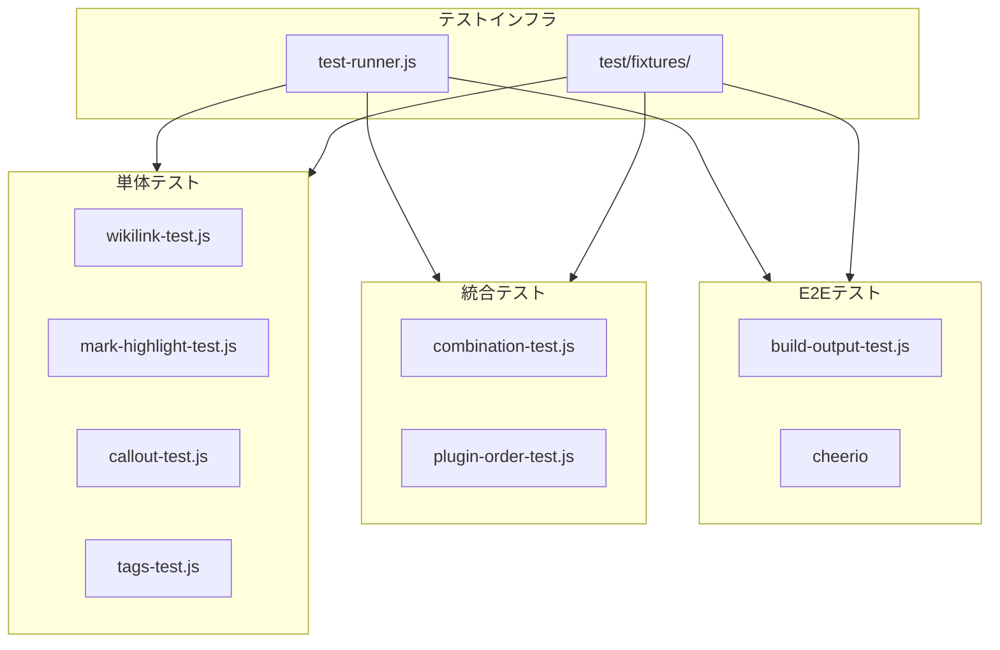
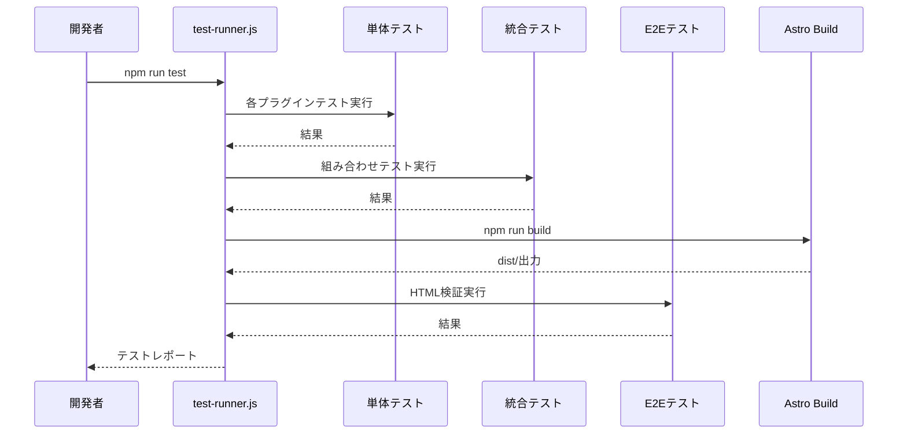

# Technical Design Document

## Overview

**Purpose**: 本機能は、itzpapaプロジェクトのMarkdownレンダリングプラグインの品質保証を強化し、Obsidian記法の信頼性を向上させます。

**Users**: ブログ執筆者（Obsidian記法の正確なレンダリング）、開発者（リグレッション検出と保守性向上）

**Impact**: 既存のテストインフラを拡張し、包括的なテストカバレッジを確立。プラグイン機能への変更はなし。

### Goals

- 各Obsidianプラグイン（WikiLink, マークハイライト, Callout, タグ）の単体テスト網羅
- プラグイン間の組み合わせテストによる干渉検出
- ビルド出力のE2E検証による最終品質保証
- 体系的なテストフィクスチャとドキュメント整備

### Non-Goals

- リンク切れ検出機能の実装（複雑度が高く、別タスクとして分離）
- プラグイン自体の機能追加・変更
- ブラウザ操作を伴うUIテスト

## Architecture

### Existing Architecture Analysis

**現在のテスト構造**:
- `test/`直下にフラットにテストファイルが配置
- `test-runner.js`が複数テストスイートを順次実行
- Node.js組み込みテストランナー（`node --test`）使用
- レポート出力: `test-report.json`

**プラグイン処理パイプライン**:
```
Markdown → remarkWikilink → remarkMarkHighlight → remarkTags → remarkCallout → HTML
```

### Architecture Pattern & Boundary Map



**Architecture Integration**:
- Selected pattern: 既存テスト構造の拡張（フラットディレクトリ維持）
- Domain/feature boundaries: テスト種別ごとにファイル分離（単体/統合/E2E）
- Existing patterns preserved: Node.js Test Runner、独自test-runner.js
- New components rationale: Calloutテスト不足解消、組み合わせテスト追加、E2E検証追加
- Steering compliance: `tech.md`のテスト方針（Node.js組み込みテストランナー使用）を遵守

### Technology Stack

| Layer | Choice / Version | Role in Feature | Notes |
|-------|------------------|-----------------|-------|
| Runtime | Node.js 20+ | テスト実行環境 | 既存環境 |
| Test Framework | node:test | 単体・統合テスト | 既存使用 |
| HTML Parser | cheerio ^1.0.0 | E2E出力検証 | 新規devDependency |
| Assertion | node:assert | テストアサーション | 既存使用 |

## System Flows

### テスト実行フロー



## Requirements Traceability

| Requirement | Summary | Components | Interfaces | Flows |
|-------------|---------|------------|------------|-------|
| 1.1-1.6 | WikiLink挙動改善 | wikilink-test.js | - | 単体テスト |
| 2.1-2.5 | マークハイライト改善 | mark-highlight-test.js | - | 単体テスト |
| 3.1-3.5 | Callout改善 | callout-test.js | - | 単体テスト |
| 4.1-4.5 | タグ改善 | tags-test.js | - | 単体テスト |
| 5.1-5.5 | 単体テスト | 各プラグインテスト | TestCase型 | 単体テスト実行 |
| 6.1-6.10 | 統合テスト | combination-test.js | - | 統合テスト実行 |
| 7.1-7.5 | E2Eテスト | build-output-test.js | HTMLValidator | E2Eテスト実行 |
| 8.1-8.5 | テストデータ | test/fixtures/ | Fixture型 | - |

## Components and Interfaces

### Component Summary

| Component | Domain/Layer | Intent | Req Coverage | Key Dependencies | Contracts |
|-----------|--------------|--------|--------------|------------------|-----------|
| callout-test.js | Unit Test | Callout単体テスト | 3.1-3.5, 5.1 | remark-callout (P0) | - |
| combination-test.js | Integration | 組み合わせテスト | 6.1-6.10 | 全プラグイン (P0) | - |
| build-output-test.js | E2E | ビルド出力検証 | 7.1-7.5 | cheerio (P0), Astro (P0) | HTMLValidator |
| test/fixtures/ | Test Data | テストフィクスチャ | 8.1-8.5 | - | Fixture |
| test-runner.js | Infrastructure | テスト統括 | 5.5, 6.5, 7.5 | node:test (P0) | - |

### Unit Test Layer

#### callout-test.js

| Field | Detail |
|-------|--------|
| Intent | Calloutプラグインの単体テストを提供 |
| Requirements | 3.1, 3.2, 3.3, 3.4, 3.5, 5.1 |

**Responsibilities & Constraints**
- remark-callout/rehype-calloutの変換結果を検証
- 各Calloutタイプ（note, warning, tip等）の出力確認
- 折りたたみ、カスタムタイトル、ネストの動作検証

**Dependencies**
- Inbound: test-runner.js — テスト実行 (P0)
- Outbound: remark-callout — テスト対象 (P0)
- Outbound: rehype-callout — テスト対象 (P0)

**Implementation Notes**
- 既存のwikilink-test.jsパターンに従う
- `remark().use(remarkCallout)`でAST変換をテスト
- rehypeフェーズはHTMLストリング出力で検証

### Integration Test Layer

#### combination-test.js

| Field | Detail |
|-------|--------|
| Intent | 複数プラグインの組み合わせ動作を検証 |
| Requirements | 6.1, 6.2, 6.3, 6.4, 6.5, 6.6, 6.7, 6.8, 6.9, 6.10 |

**Responsibilities & Constraints**
- 組み合わせマトリクス（要件6参照）の高リスクパターンを優先テスト
- プラグイン処理順序の検証
- 競合・干渉ケースの検出

**Dependencies**
- Inbound: test-runner.js — テスト実行 (P0)
- Outbound: 全remarkプラグイン — テスト対象 (P0)
- Outbound: test/fixtures/ — テストデータ (P1)

**Contracts**: Service [ ]

##### Service Interface
```typescript
interface CombinationTestCase {
  name: string;
  input: string;
  expectedPatterns: RegExp[];
  unexpectedPatterns?: RegExp[];
}

interface CombinationTestSuite {
  category: 'wikilink-highlight' | 'callout-wikilink' | 'callout-tag' | 'order' | 'conflict';
  cases: CombinationTestCase[];
}
```

**Implementation Notes**
- task-103-integration.test.jsを拡張
- カテゴリ別にテストケースをグループ化
- 優先実装: Callout+WikiLink、マークハイライト+WikiLink

### E2E Test Layer

#### build-output-test.js

| Field | Detail |
|-------|--------|
| Intent | Astroビルド出力のHTML検証 |
| Requirements | 7.1, 7.2, 7.3, 7.4, 7.5 |

**Responsibilities & Constraints**
- `npm run build`後のdist/ディレクトリを検証
- 各Obsidian記法のHTML出力が正しいことを確認
- DOM構造、属性値、クラス名を検証

**Dependencies**
- Inbound: test-runner.js — テスト実行 (P0)
- External: cheerio — HTML解析 (P0)
- External: Astro build — ビルド出力 (P0)
- Outbound: test/fixtures/ — 期待出力 (P1)

**Contracts**: Service [x]

##### Service Interface
```typescript
interface HTMLValidator {
  loadHTML(filePath: string): Promise<CheerioAPI>;
  assertElement(selector: string, assertions: ElementAssertions): void;
  assertAttribute(selector: string, attr: string, expected: string): void;
  assertText(selector: string, expected: string): void;
}

interface ElementAssertions {
  exists?: boolean;
  count?: number;
  hasClass?: string[];
  hasAttribute?: Record<string, string>;
  textContent?: string | RegExp;
}

interface E2ETestCase {
  name: string;
  htmlFile: string;  // dist/配下の相対パス
  validations: {
    selector: string;
    assertions: ElementAssertions;
  }[];
}
```

**Implementation Notes**
- ビルド前にテスト用Markdownをsrc/content/blog/に配置
- ビルド後にdist/blog/配下のHTMLを検証
- cheerioでDOM操作、セレクタベースでアサーション

### Test Data Layer

#### test/fixtures/

| Field | Detail |
|-------|--------|
| Intent | テスト入力と期待出力の管理 |
| Requirements | 8.1, 8.2, 8.3, 8.4, 8.5 |

**Responsibilities & Constraints**
- Markdown入力ファイル（`.md`）と期待HTML出力（`.expected.html`）のペア管理
- プラグイン別・テスト種別でサブディレクトリ分離
- 日本語コンテンツを含むテストケース

**Contracts**: State [x]

##### State Management
```typescript
// ディレクトリ構造
interface FixtureStructure {
  'test/fixtures/': {
    'wikilink/': {
      'basic.md': string;
      'basic.expected.html': string;
      'alias.md': string;
      'alias.expected.html': string;
      // ...
    };
    'mark-highlight/': { /* ... */ };
    'callout/': { /* ... */ };
    'tags/': { /* ... */ };
    'combination/': { /* ... */ };
    'e2e/': { /* ... */ };
  };
}

// フィクスチャ読み込みユーティリティ
interface FixtureLoader {
  loadInput(category: string, name: string): Promise<string>;
  loadExpected(category: string, name: string): Promise<string>;
  listFixtures(category: string): Promise<string[]>;
}
```

## Data Models

### Test Case Model

```typescript
// 単体テスト用
interface UnitTestCase {
  name: string;
  input: string;
  check: (ast: Root) => boolean;
}

// 統合テスト用
interface IntegrationTestCase {
  name: string;
  input: string;
  plugins: Plugin[];
  expectedOutput: string | RegExp;
}

// E2Eテスト用
interface E2ETestCase {
  name: string;
  sourceFile: string;  // src/content/blog/配下
  outputFile: string;  // dist/blog/配下
  validations: DOMValidation[];
}

interface DOMValidation {
  selector: string;
  type: 'exists' | 'count' | 'attribute' | 'text' | 'class';
  expected: unknown;
}
```

## Error Handling

### Error Strategy

- テスト失敗時は即座にエラーメッセージと入力データを出力
- ビルド失敗時はE2Eテストをスキップし、エラーを報告
- フィクスチャ読み込み失敗時は該当テストをスキップ

### Error Categories and Responses

**Test Assertion Errors**: 詳細な差分表示、入力/期待/実際の比較
**Build Errors**: Astroビルドログの出力、E2Eテストスキップ
**File System Errors**: フィクスチャパスの確認、存在チェック

## Testing Strategy

### Unit Tests

- WikiLinkプラグイン: 基本変換、エイリアス、日本語、画像WikiLink（既存40+拡張）
- マークハイライトプラグイン: 基本変換、複数行、ネスト（既存+拡張）
- Calloutプラグイン: 全7タイプ、折りたたみ、カスタムタイトル、ネスト（**新規**）
- タグプラグイン: 基本変換、階層タグ、日本語（既存+拡張）

### Integration Tests

- WikiLink+マークハイライト組み合わせ（`==[[page]]==`）
- Callout+WikiLink組み合わせ（`> [!note] [[ref]]`）
- Callout+タグ組み合わせ（`> [!tip] #tag`）
- プラグイン処理順序検証
- 競合記法検証（`==` vs `===`）

### E2E Tests

- WikiLink: href属性、クラス名、テキスト
- マークハイライト: `<mark>`要素、属性
- Callout: DOM構造、data-callout属性、折りたたみ
- タグ: リンク先URL、バッジクラス

## Optional Sections

### Performance & Scalability

- テスト実行時間目標: 全スイート10秒以内
- 並列実行: Node.js Test Runnerの並列モード活用
- ビルドキャッシュ: E2Eテスト時のビルド最適化
