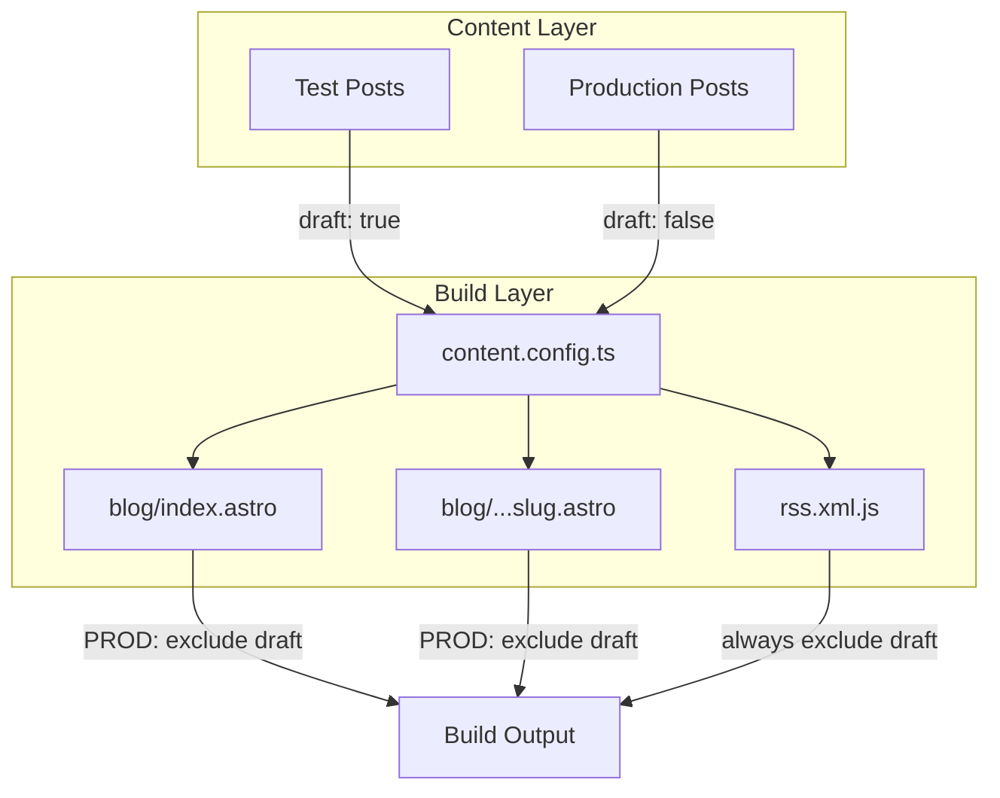

# Design Document: markdown-test-post-cleanup

## Overview

**Purpose**: itzpapaプロジェクト内のマークダウンテストポストを整理し、本番環境から除外可能な状態にする。

**Users**: 開発者がテスト記事を管理しやすくし、サイト運営者が本番サイトにテストコンテンツが表示されないことを保証する。

**Impact**: `src/content/blog/`配下の15件のテストポストに対して、フロントマター更新、ディレクトリ構造正規化を実施。

### Goals
- 全テストポストに`draft: true`フラグを設定し、本番ビルドから除外
- ディレクトリ構造を`{slug}/index.md`形式に統一
- スペース含むフォルダ名をケバブケースに正規化
- 全Obsidian機能のテストカバレッジを維持

### Non-Goals
- 命名規則の完全統一（`test-`プレフィックス）— 将来オプション
- 重複テストの統合 — 将来オプション
- 新規コード開発 — draft機能は実装済み

## Architecture

### Existing Architecture Analysis

本タスクはファイル操作のみで、既存アーキテクチャへの変更は不要。

**既存インフラ（変更なし）**:
- `src/content.config.ts`: `draft`フィールド定義済み
- `src/pages/blog/[...slug].astro`: 本番環境でdraft除外ロジック実装済み
- `src/pages/blog/index.astro`: 同上
- `src/pages/rss.xml.js`: draft記事除外済み

### Architecture Pattern & Boundary Map

本タスクはコンテンツ層のファイル操作のみのため、アーキテクチャ変更なし。



**Architecture Integration**:
- Selected pattern: 既存パターン維持（変更なし）
- Domain/feature boundaries: コンテンツ層のみ影響
- Existing patterns preserved: Astro Content Collections、draft機能
- New components rationale: なし
- Steering compliance: `src/content/blog/{slug}/index.md`形式を遵守

### Technology Stack

| Layer | Choice / Version | Role in Feature | Notes |
|-------|------------------|-----------------|-------|
| Content | Markdown (.md) | テストポストのコンテンツ形式 | 既存 |
| Schema | Zod (Astro内蔵) | フロントマターバリデーション | 既存 |
| Build | Astro v5 | 静的サイト生成 | 既存、変更なし |

## Requirements Traceability

| Requirement | Summary | Components | Interfaces | Flows |
|-------------|---------|------------|------------|-------|
| 1.3 | draft: trueフラグ追加 | TestPostFrontmatter | — | FrontmatterUpdate |
| 2.1 | フォルダ形式統一 | DirectoryStructure | — | FileMove |
| 2.2 | ルートレベル.md移行 | DirectoryStructure | — | FileMove |
| 2.3 | スペース正規化 | DirectoryStructure | — | FolderRename |
| 4.1 | draft: true設定 | TestPostFrontmatter | — | FrontmatterUpdate |
| 4.2 | 本番ビルド除外 | — | — | — (実装済み) |
| 4.3 | 開発プレビュー可能 | — | — | — (実装済み) |
| 5.1 | 機能テスト維持 | TestCoverage | — | — |

## Components and Interfaces

| Component | Domain/Layer | Intent | Req Coverage | Key Dependencies | Contracts |
|-----------|--------------|--------|--------------|------------------|-----------|
| TestPostFrontmatter | Content | テストポストのメタデータ更新 | 1.3, 4.1 | — | Data |
| DirectoryStructure | Content | ファイル・フォルダ構造正規化 | 2.1, 2.2, 2.3 | WikiLinkReferences (P1) | — |
| WikiLinkReferences | Content | リネーム時の参照更新 | 2.3 | DirectoryStructure (P0) | — |
| TestCoverage | Content | 機能テスト維持確認 | 5.1 | — | — |

### Content Layer

#### TestPostFrontmatter

| Field | Detail |
|-------|--------|
| Intent | テストポストのフロントマターに`draft: true`を追加 |
| Requirements | 1.3, 4.1 |

**Responsibilities & Constraints**
- 全15件のテストポストのフロントマターを更新
- 既存のフロントマターフィールドを保持
- YAML形式の整合性を維持

**Dependencies**
- なし（独立した編集作業）

**Contracts**: State [x]

##### State Management
- State model: Markdownフロントマターの`draft`フィールド
- Persistence: ファイルシステム上の.mdファイル
- Consistency: 全テストポストで`draft: true`を統一

**Implementation Notes**
- Validation: 更新後に`npm run build`で検証
- Risks: なし（単純なフィールド追加）

#### DirectoryStructure

| Field | Detail |
|-------|--------|
| Intent | ファイル・フォルダ構造をプロジェクト規約に統一 |
| Requirements | 2.1, 2.2, 2.3 |

**Responsibilities & Constraints**
- `table-style-test.md` → `test-table/index.md`に移行
- `test page/` → `test-page/`にリネーム
- `my test page/` → `my-test-page/`にリネーム
- 同梱画像ファイルも同時移動

**Dependencies**
- Outbound: WikiLinkReferences — パス更新（P1）

**Implementation Notes**
- Integration: フォルダ移動後にWikiLink参照を更新
- Validation: ビルド成功とリンク動作確認
- Risks: WikiLink切れ（同時更新で緩和）

#### WikiLinkReferences

| Field | Detail |
|-------|--------|
| Intent | リネーム対象フォルダへのWikiLink参照を更新 |
| Requirements | 2.3 |

**Responsibilities & Constraints**
- `test page` → `test-page`への参照更新
- `my test page` → `my-test-page`への参照更新
- 相対パス形式（`../xxx/index.md`）を維持

**Dependencies**
- Inbound: DirectoryStructure — リネーム完了後（P0）

**参照更新対象**:
| 参照元ファイル | 更新対象WikiLink |
|---------------|-----------------|
| `my test page/index.md` | `[[../test page/index.md\|...]]` → `[[../test-page/index.md\|...]]` |
| `test page/index.md` | `[[../wikilink-test/index.md\|...]]`（変更なし） |

**Implementation Notes**
- Integration: DirectoryStructureのリネーム直後に実行
- Validation: リンククリックで遷移確認

## Data Models

### Domain Model

**TestPost Entity**:
```yaml
# フロントマター構造
title: string (required)
description: string (required)
pubDate: date (required)
updatedDate: date (optional)
heroImage: string (optional)
tags: string[] (optional)
draft: boolean (optional, default: false)  # ← 更新対象
```

**Invariants**:
- テストポストは必ず`draft: true`
- 本番記事は`draft: false`または未設定

### Logical Data Model

**ディレクトリ構造（変更後）**:
```
src/content/blog/
├── test-callout/                    # 変更なし（将来リネーム候補）
│   └── index.md
├── test-page/                       # ← test page/ からリネーム
│   └── index.md
├── my-test-page/                    # ← my test page/ からリネーム
│   └── index.md
├── test-table/                      # ← table-style-test.md から移行
│   └── index.md
└── ... (その他既存フォルダ)
```

## Error Handling

### Error Strategy

本タスクはファイル操作のため、以下のエラーに対応:

| エラー | 検出方法 | 対処 |
|--------|---------|------|
| YAML構文エラー | `npm run build` | フロントマター修正 |
| WikiLink切れ | 開発サーバーで確認 | 参照パス修正 |
| 画像パス切れ | ビルドエラー | 画像ファイル移動 |

### Monitoring

- `npm run build`: ビルドエラー検出
- `npm run dev`: 開発サーバーでリンク動作確認

## Testing Strategy

### 手動検証項目

1. **ビルド検証**: `npm run build`が成功すること
2. **本番除外確認**: ビルド出力にテストポストが含まれないこと
3. **開発プレビュー**: `npm run dev`でテストポストが表示されること
4. **WikiLink動作**: リネームしたフォルダへのリンクが動作すること
5. **画像表示**: 移動した画像が正しく表示されること

### テストカバレッジ確認

整理後も以下の機能テストが維持されていること:
- [ ] WikiLink（test-wikilink, test-page, my-test-page）
- [ ] Callout（callout-comprehensive-test等）
- [ ] マークハイライト（mark-highlight-test）
- [ ] タグ（tag-test, hierarchical-tag-test）
- [ ] テーブル（test-table）
- [ ] 数式（math-test）
- [ ] Mermaid（mermaid-test）
- [ ] 画像（image-test）
