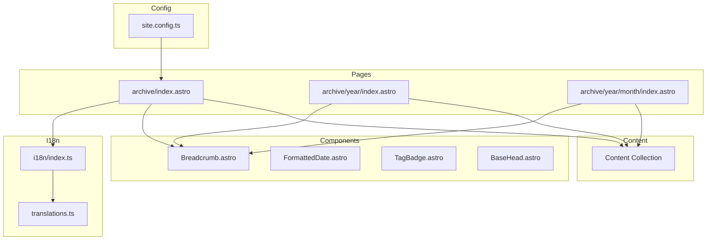
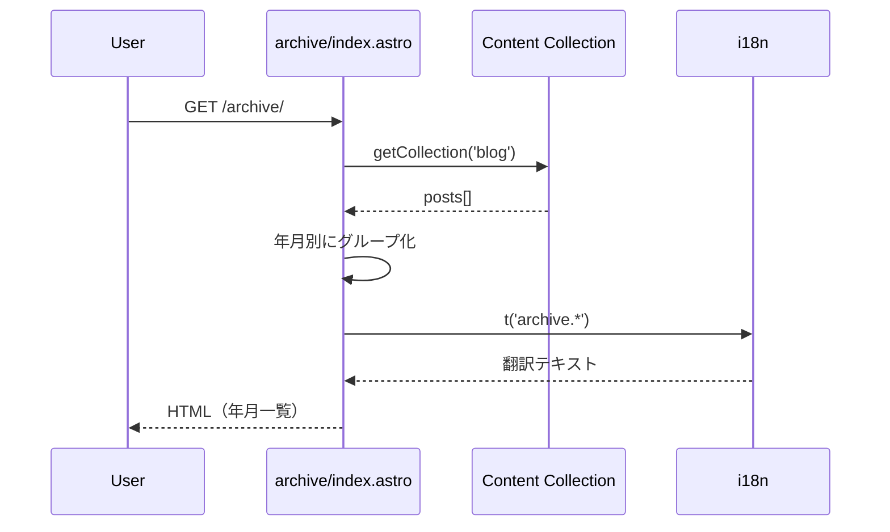

# Design Document: Monthly Archive

## Overview

**Purpose**: 月別アーカイブ機能は、ブログ記事を公開年月ごとに整理・閲覧できる機能を提供し、サイトのナビゲーション性を向上させる。

**Users**: サイト訪問者が過去の記事を時系列で探索する。

**Impact**: 既存のタグ・カテゴリページと同様のUIパターンを採用し、一貫したユーザー体験を維持しながら新しいナビゲーション経路を追加。

### Goals
- 記事を年月別に整理して閲覧可能にする
- 既存のデザインパターン・コンポーネントを再利用する
- 多言語・レスポンシブ・ダークモードに対応する

### Non-Goals
- カレンダーUI表示（将来検討）
- 記事数によるヒートマップ表示
- アーカイブウィジェットのサイドバー自動挿入
- 機能フラグによる有効/無効切り替え

## Architecture

### Existing Architecture Analysis
- **コンテンツ取得**: `getCollection('blog')`によるAstro Content Collections
- **動的ルーティング**: `getStaticPaths()`によるSSG対応の動的ページ生成
- **国際化**: `src/i18n/`モジュールによる翻訳管理
- **ナビゲーション**: `site.config.ts`の`navigation`配列で管理

### Architecture Pattern & Boundary Map



**Architecture Integration**:
- **Selected pattern**: 既存のタグ・カテゴリページパターンを踏襲
- **Domain boundaries**: ページ（表示）とコンテンツ（データ）を分離
- **Existing patterns preserved**: Content Collections、i18n、コンポーネント再利用
- **New components rationale**: 新規コンポーネント不要（既存を再利用）
- **Steering compliance**: TypeScript strict mode、Astro SSG

### Technology Stack

| Layer | Choice / Version | Role in Feature | Notes |
|-------|------------------|-----------------|-------|
| Frontend | Astro v5 | ページ生成・ルーティング | 既存 |
| Data | Content Collections | ブログ記事取得 | 既存 |
| Runtime | Node.js | ビルド時処理 | 既存 |

## System Flows

### アーカイブ一覧ページ表示フロー



**Key Decisions**:
- ビルド時に全記事を取得し、年月別にグループ化
- 本番環境では`draft: true`の記事を除外

## Requirements Traceability

| Requirement | Summary | Components | Interfaces | Flows |
|-------------|---------|------------|------------|-------|
| 1.1-1.6 | アーカイブ一覧 | archive/index.astro | - | 表示フロー |
| 2.1-2.6 | 月別一覧 | archive/[year]/[month]/index.astro | - | 表示フロー |
| 3.1-3.4 | 年別一覧 | archive/[year]/index.astro | - | 表示フロー |
| 4.1-4.2 | ナビゲーション | site.config.ts | NavItem | - |
| 5.1-5.2 | 多言語対応 | translations.ts, i18n | TranslationKeys | - |
| 6.1-6.3 | レスポンシブ・ダークモード | 各ページCSS | - | - |
| 7.1-7.3 | SEO最適化 | BaseHead.astro, 各ページ | - | - |

## Components and Interfaces

| Component | Domain/Layer | Intent | Req Coverage | Key Dependencies | Contracts |
|-----------|--------------|--------|--------------|------------------|-----------|
| archive/index.astro | Pages | アーカイブ一覧表示 | 1.1-1.6 | Content Collection (P0), i18n (P1) | - |
| archive/[year]/index.astro | Pages | 年別記事一覧表示 | 3.1-3.4 | Content Collection (P0), i18n (P1) | - |
| archive/[year]/[month]/index.astro | Pages | 月別記事一覧表示 | 2.1-2.6 | Content Collection (P0), i18n (P1) | - |
| TranslationKeys | I18n | アーカイブ翻訳キー | 5.1-5.2 | - | Type |

### Pages Layer

#### archive/index.astro

| Field | Detail |
|-------|--------|
| Intent | 全年月のアーカイブ一覧と統計情報を表示 |
| Requirements | 1.1, 1.2, 1.3, 1.4, 1.5, 1.6 |

**Responsibilities & Constraints**
- 全記事を年月別にグループ化
- 新しい順（降順）でソート
- 統計情報（総記事数、最多記事月）を計算
- 本番環境ではdraft記事を除外
- 記事が存在しない場合は空状態メッセージを表示

**Dependencies**
- Inbound: URL `/archive/` — ユーザーアクセス (P0)
- Outbound: Content Collection — 記事取得 (P0)
- Outbound: i18n — 翻訳テキスト (P1)
- External: Breadcrumb, BaseHead, Header, Footer — UI構成 (P1)

**Contracts**: State [x]

##### State Management
```typescript
interface ArchiveIndexState {
  /** 年月別記事グループ（年 -> 月 -> 記事配列） */
  archiveData: Map<number, Map<number, BlogPost[]>>;
  /** 統計情報 */
  statistics: {
    totalPosts: number;
    totalMonths: number;
    mostActiveMonth: { year: number; month: number; count: number };
  };
}
```

**Implementation Notes**
- Integration: 既存のタグ一覧ページ（`tags/index.astro`）のパターンを参考
- Risks: 大量の記事がある場合のビルド時間増加（SSGのため許容範囲）

#### archive/[year]/index.astro

| Field | Detail |
|-------|--------|
| Intent | 特定年の記事一覧を月別グループで表示 |
| Requirements | 3.1, 3.2, 3.3, 3.4 |

**Responsibilities & Constraints**
- `getStaticPaths()`で記事が存在する年のみページ生成
- 記事を月別にグループ化して表示
- パンくずナビゲーション（ホーム > アーカイブ > YYYY年）

**Dependencies**
- Inbound: URL `/archive/YYYY/` — ユーザーアクセス (P0)
- Outbound: Content Collection — 記事取得 (P0)

**Contracts**: State [x]

##### Route Definition
```typescript
export async function getStaticPaths() {
  const posts = await getCollection('blog', filterDrafts);
  const years = new Set(posts.map(p =>
    new Date(p.data.published).getFullYear()
  ));

  return Array.from(years).map(year => ({
    params: { year: String(year) },
    props: { year, posts: getPostsByYear(posts, year) }
  }));
}
```

#### archive/[year]/[month]/index.astro

| Field | Detail |
|-------|--------|
| Intent | 特定月の記事一覧を表示 |
| Requirements | 2.1, 2.2, 2.3, 2.4, 2.5, 2.6 |

**Responsibilities & Constraints**
- `getStaticPaths()`で記事が存在する年月のみページ生成
- 記事を公開日の新しい順でソート
- 各記事のタイトル、公開日、説明文、タグを表示
- パンくずナビゲーション（ホーム > アーカイブ > YYYY年 > MM月）

**Dependencies**
- Inbound: URL `/archive/YYYY/MM/` — ユーザーアクセス (P0)
- Outbound: Content Collection — 記事取得 (P0)
- External: FormattedDate, TagBadge — UI表示 (P1)

**Contracts**: State [x]

##### Route Definition
```typescript
export async function getStaticPaths() {
  const posts = await getCollection('blog', filterDrafts);
  const yearMonths = new Set(posts.map(p => {
    const d = new Date(p.data.published);
    return `${d.getFullYear()}-${String(d.getMonth() + 1).padStart(2, '0')}`;
  }));

  return Array.from(yearMonths).map(ym => {
    const [year, month] = ym.split('-');
    return {
      params: { year, month },
      props: { year: Number(year), month: Number(month), posts: getPostsByMonth(posts, year, month) }
    };
  });
}
```

### Config Layer

#### site.config.ts Navigation

| Field | Detail |
|-------|--------|
| Intent | ナビゲーションにアーカイブリンクを追加 |
| Requirements | 4.1 |

**Implementation Notes**
- `navigation`配列に`{ label: 'Archive', href: '/archive/' }`を追加
- 既存のTags/Categoryと同じ運用

### I18n Layer

#### TranslationKeys Extension

| Field | Detail |
|-------|--------|
| Intent | アーカイブ機能用の翻訳キーを追加 |
| Requirements | 5.1, 5.2 |

**Responsibilities & Constraints**
- 日本語・英語両方のエントリを追加
- 日付フォーマットは`Intl.DateTimeFormat`で言語別に処理

**Contracts**: Type [x]

##### Translation Keys
```typescript
// TranslationKeysインターフェースに追加
'archive.title': string;           // "アーカイブ" / "Archive"
'archive.posts': string;           // "件の記事" / " posts"
'archive.totalMonths': string;     // "総月数" / "Total Months"
'archive.mostActive': string;      // "最多記事月" / "Most Active"
'archive.noPostsFound': string;    // "記事が見つかりません" / "No posts found"
'archive.noPostsFoundDesc': string;
'breadcrumb.archive': string;      // "アーカイブ" / "Archive"
```

## Data Models

### Domain Model

**Entities**:
- `BlogPost`: 既存のブログ記事エンティティ（変更なし）

**Value Objects**:
- `YearMonth`: 年月を表す値オブジェクト（`{ year: number; month: number }`）
- `ArchiveStatistics`: 統計情報（総記事数、最多記事月等）

**Business Rules**:
- 年月は記事の`published`日付から導出
- 記事が存在しない年月のページは生成しない
- 本番環境では`draft: true`の記事を除外

### Logical Data Model

**構造**:
- 年月別記事グループ: `Map<year, Map<month, BlogPost[]>>`
- 記事取得はビルド時に1回のみ実行

**Indexing**: なし（ビルド時にメモリ内で処理）

## Error Handling

### Error Categories and Responses
- **User Errors**: 存在しない年月へのアクセス → 404ページ表示（Astroデフォルト動作）
- **Business Logic Errors**: 記事0件 → 空状態メッセージ表示（フレンドリーなUI）

### Monitoring
- ビルドログで生成ページ数を確認可能
- 404エラーはホスティングサービスのログで監視

## Testing Strategy

### Unit Tests
- 年月グループ化ロジック（存在する場合）
- 日付フォーマット処理

### Integration Tests
- 各ページの正常レンダリング
- パンくずナビゲーションの正確性
- i18n翻訳の適用

### E2E Tests
- `/archive/`から年別・月別ページへの遷移
- 記事カードクリックから記事詳細への遷移
- レスポンシブレイアウトの確認
- ダークモード切り替え
