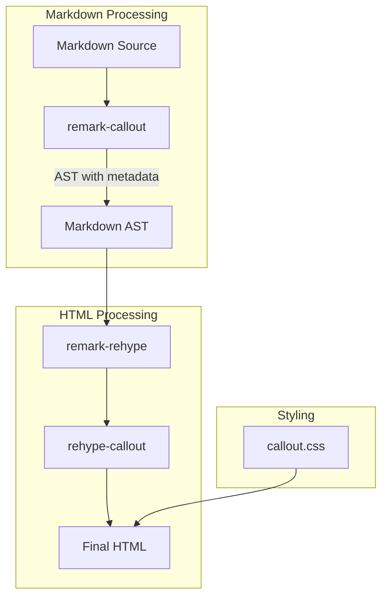

# Design Document: Obsidian Callout 完全対応

## Overview

**Purpose**: Obsidian公式のcalloutタイプ（13種類）とエイリアスを完全サポートし、Obsidianユーザーが執筆したコンテンツを修正なしでブログに公開できるようにする。

**Users**: Obsidianで知識管理を行い、ブログとして公開したいユーザー。

**Impact**: 現行7タイプから13タイプへ拡張。既存機能（折りたたみ、カスタムタイトル、ネスト）は維持。

### Goals
- Obsidian公式13タイプのcalloutを完全サポート
- 全エイリアス（summary, tldr, hint, check等）を正規タイプへ解決
- 既存コンテンツとの後方互換性を維持

### Non-Goals
- カスタムcalloutタイプの追加機能
- calloutアイコンのユーザーカスタマイズ
- アニメーション効果の追加

## Architecture

### Existing Architecture Analysis

現行システムは2段階のプラグインパイプラインで構成:

1. **remark-callout**: Markdown AST段階でcallout構文を検出し、メタデータを付与
2. **rehype-callout**: HTML AST段階でメタデータに基づきHTML構造を生成

この分離により、Astroの画像最適化がcallout内画像に正しく適用される。

### Architecture Pattern & Boundary Map



**Architecture Integration**:
- 選択パターン: インプレース拡張（既存ファイルへの定数追加）
- ドメイン境界: remark（構文解析・型解決）、rehype（HTML生成）、CSS（視覚表現）
- 既存パターン維持: データ属性ベースのスタイリング、OKLCH色空間
- Steering準拠: カスタムremarkプラグインはJavaScriptで記述

### Technology Stack

| Layer | Choice / Version | Role in Feature | Notes |
|-------|------------------|-----------------|-------|
| Markdown Processing | remark + unist-util-visit | callout構文解析・エイリアス解決 | 既存依存 |
| HTML Processing | rehype + unist-util-visit | HTML構造生成・アイコン挿入 | 既存依存 |
| Styling | CSS (OKLCH) | タイプ別色定義・レスポンシブ対応 | 新色追加 |
| Icons | Lucide (inline SVG) | タイプ別アイコン表示 | 新アイコン追加 |

## Requirements Traceability

| Requirement | Summary | Components | Interfaces | Flows |
|-------------|---------|------------|------------|-------|
| 1.1 | 13タイプ対応 | remark-callout, rehype-callout, callout.css | VALID_TYPES, CALLOUT_ICONS, CSS変数 | — |
| 1.2 | 未知タイプ→note | remark-callout | parseCalloutHeader | — |
| 1.3 | OKLCH配色 | callout.css | CSS変数 | — |
| 1.4 | Lucideアイコン | rehype-callout | CALLOUT_ICONS | — |
| 2.1-2.8 | エイリアス解決 | remark-callout | TYPE_ALIASES, resolveType | — |
| 3.1-3.6 | 既存機能維持 | 全コンポーネント | — | — |
| 4.1-4.2 | デフォルトタイトル | remark-callout | DEFAULT_TITLES | — |
| 5.1-5.3 | テスト | tests/unit/callout-test.js | — | — |

## Components and Interfaces

| Component | Domain | Intent | Req Coverage | Key Dependencies | Contracts |
|-----------|--------|--------|--------------|------------------|-----------|
| remark-callout | Markdown Processing | callout構文解析・エイリアス解決 | 1.1, 1.2, 2.1-2.8, 3.1-3.4, 4.1-4.2 | unist-util-visit (P0) | Service |
| rehype-callout | HTML Processing | HTML構造・アイコン生成 | 1.1, 1.4, 3.1-3.3 | unist-util-visit (P0) | Service |
| callout.css | Styling | タイプ別視覚表現 | 1.3, 3.5-3.6 | — | State |
| callout-test.js | Testing | 機能検証 | 5.1-5.3 | node:test (P0) | — |

### Markdown Processing

#### remark-callout

| Field | Detail |
|-------|--------|
| Intent | Obsidian callout構文を解析し、エイリアスを正規タイプに解決 |
| Requirements | 1.1, 1.2, 2.1-2.8, 3.1-3.4, 4.1-4.2 |

**Responsibilities & Constraints**
- blockquoteノードから`[!type]`パターンを検出
- エイリアスを正規タイプに変換（TYPE_ALIASESマップ使用）
- data.hPropertiesにメタデータを付与
- 折りたたみ・カスタムタイトル・ネスト処理を維持

**Dependencies**
- Inbound: Astro MDX pipeline — ビルド時呼び出し (P0)
- Outbound: rehype-callout — メタデータ引き渡し (P0)
- External: unist-util-visit — AST走査 (P0)

**Contracts**: Service [x]

##### Service Interface

```javascript
/**
 * エイリアス→正規タイプ変換マップ
 * @type {Record<string, string>}
 */
const TYPE_ALIASES = {
  summary: 'abstract',
  tldr: 'abstract',
  hint: 'tip',
  important: 'tip',
  check: 'success',
  done: 'success',
  help: 'question',
  faq: 'question',
  caution: 'warning',
  attention: 'warning',
  fail: 'failure',
  missing: 'failure',
  error: 'danger',
  cite: 'quote'
};

/**
 * 有効なcalloutタイプ（正規タイプのみ）
 * @type {string[]}
 */
const VALID_TYPES = [
  'note', 'abstract', 'info', 'todo', 'tip', 'success',
  'question', 'warning', 'failure', 'danger', 'bug', 'example', 'quote'
];

/**
 * 入力タイプを正規タイプに解決
 * @param {string} rawType - 入力されたタイプ（小文字化済み）
 * @returns {string} - 正規タイプ（未知の場合は'note'）
 */
function resolveType(rawType) {
  if (VALID_TYPES.includes(rawType)) return rawType;
  if (TYPE_ALIASES[rawType]) return TYPE_ALIASES[rawType];
  return 'note';
}
```

- Preconditions: blockquoteノードにテキスト子ノードが存在
- Postconditions: data.hPropertiesに'data-callout'属性が設定
- Invariants: originalTypeプロパティで元の入力を保持

**Implementation Notes**
- Integration: 既存VALID_TYPESを拡張、TYPE_ALIASESを新規追加
- Validation: rawTypeの小文字化は既存処理を維持
- Risks: なし（後方互換性維持）

### HTML Processing

#### rehype-callout

| Field | Detail |
|-------|--------|
| Intent | calloutメタデータに基づきHTML構造とアイコンを生成 |
| Requirements | 1.1, 1.4, 3.1-3.3 |

**Responsibilities & Constraints**
- data-callout属性に基づきタイプ別アイコンを選択
- div/details構造を生成
- 未知タイプはnoteアイコンにフォールバック

**Dependencies**
- Inbound: remark-callout — メタデータ付きblockquote (P0)
- External: unist-util-visit — AST走査 (P0)

**Contracts**: Service [x]

##### Service Interface

```javascript
/**
 * タイプ別Lucide SVGアイコン
 * @type {Record<string, string>}
 */
const CALLOUT_ICONS = {
  note: '<svg>...</svg>',      // pencil
  abstract: '<svg>...</svg>',  // clipboard-list
  info: '<svg>...</svg>',      // info
  todo: '<svg>...</svg>',      // list-todo
  tip: '<svg>...</svg>',       // lightbulb
  success: '<svg>...</svg>',   // circle-check
  question: '<svg>...</svg>',  // circle-help
  warning: '<svg>...</svg>',   // triangle-alert
  failure: '<svg>...</svg>',   // x-circle
  danger: '<svg>...</svg>',    // zap
  bug: '<svg>...</svg>',       // bug
  example: '<svg>...</svg>',   // folder-open
  quote: '<svg>...</svg>'      // quote
};
```

- Preconditions: ノードにdata-callout属性が存在
- Postconditions: アイコン付きHTML構造が生成
- Invariants: アイコンはLucide準拠のSVG

**Implementation Notes**
- Integration: 既存CALLOUT_ICONSに新タイプを追加
- Validation: 未知タイプはnoteにフォールバック（既存動作）
- Risks: なし

### Styling

#### callout.css

| Field | Detail |
|-------|--------|
| Intent | タイプ別のOKLCH配色とスタイルを定義 |
| Requirements | 1.3, 3.5-3.6 |

**Responsibilities & Constraints**
- 13タイプ分のCSS変数（color/bg）を定義
- ダークモード対応（html.dark、prefers-color-scheme）
- レスポンシブ対応を維持

**Contracts**: State [x]

##### State Management

```css
/* 新タイプ用CSS変数（ライトモード） */
:root {
  /* abstract: 緑系 */
  --callout-abstract-color: oklch(0.7 0.2 150);
  --callout-abstract-bg: oklch(0.7 0.2 150 / 0.1);

  /* todo: 青系 */
  --callout-todo-color: oklch(0.65 0.2 260);
  --callout-todo-bg: oklch(0.65 0.2 260 / 0.1);

  /* success: 緑系 */
  --callout-success-color: oklch(0.7 0.2 150);
  --callout-success-bg: oklch(0.7 0.2 150 / 0.1);

  /* question: 黄系 */
  --callout-question-color: oklch(0.75 0.18 90);
  --callout-question-bg: oklch(0.75 0.18 90 / 0.1);

  /* failure: 赤系 */
  --callout-failure-color: oklch(0.65 0.25 25);
  --callout-failure-bg: oklch(0.65 0.25 25 / 0.1);

  /* bug: 赤系 */
  --callout-bug-color: oklch(0.65 0.25 25);
  --callout-bug-bg: oklch(0.65 0.25 25 / 0.1);

  /* example: 紫系 */
  --callout-example-color: oklch(0.6 0.25 300);
  --callout-example-bg: oklch(0.6 0.25 300 / 0.1);

  /* quote: グレー系 */
  --callout-quote-color: oklch(0.55 0.02 280);
  --callout-quote-bg: oklch(0.55 0.02 280 / 0.1);
}
```

- Persistence: 静的CSS、ビルド時に組み込み
- Consistency: 既存変数パターンを踏襲
- Concurrency: 該当なし

**Implementation Notes**
- Integration: 既存CSS変数定義セクションに追加
- Validation: ブラウザでの視覚確認
- Risks: 同系色タイプの視認性確認が必要

## Data Models

### Domain Model

**Callout Type System**:

```
CalloutType (Value Object)
├── canonical: string (正規タイプ名)
├── aliases: string[] (エイリアス一覧)
├── color: OKLCHColor (配色)
└── icon: SVGString (アイコン)
```

**Type Hierarchy**:
- 正規タイプ: 13種類
- エイリアス: 14種類（正規タイプへの参照）

## Error Handling

### Error Strategy

既存のフォールバック戦略を維持:
- 未知タイプ → `note`として処理
- アイコン未定義 → `note`アイコンを使用

### Error Categories and Responses

**User Errors**: 未知のcalloutタイプ使用 → noteとして正常表示（警告なし）

## Testing Strategy

### Unit Tests
- 13種類すべてのタイプがVALID_TYPESに含まれることを確認
- 各エイリアスが正しい正規タイプに解決されることを確認
- 未知タイプがnoteにフォールバックすることを確認

### Integration Tests
- 各タイプのcalloutが正しいHTML構造に変換されることを確認
- 各タイプに正しいアイコンが適用されることを確認
- エイリアス使用時も正規タイプと同じ表示になることを確認

### E2E/UI Tests
- 全13タイプが視覚的に区別可能であることを確認
- ダークモードで全タイプが正しく表示されることを確認
- モバイルビューでレイアウトが崩れないことを確認

## Supporting References

### Lucide Icon SVG一覧

実装時に以下のアイコンをLucide公式サイトから取得:

| Type | Lucide Icon Name | 用途 |
|------|------------------|------|
| note | pencil | メモ・ノート |
| abstract | clipboard-list | 要約・概要 |
| info | info | 情報 |
| todo | list-todo | タスク |
| tip | lightbulb | ヒント |
| success | circle-check | 成功・完了 |
| question | circle-help | 質問・FAQ |
| warning | triangle-alert | 警告 |
| failure | x-circle | 失敗 |
| danger | zap | 危険 |
| bug | bug | バグ |
| example | folder-open | 例 |
| quote | quote | 引用 |
