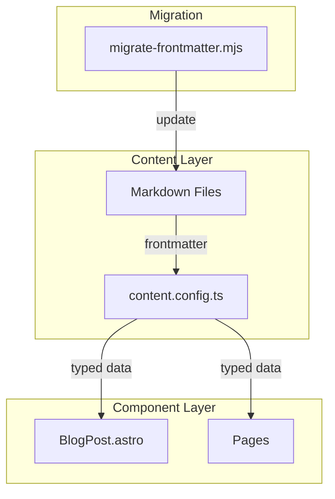
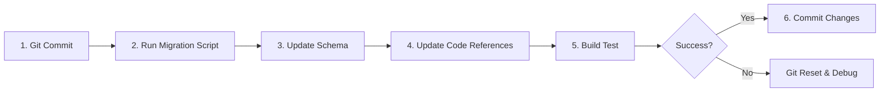

# Technical Design Document

## Overview

**Purpose**: itzpapaプロジェクトのフロントマター仕様をfuwariテーマに準拠させ、Obsidianとの互換性を確保する。

**Users**: コンテンツ作成者（Obsidianユーザー）および開発者が、fuwari互換のフロントマター形式で記事を作成・管理できるようになる。

**Impact**: 既存のスキーマ定義、7つのソースファイル、19件のブログ記事を更新する。

### Goals
- フロントマターフィールド名をfuwari仕様に統一（`published`, `image`, `updated`）
- fuwari準拠のスキーマ定義（必須/オプション、デフォルト値）
- Obsidian公式プロパティ（`aliases`）のサポート
- 既存コンテンツの安全なマイグレーション

### Non-Goals
- fuwariの`prevTitle`/`prevSlug`/`nextTitle`/`nextSlug`フィールドは対象外
- `image`フィールドの型変更（`image()`ヘルパーを維持）
- 新しいUIコンポーネントの追加

## Architecture

### Existing Architecture Analysis

現在のアーキテクチャ:
- **スキーマ定義**: `src/content.config.ts`でZodスキーマを定義
- **データフロー**: Astro Content Collectionsがフロントマターを型安全に提供
- **参照箇所**: 7ファイルでフロントマターデータを参照

変更対象のフィールド:
| 現在 | fuwari準拠 |
|------|-----------|
| `pubDate` | `published` |
| `heroImage` | `image` |
| `updatedDate` | `updated` |

### Architecture Pattern & Boundary Map



**Architecture Integration**:
- Selected pattern: 一括リファクタリング（スキーマ・コード・コンテンツ同時更新）
- Domain/feature boundaries: Content Collection境界を維持
- Existing patterns preserved: Astro Content Collections、Zodスキーマ
- New components rationale: マイグレーションスクリプトのみ一時追加
- Steering compliance: TypeScript strict mode、既存ディレクトリ構造を維持

### Technology Stack

| Layer | Choice / Version | Role in Feature | Notes |
|-------|------------------|-----------------|-------|
| Schema | Zod (Astro内蔵) | フロントマター型定義 | 変更なし |
| Runtime | Node.js | マイグレーションスクリプト実行 | 既存環境 |
| Content | Markdown/MDX | ブログ記事フォーマット | 変更なし |

## Requirements Traceability

| Requirement | Summary | Components | Interfaces | Flows |
|-------------|---------|------------|------------|-------|
| 1.1-1.4 | フィールドリネーム | ContentSchema, BlogPostLayout, AllPages | SchemaInterface | Migration |
| 2.1-2.9 | スキーマ定義 | ContentSchema | SchemaInterface | - |
| 3.1-3.2 | Obsidianサポート | ContentSchema | SchemaInterface | - |
| 4.1-4.4 | マイグレーション | MigrationScript | - | Migration |
| 5.1-5.4 | コード参照更新 | AllPages, BlogPostLayout | - | - |
| 6.1-6.4 | 日付形式 | ContentSchema | SchemaInterface | - |

## Components and Interfaces

| Component | Domain/Layer | Intent | Req Coverage | Key Dependencies | Contracts |
|-----------|--------------|--------|--------------|------------------|-----------|
| ContentSchema | Content | フロントマタースキーマ定義 | 1, 2, 3, 6 | Zod, Astro (P0) | Schema |
| BlogPostLayout | UI | 記事レイアウト | 1, 5 | ContentSchema (P0) | Props |
| MigrationScript | Tool | 既存記事の変換 | 4 | gray-matter (P1) | - |
| Pages | UI | 各ページコンポーネント | 1, 5 | ContentSchema (P0) | - |

### Content Layer

#### ContentSchema

| Field | Detail |
|-------|--------|
| Intent | fuwari準拠のフロントマタースキーマを定義 |
| Requirements | 1.1-1.4, 2.1-2.9, 3.1-3.2, 6.1-6.4 |

**Responsibilities & Constraints**
- Zodを使用した型安全なフロントマター定義
- fuwari互換フィールド名の採用
- デフォルト値によるオプショナルフィールドの処理

**Dependencies**
- Inbound: Markdown files — frontmatter source (P0)
- Outbound: All pages/layouts — typed data provision (P0)
- External: Zod — schema validation (P0)

**Contracts**: Schema [x]

##### Schema Interface

```typescript
// src/content.config.ts
import { defineCollection, z } from 'astro:content';
import { glob } from 'astro/loaders';

const blog = defineCollection({
  loader: glob({ base: './src/content/blog', pattern: '**/*.{md,mdx}' }),
  schema: ({ image }) =>
    z.object({
      // Required fields
      title: z.string(),
      published: z.coerce.date(),

      // Optional fields with defaults (fuwari-compatible)
      updated: z.coerce.date().optional(),
      description: z.string().optional().default(''),
      image: image().optional(),
      tags: z.array(z.string()).optional().default([]),
      category: z.string().optional().default(''),
      draft: z.boolean().optional().default(false),
      lang: z.string().optional().default(''),

      // Obsidian official property
      aliases: z.array(z.string()).optional(),
    }),
});

export const collections = { blog };
```

**Implementation Notes**
- `image()`ヘルパーを維持（Astro画像最適化のため、fuwariの`z.string()`とは異なる）
- `z.coerce.date()`でYYYY-MM-DD/ISO 8601両形式を受け入れ
- 未定義フィールドはZodのデフォルト動作で無視される

### UI Layer

#### BlogPostLayout

| Field | Detail |
|-------|--------|
| Intent | ブログ記事のレイアウトコンポーネント |
| Requirements | 1.1-1.4, 5.1-5.4 |

**Responsibilities & Constraints**
- フロントマターデータの表示
- 日付フォーマット、画像表示の処理

**Dependencies**
- Inbound: BlogPost page — props (P0)
- Outbound: FormattedDate, Image — UI rendering (P1)
- External: None

**Contracts**: Props [x]

##### Props Interface

```typescript
type Props = {
  title: string;
  published: Date;           // renamed from pubDate
  updated?: Date;            // renamed from updatedDate
  description?: string;
  image?: ImageMetadata;     // renamed from heroImage
  imageLight?: ImageMetadata;  // renamed from heroImageLight
  imageDark?: ImageMetadata;   // renamed from heroImageDark
  tags?: string[];
  category?: string;
  draft?: boolean;
  lang?: string;
  aliases?: string[];
  headings?: Array<{ depth: number; text: string; slug: string }>;
  readingTime?: number;
  slug?: string;
  showComments?: boolean;
};
```

**Implementation Notes**
- 内部変数名も`published`, `image`, `updated`に統一
- OG画像URL生成で`image`を参照

### Tool Layer

#### MigrationScript

| Field | Detail |
|-------|--------|
| Intent | 既存記事のフロントマターをfuwari形式に変換 |
| Requirements | 4.1-4.4 |

**Responsibilities & Constraints**
- 19件の既存Markdownファイルを安全に変換
- フィールド名のリネーム（pubDate→published, heroImage→image, updatedDate→updated）
- 元ファイルの上書き保存

**Dependencies**
- Inbound: None
- Outbound: Markdown files — file write (P0)
- External: gray-matter — YAML parsing (P1)

**Contracts**: None (one-time script)

**Implementation Notes**
- 実行前にgit commitで状態保存を推奨
- スクリプトは`scripts/migrate-frontmatter.mjs`に配置
- 完了後に削除可能

## Data Models

### Domain Model

**Frontmatter Entity (fuwari-compatible)**:

```yaml
# Required
title: string
published: Date (YYYY-MM-DD or ISO 8601)

# Optional with defaults
updated: Date (optional)
description: string (default: "")
image: ImageMetadata (default: undefined)
tags: string[] (default: [])
category: string (default: "")
draft: boolean (default: false)
lang: string (default: "")

# Obsidian extension
aliases: string[] (optional)
```

### Field Mapping

| 旧フィールド | 新フィールド | 型 | 変更点 |
|-------------|-------------|-----|--------|
| `pubDate` | `published` | `z.coerce.date()` | 名前のみ |
| `heroImage` | `image` | `image().optional()` | 名前のみ |
| `updatedDate` | `updated` | `z.coerce.date().optional()` | 名前のみ |
| - | `category` | `z.string().optional().default('')` | 新規追加 |
| - | `lang` | `z.string().optional().default('')` | 新規追加 |
| - | `aliases` | `z.array(z.string()).optional()` | 新規追加 |

## Error Handling

### Error Strategy

- **スキーマバリデーションエラー**: Zodが詳細なエラーメッセージを提供
- **マイグレーションエラー**: スクリプトがファイルパスとエラー内容を出力

### Error Categories and Responses

**User Errors (4xx equivalent)**:
- 必須フィールド欠落 → Zodエラーメッセージでフィールド名を表示
- 無効な日付形式 → `z.coerce.date()`がパースエラーを報告

**System Errors**:
- ファイル読み書きエラー → マイグレーションスクリプトでtry-catch処理

## Testing Strategy

### Unit Tests
- スキーマ定義のバリデーションテスト（必須/オプション、デフォルト値）
- 日付パース（YYYY-MM-DD, ISO 8601）

### Integration Tests
- ビルド成功確認（`npm run build`）
- 開発サーバー起動確認（`npm run dev`）

### E2E Tests
- 全19記事のページ表示確認
- 日付・画像・タグの正常表示

## Migration Strategy



### Phase 1: 準備
- 現在の状態をgit commitで保存

### Phase 2: マイグレーション実行
- `node scripts/migrate-frontmatter.mjs`を実行
- 19件のMarkdownファイルを変換

### Phase 3: スキーマ更新
- `src/content.config.ts`を更新

### Phase 4: コード参照更新
- 7ファイルのフィールド参照を更新

### Phase 5: 検証
- `npm run build`でビルド成功を確認
- `npm run dev`で動作確認

### Rollback
- `git reset --hard`で変更前の状態に復元可能
