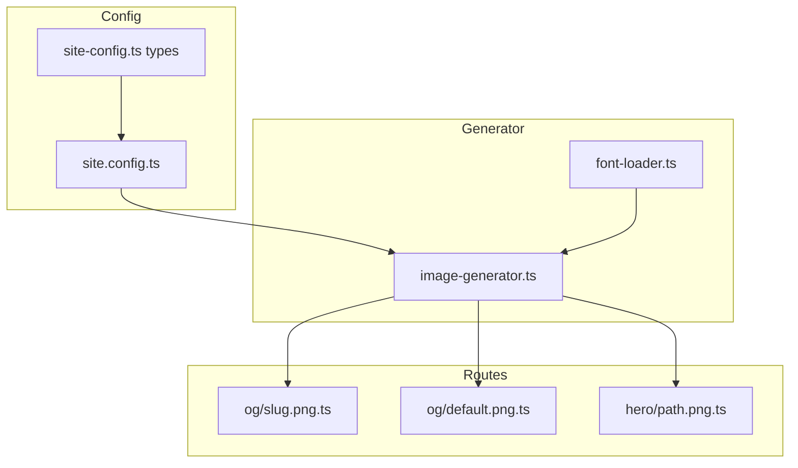

# Technical Design: OG Image Optimization

## Overview

**Purpose**: 自動生成OG画像のファイルサイズを最適化し、SNS共有時のパフォーマンスを向上させる。

**Users**: サイト管理者がsite.configから圧縮設定をカスタマイズし、開発者は既存APIをそのまま使用可能。

**Impact**: 既存のOG画像生成システムの内部実装を変更し、WebPデフォルト出力と圧縮最適化を実現。

### Goals
- WebP形式をデフォルト出力とし、PNG比50%以上のファイルサイズ削減
- site.configからの圧縮パラメータカスタマイズ対応
- 既存API（generateOgImage, generateHeroImage, generateDefaultOgImage）の互換性維持

### Non-Goals
- URL構造の変更（`.png`拡張子を維持）
- 新しい画像フォーマット（AVIF等）のサポート
- ビルド時並列処理の最適化

## Architecture

### Existing Architecture Analysis

現在のOG画像生成パイプライン:
1. satori: JSXライクテンプレート → SVG生成
2. sharp: SVG → PNG変換（デフォルト設定、圧縮最適化なし）
3. APIルート: Buffer → HTTPレスポンス（Content-Type: image/png）

**変更対象**:
- `src/utils/og-image/image-generator.ts` - 出力フォーマット・圧縮設定
- `src/types/site-config.ts` - 圧縮設定型定義
- `src/pages/og/*.png.ts`, `src/pages/hero/*.png.ts` - Content-Typeヘッダー

### Architecture Pattern & Boundary Map



**Architecture Integration**:
- Selected pattern: 既存パイプライン拡張（設定注入パターン）
- Domain boundaries: 設定層（Config）→ 生成層（Generator）→ 配信層（Routes）
- Existing patterns preserved: siteConfig参照パターン、Buffer返却パターン
- New components rationale: CompressionConfig型の追加のみ（既存構造維持）
- Steering compliance: TypeScript strict mode、ユーティリティ機能別分割

### Technology Stack

| Layer | Choice / Version | Role in Feature | Notes |
|-------|------------------|-----------------|-------|
| Runtime | Node.js | ビルド時画像処理 | 既存 |
| Image Processing | sharp (既存) | WebP/PNG変換・圧縮 | 追加依存なし |
| Config | site.config.ts | 圧縮設定管理 | 既存構造拡張 |

## Requirements Traceability

| Requirement | Summary | Components | Interfaces | Flows |
|-------------|---------|------------|------------|-------|
| 1.1 | WebPデフォルト出力 | ImageGenerator | generateImage() | 画像生成フロー |
| 1.2 | 品質維持 | ImageGenerator | quality設定 | - |
| 1.3 | ビルド時間制約 | ImageGenerator | effort設定 | - |
| 2.1 | WebPデフォルト | ImageGenerator, Config | OgImageConfig | - |
| 2.2 | PNG選択対応 | ImageGenerator, Config | format設定 | - |
| 2.3 | Content-Type設定 | Routes | HTTP Response | レスポンス生成 |
| 2.4 | ファイル拡張子 | Routes | - | URL維持 |
| 2.5 | 配信パターン対応 | ImageGenerator, Routes | - | 両パターン |
| 3.1-3.4 | 圧縮設定 | Config, ImageGenerator | CompressionConfig | - |
| 4.1-4.4 | API互換性 | ImageGenerator | 既存シグネチャ | - |
| 5.1-5.3 | サイズ削減・SNS対応 | ImageGenerator | - | - |

## Components and Interfaces

| Component | Domain/Layer | Intent | Req Coverage | Key Dependencies | Contracts |
|-----------|--------------|--------|--------------|------------------|-----------|
| CompressionConfig | Config | 圧縮設定型定義 | 3.1-3.4 | - | Type Definition |
| OgImageConfig拡張 | Config | 設定スキーマ拡張 | 2.1, 2.2, 3.1-3.4 | CompressionConfig (P0) | Type Definition |
| ImageGenerator | Generator | 画像生成・圧縮 | 1.1-1.3, 2.1-2.5, 4.1-4.4, 5.1-5.3 | siteConfig (P0), sharp (P0) | Service |
| OgRoute | Routes | OG画像配信 | 2.3-2.5 | ImageGenerator (P0) | API |

### Config Layer

#### CompressionConfig

| Field | Detail |
|-------|--------|
| Intent | OG画像の圧縮パラメータを定義する型 |
| Requirements | 3.1, 3.2, 3.3, 3.4 |

**Responsibilities & Constraints**
- WebP/PNG両形式の圧縮パラメータを型安全に定義
- デフォルト値はImageGenerator側で適用

**Contracts**: Type Definition

##### Type Definition

```typescript
/** 出力フォーマット */
type OgImageFormat = 'webp' | 'png';

/** 圧縮設定 */
interface OgImageCompressionConfig {
  /** 出力フォーマット（デフォルト: 'webp'） */
  format?: OgImageFormat;

  /** WebP品質 0-100（デフォルト: 80） */
  webpQuality?: number;

  /** PNG圧縮レベル 0-9（デフォルト: 9） */
  pngCompressionLevel?: number;
}
```

#### OgImageConfig拡張

| Field | Detail |
|-------|--------|
| Intent | 既存OgImageConfig型にcompression設定を追加 |
| Requirements | 2.1, 2.2, 3.1-3.4 |

**Contracts**: Type Definition

##### Type Definition

```typescript
interface OgImageConfig {
  /** ライトモード用背景画像パス */
  lightBackground?: string;

  /** ダークモード用背景画像パス */
  darkBackground?: string;

  /** 圧縮設定（オプション） */
  compression?: OgImageCompressionConfig;
}
```

**Implementation Notes**
- 既存のlightBackground/darkBackgroundプロパティは維持
- compression未設定時はImageGeneratorがデフォルト値を適用

### Generator Layer

#### ImageGenerator

| Field | Detail |
|-------|--------|
| Intent | OG/Hero画像の生成・圧縮処理 |
| Requirements | 1.1-1.3, 2.1-2.5, 4.1-4.4, 5.1-5.3 |

**Responsibilities & Constraints**
- siteConfig.ogImage.compressionから設定を読み取り
- sharpを使用してWebP/PNG変換・圧縮
- 既存関数シグネチャ（引数・戻り値）の維持

**Dependencies**
- Inbound: OgRoute, HeroRoute, DefaultRoute — 画像生成呼び出し (P0)
- External: sharp — 画像処理 (P0)
- External: siteConfig — 圧縮設定 (P0)

**Contracts**: Service

##### Service Interface

```typescript
/** 既存シグネチャ維持 - 変更なし */
interface OgImageOptions {
  title: string;
  slug: string;
  width?: number;
  height?: number;
}

interface HeroImageOptions {
  title: string;
  slug: string;
  theme: 'light' | 'dark';
  width?: number;
  height?: number;
}

/** 画像生成結果（内部用拡張） */
interface ImageResult {
  buffer: Buffer;
  contentType: 'image/webp' | 'image/png';
  format: 'webp' | 'png';
}

/** 公開API - シグネチャ維持 */
function generateOgImage(options: OgImageOptions): Promise<Buffer>;
function generateHeroImage(options: HeroImageOptions): Promise<Buffer>;
function generateDefaultOgImage(): Promise<Buffer>;

/** 新規追加 - Content-Type取得用 */
function getOgImageContentType(): 'image/webp' | 'image/png';
function getOgImageFormat(): 'webp' | 'png';
```

- Preconditions: titleは空文字列でないこと
- Postconditions: 指定フォーマットで圧縮されたBuffer返却
- Invariants: 出力解像度は変更なし（OG: 1200×630、Hero: 1020×510）

**Implementation Notes**
- Integration: siteConfig.ogImage?.compression ?? デフォルト値
- Validation: quality/compressionLevel範囲チェック（範囲外はclamp）
- Risks: sharp WebP変換でSVG内の一部要素が非対応の可能性（低リスク）

### Routes Layer

#### OgRoute / HeroRoute / DefaultRoute

| Field | Detail |
|-------|--------|
| Intent | 生成画像のHTTPレスポンス配信 |
| Requirements | 2.3, 2.4, 2.5 |

**Responsibilities & Constraints**
- ImageGeneratorからBuffer取得
- Content-Typeヘッダーを動的に設定
- Cache-Controlヘッダー維持

**Dependencies**
- Inbound: ブラウザ/SNSクローラー — HTTP GET (P0)
- Outbound: ImageGenerator — 画像生成 (P0)

**Contracts**: API

##### API Contract

| Method | Endpoint | Response | Content-Type | Errors |
|--------|----------|----------|--------------|--------|
| GET | /og/[slug].png | Buffer | image/webp or image/png | 500 |
| GET | /og/default.png | Buffer | image/webp or image/png | 500 |
| GET | /hero/[path].png | Buffer | image/webp or image/png | 500 |

**Implementation Notes**
- Integration: `getOgImageContentType()`で動的にContent-Type取得
- URL拡張子（.png）は維持、Content-Typeで実フォーマット通知

## Data Models

### Domain Model

変更なし。既存のOgImageOptions/HeroImageOptionsを維持。

### Logical Data Model

**OgImageCompressionConfig構造**:
```
OgImageConfig
├── lightBackground: string?
├── darkBackground: string?
└── compression: OgImageCompressionConfig?
    ├── format: 'webp' | 'png' (default: 'webp')
    ├── webpQuality: number 0-100 (default: 80)
    └── pngCompressionLevel: number 0-9 (default: 9)
```

## Error Handling

### Error Strategy
- 圧縮設定の範囲外値: clamp処理（警告ログ出力）
- sharp変換エラー: 既存のcatch処理で500エラー返却

### Error Categories and Responses
**User Errors**: 設定値範囲外 → clamp処理で自動修正
**System Errors**: sharp処理失敗 → 500エラー（既存動作維持）

## Testing Strategy

### Unit Tests
- `getOgImageContentType()`: format設定に応じた正しいContent-Type返却
- `getOgImageFormat()`: format設定に応じた正しいformat返却
- 圧縮設定デフォルト値適用: compression未設定時のデフォルト動作
- 圧縮設定範囲clamp: 範囲外値のclamp処理

### Integration Tests
- WebP出力: generateOgImage → WebP Buffer生成確認
- PNG出力: format='png'設定時のPNG Buffer生成確認
- APIルートContent-Type: 実際のHTTPレスポンスヘッダー確認

### E2E Tests
- ビルド後OG画像サイズ: 現行比50%以上削減確認
- SNS互換性: Twitter Card Validatorでの表示確認（手動）

## Performance & Scalability

**Target metrics**:
- WebP出力: 現行PNG比50%以上のサイズ削減
- PNG圧縮最適化: 現行比30%以上のサイズ削減
- ビルド時間: 1画像あたり+100ms以内

**Measurement**:
- ビルド前後のdist/og/ファイルサイズ比較
- `npm run build`実行時間計測
