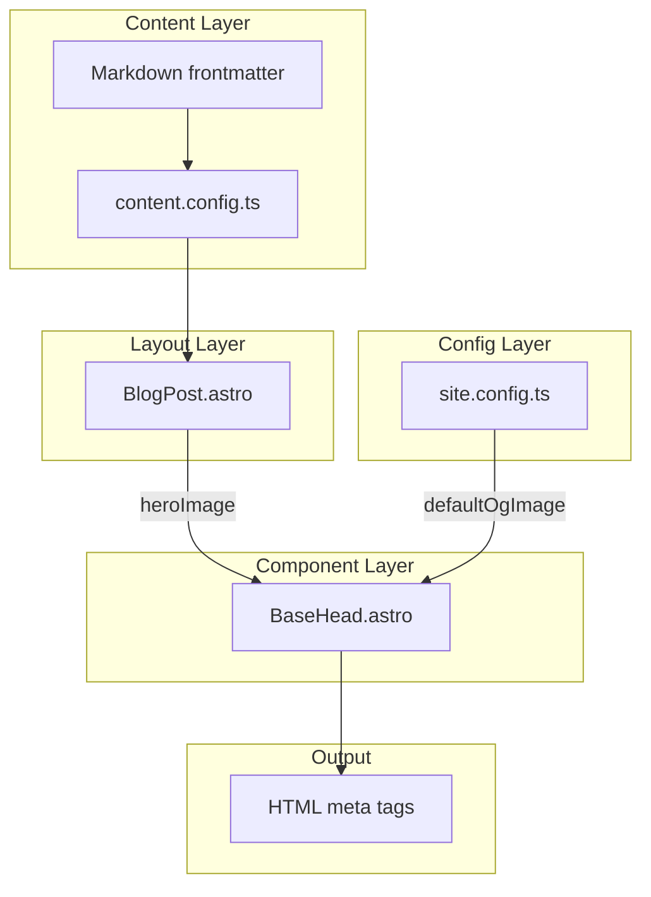
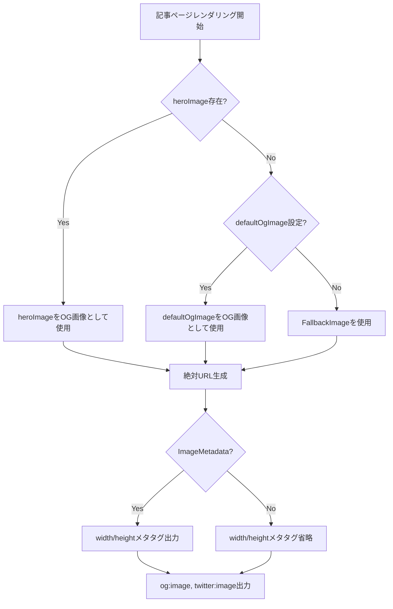
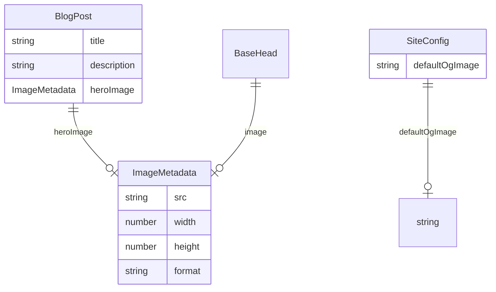

# Design Document: OG画像対応

## Overview

**Purpose**: 本機能はブログ記事のSNS共有時に適切なOG画像（Open Graph画像）を表示することで、クリック率とユーザーエンゲージメントの向上を実現します。

**Users**: ブログ管理者およびコンテンツ作成者が、記事公開時にSNSプレビューの品質を確保するために利用します。

**Impact**: 既存のBaseHead.astroとBlogPost.astroを拡張し、heroImageをOGメタタグに反映。未設定時はサイト設定のデフォルトOG画像にフォールバックします。

### Goals
- 記事ページに`og:image`、`og:image:width/height`、`twitter:image`メタタグを自動出力
- heroImage → defaultOgImageの優先順位でOG画像を解決
- 主要SNSプラットフォーム（Facebook、Twitter/X、LinkedIn等）の仕様に準拠

### Non-Goals
- 動的OG画像生成（記事タイトルを含む画像の自動生成）は本Phase 1のスコープ外
- frontmatterへの専用`ogImage`フィールド追加は将来の拡張として保留
- OG画像の自動リサイズ・最適化処理

## Architecture

### Existing Architecture Analysis

現在のOG画像処理アーキテクチャ:

1. **BaseHead.astro**: `og:image`と`twitter:image`メタタグを出力（Props経由で画像受け取り）
2. **BlogPost.astro**: 記事レイアウトコンポーネント（heroImageを保持するがBaseHeadに渡していない）
3. **site.config.ts**: `seo.defaultOgImage`でデフォルトパスを定義（未使用状態）
4. **content.config.ts**: `heroImage: image().optional()`でスキーマ定義済み

**技術的負債**:
- BlogPost.astroからBaseHeadへのheroImage受け渡しが欠落
- siteConfig.seo.defaultOgImageがBaseHeadで未使用
- `og:image:width/height`メタタグが未実装

### Architecture Pattern & Boundary Map



**Architecture Integration**:
- **Selected pattern**: コンポーネント拡張パターン（既存構造を維持しながら機能追加）
- **Domain boundaries**: Content → Layout → Component の単方向データフロー維持
- **Existing patterns preserved**: AstroのProps受け渡し、ImageMetadata型の活用
- **New components rationale**: 新規コンポーネント不要、既存コンポーネントの修正のみ
- **Steering compliance**: TypeScript strict mode、相対パスインポートを維持

### Technology Stack

| Layer | Choice / Version | Role in Feature | Notes |
|-------|------------------|-----------------|-------|
| Frontend | Astro v5 | 静的サイト生成、メタタグ出力 | 既存 |
| Data | Astro Content Collections | heroImageスキーマ | 既存、変更なし |
| Config | TypeScript | siteConfig型定義 | 既存 |

## System Flows

### OG画像解決フロー



**Key Decisions**:
- heroImage優先、defaultOgImageフォールバック
- ImageMetadata型の場合のみwidth/heightを出力（静的パスでは省略）

## Requirements Traceability

| Requirement | Summary | Components | Interfaces | Flows |
|-------------|---------|------------|------------|-------|
| 1.1 | og:imageタグ出力 | BaseHead.astro | Props.image | OG画像解決フロー |
| 1.2 | og:image:width/heightタグ出力 | BaseHead.astro | Props.image | OG画像解決フロー |
| 1.3 | twitter:imageタグ出力 | BaseHead.astro | Props.image | OG画像解決フロー |
| 2.1 | frontmatter ogImage使用 | — | — | — |
| 2.2 | デフォルトOG画像フォールバック | BaseHead.astro | siteConfig.seo | OG画像解決フロー |
| 2.3 | 相対パス解決 | BaseHead.astro | Astro.url | OG画像解決フロー |
| 3.1 | ogImage未指定時のheroImage使用 | BlogPost.astro, BaseHead.astro | Props.image | OG画像解決フロー |
| 3.2 | heroImage未指定時のdefaultOgImage使用 | BaseHead.astro | siteConfig.seo | OG画像解決フロー |
| 3.3 | siteConfigでのdefaultOgImage定義 | site.config.ts | SeoConfig | — |
| 4.1 | 1200x630px推奨サイズ | — | — | — |
| 4.2 | 絶対URL形式 | BaseHead.astro | Astro.url, Astro.site | OG画像解決フロー |
| 4.3 | PNG/JPG/WebP対応 | — | — | — |

**Note**:
- 2.1は将来の拡張として保留（本Phase 1ではheroImageを使用）
- 4.1, 4.3はコンテンツ作成者の責任（システムは任意サイズ・形式を受け入れ）
- 5.x（動的OG画像生成）はPhase 2として分離

## Components and Interfaces

| Component | Domain/Layer | Intent | Req Coverage | Key Dependencies | Contracts |
|-----------|--------------|--------|--------------|------------------|-----------|
| BaseHead.astro | Component | OGメタタグ出力 | 1.1-1.3, 2.2, 2.3, 3.2, 4.2 | siteConfig (P1) | Props |
| BlogPost.astro | Layout | 記事レイアウト、画像受け渡し | 3.1 | BaseHead (P0) | Props |
| site.config.ts | Config | サイト設定管理 | 3.3 | — | SeoConfig |

### Component Layer

#### BaseHead.astro

| Field | Detail |
|-------|--------|
| Intent | ページのhead要素を生成し、OGメタタグを含むSEO関連タグを出力 |
| Requirements | 1.1, 1.2, 1.3, 2.2, 2.3, 3.2, 4.2 |

**Responsibilities & Constraints**
- OGメタタグ（og:image, og:image:width, og:image:height, twitter:image）の出力
- 画像URLの絶対URL変換
- フォールバック画像の解決（Props.image → siteConfig.defaultOgImage → FallbackImage）

**Dependencies**
- Inbound: BlogPost.astro — image Props (P0)
- External: siteConfig — defaultOgImage (P1)
- External: Astro.url, Astro.site — URL解決 (P0)

**Contracts**: Props [x]

##### Props Interface

```typescript
interface BaseHeadProps {
  title: string;
  description: string;
  image?: ImageMetadata;
}
```

- **Preconditions**: title, descriptionは非空文字列
- **Postconditions**: og:image, twitter:imageメタタグが出力される
- **Invariants**: imageがImageMetadataの場合、width/heightも出力

##### 拡張後のメタタグ出力仕様

```html
<!-- Open Graph -->
<meta property="og:image" content="{絶対URL}" />
<meta property="og:image:width" content="{width}" />  <!-- ImageMetadata時のみ -->
<meta property="og:image:height" content="{height}" /> <!-- ImageMetadata時のみ -->

<!-- Twitter Card -->
<meta property="twitter:image" content="{絶対URL}" />
```

**Implementation Notes**
- Integration: siteConfigをインポートし、defaultOgImageへのフォールバックを実装
- Validation: image Propsが未定義の場合、siteConfig.seo.defaultOgImageを使用
- Risks: 静的パス（string型）とImageMetadata型の両方を扱う必要あり

### Layout Layer

#### BlogPost.astro

| Field | Detail |
|-------|--------|
| Intent | ブログ記事のレイアウトテンプレート |
| Requirements | 3.1 |

**Responsibilities & Constraints**
- heroImageをBaseHeadコンポーネントに受け渡す
- 既存の記事表示ロジックは変更しない

**Dependencies**
- Outbound: BaseHead.astro — image Props (P0)
- Inbound: Content Collection — heroImage (P0)

**Contracts**: Props [x]

##### 修正箇所

```astro
<!-- 修正前 -->
<BaseHead title={title} description={description} />

<!-- 修正後 -->
<BaseHead title={title} description={description} image={heroImage} />
```

**Implementation Notes**
- Integration: 1行の修正のみ
- Validation: heroImageがundefinedの場合、BaseHead内部でフォールバック処理
- Risks: なし（後方互換性維持）

### Config Layer

#### site.config.ts

| Field | Detail |
|-------|--------|
| Intent | サイト全体の設定を一元管理 |
| Requirements | 3.3 |

**Responsibilities & Constraints**
- seo.defaultOgImageでデフォルトOG画像パスを定義
- 既存の設定構造は変更しない

**Dependencies**
- Outbound: BaseHead.astro — defaultOgImage (P1)

**Contracts**: Config [x]

##### 既存設定（変更なし）

```typescript
// src/site.config.ts
seo: {
  defaultOgImage: '/og-image.png',
  // ...
}

// src/types/site-config.ts
interface SeoConfig {
  defaultOgImage?: string;
  // ...
}
```

**Implementation Notes**
- Integration: 既存設定をそのまま使用
- Validation: defaultOgImageが未設定の場合、FallbackImageを使用
- Risks: なし

## Data Models

### Domain Model

本機能で扱うデータモデルは既存のAstro Content Collectionsスキーマを使用。

**Entities**:
- `BlogPost`: heroImage（ImageMetadata型、optional）を持つ

**Value Objects**:
- `ImageMetadata`: Astro標準の画像メタデータ型（src, width, height, format）

### Logical Data Model



## Error Handling

### Error Strategy

本機能はビルド時に実行されるため、ランタイムエラーは発生しない。フォールバック戦略で欠損データを補完。

### Error Categories and Responses

**Missing Data Errors**:
- heroImage未指定 → defaultOgImageにフォールバック
- defaultOgImage未設定 → FallbackImage（組み込み）を使用
- FallbackImageも利用不可 → ビルドエラー（設定ミス）

**Type Mismatch**:
- 静的パス（string）の場合 → width/heightメタタグを省略

## Testing Strategy

### Unit Tests
- BaseHead.astroのOGメタタグ出力検証
- heroImage存在時のメタタグ内容確認
- defaultOgImageフォールバック動作確認
- width/height出力条件の検証

### Integration Tests
- BlogPost.astro経由のOGメタタグ出力確認
- 実際の記事ページでのメタタグ検証

### E2E Tests
- ビルド後のHTMLファイルでog:imageメタタグ存在確認
- SNSデバッガー（Facebook、Twitter Card Validator）での検証手順をドキュメント化

## Phase 2: 動的OG画像生成（将来の拡張）

本Phase 1完了後、Requirement 5の実装を検討する場合の方針:

### 調査項目
- satori + resvg または @vercel/og の評価
- 日本語フォント（Noto Sans JP）のサブセット対応
- Astroエンドポイントでのオンデマンド生成 vs ビルド時生成

### 前提条件
- Phase 1（Req 1-4）の完了
- 動的生成の必要性についてのユーザー確認
- パフォーマンスとビルド時間への影響評価

詳細は`research.md`を参照。
