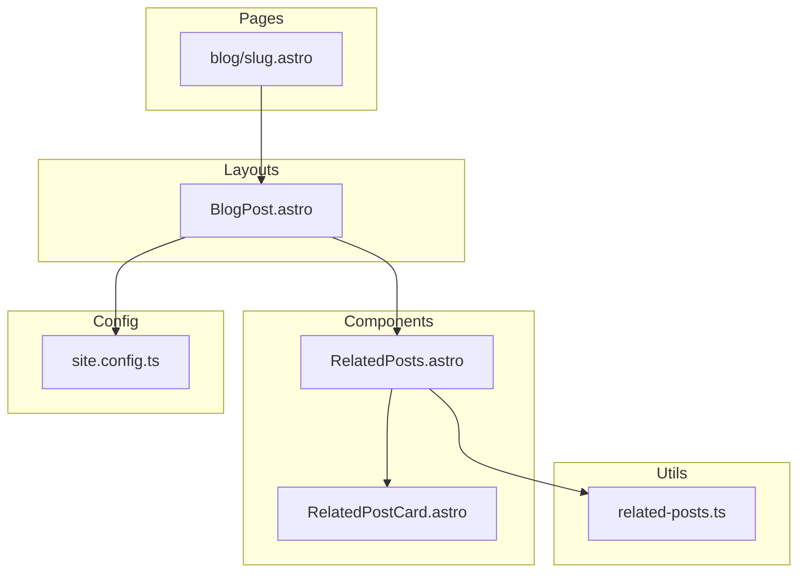

# Design Document: Related Posts

## Overview

**Purpose**: ブログ記事ページの下部に、タグの共通性に基づいて関連記事を表示する機能を提供する。

**Users**: ブログ読者が興味のある関連コンテンツを発見しやすくなる。

**Impact**: 既存の `BlogPost.astro` レイアウトに新しいセクションを追加。`site.config.features.relatedPosts` フラグで機能の有効/無効を制御。

### Goals
- タグベースで関連記事を自動判定・表示
- 既存のスタイルシステムとの一貫性維持
- ビルド時（SSG）に計算し、クライアントJSなし

### Non-Goals
- TF-IDFや機械学習ベースの高度なレコメンデーション
- 関連記事の手動指定機能
- ページネーション（最大5件固定）

## Architecture

### Existing Architecture Analysis

既存の記事表示フロー:
1. `src/pages/blog/[...slug].astro` で `getCollection` により記事取得
2. `BlogPost.astro` レイアウトに記事データを渡す
3. レイアウト内で `Comments` コンポーネントを表示

**統合ポイント**: `Comments` コンポーネントの直前に `RelatedPosts` セクションを挿入。

### Architecture Pattern & Boundary Map



**Architecture Integration**:
- Selected pattern: ユーティリティ関数 + Astroコンポーネント分離
- Domain boundaries: ロジック（utils）とUI（components）を分離
- Existing patterns preserved: `getCollection` 使用、CSS変数活用
- New components rationale: `RelatedPosts`（セクション表示）、`RelatedPostCard`（カード表示）、ユーティリティ関数（スコアリングロジック）
- Steering compliance: TypeScript strict mode、プラグイン独立性

### Technology Stack

| Layer | Choice / Version | Role in Feature | Notes |
|-------|------------------|-----------------|-------|
| Frontend | Astro v5 コンポーネント | UI表示 | 既存フレームワーク使用 |
| Data | Astro Content Collections | 記事データ取得 | `getCollection` API |
| Styling | CSS Variables | テーマ対応 | 既存変数を再利用 |

## Requirements Traceability

| Requirement | Summary | Components | Interfaces | Flows |
|-------------|---------|------------|------------|-------|
| 1.1 | 最大5件表示 | RelatedPosts | getRelatedPosts | - |
| 1.2 | 0件時非表示 | RelatedPosts | - | - |
| 1.3 | フラグ制御 | BlogPost | - | - |
| 1.4 | 自記事除外 | - | getRelatedPosts | - |
| 2.1 | タグスコア計算 | - | getRelatedPosts | - |
| 2.2 | 日付ソート | - | getRelatedPosts | - |
| 2.3 | タグなし除外 | - | getRelatedPosts | - |
| 2.4 | 共通タグ1+条件 | - | getRelatedPosts | - |
| 3.1 | タイトル・日付・説明表示 | RelatedPostCard | RelatedPostCardProps | - |
| 3.2 | 画像表示 | RelatedPostCard | RelatedPostCardProps | - |
| 3.3 | ダークモード対応 | RelatedPostCard | - | - |
| 3.4 | レスポンシブ | RelatedPosts | - | - |
| 3.5 | クリック遷移 | RelatedPostCard | - | - |
| 4.1 | SSG実行 | RelatedPosts, BlogPost | - | - |
| 4.2 | クライアントJSなし | RelatedPosts, RelatedPostCard | - | - |

## Components and Interfaces

| Component | Domain/Layer | Intent | Req Coverage | Key Dependencies | Contracts |
|-----------|--------------|--------|--------------|------------------|-----------|
| getRelatedPosts | Utils | 関連記事のスコアリングと取得 | 1.1, 1.4, 2.1-2.4 | Content Collections (P0) | Service |
| RelatedPosts | UI/Components | 関連記事セクションの表示 | 1.1, 1.2, 3.4, 4.1, 4.2 | getRelatedPosts (P0), RelatedPostCard (P0) | State |
| RelatedPostCard | UI/Components | 個別記事カードの表示 | 3.1-3.3, 3.5 | FormattedDate (P1) | State |
| BlogPost (修正) | UI/Layouts | フラグに基づくセクション表示制御 | 1.3 | RelatedPosts (P1) | - |

### Utils Layer

#### getRelatedPosts

| Field | Detail |
|-------|--------|
| Intent | 現在の記事に対する関連記事をスコアリングして取得する |
| Requirements | 1.1, 1.4, 2.1, 2.2, 2.3, 2.4 |

**Responsibilities & Constraints**
- 共通タグ数によるスコアリング
- 同スコア時は公開日降順でソート
- 現在の記事自身を除外
- タグなし記事を除外
- 共通タグ0の記事を除外

**Dependencies**
- Inbound: RelatedPosts コンポーネント — 関連記事取得 (P0)
- External: Astro Content Collections — 記事データ (P0)

**Contracts**: Service [x]

##### Service Interface

```typescript
import type { CollectionEntry } from 'astro:content';

interface RelatedPost {
  /** 記事ID（slug） */
  id: string;
  /** 記事データ */
  data: CollectionEntry<'blog'>['data'];
  /** 関連スコア（共通タグ数） */
  score: number;
}

interface GetRelatedPostsOptions {
  /** 現在の記事ID */
  currentPostId: string;
  /** 現在の記事のタグ */
  currentTags: string[];
  /** 全記事リスト */
  allPosts: CollectionEntry<'blog'>[];
  /** 取得する最大件数（デフォルト: 5） */
  limit?: number;
}

/**
 * 関連記事を取得する
 * @returns スコア順にソートされた関連記事リスト
 */
function getRelatedPosts(options: GetRelatedPostsOptions): RelatedPost[];
```

- Preconditions: `currentTags` は配列（空配列も許可）、`allPosts` は有効な記事リスト
- Postconditions: 戻り値は `limit` 以下の件数、スコア降順・日付降順でソート済み
- Invariants: 現在の記事は結果に含まれない

**Implementation Notes**
- スコア計算: `currentTags` と記事の `tags` の共通要素数
- ソート優先順位: 1) スコア降順 2) 公開日降順

### Components Layer

#### RelatedPosts

| Field | Detail |
|-------|--------|
| Intent | 関連記事セクション全体を表示する |
| Requirements | 1.1, 1.2, 3.4, 4.1, 4.2 |

**Responsibilities & Constraints**
- 関連記事が0件の場合はセクション全体を非表示
- レスポンシブグリッドレイアウト（モバイル1列、デスクトップ2-3列）
- クライアントJavaScriptを使用しない

**Dependencies**
- Inbound: BlogPost レイアウト — セクション表示 (P0)
- Outbound: getRelatedPosts — 関連記事取得 (P0)
- Outbound: RelatedPostCard — カード表示 (P0)

**Contracts**: State [x]

##### State Management

```typescript
interface RelatedPostsProps {
  /** 現在の記事ID */
  currentPostId: string;
  /** 現在の記事のタグ */
  currentTags: string[];
}
```

**Implementation Notes**
- `getCollection` でビルド時に全記事を取得
- CSS Grid でレスポンシブレイアウト実装
- セクションタイトルは `t()` で国際化対応

#### RelatedPostCard

| Field | Detail |
|-------|--------|
| Intent | 個別の関連記事カードを表示する |
| Requirements | 3.1, 3.2, 3.3, 3.5 |

**Responsibilities & Constraints**
- タイトル、公開日、説明文（オプション）を表示
- アイキャッチ画像（オプション）を表示
- ダークモード対応
- カード全体がクリック可能なリンク

**Dependencies**
- Inbound: RelatedPosts — カード表示 (P0)
- Outbound: FormattedDate — 日付フォーマット (P1)

**Contracts**: State [x]

##### State Management

```typescript
import type { CollectionEntry } from 'astro:content';

interface RelatedPostCardProps {
  /** 記事ID（リンク生成用） */
  id: string;
  /** 記事タイトル */
  title: string;
  /** 公開日 */
  published: Date;
  /** 説明文（オプション） */
  description?: string;
  /** アイキャッチ画像（オプション） */
  image?: ImageMetadata;
}
```

**Implementation Notes**
- `<a>` タグでカード全体をラップ
- 画像は `Image` コンポーネントで最適化
- ダークモードは `html.dark` セレクタで対応

### Layouts Layer (修正)

#### BlogPost (修正)

| Field | Detail |
|-------|--------|
| Intent | `features.relatedPosts` フラグに基づき関連記事セクションを表示制御 |
| Requirements | 1.3 |

**Implementation Notes**
- `Comments` コンポーネントの直前に `RelatedPosts` を配置
- `features.relatedPosts && tags && tags.length > 0` 条件で表示制御
- `RelatedPosts` に `currentPostId` と `currentTags` を渡す

## Data Models

### Domain Model

**RelatedPost**: 関連記事を表すValue Object
- `id`: 記事スラッグ（識別子）
- `data`: 記事のフロントマター（既存スキーマ）
- `score`: 関連スコア（一時的な計算値）

**スコアリングルール**:
- 共通タグ1つにつき+1ポイント
- スコア0の記事は除外
- 同スコアは公開日の新しい順

## Error Handling

### Error Strategy

この機能はビルド時に実行されるため、ランタイムエラーは発生しない。

### Error Categories and Responses

**データ不整合**:
- タグが未定義の場合 → 空配列として扱う（スキーマのデフォルト値）
- 画像が未定義の場合 → プレースホルダー非表示

## Testing Strategy

### Unit Tests
- `getRelatedPosts`: スコアリングロジックの正確性
- `getRelatedPosts`: ソート順序（スコア降順、日付降順）
- `getRelatedPosts`: 自記事除外、タグなし除外

### Integration Tests
- `RelatedPosts`: 関連記事0件時の非表示確認
- `RelatedPosts`: `features.relatedPosts: false` 時の非表示確認

### E2E/UI Tests
- 記事ページで関連記事セクションが表示される
- 関連記事カードのリンクが正しく動作する
- ダークモード切り替えでスタイルが適用される
