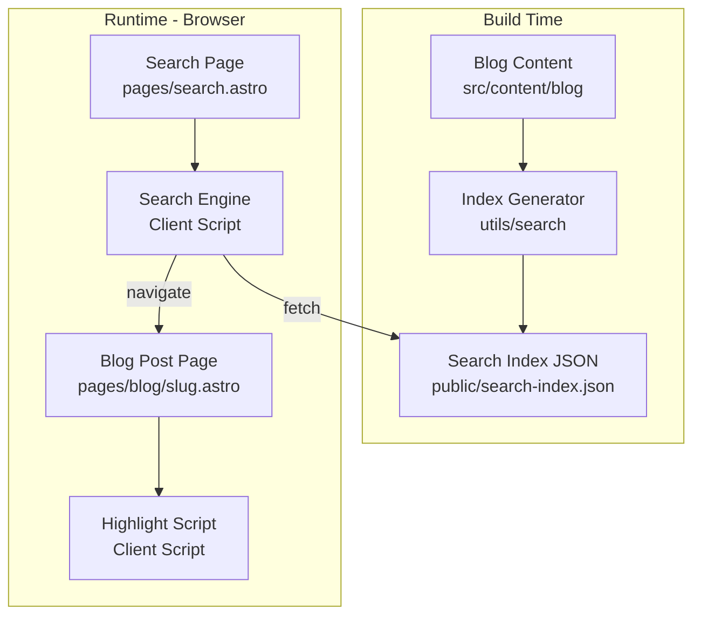
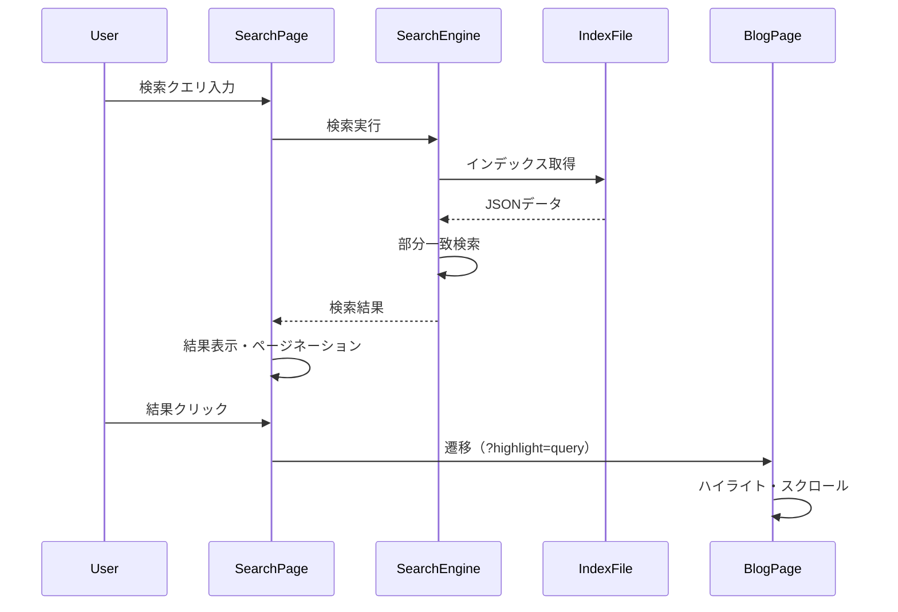
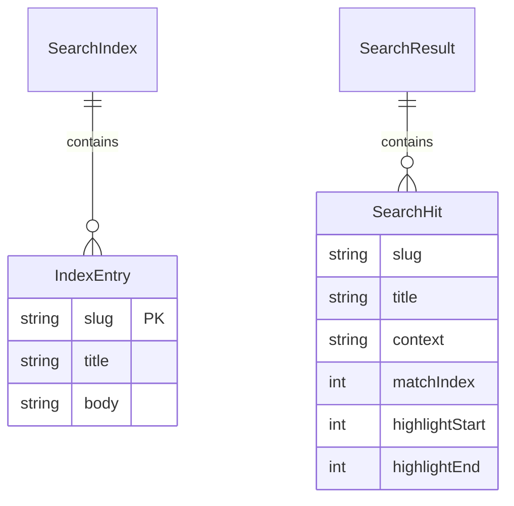

# Design Document: Search Feature

## Overview

**Purpose**: ブログサイトに全文検索機能を提供し、訪問者が記事コンテンツを検索語句で探索できるようにする。

**Users**: サイト訪問者がブログ記事から特定の情報を素早く見つけるために使用する。

**Impact**: 既存の静的サイト構成にクライアントサイド検索を追加。ビルドプロセスで検索インデックスを生成し、検索ページと記事ページにクライアントスクリプトを追加する。

### Goals
- 部分一致検索によるブログ記事の全文検索
- 検索ヒット箇所のコンテキスト表示とハイライト
- 検索結果クリック時の該当箇所への自動スクロール
- 既存UIコンポーネント（Pagination）との統合

### Non-Goals
- 高度な検索機能（フレーズ検索、AND/OR演算子、ファジーマッチ）
- 外部検索サービスとの連携
- 検索履歴やサジェスト機能
- リアルタイムインデックス更新（ビルド時のみ）

## Architecture

### Architecture Pattern & Boundary Map



**Architecture Integration**:
- **Selected pattern**: ビルド時インデックス生成 + クライアントサイド検索
- **Domain boundaries**: 検索ロジック (`utils/search/`) とUIコンポーネント (`components/`) を分離
- **Existing patterns preserved**: Astroページ構造、i18nシステム、Paginationコンポーネント
- **New components rationale**: 検索専用ユーティリティと検索ページを追加
- **Steering compliance**: TypeScript strict mode、機能別ディレクトリ構造を維持

### Technology Stack

| Layer | Choice / Version | Role in Feature | Notes |
|-------|------------------|-----------------|-------|
| Frontend | Astro v5 | 検索ページ、記事ページの静的生成 | 既存スタック |
| Client Script | TypeScript | 検索実行、ハイライト処理 | ブラウザで実行 |
| Data | JSON | 検索インデックスファイル | `public/search-index.json` |
| Infrastructure | 静的ホスティング | インデックスファイルの配信 | 既存インフラ |

## System Flows

### 検索実行フロー



**Key Decisions**:
- インデックスは初回検索時にfetchし、以降はメモリにキャッシュ
- ページネーションはクライアントサイドで処理（URLクエリパラメータで状態管理）

## Requirements Traceability

| Requirement | Summary | Components | Interfaces | Flows |
|-------------|---------|------------|------------|-------|
| 1.1, 1.2, 1.3, 1.4 | 検索ページの提供 | SearchPage | - | - |
| 2.1, 2.2, 2.3, 2.4 | 部分一致検索 | SearchEngine, IndexGenerator | SearchIndex | 検索実行フロー |
| 3.1, 3.2, 3.3, 3.4 | コンテキスト表示 | SearchResultItem | SearchHit | 検索実行フロー |
| 4.1, 4.2, 4.3 | 該当箇所ナビゲーション | HighlightScript | - | 検索実行フロー |
| 5.1, 5.2, 5.3, 5.4, 5.5 | ページネーション | SearchPagination | - | - |
| 6.1, 6.2 | 検索結果なし処理 | SearchPage | - | - |

## Components and Interfaces

| Component | Domain/Layer | Intent | Req Coverage | Key Dependencies | Contracts |
|-----------|--------------|--------|--------------|------------------|-----------|
| IndexGenerator | Build/Utils | ビルド時にJSONインデックス生成 | 2.1, 2.4 | getCollection (P0) | - |
| SearchPage | UI/Pages | 検索UI提供 | 1.1-1.4, 6.1-6.2 | SearchEngine (P0), Pagination (P1) | - |
| SearchEngine | Client/Utils | 検索ロジック実行 | 2.1-2.3, 3.1-3.4 | SearchIndex (P0) | SearchResult |
| SearchResultItem | UI/Components | 検索結果1件の表示 | 3.1-3.4 | - | - |
| SearchPagination | UI/Components | 検索結果のページ分割 | 5.1-5.5 | Pagination (P0) | - |
| HighlightScript | Client/Script | 記事内ハイライト・スクロール | 4.1-4.3 | - | - |

### Build / Utils

#### IndexGenerator

| Field | Detail |
|-------|--------|
| Intent | ビルド時に全記事からプレーンテキストを抽出し、検索インデックスJSONを生成 |
| Requirements | 2.1, 2.4 |

**Responsibilities & Constraints**
- `src/content/blog/` の全記事から検索可能なテキストを抽出
- draft記事は除外
- Markdown記法を除去してプレーンテキスト化
- `public/search-index.json` として出力

**Dependencies**
- Inbound: Astroビルドプロセス — ビルド時に実行 (P0)
- External: `astro:content` — 記事コレクション取得 (P0)

**Contracts**: Service [x]

##### Service Interface
```typescript
interface SearchIndexEntry {
  slug: string;
  title: string;
  body: string; // プレーンテキスト化された本文
}

interface IndexGeneratorService {
  generateIndex(): Promise<SearchIndexEntry[]>;
  stripMarkdown(content: string): string;
}
```
- Preconditions: ブログ記事が `src/content/blog/` に存在
- Postconditions: `public/search-index.json` が生成される
- Invariants: draft記事は含まれない

**Implementation Notes**
- Integration: Astroビルドフック (`astro.config.mjs`) で実行
- Validation: 空の本文は除外
- Risks: 大量記事時のビルド時間増加

---

### Client / Utils

#### SearchEngine

| Field | Detail |
|-------|--------|
| Intent | クライアントで検索クエリを実行し、ヒット結果を返す |
| Requirements | 2.1, 2.2, 2.3, 3.1, 3.2, 3.3, 3.4 |

**Responsibilities & Constraints**
- 検索インデックスのfetchとキャッシュ
- 部分一致検索（大文字小文字区別なし）
- ヒット箇所の周辺テキスト（コンテキスト）抽出
- 同一記事内の複数ヒットを個別結果として返却

**Dependencies**
- External: search-index.json — 検索データ (P0)

**Contracts**: Service [x] / State [x]

##### Service Interface
```typescript
interface SearchHit {
  slug: string;
  title: string;
  context: string;      // ヒット箇所の周辺テキスト
  matchIndex: number;   // 本文中でのヒット位置
  highlightStart: number; // context内でのハイライト開始位置
  highlightEnd: number;   // context内でのハイライト終了位置
}

interface SearchResult {
  query: string;
  hits: SearchHit[];
  totalHits: number;
}

interface SearchEngineService {
  search(query: string): Promise<SearchResult>;
  loadIndex(): Promise<void>;
}
```
- Preconditions: `query` が空文字でない
- Postconditions: マッチするすべてのヒット箇所を返す
- Invariants: 同一記事の複数ヒットは個別のSearchHitとして返る

##### State Management
- State model: インデックスデータをメモリにキャッシュ
- Persistence: sessionStorage（オプション、初期は不使用）
- Concurrency strategy: 単一fetchリクエスト

**Implementation Notes**
- Integration: SearchPageから呼び出し
- Validation: 空クエリは即座に空結果を返す
- Risks: インデックスfetch失敗時のエラーハンドリング

---

### UI / Pages

#### SearchPage

| Field | Detail |
|-------|--------|
| Intent | 検索入力フォームと検索結果一覧を表示するページ |
| Requirements | 1.1, 1.2, 1.3, 1.4, 6.1, 6.2 |

**Responsibilities & Constraints**
- `/search/` パスで検索ページを提供
- URLクエリパラメータ `?q=検索語&page=1` で状態管理
- Header, Footer, Breadcrumb を含む標準レイアウト
- レスポンシブデザイン対応

**Dependencies**
- Inbound: ユーザー操作 — 検索クエリ入力 (P0)
- Outbound: SearchEngine — 検索実行 (P0)
- Outbound: SearchPagination — ページ分割表示 (P1)
- External: Header, Footer, Breadcrumb — 共通レイアウト (P1)

**Contracts**: State [x]

##### State Management
- State model: URL query parameters (`q`, `page`)
- Persistence: URLベース（ブックマーク可能）
- Concurrency strategy: 入力debounce（300ms）

**Implementation Notes**
- Integration: ナビゲーションへの検索リンク追加はオプション
- Validation: XSS対策としてクエリをエスケープ

---

### UI / Components

#### SearchResultItem

| Field | Detail |
|-------|--------|
| Intent | 1件の検索結果を表示（タイトル、コンテキスト、ハイライト） |
| Requirements | 3.1, 3.2, 3.3, 3.4 |

**Props Interface**
```typescript
interface SearchResultItemProps {
  slug: string;
  title: string;
  context: string;
  query: string;
  highlightStart: number;
  highlightEnd: number;
}
```

**Implementation Notes**
- リンク先: `/blog/{slug}/?highlight={query}`
- コンテキスト内のハイライトは `<mark>` タグで表現

---

#### SearchPagination

| Field | Detail |
|-------|--------|
| Intent | 検索結果のページネーション表示 |
| Requirements | 5.1, 5.2, 5.3, 5.4, 5.5 |

**Responsibilities & Constraints**
- 既存Paginationコンポーネントをラップ
- URLにクエリパラメータ `q` を維持

**Dependencies**
- Outbound: Pagination — ページナビゲーションUI (P0)

**Implementation Notes**
- `baseUrl` を `/search/?q={query}&page=` 形式で生成
- 既存Paginationのスタイルを継承

---

### Client / Script

#### HighlightScript

| Field | Detail |
|-------|--------|
| Intent | 記事ページで検索語句をハイライトし、該当箇所にスクロール |
| Requirements | 4.1, 4.2, 4.3 |

**Responsibilities & Constraints**
- URLクエリパラメータ `?highlight=` を読み取り
- 記事本文内で該当テキストを検索
- 最初のヒット箇所に `<mark>` タグを挿入
- `scrollIntoView()` で該当箇所にスクロール

**Dependencies**
- Inbound: URL query parameter — ハイライト対象語句 (P0)

**Implementation Notes**
- Integration: `BlogPost.astro` に `<script>` タグとして追加
- Validation: 空のhighlightパラメータは無視
- Risks: DOM操作によるパフォーマンス影響（長文記事）

## Data Models

### Domain Model



**Entities**:
- `IndexEntry`: 検索インデックスの1記事分のデータ
- `SearchHit`: 1つのヒット箇所を表す検索結果単位

**Invariants**:
- 1記事に複数ヒットがある場合、複数のSearchHitが生成される
- SearchHit.context は50-100文字程度のスニペット

### Data Contracts & Integration

**API Data Transfer**
- Request: なし（静的JSON）
- Response: `SearchIndexEntry[]`

**search-index.json Schema**
```json
[
  {
    "slug": "my-article",
    "title": "記事タイトル",
    "body": "プレーンテキスト化された本文..."
  }
]
```

## Error Handling

### Error Strategy
- ユーザーエラー: 空クエリは「検索語句を入力してください」メッセージ表示
- システムエラー: インデックスfetch失敗時は「検索を実行できませんでした」メッセージ

### Error Categories and Responses
- **User Errors (4xx)**: 空クエリ → 入力促進メッセージ
- **System Errors (5xx)**: fetch失敗 → エラーメッセージ + リトライボタン

### Monitoring
- コンソールログでfetchエラーを記録（開発時のデバッグ用）

## Testing Strategy

### Unit Tests
- `stripMarkdown`: Markdown記法除去の正確性
- `SearchEngine.search`: 部分一致検索ロジック
- コンテキスト抽出: 適切な長さのスニペット生成

### Integration Tests
- インデックス生成 → 検索実行 → 結果表示の一連のフロー
- ページネーションとクエリパラメータ維持

### E2E/UI Tests
- 検索フォーム入力 → 結果表示 → 記事遷移 → ハイライトスクロール
- 0件結果時のメッセージ表示
- レスポンシブレイアウト（モバイル/デスクトップ）

## i18n Integration

検索機能に必要な翻訳キーを `TranslationKeys` に追加:

```typescript
// 追加する翻訳キー
'search.title': string;           // 検索ページタイトル
'search.placeholder': string;     // 入力欄プレースホルダー
'search.button': string;          // 検索ボタン
'search.noResults': string;       // 0件メッセージ
'search.resultsCount': string;    // 件数表示
'search.enterQuery': string;      // 入力促進メッセージ
'breadcrumb.search': string;      // パンくず
```
