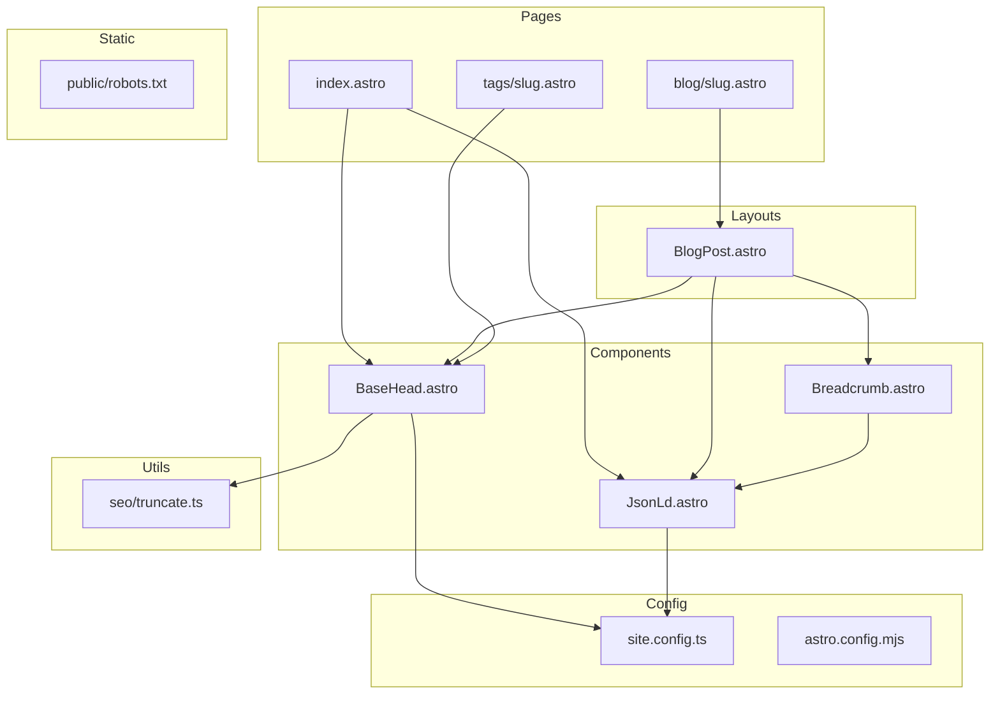

# Design Document: SEO Optimization

## Overview

**Purpose**: itzpapaブログサイトの検索エンジン可視性向上とリッチリザルト表示を実現するSEO最適化機能を提供する。

**Users**: サイト運営者（SEO設定）、検索エンジン（構造化データ解析）、SNSプラットフォーム（OGタグ解析）。

**Impact**: 既存の`BaseHead.astro`を拡張し、新規`JsonLd.astro`コンポーネントを追加。`public/robots.txt`を新規作成。

### Goals
- JSON-LD構造化データ（Article, WebSite, BreadcrumbList）の出力
- robots.txtによるクローラー制御
- メタタグ最適化（タイトル形式、記事用OGタグ）
- URL末尾スラッシュの統一

### Non-Goals
- 検索ボックス機能（`sitelinks searchbox`）の実装
- サイトマップの動的生成（既存`@astrojs/sitemap`で対応済み）
- パフォーマンス最適化（Req 4: 既存実装で充足）
- 内部リンク構造改善（Req 7: 既存実装で充足）

## Architecture

### Existing Architecture Analysis

現在のSEO関連実装:
- `BaseHead.astro`: canonical URL、Open Graph、Twitter Card、メタタグ、GA
- `Breadcrumb.astro`: セマンティックなパンくずナビ（`aria-current`対応）
- `site.config.ts`: サイト基本情報、OG画像設定
- `astro.config.mjs`: `@astrojs/sitemap`統合済み、`trailingSlash`未設定

**Technical Debt**: `trailingSlash`がデフォルト（`'ignore'`）のため、URL正規化が不完全。

### Architecture Pattern & Boundary Map



**Architecture Integration**:
- **Selected pattern**: ハイブリッドアプローチ（JSON-LDは新規分離、OGタグはBaseHead拡張）
- **Domain boundaries**: SEOユーティリティは`src/utils/seo/`に集約
- **Existing patterns preserved**: コンポーネントベースのhead管理、siteConfigからの設定取得
- **New components rationale**: JSON-LDの複雑なスキーマ構造を分離して可読性・テスト性向上
- **Steering compliance**: TypeScript strict mode、Astroコンポーネントパターン維持

### Technology Stack

| Layer | Choice / Version | Role in Feature | Notes |
|-------|------------------|-----------------|-------|
| Frontend | Astro v5 | 静的サイト生成、コンポーネント | 既存 |
| Data Format | JSON-LD | 構造化データ出力 | Google推奨形式 |
| Schema | Schema.org v29.4 | 構造化データ語彙 | Article, WebSite, BreadcrumbList |
| Config | TypeScript | 型安全な設定管理 | strict mode |

## Requirements Traceability

| Requirement | Summary | Components | Interfaces | Flows |
|-------------|---------|------------|------------|-------|
| 1.1 | robots.txt配置 | public/robots.txt | - | ビルド時コピー |
| 1.2 | sitemap参照 | public/robots.txt | - | - |
| 1.4 | テストページ除外 | public/robots.txt | - | - |
| 2.1 | Article JSON-LD | JsonLd.astro | JsonLdProps | 記事ページレンダリング |
| 2.2 | JSON-LD推奨プロパティ | JsonLd.astro | ArticleSchema | - |
| 2.3 | dateModifiedフォールバック | JsonLd.astro | - | - |
| 2.4 | WebSite JSON-LD | JsonLd.astro | WebSiteSchema | トップページレンダリング |
| 2.5 | BreadcrumbList JSON-LD | JsonLd.astro | BreadcrumbSchema | 記事ページレンダリング |
| 3.2 | タイトル形式 | BaseHead.astro | BaseHeadProps | - |
| 3.3 | 説明文切り詰め | seo/truncate.ts | truncateText | - |
| 3.4 | article:published_time | BaseHead.astro | BaseHeadProps | - |
| 3.5 | article:tag | BaseHead.astro | BaseHeadProps | - |
| 6.3 | 末尾スラッシュ統一 | astro.config.mjs | - | 設定変更 |

**Note**: Req 4（パフォーマンス）、Req 5（アクセシビリティ）、Req 7（内部リンク）は既存実装で充足済みのため設計対象外。

## Components and Interfaces

| Component | Domain/Layer | Intent | Req Coverage | Key Dependencies | Contracts |
|-----------|--------------|--------|--------------|------------------|-----------|
| JsonLd.astro | SEO/Components | 構造化データJSON-LD出力 | 2.1-2.5 | siteConfig (P0) | Service |
| BaseHead.astro | SEO/Components | メタタグ・OGタグ出力 | 3.2-3.5 | siteConfig (P0), truncate (P1) | Service |
| truncate.ts | SEO/Utils | テキスト切り詰め | 3.3 | - | Service |
| robots.txt | SEO/Static | クローラー制御 | 1.1-1.4 | - | - |
| astro.config.mjs | Config | Astro設定 | 6.3 | - | - |

### SEO Components

#### JsonLd.astro

| Field | Detail |
|-------|--------|
| Intent | ページタイプに応じたJSON-LD構造化データを`<script type="application/ld+json">`として出力 |
| Requirements | 2.1, 2.2, 2.3, 2.4, 2.5 |

**Responsibilities & Constraints**
- 3種類のスキーマタイプ（Article/BlogPosting, WebSite, BreadcrumbList）を条件分岐で出力
- すべてのURLは絶対URL形式で出力
- 日付はISO 8601形式

**Dependencies**
- Inbound: BlogPost.astro, index.astro — 構造化データ出力 (P0)
- Outbound: siteConfig — サイト情報取得 (P0)

**Contracts**: Service [x]

##### Service Interface
```typescript
interface JsonLdProps {
  type: 'article' | 'website' | 'breadcrumb';
  // Article用
  article?: {
    title: string;
    description: string;
    datePublished: Date;
    dateModified?: Date;
    image?: string;
    tags?: string[];
  };
  // BreadcrumbList用
  breadcrumbs?: Array<{
    name: string;
    url: string;
  }>;
}

// 出力スキーマ型定義
interface ArticleSchema {
  '@context': 'https://schema.org';
  '@type': 'BlogPosting';
  headline: string;
  description: string;
  datePublished: string;  // ISO 8601
  dateModified: string;   // ISO 8601
  author: {
    '@type': 'Person';
    name: string;
    url?: string;
  };
  image?: string;
  mainEntityOfPage: {
    '@type': 'WebPage';
    '@id': string;
  };
}

interface WebSiteSchema {
  '@context': 'https://schema.org';
  '@type': 'WebSite';
  name: string;
  url: string;
}

interface BreadcrumbSchema {
  '@context': 'https://schema.org';
  '@type': 'BreadcrumbList';
  itemListElement: Array<{
    '@type': 'ListItem';
    position: number;
    name: string;
    item: string;
  }>;
}
```

**Implementation Notes**
- Integration: `BlogPost.astro`の`<head>`内で`<BaseHead>`の後に配置
- Validation: Rich Results Testでの事前検証を推奨
- Risks: スキーマエラー時はリッチリザルト非表示（機能劣化のみ、サイト表示には影響なし）

#### BaseHead.astro（拡張）

| Field | Detail |
|-------|--------|
| Intent | 既存メタタグ出力に加え、タイトル形式変更と記事用OGタグを追加 |
| Requirements | 3.2, 3.3, 3.4, 3.5 |

**Responsibilities & Constraints**
- タイトルを「記事タイトル | サイト名」形式で出力（トップページは除外）
- 説明文を160文字で切り詰め
- 記事ページで`article:published_time`, `article:modified_time`, `article:tag`を出力

**Dependencies**
- Inbound: 全ページ — メタタグ出力 (P0)
- Outbound: siteConfig — サイト情報 (P0), truncate.ts — 説明文切り詰め (P1)

**Contracts**: Service [x]

##### Service Interface（拡張）
```typescript
interface BaseHeadProps {
  title: string;
  description: string;
  image?: ImageMetadata;
  // 新規追加
  isHomePage?: boolean;  // trueの場合タイトル形式変更なし
  article?: {
    publishedTime: Date;
    modifiedTime?: Date;
    tags?: string[];
  };
}
```

**Implementation Notes**
- Integration: 既存propsに後方互換性を維持しつつ`article`プロパティを追加
- Validation: `article`が渡された場合のみOGタグを出力
- Risks: 既存ページへの影響なし（オプショナルプロパティ）

### SEO Utilities

#### truncate.ts

| Field | Detail |
|-------|--------|
| Intent | テキストを指定文字数で切り詰め、省略記号を追加 |
| Requirements | 3.3 |

**Contracts**: Service [x]

##### Service Interface
```typescript
/**
 * テキストを指定文字数で切り詰める
 * @param text - 対象テキスト
 * @param maxLength - 最大文字数（デフォルト: 160）
 * @param suffix - 省略記号（デフォルト: '...'）
 * @returns 切り詰められたテキスト
 */
export function truncateText(
  text: string,
  maxLength?: number,
  suffix?: string
): string;
```

**Implementation Notes**
- Integration: BaseHead.astro、JsonLd.astroから呼び出し
- Validation: 空文字・null安全、サロゲートペア考慮
- Risks: 日本語文字数カウントの正確性（`[...text].length`使用）

### Static Files

#### public/robots.txt

| Field | Detail |
|-------|--------|
| Intent | 検索エンジンクローラーへのクロール指示 |
| Requirements | 1.1, 1.2, 1.4 |

**Contents**
```
User-agent: *
Allow: /
Disallow: /api/
Disallow: /test-

Sitemap: https://example.com/sitemap-index.xml
```

**Implementation Notes**
- Integration: `public/`に配置、ビルド時に自動コピー
- Validation: Google Search Consoleのrobots.txtテスターで検証
- Risks: 誤設定時に重要ページがインデックスから除外される可能性

### Configuration

#### astro.config.mjs（変更）

| Field | Detail |
|-------|--------|
| Intent | URL末尾スラッシュの統一 |
| Requirements | 6.3 |

**Changes**
```javascript
export default defineConfig({
  // 既存設定...
  trailingSlash: 'always',  // 新規追加
});
```

**Implementation Notes**
- Integration: 既存設定に1行追加
- Validation: 各ページURLとcanonical URLの一致確認
- Risks: 既存のリンクパターンとの整合性確認必要

## Data Models

### Domain Model

本機能はデータ永続化を伴わない。siteConfigからの設定読み込みとページpropsからのデータ変換のみ。

**Data Flow**:
1. ページコンポーネントがpropsを受け取る
2. JsonLd/BaseHeadコンポーネントがpropsをスキーマ/メタタグ形式に変換
3. HTMLとして出力

### Data Contracts & Integration

**JSON-LD出力形式**（Article例）:
```json
{
  "@context": "https://schema.org",
  "@type": "BlogPosting",
  "headline": "記事タイトル",
  "description": "記事の説明...",
  "datePublished": "2025-12-14T00:00:00Z",
  "dateModified": "2025-12-14T00:00:00Z",
  "author": {
    "@type": "Person",
    "name": "Author Name"
  },
  "image": "https://example.com/image.jpg",
  "mainEntityOfPage": {
    "@type": "WebPage",
    "@id": "https://example.com/blog/slug/"
  }
}
```

## Error Handling

### Error Strategy

JSON-LDおよびメタタグはサイト表示に必須ではないため、グレースフルデグラデーション方針を採用。

### Error Categories and Responses

**User Errors**: 該当なし（設定エラーはビルド時に検出）

**System Errors**:
- siteConfig未設定 → デフォルト値使用、ビルド警告
- 日付パースエラー → 現在日時をフォールバック

**Business Logic Errors**:
- 必須propsなし → JSON-LD出力スキップ（サイト表示は継続）

## Testing Strategy

### Unit Tests
- `truncateText`: 通常テキスト切り詰め、空文字処理、日本語文字数カウント、サロゲートペア処理

### Integration Tests
- JsonLd.astro: Article/WebSite/BreadcrumbList各スキーマの正常出力
- BaseHead.astro: タイトル形式、OGタグ出力、既存機能との互換性

### E2E/Validation Tests
- Rich Results Test: JSON-LDスキーマ検証
- Google Search Console: robots.txt検証、インデックス状況確認

## Optional Sections

### Security Considerations

- JSON-LDに含まれる情報は公開情報のみ（タイトル、日付、著者名）
- XSS対策: JSON.stringifyによる自動エスケープ

### Performance & Scalability

- JSON-LD出力は静的生成時に処理（ランタイムオーバーヘッドなし）
- 追加されるHTMLサイズ: 約500-1000バイト/ページ（許容範囲）
