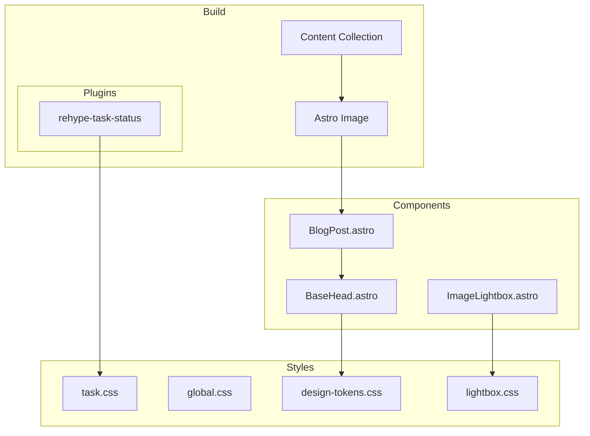

# Design Document: Site Performance Optimization

## Overview

**Purpose**: itzpapaブログサイトのCore Web Vitals改善とアクセシビリティ向上を実現し、Lighthouse Performance 90+、Accessibility 95+を達成する。

**Users**: サイト訪問者（一般ユーザー、スクリーンリーダー利用者）およびサイト運営者が、高速で利用しやすいブログ体験を得られる。

**Impact**: 既存のAstro SSG構成を維持しながら、画像配信最適化、CSS改善、アクセシビリティ修正を適用する。

### Goals

- LCPを5.6秒から2.5秒以下に改善
- Lighthouse Performanceスコアを79から90以上に向上
- Lighthouse Accessibilityスコアを94から95以上に向上
- 既存のデザイン・機能を維持

### Non-Goals

- サーバーサイド（Cloudflare）設定の変更
- 新機能の追加
- デザインの大幅な変更
- コンテンツの追加・変更

## Architecture

### Existing Architecture Analysis

**現在の構成**:
- Astro v5 SSG（静的サイト生成）
- Astro Imageコンポーネントによる画像最適化（WebP変換済み）
- Google Fonts（Noto Sans JP）- media="print"による遅延読み込み
- カスタムremark/rehypeプラグインによるObsidian記法対応

**維持するパターン**:
- コンテンツコレクション（`src/content/blog/`）
- コンポーネントベースのレイアウト構造
- OKLCHカラーシステム（design-tokens.css）
- ダークモード対応

### Architecture Pattern & Boundary Map



**Architecture Integration**:
- Selected pattern: 既存Astro SSGアーキテクチャの拡張
- Domain boundaries: Build層・Components層・Styles層の分離を維持
- Existing patterns preserved: Astro Imageによる最適化、CSSデザイントークン
- New components rationale: 新規コンポーネントは追加しない（既存コンポーネントの修正のみ）
- Steering compliance: TypeScript strict mode、機能ベースのディレクトリ構造を維持

### Technology Stack

| Layer | Choice / Version | Role in Feature | Notes |
|-------|------------------|-----------------|-------|
| Framework | Astro v5 | SSG、画像最適化 | 既存 |
| Styles | CSS (OKLCH) | デザイントークン、コントラスト改善 | 拡張 |
| Plugins | rehype | ARIA属性修正 | 修正 |

## Requirements Traceability

| Requirement | Summary | Components | Interfaces | Notes |
|-------------|---------|------------|------------|-------|
| 1.1 | LCP 2.5秒以下 | BaseHead, BlogPost | PreloadProps | 目標メトリクス |
| 1.2 | fetchpriority="high" | BlogPost | - | 実装済み |
| 1.3 | Preload追加 | BaseHead | PreloadProps | 新規実装 |
| 1.4 | WebP/AVIF配信 | Astro Image | - | 実装済み |
| 1.5 | 画像サイズ最適化 | - | - | 運用ガイドライン |
| 2.1 | クリティカルCSS | - | - | Astro自動処理 |
| 2.2 | Google Fonts最適化 | BaseHead | - | 実装済み |
| 3.1 | 未使用CSS削除 | Vite config | - | Astro自動処理 |
| 3.2 | CSS最小化 | Vite config | - | Astro自動処理 |
| 3.3 | フォントサブセット | - | - | 対応見送り |
| 4.1 | 画像width/height | Lightbox | LightboxCSS | CSS修正 |
| 4.2 | Lightbox寸法 | Lightbox, LightboxCSS | - | aspect-ratio追加 |
| 5.1 | コントラスト比AA | DesignTokens | - | セマンティックカラー追加 |
| 5.2 | time要素コントラスト | BlogPost, DesignTokens | - | 色変更 |
| 5.3 | em>strong コントラスト | GlobalCSS | - | 色変更 |
| 6.1 | ARIA禁止属性削除 | rehype-task-status | - | プラグイン修正 |
| 6.2 | sr-onlyテキスト | rehype-task-status, GlobalCSS | - | 新規実装 |
| 6.3 | role="listitem" | TagList | - | 実装済み |
| 7.1-7.3 | キャッシュ戦略 | - | - | Cloudflare既存設定 |
| 8.1-8.5 | パフォーマンス目標 | - | - | 検証フェーズ |

## Components and Interfaces

| Component | Domain/Layer | Intent | Req Coverage | Key Dependencies | Contracts |
|-----------|--------------|--------|--------------|------------------|-----------|
| BaseHead | Components | HTMLヘッダー生成 | 1.3, 2.2 | BlogPost (P0) | Props |
| BlogPost | Layouts | ブログ記事レイアウト | 1.1-1.4, 5.2 | BaseHead (P0) | Props |
| rehype-task-status | Plugins | タスクチェックボックス生成 | 6.1, 6.2 | - | Plugin API |
| design-tokens.css | Styles | カラー定義 | 5.1-5.3 | - | CSS Variables |
| global.css | Styles | グローバルスタイル | 6.2 | design-tokens (P0) | CSS Classes |
| lightbox.css | Styles | ライトボックススタイル | 4.1, 4.2 | - | CSS Classes |

### Components Layer

#### BaseHead.astro

| Field | Detail |
|-------|--------|
| Intent | HTMLヘッダー生成、preloadタグ追加 |
| Requirements | 1.3, 2.2 |

**Responsibilities & Constraints**
- ヒーロー画像のpreloadタグを生成
- 既存のGoogle Fonts最適化を維持
- propsで渡されたpreload情報を処理

**Dependencies**
- Inbound: BlogPost.astro — preload情報の提供 (P0)
- External: Google Fonts — フォント配信 (P2)

**Contracts**: Props [x]

##### Props Interface
```typescript
interface BaseHeadProps {
  title: string;
  description: string;
  image?: ImageMetadata;
  isHomePage?: boolean;
  slug?: string;
  article?: {
    publishedTime: Date;
    modifiedTime?: Date;
    tags?: string[];
  };
  /** ヒーロー画像preload情報（新規追加） */
  heroPreload?: {
    src: string;
    type?: string; // 'image/webp' | 'image/png' など
  };
}
```

**Implementation Notes**
- heroPreloadが指定された場合、`<link rel="preload" as="image" href="..." type="...">`を生成
- 既存のpropsインターフェースを破壊しない（オプショナル追加）

#### BlogPost.astro

| Field | Detail |
|-------|--------|
| Intent | ブログ記事レイアウト、preload情報をBaseHeadへ伝達 |
| Requirements | 1.1-1.4, 5.2 |

**Responsibilities & Constraints**
- ヒーロー画像のパスを計算し、BaseHeadへ渡す
- 既存のfetchpriority="high"を維持
- 日時表示のコントラスト改善

**Dependencies**
- Outbound: BaseHead.astro — preload情報の提供 (P0)
- External: Astro Image — 画像最適化 (P0)

**Implementation Notes**
- heroPreload propsを追加し、ヒーロー画像パスを渡す
- article-meta__publishedのCSSクラス変更または色変更

### Plugins Layer

#### rehype-task-status

| Field | Detail |
|-------|--------|
| Intent | GFMチェックボックスをカスタムスタイルに置き換え |
| Requirements | 6.1, 6.2 |

**Responsibilities & Constraints**
- span要素でaria-labelを使用しない
- sr-onlyパターンでアクセシビリティを確保

**Contracts**: Plugin API [x]

##### Modified Output Structure
```html
<!-- Before (現状) -->
<span class="task-checkbox" data-task-status="done" role="img" aria-label="完了">
  <span class="task-icon" aria-hidden="true"></span>
</span>

<!-- After (修正後) -->
<span class="task-checkbox" data-task-status="done" aria-hidden="true">
  <span class="task-icon"></span>
</span>
<span class="sr-only">完了</span>
```

**Implementation Notes**
- role="img"とaria-labelを削除
- 親span全体をaria-hidden="true"に
- 隣接するsr-only spanでステータスを読み上げ

### Styles Layer

#### design-tokens.css

| Field | Detail |
|-------|--------|
| Intent | デザイントークン定義、コントラスト改善 |
| Requirements | 5.1-5.3 |

**Contracts**: CSS Variables [x]

##### New CSS Variables
```css
:root {
  /* テキスト用アクセントカラー（コントラスト比4.5:1以上を保証） */
  --color-text-accent: oklch(50% 0.20 var(--primary-hue));
  --color-text-accent-light: oklch(45% 0.18 var(--primary-hue));
}

html.dark {
  --color-text-accent: oklch(75% 0.18 var(--primary-hue));
  --color-text-accent-light: oklch(80% 0.16 var(--primary-hue));
}
```

**Implementation Notes**
- 白背景でのコントラスト比4.5:1以上を確保（oklch 50%以下）
- ダークモードでは明度を上げてコントラストを維持

#### global.css

| Field | Detail |
|-------|--------|
| Intent | グローバルスタイル、sr-onlyクラス追加 |
| Requirements | 6.2 |

**Contracts**: CSS Classes [x]

##### New CSS Classes
```css
/* Screen reader only - visually hidden but accessible */
.sr-only {
  position: absolute;
  width: 1px;
  height: 1px;
  padding: 0;
  margin: -1px;
  overflow: hidden;
  clip: rect(0, 0, 0, 0);
  white-space: nowrap;
  border: 0;
}
```

#### lightbox.css

| Field | Detail |
|-------|--------|
| Intent | ライトボックススタイル、CLS防止 |
| Requirements | 4.1, 4.2 |

**Contracts**: CSS Classes [x]

##### Modified CSS
```css
.lightbox-image {
  /* 既存のスタイルに追加 */
  aspect-ratio: 16 / 9; /* デフォルトアスペクト比でCLS防止 */
}
```

**Implementation Notes**
- aspect-ratioを追加することで、画像読み込み前にレイアウト領域を確保
- 実際の画像サイズに関わらずCLSを防止

## Testing Strategy

### Unit Tests
- rehype-task-statusプラグインのsr-only出力検証
- design-tokens.cssのコントラスト比計算検証（手動またはツール）

### Integration Tests
- BaseHead + BlogPost間のpreload情報受け渡し検証
- ダークモード切り替え時のコントラスト維持検証

### E2E/UI Tests
- Lighthouse CIによるパフォーマンススコア検証
- axe-coreによるアクセシビリティ検証

### Performance Tests
- LCP測定（目標: 2.5秒以下）
- CLS測定（目標: 0.1以下）

## Error Handling

### Error Categories and Responses

**Build Errors**:
- Preloadパス不正 → ビルド警告を出力、preloadをスキップ

**Runtime Errors**:
- なし（SSGのため）

## Optional Sections

### Performance & Scalability

**Target Metrics**:
| Metric | Current | Target |
|--------|---------|--------|
| Performance Score | 79 | 90+ |
| Accessibility Score | 94 | 95+ |
| LCP | 5.6s | ≤2.5s |
| CLS | 0 | ≤0.1 |
| FCP | 1.4s | ≤1.8s |

**Measurement Strategy**:
- Lighthouse CI（GitHub Actions）
- 本番デプロイ後のPageSpeed Insights確認

### Security Considerations

- 外部リソース（Google Fonts）へのpreconnect維持
- ユーザー入力のサニタイズ（既存のrehypeプラグインで処理済み）

## Supporting References

詳細な調査結果は `research.md` を参照。

- LCP最適化アプローチの評価
- ARIA属性問題の技術的背景
- コントラスト比計算の根拠
