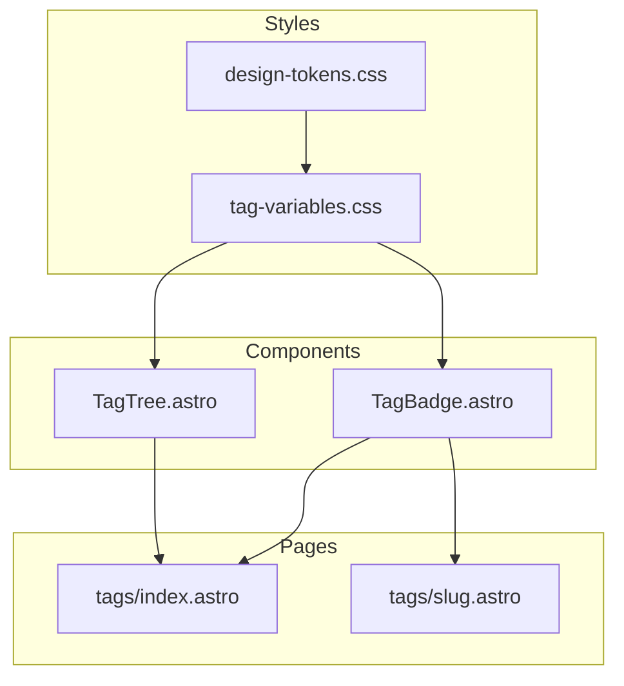

# Design Document: tag-page-fix

## Overview

**Purpose**: タグページにおけるスタイル・見た目のバグを修正し、TagBadgeおよびTagTreeコンポーネントの視覚的な一貫性とダークモード対応を改善します。

**Users**: サイト訪問者がタグ一覧ページ（`/tags/`）およびタグ詳細ページ（`/tags/[slug]`）を利用する際に、タグバッジとツリービューが正しく表示されるようになります。

**Impact**: 既存のCSSスタイル定義とコンポーネント内スタイルの整合性を確保し、ライト/ダークモード両方で視覚的な不具合を解消します。

### Goals
- TagBadgeコンポーネントのスタイルがCSS変数と正しく連携する
- TagTreeコンポーネントのツリー表示が正しく機能する
- ダークモードでの表示が一貫して動作する
- CSS変数のフォールバック値を適切に設定する

### Non-Goals
- 新機能の追加（検索、フィルタリング等）
- パフォーマンス最適化
- アクセシビリティの大幅な改善（現状維持）

## Architecture

### Existing Architecture Analysis

現在のスタイルシステムは以下の構造で実装されています：

1. **design-tokens.css**: OKLCHベースのデザイントークン（カラー、スペーシング、タイポグラフィ）
2. **tag-variables.css**: タグ関連CSS変数（`--tag-*`, `--tree-*`）の定義
3. **TagBadge.astro / TagTree.astro**: Astroスコープ付きスタイルでCSS変数を参照

**技術的制約**:
- Astroスコープ付きスタイルはコンポーネント固有のクラス名を生成
- CSS変数はグローバルスコープで定義され、コンポーネント内から参照可能
- ダークモードは`html.dark`クラスによる切り替え方式

### Architecture Pattern & Boundary Map

**Architecture Integration**:
- Selected pattern: CSS変数による一元管理（既存パターン踏襲）
- Domain/feature boundaries: スタイル定義（CSS）とコンポーネント（Astro）の分離
- Existing patterns preserved: デザイントークンシステム、スコープ付きスタイル
- New components rationale: 新規コンポーネントなし（既存修正のみ）
- Steering compliance: Astro規約、TypeScript strict mode

### Technology Stack

| Layer | Choice / Version | Role in Feature | Notes |
|-------|------------------|-----------------|-------|
| Frontend | Astro v5 | コンポーネントレンダリング | 既存 |
| Styling | CSS Custom Properties | スタイル変数管理 | 既存 |
| Color System | OKLCH | カラー定義 | @supportsフォールバック済み |

## Requirements Traceability

| Requirement | Summary | Components | Interfaces | Flows |
|-------------|---------|------------|------------|-------|
| 1.1 | タグテキストとカウント数の正しいフォントサイズ表示 | TagBadge | CSS変数参照 | - |
| 1.2 | ホバー時のCSS変数適用 | TagBadge | CSS変数参照 | - |
| 1.3 | ダークモードでの正しい表示 | TagBadge | CSS変数参照 | - |
| 1.4 | モバイル画面での適切なサイズ | TagBadge | CSS変数参照 | - |
| 1.5 | カウントバッジの適切な表示 | TagBadge | CSS変数参照 | - |
| 2.1 | 正しいインデント表示 | TagTree | CSS変数参照 | - |
| 2.2 | 展開/折りたたみの正しい動作 | TagTree | JavaScript | toggle |
| 2.3 | アイコンの回転アニメーション | TagTree | CSS transition | - |
| 2.4 | ダークモードでの正しい表示 | TagTree | CSS変数参照 | - |
| 2.5 | モバイル画面での適切なサイズ | TagTree | CSS変数参照 | - |
| 2.6 | ホバー背景色の正しい表示 | TagTree | CSS変数参照 | - |
| 3.1 | `--tag-*`変数の一貫使用 | tag-variables.css, TagBadge | - | - |
| 3.2 | `--tree-*`変数の一貫使用 | tag-variables.css, TagTree | - | - |
| 3.3 | 未定義変数のフォールバック | 全CSS | - | - |
| 3.4 | ライト/ダーク両モード対応 | tag-variables.css | - | - |

## Components and Interfaces

| Component | Domain/Layer | Intent | Req Coverage | Key Dependencies (P0/P1) | Contracts |
|-----------|--------------|--------|--------------|--------------------------|-----------|
| TagBadge | UI/Component | タグバッジ表示 | 1.1-1.5 | tag-variables.css (P0) | State |
| TagTree | UI/Component | 階層ツリー表示 | 2.1-2.6 | tag-variables.css (P0), TagBadge (P1) | State |
| tag-variables.css | Style/Foundation | CSS変数定義 | 3.1-3.4 | design-tokens.css (P0) | - |

### UI Layer

#### TagBadge

| Field | Detail |
|-------|--------|
| Intent | 個別のタグをバッジ形式で表示 |
| Requirements | 1.1, 1.2, 1.3, 1.4, 1.5 |

**Responsibilities & Constraints**
- タグ名とオプションのカウント数を表示
- リンク有無に応じた適切なHTML要素選択（`<a>` or ``）
- CSS変数を使用したスタイル適用

**Dependencies**
- Inbound: Pages (tags/index, tags/[slug]) — 表示用 (P1)
- External: tag-variables.css — CSS変数参照 (P0)

**Contracts**: State [x]

##### State Management
- State model: Props経由で受け取るデータのみ（tag, href, count, className, ariaLabel）
- Persistence & consistency: 静的レンダリング、状態なし
- Concurrency strategy: N/A

**Implementation Notes**
- Integration: CSS変数参照にフォールバック値を追加
- Validation: コンポーネント内のダークモードスタイルをCSS変数参照に統一
- Risks: スコープ付きスタイルの優先度確認が必要

#### TagTree

| Field | Detail |
|-------|--------|
| Intent | 階層構造のタグをツリービューで表示 |
| Requirements | 2.1, 2.2, 2.3, 2.4, 2.5, 2.6 |

**Responsibilities & Constraints**
- 階層タグデータをフラット化してツリー表示
- 展開/折りたたみ機能（JavaScript制御）
- インデントガイド表示
- キーボードナビゲーション対応

**Dependencies**
- Inbound: Pages (tags/index) — ツリー表示用 (P1)
- Outbound: TagBadge — ノード表示 (P1)
- External: tag-variables.css — CSS変数参照 (P0)

**Contracts**: State [x]

##### State Management
- State model: Props（hierarchy, expandAll, initialDisplayLevel等）+ DOM状態（aria-expanded）
- Persistence & consistency: クライアントサイドDOM操作
- Concurrency strategy: イベント駆動、シングルスレッド

**Implementation Notes**
- Integration: `--tree-*`変数の一貫した参照、フォールバック値追加
- Validation: 展開/折りたたみ時のアニメーション確認
- Risks: JavaScriptのDOM操作とCSSトランジションの同期

### Style Layer

#### tag-variables.css

| Field | Detail |
|-------|--------|
| Intent | タグ・ツリー関連CSS変数の一元定義 |
| Requirements | 3.1, 3.2, 3.3, 3.4 |

**Responsibilities & Constraints**
- `--tag-*`プレフィックスの変数定義（基本、ホバー、フォーカス、カウント、レスポンシブ）
- `--tree-*`プレフィックスの変数定義（背景、ボーダー、ホバー、トグル）
- `:root`（ライトモード）と`html.dark`（ダークモード）の両定義
- design-tokens.cssの変数を参照

**Dependencies**
- Inbound: TagBadge, TagTree — CSS変数参照 (P0)
- External: design-tokens.css — デザイントークン参照 (P0)

**Implementation Notes**
- Integration: 既存定義の確認と不足変数の追加
- Validation: 全CSS変数にフォールバック値を設定
- Risks: 循環参照の回避

## Error Handling

### Error Strategy
CSSスタイリングのエラーは視覚的な不具合として現れるため、フォールバック値による graceful degradation を採用。

### Error Categories and Responses
**CSS変数未定義**: フォールバック値によるデフォルトスタイル適用
**OKLCHサポートなし**: @supportsによるHEXフォールバック（既存）

## Testing Strategy

### Visual Testing
- TagBadgeのライトモード表示確認
- TagBadgeのダークモード表示確認
- TagBadgeのホバー状態確認
- TagTreeの展開/折りたたみ動作確認
- TagTreeのダークモード表示確認

### Responsive Testing
- モバイル（640px以下）でのTagBadgeサイズ確認
- モバイル（640px以下）でのTagTreeレイアウト確認

### Browser Testing
- Chrome/Firefox/Safari での表示確認
- OKLCHフォールバックの動作確認（古いブラウザ）
