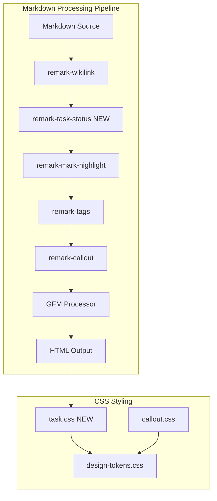
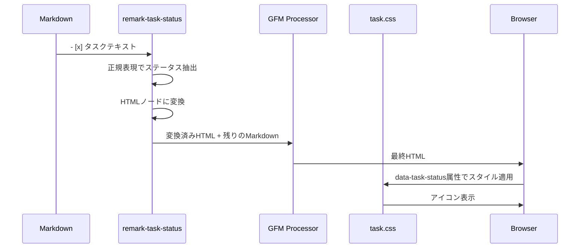
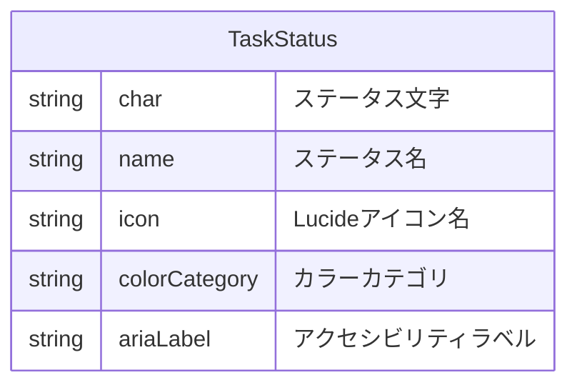

# Design Document: task-theme-design

## Overview

**Purpose**: Obsidianのタスク記法（22種類の拡張チェックボックス構文）をAstroブログ上で視覚的にレンダリングする機能を提供する。

**Users**: ブログ閲覧者がタスクの状態を視覚的に把握でき、ブログ運営者がObsidianで作成したコンテンツをそのまま公開できる。

**Impact**: 既存のMarkdown処理パイプラインにremarkプラグインを追加し、タスク記法をカスタムHTML要素に変換する。

### Goals
- 22種類のタスクステータスをアイコン付きでレンダリング
- 表示専用（クリックで状態変更しない）
- ダークモード対応
- 既存のプラグインパターン・CSSパターンとの一貫性

### Non-Goals
- タスクの状態変更機能（インタラクティブ）
- タスクのフィルタリング・検索機能
- タスクのメタデータ抽出（日付、優先度等）
- Obsidian Tasks プラグインの完全互換

## Architecture

### Existing Architecture Analysis
- **remarkプラグインチェーン**: WikiLink → MarkHighlight → Tags → Callout
- **CSSパターン**: callout.cssでデータ属性+CSSマスクアイコンを使用
- **GFM設定**: `gfm: true`でタスクリストが有効（`[ ]`と`[x]`のみ対応）

### Architecture Pattern & Boundary Map



**Architecture Integration**:
- **Selected pattern**: Remark AST変換パターン（remark-mark-highlightと同様）
- **Domain boundaries**: Markdown処理はremarkプラグイン、スタイリングはCSS
- **Existing patterns preserved**: unist-util-visit、データ属性によるスタイル分岐、CSSマスクアイコン
- **New components rationale**: タスク構文はGFMでは拡張ステータスを認識しないため、専用プラグインが必要
- **Steering compliance**: TypeScript strict mode、カスタムremarkプラグインはJavaScriptで記述

### Technology Stack

| Layer | Choice / Version | Role in Feature | Notes |
|-------|------------------|-----------------|-------|
| Markdown Processing | remark + unist-util-visit | タスク構文のAST変換 | 既存依存関係 |
| Styling | CSS3 (CSS Masks, Custom Properties) | ステータスアイコン表示 | 新規CSSファイル |
| Icons | Lucide Icons (SVG data URI) | 22種類のステータスアイコン | ISCライセンス |

## System Flows

### タスク構文処理フロー



## Requirements Traceability

| Requirement | Summary | Components | Interfaces | Flows |
|-------------|---------|------------|------------|-------|
| 1.1-1.4 | 基本ステータス（to-do, done, incomplete, canceled） | remark-task-status, task.css | TaskStatusType | 処理フロー |
| 2.1-2.2 | スケジューリング（forwarded, scheduling） | remark-task-status, task.css | TaskStatusType | 処理フロー |
| 3.1-3.3 | 重要度マーカー（question, important, star） | remark-task-status, task.css | TaskStatusType | 処理フロー |
| 4.1-4.4 | 参照マーカー（quote, location, bookmark, info） | remark-task-status, task.css | TaskStatusType | 処理フロー |
| 5.1-5.4 | アイデアマーカー（savings, idea, pros, cons） | remark-task-status, task.css | TaskStatusType | 処理フロー |
| 6.1-6.5 | アクションマーカー（fire, key, win, up, down） | remark-task-status, task.css | TaskStatusType | 処理フロー |
| 7.1-7.3 | 表示専用動作 | task.css | - | - |
| 8.1-8.2 | 未知ステータス処理 | remark-task-status | TaskStatusType | 処理フロー |

## Components and Interfaces

| Component | Domain/Layer | Intent | Req Coverage | Key Dependencies | Contracts |
|-----------|--------------|--------|--------------|------------------|-----------|
| remark-task-status | Markdown Processing | タスク構文をHTML要素に変換 | 1-6, 8 | unist-util-visit (P0) | Service |
| task.css | Styling | ステータスアイコンとスタイル定義 | 1-7 | design-tokens.css (P0) | State |

### Markdown Processing Layer

#### remark-task-status

| Field | Detail |
|-------|--------|
| Intent | リストアイテム内のタスク構文を検出し、ステータス付きHTML要素に変換する |
| Requirements | 1.1-1.4, 2.1-2.2, 3.1-3.3, 4.1-4.4, 5.1-5.4, 6.1-6.5, 8.1-8.2 |

**Responsibilities & Constraints**
- リストアイテムの先頭にある`[x]`パターンを検出（xは任意の1文字）
- ステータス文字をdata属性付きHTMLに変換
- GFMより前に処理し、GFMのタスクリスト処理との競合を回避
- 未定義ステータスはデフォルト（unknown）として処理

**Dependencies**
- Inbound: astro.config.mjs — プラグイン登録 (P0)
- External: unist-util-visit — AST走査 (P0)

**Contracts**: Service [x]

##### Service Interface
```typescript
/**
 * タスクステータスの型定義
 */
type TaskStatusChar =
  | ' ' | 'x' | 'X' | '/' | '-' | '>' | '<'
  | '?' | '!' | '*' | '"' | 'l' | 'b' | 'i'
  | 'S' | 'I' | 'p' | 'c' | 'f' | 'k' | 'w' | 'u' | 'd';

type TaskStatusName =
  | 'todo' | 'done' | 'incomplete' | 'canceled'
  | 'forwarded' | 'scheduling'
  | 'question' | 'important' | 'star'
  | 'quote' | 'location' | 'bookmark' | 'information'
  | 'savings' | 'idea' | 'pros' | 'cons'
  | 'fire' | 'key' | 'win' | 'up' | 'down'
  | 'unknown';

interface RemarkTaskStatusOptions {
  /** タスクチェックボックスのCSSクラス名 @default 'task-checkbox' */
  className?: string;
  /** プラグインの有効/無効 @default true */
  enabled?: boolean;
  /** アクセシビリティ属性を追加するか @default true */
  accessibility?: boolean;
}

/**
 * remarkプラグイン関数
 */
function remarkTaskStatus(options?: RemarkTaskStatusOptions): (tree: Root) => void;
```

- Preconditions: Markdownテキストが有効なAST形式で渡される
- Postconditions: タスク構文が`<span data-task-status="...">...</span>`に変換される
- Invariants: 変換後もMarkdownの他の要素は影響を受けない

**Implementation Notes**
- Integration: astro.config.mjsのremarkPlugins配列でremark-wikilinkの直後に配置
- Validation: 正規表現`/^\[([ xX/\-><!?*"lbiSIpcfkwud])\]\s/`でパターン検証
- Risks: GFMのタスクリスト処理との順序競合 → プラグイン配置順で回避

### Styling Layer

#### task.css

| Field | Detail |
|-------|--------|
| Intent | タスクステータスのアイコンとスタイルを定義する |
| Requirements | 1.1-1.4, 2.1-2.2, 3.1-3.3, 4.1-4.4, 5.1-5.4, 6.1-6.5, 7.1-7.3 |

**Responsibilities & Constraints**
- 22種類のステータスアイコンをCSSマスクで表示
- ダークモード対応
- クリック不可の視覚的フィードバック（cursor: default, pointer-events: none）
- design-tokens.cssの色変数を使用

**Dependencies**
- Inbound: global.css — CSSインポート (P0)
- External: design-tokens.css — 色・スペーシング変数 (P0)

**Contracts**: State [x]

##### State Management
- State model: CSS Custom Properties（`--task-icon-*`, `--task-color-*`）
- Persistence: ビルド時に静的CSSとして出力
- Concurrency: なし（静的スタイル）

**Implementation Notes**
- Integration: global.cssに`@import './task.css';`を追加
- Validation: 各ステータスのdata属性に対応するスタイルが存在することを確認
- Risks: SVG data URIのサイズが大きくなる可能性 → gzip圧縮で軽減

## Data Models

### Domain Model



**ステータスマッピング**:

| char | name | icon | colorCategory | ariaLabel |
|------|------|------|---------------|-----------|
| ` ` | todo | circle | neutral | 未完了 |
| `x`/`X` | done | circle-check | success | 完了 |
| `/` | incomplete | circle-slash | warning | 進行中 |
| `-` | canceled | circle-x | muted | キャンセル |
| `>` | forwarded | arrow-right | info | 転送 |
| `<` | scheduling | calendar | info | スケジューリング |
| `?` | question | circle-help | warning | 質問 |
| `!` | important | alert-triangle | danger | 重要 |
| `*` | star | star | accent | スター |
| `"` | quote | quote | neutral | 引用 |
| `l` | location | map-pin | info | 場所 |
| `b` | bookmark | bookmark | accent | ブックマーク |
| `i` | information | info | info | 情報 |
| `S` | savings | piggy-bank | success | 貯蓄 |
| `I` | idea | lightbulb | warning | アイデア |
| `p` | pros | thumbs-up | success | 賛成 |
| `c` | cons | thumbs-down | danger | 反対 |
| `f` | fire | flame | danger | 緊急 |
| `k` | key | key | accent | キー |
| `w` | win | trophy | success | 勝利 |
| `u` | up | arrow-up | success | 上昇 |
| `d` | down | arrow-down | danger | 下降 |

### Logical Data Model

**HTML出力構造**:
```html
<li class="task-list-item">
  <span class="task-checkbox" data-task-status="done" aria-label="完了">
    <span class="task-icon" aria-hidden="true"></span>
  </span>
  タスクのテキスト内容
</li>
```

**CSS変数構造**:
```css
:root {
  /* アイコンSVG (data URI) */
  --task-icon-todo: url("data:image/svg+xml,...");
  --task-icon-done: url("data:image/svg+xml,...");
  /* ... 22種類 */

  /* カラーカテゴリ */
  --task-color-neutral: var(--color-gray-500);
  --task-color-success: oklch(0.7 0.2 150);
  --task-color-warning: oklch(0.75 0.18 75);
  --task-color-danger: oklch(0.65 0.25 25);
  --task-color-info: oklch(0.7 0.15 210);
  --task-color-accent: var(--color-primary-500);
  --task-color-muted: var(--color-gray-400);
}
```

## Error Handling

### Error Strategy
- **無効な構文**: 通常のリストアイテムとしてフォールバック
- **未定義ステータス**: `unknown`ステータスとしてデフォルトアイコンを表示

### Error Categories and Responses
**User Errors**: なし（表示専用）
**System Errors**: なし（ビルド時処理）
**Business Logic Errors**:
- 未定義ステータス文字 → デフォルトアイコン（circle）で表示、警告ログなし

## Testing Strategy

### Unit Tests
- `remarkTaskStatus`: 各ステータス文字の正しい変換
- `remarkTaskStatus`: 未定義文字のフォールバック処理
- `remarkTaskStatus`: ネストされたリストの処理
- `remarkTaskStatus`: コードブロック内のタスク構文のスキップ

### Integration Tests
- Astro Markdown処理パイプラインでの正常動作
- GFMタスクリストとの共存確認
- 他のremarkプラグインとの順序依存性テスト

### E2E/UI Tests
- 各ステータスアイコンの視覚的表示確認
- ダークモードでの色表示確認
- クリック不可動作の確認

## Supporting References

### Lucide Icons SVG Data URI
詳細なSVGデータURIは実装時に[Lucide Icons](https://lucide.dev/icons/)から取得。

### カラーパレット詳細
| Category | Light Mode | Dark Mode |
|----------|------------|-----------|
| neutral | `var(--color-gray-500)` | `var(--color-gray-400)` |
| success | `oklch(0.7 0.2 150)` | `oklch(0.8 0.18 150)` |
| warning | `oklch(0.75 0.18 75)` | `oklch(0.85 0.16 75)` |
| danger | `oklch(0.65 0.25 25)` | `oklch(0.75 0.22 25)` |
| info | `oklch(0.7 0.15 210)` | `oklch(0.8 0.13 210)` |
| accent | `var(--color-primary-500)` | `var(--color-primary-500)` |
| muted | `var(--color-gray-400)` | `var(--color-gray-500)` |
