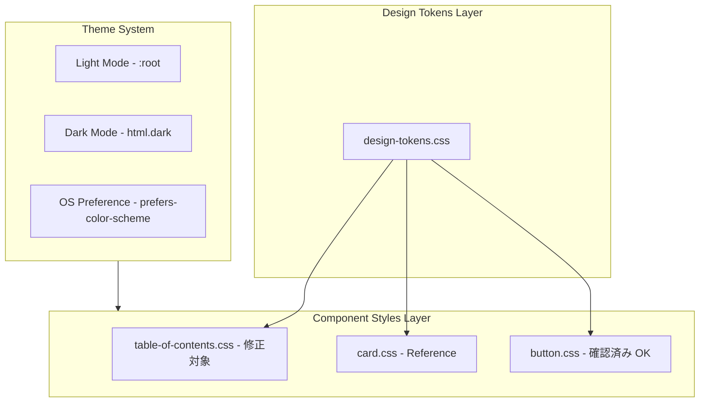

# Design Document: theme-design-unification

## Overview

**Purpose**: ダークモードとライトモードでデザインの一貫性が保たれていないコンポーネントを特定・修正し、テーマ切り替え時にシームレスな視覚的体験を提供する。

**Users**: サイト訪問者がテーマを切り替えた際に、デザインの違和感（ボーダーの出現/消失、背景色の急激な変化など）を感じないようにする。

**Impact**: 複数のCSSファイル（table-of-contents.css、button.css）を修正し、ライトモードでもダークモードと同等のスタイル構造を持たせる。

### Goals

- 目次コンポーネントのライト/ダークモード間でのボーダー表示を統一
- 目次リンクのホバー/アクティブ状態の背景色をライトモードにも定義
- ボタンコンポーネント（secondary, ghost, text）のホバー背景色を統一
- 既存のカードコンポーネントで確立されたテーマ対応パターンを踏襲
- テーマ切り替え時のスムーズなトランジションを維持

### Non-Goals

- 新規コンポーネントの作成
- 既存デザイントークンシステムの変更
- JavaScript/TypeScriptコードの変更
- モバイルビューの目次サイドバースタイル変更（既に両モードで一貫性あり）

## Architecture

### Existing Architecture Analysis

現在のテーマシステムは以下の構造で実装されている:

1. **デザイントークン** (`design-tokens.css`): 色、スペーシング、トランジション等のCSS変数を定義
2. **テーマ切り替え**: `html.dark` クラスと `@media (prefers-color-scheme: dark)` の二重対応
3. **コンポーネントスタイル**: 各コンポーネントが個別のCSSファイルで定義

### 発見された不整合一覧

| ファイル | セレクタ | ライトモード | ダークモード | 問題 |
|---------|---------|-------------|-------------|------|
| table-of-contents.css | `.table-of-contents` | border なし | `border: 1px solid` | ボーダーの有無 |
| table-of-contents.css | `.toc-link:hover` | 背景色なし | `background-color: oklch(30% 0.08 293)` | 背景色の有無 |
| table-of-contents.css | `.toc-link.active` | 背景色なし | `background-color: oklch(30% 0.08 293)` | 背景色の有無 |
| button.css | `.btn--secondary:hover` | `--color-primary-50` | `oklch(30% 0.08 293)` | 両方定義済み（OK） |
| button.css | `.btn--ghost:hover` | `--color-gray-100` | `--color-gray-800` | 両方定義済み（OK） |
| button.css | `.btn--text:hover` | `--color-primary-50` | `oklch(30% 0.06 293)` | 両方定義済み（OK） |

**修正対象**: table-of-contents.css のみ（button.css は既に両モードで定義済み）

### Architecture Pattern & Boundary Map



**Architecture Integration**:
- **Selected pattern**: 既存のカードコンポーネントパターンを踏襲（ライトモードで基本定義、ダークモードで値の上書き）
- **Domain boundaries**: CSSスタイルのみの変更、ロジック層に影響なし
- **Existing patterns preserved**: `html.dark` セレクタと `@media (prefers-color-scheme: dark)` の二重定義パターン
- **Steering compliance**: デザイントークン（`--color-gray-*`）を使用したスタイル定義

### Technology Stack

| Layer | Choice / Version | Role in Feature | Notes |
|-------|------------------|-----------------|-------|
| Frontend | CSS3 (OKLCH) | スタイル定義 | 既存のカラーシステムを使用 |
| Design System | CSS Custom Properties | テーマ変数 | `design-tokens.css` で定義済み |

## Requirements Traceability

| Requirement | Summary | Components | Interfaces | Flows |
|-------------|---------|------------|------------|-------|
| 1.1 | 目次にライトモードボーダー追加 | table-of-contents.css | N/A | N/A |
| 1.2 | テーマ別ボーダーカラー変更 | table-of-contents.css | N/A | N/A |
| 1.3 | デザイントークン使用 | table-of-contents.css | N/A | N/A |
| 2.1 | ダークモード追加プロパティ特定 | table-of-contents.css | N/A | N/A |
| 2.2 | ライトモードに同等プロパティ追加 | table-of-contents.css | N/A | N/A |
| 2.3 | ボーダー・背景色の両モード定義 | table-of-contents.css | N/A | N/A |
| 3.1 | トランジション適用 | table-of-contents.css | N/A | N/A |
| 3.2 | 視覚的プロパティのトランジション | table-of-contents.css | N/A | N/A |
| 3.3 | reduced-motion対応 | design-tokens.css | N/A | N/A |
| 4.1 | カードパターン適用 | table-of-contents.css | N/A | N/A |
| 4.2 | デザイントークン使用 | table-of-contents.css | N/A | N/A |
| 4.3 | 二重テーマ定義 | table-of-contents.css | N/A | N/A |

## Components and Interfaces

| Component | Domain/Layer | Intent | Req Coverage | Key Dependencies | Contracts |
|-----------|--------------|--------|--------------|------------------|-----------|
| table-of-contents.css | Styles | 目次スタイル定義 | 1.1-1.3, 2.1-2.3, 3.1-3.2, 4.1-4.3 | design-tokens.css (P0) | State |

### Styles Layer

#### table-of-contents.css

| Field | Detail |
|-------|--------|
| Intent | 目次コンポーネントのテーマ対応スタイル統一 |
| Requirements | 1.1, 1.2, 1.3, 2.1, 2.2, 2.3, 3.1, 3.2, 4.1, 4.2, 4.3 |

**Responsibilities & Constraints**
- 目次の視覚的スタイル（背景、ボーダー、シャドウ）の定義
- 目次リンクのホバー/アクティブ状態の背景色定義
- ライト/ダークモード両対応
- トランジションによるスムーズなテーマ切り替え

**Dependencies**
- Inbound: design-tokens.css — カラー変数、トランジション変数 (P0)

**Contracts**: State [x]

##### State Management

**修正箇所 1: .table-of-contents ボーダー**

```css
/* Current State (Before) */
.table-of-contents {
  background-color: var(--color-gray-50);
  border-radius: var(--radius-xl);
  padding: var(--space-6);
  box-shadow: var(--shadow-sm);
  /* border なし */
}

html.dark .table-of-contents {
  background-color: var(--color-gray-800);
  border: 1px solid var(--color-gray-700);  /* ダークモードでのみボーダー追加 */
}
```

```css
/* Target State (After) */
.table-of-contents {
  background-color: var(--color-gray-50);
  border: 1px solid var(--color-gray-200);  /* 追加 */
  border-radius: var(--radius-xl);
  padding: var(--space-6);
  box-shadow: var(--shadow-sm);
  transition:
    background-color var(--duration-normal) var(--easing-default),
    border-color var(--duration-normal) var(--easing-default),
    box-shadow var(--duration-fast) var(--easing-default);  /* 追加 */
}

html.dark .table-of-contents {
  background-color: var(--color-gray-800);
  border-color: var(--color-gray-700);  /* border → border-color に変更 */
}

@media (prefers-color-scheme: dark) {
  :root:not(.light) .table-of-contents {
    background-color: var(--color-gray-800);
    border-color: var(--color-gray-700);
  }
}
```

**修正箇所 2: .toc-link:hover 背景色**

```css
/* Current State (Before) - ライトモードにホバー背景色なし */
/* ダークモードのみ定義 */
html.dark .toc-link:hover {
  color: var(--color-primary-400);
  background-color: oklch(30% 0.08 293);
}
```

```css
/* Target State (After) */
.toc-link:hover {
  background-color: var(--color-gray-100);  /* 追加: ライトモード用 */
}

html.dark .toc-link:hover {
  color: var(--color-primary-400);
  background-color: oklch(30% 0.08 293);
}

@media (prefers-color-scheme: dark) {
  :root:not(.light) .toc-link:hover {
    color: var(--color-primary-400);
    background-color: oklch(30% 0.08 293);
  }
}
```

**修正箇所 3: .toc-link.active 背景色**

```css
/* Current State (Before) - ライトモードにアクティブ背景色なし */
/* ダークモードのみ定義 */
html.dark .toc-link.active {
  color: var(--color-primary-400);
  background-color: oklch(30% 0.08 293);
}
```

```css
/* Target State (After) */
.toc-link.active {
  background-color: var(--color-primary-50);  /* 追加: ライトモード用 */
}

html.dark .toc-link.active {
  color: var(--color-primary-400);
  background-color: oklch(30% 0.08 293);
}

@media (prefers-color-scheme: dark) {
  :root:not(.light) .toc-link.active {
    color: var(--color-primary-400);
    background-color: oklch(30% 0.08 293);
  }
}
```

**Implementation Notes**
- Integration: 既存の `table-of-contents.css` を直接編集
- Validation: ライト/ダークモード両方でボーダーと背景色が表示されることを視覚的に確認
- Risks: なし（純粋なCSS追加のみ）

## Data Models

該当なし（CSSスタイルのみの変更）

## Error Handling

該当なし（CSSスタイルのみの変更）

## Testing Strategy

### Visual Testing
1. **目次ボーダー - ライトモード**: 目次にボーダー（`--color-gray-200`）が表示される
2. **目次ボーダー - ダークモード**: 目次にボーダー（`--color-gray-700`）が表示される
3. **目次リンクホバー - ライトモード**: ホバー時に背景色（`--color-gray-100`）が表示される
4. **目次リンクホバー - ダークモード**: ホバー時に背景色（`oklch(30% 0.08 293)`）が表示される
5. **目次リンクアクティブ - ライトモード**: アクティブ時に背景色（`--color-primary-50`）が表示される
6. **目次リンクアクティブ - ダークモード**: アクティブ時に背景色（`oklch(30% 0.08 293)`）が表示される
7. **テーマ切り替え**: ボーダーカラーと背景色がスムーズにトランジションする
8. **OSプリファレンス**: システム設定に従ってテーマが適用される
9. **reduced-motion**: トランジションが無効化される

### Browser Testing
1. Chrome（最新版）
2. Firefox（最新版）
3. Safari（最新版）
4. Edge（最新版）

### Responsive Testing
1. デスクトップ（1024px以上）
2. タブレット（768px-1023px）
3. モバイル（767px以下）— 既に両モードで一貫性あり、変更不要だが確認は必要
