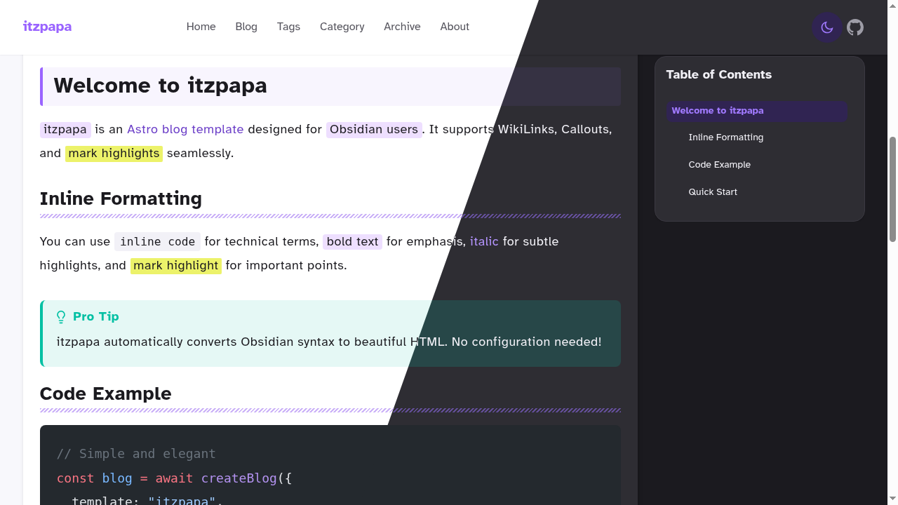

# itzpapa - Astro Blog with Obsidian-style Features



[日本語版はこちら / Japanese](./README.ja.md)

An Astro-based blog site that supports Obsidian-style syntax (WikiLink, Callout, Inline Tags, Mark Highlight) with powerful customization options.

## Features

- **Astro v5** - Fast static site generation with Markdown/MDX
- **Obsidian syntax** - WikiLink (`[[page]]`), Callout, Mark highlight (`==text==`), Inline tags (`#tag`)
- **Search** - Full-text search with keyword highlighting
- **SEO** - OG images, sitemap, RSS, canonical URLs
- **i18n** - Japanese and English
- **Integrations** - giscus comments, Google AdSense
- **Theme** - Customizable via `primaryHue` (0-360) in `site.config.ts`

## Getting Started

```bash
git clone https://github.com/hachian/itzpapa.git
cd itzpapa

# Linux/macOS
npm install

# Windows (pnpm recommended)
pnpm install
```

Edit `site.config.ts`:

```typescript
site: {
  title: 'Your Site Title',
  author: 'Your Name',
  baseUrl: 'https://your-domain.com',
},
features: {
  comments: {
    enabled: false,  // Disable giscus (or configure your own)
  },
},
```

Start development server:

```bash
npm run dev   # Linux/macOS
pnpm dev      # Windows
```

Open http://localhost:4321 to view your site.

## Commands

| npm | pnpm | Description |
|-----|------|-------------|
| `npm install` | `pnpm install` | Install dependencies |
| `npm run dev` | `pnpm dev` | Start dev server (localhost:4321) |
| `npm run build` | `pnpm build` | Build for production (./dist/) |
| `npm run build:ci` | `pnpm build:ci` | Build for CI (no image optimization) |
| `npm run preview` | `pnpm preview` | Preview build locally |
| `npm run test` | `pnpm test` | Run all tests |

## Configuration

All site settings are centralized in `site.config.ts` at the project root.
For detailed documentation, see: https://itzpapa.hachian.com/blog/site-config-guide/

```typescript
export const siteConfig = {
  site: {
    title: 'Your Site Title',
    description: { ja: '日本語説明', en: 'English description' },
    author: 'Your Name',
    baseUrl: 'https://your-site.com',
    language: 'en',  // 'ja' or 'en'
  },
  theme: {
    primaryHue: 293,  // 0-360
  },
  navigation: [...],
  social: { github: {...}, twitter: {...}, ... },
  footer: {
    copyrightText: 'All rights reserved.',
    startYear: 2024,
  },
  seo: {
    googleAnalyticsId: 'G-XXXXXXXXXX',
    googleAdsenseId: 'ca-pub-XXXXXXXXXXXXXXXX',
  },
  features: {
    tableOfContents: true,
    tagCloud: true,
    relatedPosts: true,
    comments: { enabled: false, provider: 'giscus', config: {...} },
  },
  ogImage: {
    lightBackground: 'itzpapa-light_16_9.png',
    darkBackground: 'itzpapa-dark_16_9.png',
  },
  imageHosting: {...},  // Optional: S3/R2 external hosting
  pagination: {
    postsPerPage: 24,
  },
};
```

## Project Structure

```
├── public/              # Static files
│   ├── favicon.svg
│   └── fonts/          # Web fonts
├── src/
│   ├── assets/         # Image assets
│   ├── components/     # Astro components
│   ├── content/        # Blog posts (Markdown/MDX)
│   │   └── blog/      # Blog entries
│   ├── i18n/           # Internationalization
│   ├── integrations/   # Astro integrations
│   ├── layouts/        # Layout templates
│   ├── pages/          # Page components
│   ├── plugins/        # Custom plugins
│   │   ├── remark-wikilink/      # WikiLink support
│   │   ├── remark-mark-highlight/ # Mark highlight
│   │   ├── remark-tags/          # Inline tag support
│   │   └── rehype-callout/       # Callout blocks
│   ├── styles/         # Global styles
│   ├── theme/          # Theme utilities
│   ├── types/          # TypeScript types
│   └── utils/          # Utility functions
├── scripts/            # Build scripts
├── tests/              # Test files
├── site.config.ts      # Centralized site configuration
├── astro.config.mjs    # Astro configuration
├── package.json        # Package configuration
└── tsconfig.json       # TypeScript configuration
```

## Dependencies

### Main Dependencies
- **astro** - Static site generator
- **@astrojs/mdx** - MDX integration
- **@astrojs/rss** - RSS feed generation
- **@astrojs/sitemap** - Sitemap generation
- **sharp** - Image processing
- **satori** - OG image generation
- **remark-breaks** - Single line break support

### Dev Dependencies
- **remark** - Markdown processor
- **unified** - Text processing interface
- **unist-util-visit** - AST node traversal

## Custom Plugins

### remark-wikilink
Plugin supporting WikiLink syntax (`[[page name]]`).
- Space handling in file names
- Anchor link support
- Image embed support

### remark-mark-highlight
Plugin supporting mark highlight syntax (`==text==`).
- Inline highlight display
- CSS customizable

### remark-tags
Plugin supporting inline tag syntax (`#tag`).
- Hierarchical tags (`#parent/child`)
- Japanese tag support
- Auto-linking to tag pages

## Usage

For syntax examples, see:
- Markdown: https://itzpapa.hachian.com/blog/markdown-demo/
- Obsidian syntax: https://itzpapa.hachian.com/blog/obsidian-syntax-demo/

### Creating Blog Posts

1. Create a new folder in `src/content/blog/`
2. Create an `index.md` or `index.mdx` file
3. Add frontmatter and content

```markdown
---
title: 'Article Title'           # Required
description: 'Article summary'   # Required
pubDate: '2024-07-08'           # Required (YYYY-MM-DD)
heroImage: './image.jpg'         # Optional
tags: ['Astro', 'Blog']          # Optional
draft: false                     # Optional
---
```

## Deployment

### Cloudflare Pages

This project includes configuration for Cloudflare Pages deployment:
- Security headers configured in `public/_headers`

## License

[MIT](https://github.com/hachian/itzpapa/blob/main/LICENSE)
