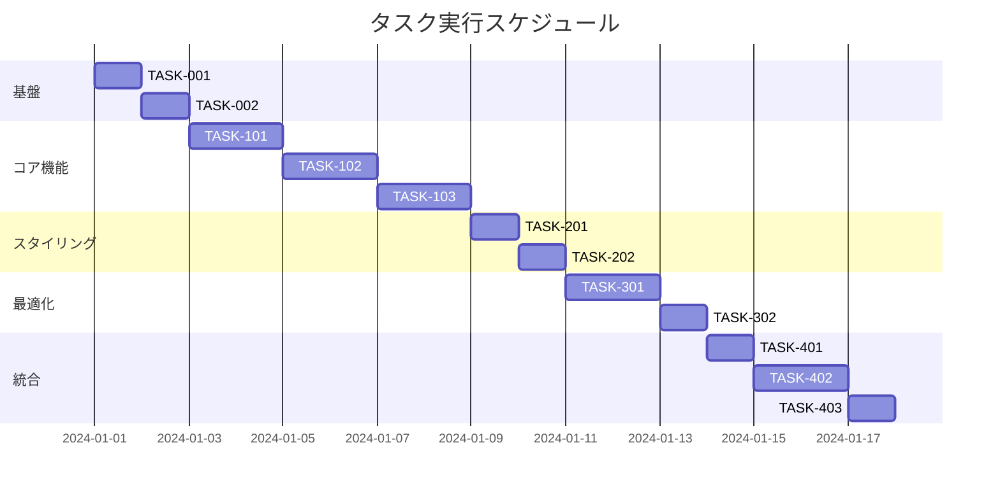

# Markdownハイライト記法（==記法）実装タスク

## 概要

全タスク数: 12
推定作業時間: 16時間
クリティカルパス: TASK-001 → TASK-101 → TASK-102 → TASK-103 → TASK-201 → TASK-301 → TASK-401

## タスク一覧

### フェーズ1: 基盤構築

#### TASK-001: プロジェクト環境確認と設定

- [x] **タスク完了**
- **タスクタイプ**: DIRECT
- **要件リンク**: REQ-401, REQ-402
- **依存タスク**: なし
- **実装詳細**:
  - 既存のremark関連プラグインの動作確認
  - Astroビルド設定の確認
  - remarkプラグインチェーンの処理順序確認
  - テスト環境のセットアップ
- **テスト要件**:
  - [ ] 現在のビルドが正常に動作することを確認
  - [ ] 既存のremark-wikilinkプラグインの動作確認
  - [ ] 開発サーバーの起動確認
- **完了条件**:
  - [ ] 開発環境が正常に動作している
  - [ ] テストファイルの実行環境が整備されている

#### TASK-002: remarkプラグイン基本構造の作成

- [x] **タスク完了**
- **タスクタイプ**: DIRECT
- **要件リンク**: REQ-001, REQ-401
- **依存タスク**: TASK-001
- **実装詳細**:
  - `src/plugins/remark-mark-highlight/`ディレクトリ作成
  - `index.js`ファイルの作成
  - remarkプラグインの基本構造実装
  - パッケージメタデータの設定
- **テスト要件**:
  - [ ] プラグインが正しくエクスポートされる
  - [ ] remarkパイプラインに組み込める
- **完了条件**:
  - [ ] プラグインディレクトリが作成されている
  - [ ] 基本的なプラグイン構造が実装されている

### フェーズ2: コア機能実装

#### TASK-101: ハイライト記法のパーサー実装

- [x] **タスク完了**
- **タスクタイプ**: TDD
- **要件リンク**: REQ-001, REQ-003, REQ-004
- **依存タスク**: TASK-002
- **実装詳細**:
  - `==`記法の正規表現パターン作成
  - AST（Abstract Syntax Tree）ノードの変換ロジック
  - 複数行対応のパーサー実装
  - mark要素のノード生成
- **テスト要件**:
  - [ ] 単体テスト: 基本的なハイライト記法の変換
  - [ ] 単体テスト: 複数のハイライト記法の処理
  - [ ] 単体テスト: 複数行に渡るハイライト記法
  - [ ] 単体テスト: 空のハイライト記法の処理
- **エラーハンドリング**:
  - [ ] 不完全な記法の処理
  - [ ] ネストした記法の処理
  - [ ] 極端に長いテキストの処理

#### TASK-102: エスケープ処理とコード内記法の除外

- [ ] **タスク完了**
- **タスクタイプ**: TDD
- **要件リンク**: REQ-103, REQ-104, REQ-201
- **依存タスク**: TASK-101
- **実装詳細**:
  - エスケープ文字（\）の処理ロジック
  - コードブロック内の記法除外
  - インラインコード内の記法除外
  - ASTノードタイプの判定処理
- **テスト要件**:
  - [ ] 単体テスト: エスケープされた記法の処理
  - [ ] 単体テスト: コードブロック内の記法無視
  - [ ] 単体テスト: インラインコード内の記法無視
  - [ ] 統合テスト: 複合的なケースの処理
- **完了条件**:
  - [ ] エスケープ処理が正しく動作する
  - [ ] コード内の記法が変換されない

#### TASK-103: 他のMarkdown記法との統合

- [ ] **タスク完了**
- **タスクタイプ**: TDD
- **要件リンク**: REQ-102, REQ-105, NFR-302
- **依存タスク**: TASK-102
- **実装詳細**:
  - WikiLink記法との併用処理
  - 太字・斜体記法との併用処理
  - リンク記法との併用処理
  - 処理順序の最適化
- **テスト要件**:
  - [ ] 統合テスト: WikiLinkとの併用
  - [ ] 統合テスト: 太字・斜体との併用
  - [ ] 統合テスト: リンクとの併用
  - [ ] 統合テスト: 複数記法の複合処理
- **完了条件**:
  - [ ] 他の記法と競合しない
  - [ ] 処理順序が適切に設定されている

### フェーズ3: スタイリングとUI実装

#### TASK-201: CSS実装とスタイル設定

- [ ] **タスク完了**
- **タスクタイプ**: DIRECT
- **要件リンク**: REQ-002, NFR-201, REQ-301
- **依存タスク**: TASK-103
- **実装詳細**:
  - mark要素のデフォルトCSS実装
  - カスタムクラスのサポート
  - レスポンシブ対応
- **UI/UX要件**:
  - [ ] 背景色: #ffeb3b（黄色）
  - [ ] パディング: 0.125em 0.25em
  - [ ] 角丸: 2px
  - [ ] コントラスト比: WCAG 2.1 AA準拠
- **テスト要件**:
  - [ ] ビジュアルテスト: ハイライト表示確認
  - [ ] レスポンシブテスト: 各デバイスサイズ
  - [ ] アクセシビリティテスト: コントラスト比
- **完了条件**:
  - [ ] スタイルが正しく適用される
  - [ ] アクセシビリティ基準を満たす

#### TASK-202: アクセシビリティ対応

- [ ] **タスク完了**
- **タスクタイプ**: TDD
- **要件リンク**: NFR-201, NFR-202
- **依存タスク**: TASK-201
- **実装詳細**:
  - ARIA属性の追加
  - スクリーンリーダー対応
  - キーボードナビゲーション考慮
  - セマンティックHTML確保
- **テスト要件**:
  - [ ] スクリーンリーダーテスト
  - [ ] キーボード操作テスト
  - [ ] ARIA属性の検証
- **完了条件**:
  - [ ] スクリーンリーダーで適切に読み上げられる
  - [ ] セマンティックHTMLが維持されている

### フェーズ4: パフォーマンス最適化

#### TASK-301: パフォーマンス最適化

- [ ] **タスク完了**
- **タスクタイプ**: TDD
- **要件リンク**: REQ-402, NFR-001, NFR-002
- **依存タスク**: TASK-202
- **実装詳細**:
  - 正規表現の最適化
  - AST走査の効率化
  - メモリ使用量の最小化
  - キャッシュ戦略の実装
- **テスト要件**:
  - [ ] パフォーマンステスト: 1000個のハイライト処理
  - [ ] メモリ使用量テスト: 大規模文書処理
  - [ ] ベンチマークテスト: 処理速度測定
- **完了条件**:
  - [ ] 1000個のハイライトを100ms以内で処理
  - [ ] メモリ使用量が10%以内の増加

#### TASK-302: セキュリティ対策

- [ ] **タスク完了**
- **タスクタイプ**: TDD
- **要件リンク**: REQ-403, NFR-101, NFR-102
- **依存タスク**: TASK-301
- **実装詳細**:
  - XSS対策の実装
  - HTMLタグのサニタイズ
  - ネスト深度の制限（最大10レベル）
  - 悪意のある入力の検出と処理
- **テスト要件**:
  - [ ] セキュリティテスト: XSS攻撃パターン
  - [ ] セキュリティテスト: HTMLインジェクション
  - [ ] セキュリティテスト: DoS攻撃パターン
- **完了条件**:
  - [ ] XSS攻撃が防げている
  - [ ] 悪意のある入力が適切に処理される

### フェーズ5: 統合とE2Eテスト

#### TASK-401: Astro統合と設定

- [ ] **タスク完了**
- **タスクタイプ**: DIRECT
- **要件リンク**: REQ-401, NFR-301
- **依存タスク**: TASK-302
- **実装詳細**:
  - astro.config.mjsへのプラグイン追加
  - プラグイン実行順序の設定
  - 設定オプションの実装
  - ドキュメントの作成
- **テスト要件**:
  - [ ] ビルドテスト: 開発ビルド
  - [ ] ビルドテスト: プロダクションビルド
  - [ ] 統合テスト: ホットリロード動作
- **完了条件**:
  - [ ] Astroビルドが正常に完了する
  - [ ] プラグインが正しく適用される

#### TASK-402: E2Eテストスイート

- [ ] **タスク完了**
- **タスクタイプ**: TDD
- **要件リンク**: 全要件
- **依存タスク**: TASK-401
- **実装詳細**:
  - E2Eテストの作成
  - 実際のMarkdownファイルでのテスト
  - ブラウザでの表示確認
  - CI/CDパイプラインへの統合
- **テスト要件**:
  - [ ] E2Eテスト: 基本的なハイライト機能
  - [ ] E2Eテスト: 他の記法との併用
  - [ ] E2Eテスト: エッジケースの処理
  - [ ] E2Eテスト: パフォーマンス測定
- **完了条件**:
  - [ ] すべてのE2Eテストが成功する
  - [ ] 本番環境での動作が確認される

#### TASK-403: ドキュメント作成と最終確認

- [ ] **タスク完了**
- **タスクタイプ**: DIRECT
- **要件リンク**: 全要件
- **依存タスク**: TASK-402
- **実装詳細**:
  - READMEの作成/更新
  - 使用方法のドキュメント
  - APIドキュメント
  - サンプルコードの作成
- **テスト要件**:
  - [ ] ドキュメントの正確性確認
  - [ ] サンプルコードの動作確認
- **完了条件**:
  - [ ] ドキュメントが完成している
  - [ ] すべての受け入れ基準を満たしている

## 実行順序

## サブタスクテンプレート

### TDDタスクの場合

各タスクは以下のTDDプロセスで実装:

1. `tdd-requirements.md` - 詳細要件定義
2. `tdd-testcases.md` - テストケース作成
3. `tdd-red.md` - テスト実装（失敗）
4. `tdd-green.md` - 最小実装
5. `tdd-refactor.md` - リファクタリング
6. `tdd-verify-complete.md` - 品質確認

### DIRECTタスクの場合

各タスクは以下のDIRECTプロセスで実装:

1. `direct-setup.md` - 直接実装・設定
2. `direct-verify.md` - 動作確認・品質確認

## 並行実行可能なタスク

以下のタスクは依存関係がない、または依存タスクが完了次第並行実行可能:

- **フェーズ3**: TASK-201とTASK-202は部分的に並行実行可能
- **フェーズ4**: TASK-301とTASK-302は独立して実行可能
- **フェーズ5**: TASK-403はTASK-402と並行して準備可能