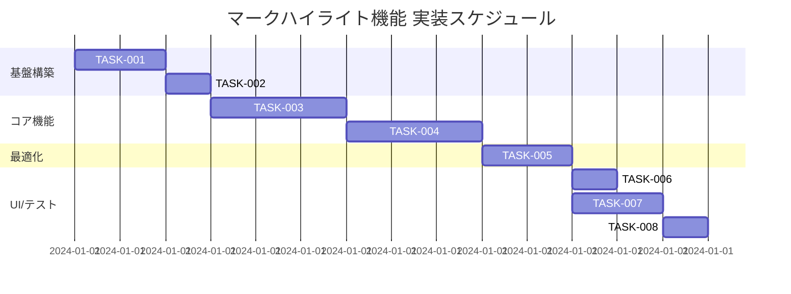

# マークハイライト機能 実装タスク

## 概要

全タスク数: 8
推定作業時間: 12時間
クリティカルパス: TASK-001 → TASK-002 → TASK-003 → TASK-004 → TASK-005

## タスク一覧

### フェーズ1: プラグイン基盤構築

#### TASK-001: remarkプラグイン基本構造の作成

- [x] **タスク完了**
- **タスクタイプ**: DIRECT
- **要件リンク**: REQ-001, REQ-401
- **依存タスク**: なし
- **実装詳細**:
  - `src/plugins/remark-mark-highlight/index.js` ファイルの作成
  - 基本的なremarkプラグイン構造の実装
  - `==text==` パターンの検出機能
  - `<mark>` タグへの変換ロジック
- **テスト要件**:
  - [ ] プラグインの読み込みテスト
  - [ ] 基本的な変換テスト
- **完了条件**:
  - [ ] プラグインファイルが作成されている
  - [ ] 基本的な `==text==` → `<mark>text</mark>` 変換が動作する
  - [ ] エラーが発生しない

#### TASK-002: Astro設定への統合

- [x] **タスク完了**
- **タスクタイプ**: DIRECT
- **要件リンク**: REQ-201, NFR-301, NFR-302
- **依存タスク**: TASK-001
- **実装詳細**:
  - `astro.config.mjs` にプラグインを追加
  - 既存のwikilink、calloutプラグインとの処理順序の調整
  - プラグインの優先度設定
- **テスト要件**:
  - [ ] Astroビルドの成功確認
  - [ ] 既存プラグインとの競合チェック
- **完了条件**:
  - [ ] `astro.config.mjs` が更新されている
  - [ ] ビルドが成功する
  - [ ] 既存機能が正常に動作する

### フェーズ2: コア機能実装

#### TASK-003: 基本的なマークハイライト機能

- [x] **タスク完了（部分実装）**
- **タスクタイプ**: TDD
- **要件リンク**: REQ-001, REQ-002, REQ-003
- **依存タスク**: TASK-002
- **実装詳細**:
  - 正規表現 `==([^=\n]+)==` による基本パターン検出
  - HTMLの `<mark>` 要素への変換
  - 複数のハイライトが同一行に存在する場合の処理
  - インライン記法（太字、イタリック、リンク）との共存
- **テスト要件**:
  - [ ] 単体テスト: 基本的な変換 `==テスト==` → `<mark>テスト</mark>`
  - [ ] 単体テスト: 複数ハイライト `==一つ目== と ==二つ目==`
  - [ ] 単体テスト: インライン記法との共存 `==**太字**==`、`==*イタリック*==`
  - [ ] 単体テスト: リンクとの共存 `==[リンク](url)==`
- **エラーハンドリング**:
  - [ ] 空のハイライト `====` は処理しない
  - [ ] 改行を含む場合は処理しない
  - [ ] 奇数個の `==` は処理しない

#### TASK-004: エッジケースとセキュリティ対応

- [ ] **タスク完了**
- **タスクタイプ**: TDD
- **要件リンク**: REQ-101, REQ-102, REQ-103, NFR-101, NFR-102
- **依存タスク**: TASK-003
- **実装詳細**:
  - コードブロック内の `==` を無視する処理
  - HTMLエスケープ処理の実装
  - 不正な記法のハンドリング
  - セキュリティ対策（XSS防止）
- **テスト要件**:
  - [ ] セキュリティテスト: XSS攻撃パターンの検証
  - [ ] エッジケーステスト: コードブロック内の `==` 無視
  - [ ] エッジケーステスト: 不正な記法の処理
  - [ ] 境界値テスト: 文字数の限界値
- **エラーハンドリング**:
  - [ ] 悪意のあるスクリプト注入の防止
  - [ ] 不正なHTMLタグの生成防止
  - [ ] エラー発生時の適切な処理

### フェーズ3: パフォーマンス最適化

#### TASK-005: パフォーマンス最適化

- [ ] **タスク完了**
- **タスクタイプ**: TDD
- **要件リンク**: NFR-001, NFR-002, REQ-401
- **依存タスク**: TASK-004
- **実装詳細**:
  - 処理の最適化（不要な処理の削減）
  - 正規表現パフォーマンスの向上
  - メモリ使用量の最適化
  - 既存プラグインへの影響の最小化
- **テスト要件**:
  - [ ] パフォーマンステスト: 処理時間測定
  - [ ] パフォーマンステスト: メモリ使用量測定
  - [ ] 統合テスト: 既存機能への影響測定
- **パフォーマンス要件**:
  - [ ] 1000文字、10個のハイライトで100ms以下
  - [ ] 既存処理への影響10%以下
  - [ ] メモリリークなし

### フェーズ4: スタイリングとアクセシビリティ

#### TASK-006: CSSスタイリング

- [x] **タスク完了**
- **タスクタイプ**: DIRECT
- **要件リンク**: NFR-201, NFR-202, REQ-202
- **依存タスク**: TASK-005
- **実装詳細**:
  - `src/styles/global.css` にマークハイライトのスタイルを追加
  - 視覚的に明確なハイライト表示の実装
  - アクセシビリティガイドラインに準拠したスタイル
  - ダークモード対応（必要に応じて）
- **UI/UX要件**:
  - [ ] 視覚的識別性: コントラスト比の確保
  - [ ] アクセシビリティ: スクリーンリーダー対応
  - [ ] レスポンシブ対応: モバイル端末での表示
  - [ ] 既存デザインとの整合性
- **テスト要件**:
  - [ ] ビジュアルテスト: ブラウザでの表示確認
  - [ ] アクセシビリティテスト: コントラスト比測定
  - [ ] レスポンシブテスト: 各デバイスでの表示確認

### フェーズ5: テスト環境整備

#### TASK-007: 専用テストスイートの作成

- [ ] **タスク完了**
- **タスクタイプ**: TDD
- **要件リンク**: 全要件
- **依存タスク**: TASK-006
- **実装詳細**:
  - `test/mark-highlight-test.js` の作成
  - 包括的なテストケースの実装
  - パッケージスクリプトの追加
  - テストレポート機能の追加
- **テスト要件**:
  - [ ] 単体テスト: 全機能の網羅
  - [ ] 統合テスト: 既存プラグインとの統合
  - [ ] パフォーマンステスト: ベンチマーク
  - [ ] セキュリティテスト: 脆弱性チェック
- **完了条件**:
  - [ ] テストファイルが作成されている
  - [ ] `npm run test:mark-highlight` コマンドが動作する
  - [ ] 全テストが成功する

#### TASK-008: 実用テストページの作成

- [ ] **タスク完了**
- **タスクタイプ**: DIRECT
- **要件リンク**: 受け入れ基準全体
- **依存タスク**: TASK-007
- **実装詳細**:
  - `src/content/blog/mark-highlight-test/index.md` の作成
  - 全機能を網羅したテストページの作成
  - ブラウザでの動作確認環境の構築
  - ドキュメント更新
- **UI/UX要件**:
  - [ ] 視覚的確認: ハイライト表示の動作確認
  - [ ] ユーザビリティ: 実際の使用シナリオでのテスト
  - [ ] 互換性確認: 既存機能との組み合わせテスト
- **テスト要件**:
  - [ ] E2Eテスト: ブラウザでの動作確認
  - [ ] ユーザビリティテスト: 実際の使用感確認
- **完了条件**:
  - [ ] テストページが作成されている
  - [ ] ブラウザで正常に表示される
  - [ ] 全ての受け入れ基準を満たしている

## 実行順序

## サブタスクテンプレート

### TDDタスクの場合

各TDDタスクは以下のプロセスで実装:

1. `tdd-requirements.md` - 詳細要件定義
2. `tdd-testcases.md` - テストケース作成
3. `tdd-red.md` - テスト実装（失敗）
4. `tdd-green.md` - 最小実装
5. `tdd-refactor.md` - リファクタリング
6. `tdd-verify-complete.md` - 品質確認

### DIRECTタスクの場合

各DIRECTタスクは以下のプロセスで実装:

1. `direct-setup.md` - 直接実装・設定
2. `direct-verify.md` - 動作確認・品質確認

## 品質ゲート

各フェーズ完了時に以下を確認:

### フェーズ1完了時
- [ ] プラグインが正常に読み込まれる
- [ ] Astroビルドが成功する
- [ ] 既存機能が正常に動作する

### フェーズ2完了時
- [ ] 基本的なマークハイライト機能が動作する
- [ ] エッジケースが適切に処理される
- [ ] セキュリティテストに合格する

### フェーズ3完了時
- [ ] パフォーマンス要件を満たしている
- [ ] 既存機能への影響が最小限である

### フェーズ4完了時
- [ ] ハイライトが視覚的に明確である
- [ ] アクセシビリティ要件を満たしている

### フェーズ5完了時
- [ ] 全テストが成功する
- [ ] ブラウザで正常に動作する
- [ ] 受け入れ基準をすべて満たしている

## 関連ドキュメント

- [マークハイライト機能 要件定義書](../spec/mark-highlight-requirements.md)
- [Obsidian Callout 実装タスク](./obsidian-callout-tasks.md)
- [Wikilink 実装タスク](./wikilink-tasks.md)