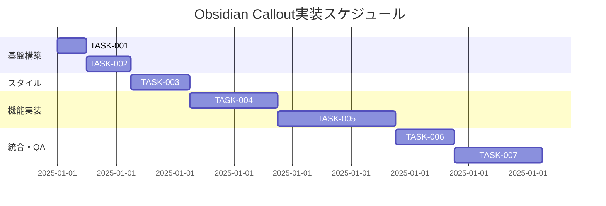

# Obsidian Callout機能 実装タスク

## 概要

全タスク数: 7
推定作業時間: 6時間
クリティカルパス: TASK-001 → TASK-002 → TASK-003 → TASK-004

## タスク一覧

### フェーズ1: 基盤構築・環境準備

#### TASK-001: パッケージ依存関係の追加

- [ ] **タスク完了**
- **タスクタイプ**: DIRECT
- **要件リンク**: REQ-001
- **依存タスク**: なし
- **実装詳細**:
  - rehype-calloutsライブラリのインストール
  - package.jsonの更新
  - 必要に応じてCSS関連の依存関係を追加
- **テスト要件**:
  - [ ] パッケージインストールの確認
  - [ ] 依存関係の競合チェック
- **完了条件**:
  - [ ] rehype-calloutsがnode_modulesに存在
  - [ ] package.jsonが正しく更新されている
  - [ ] npm install が成功する

#### TASK-002: Astro設定の更新

- [ ] **タスク完了**
- **タスクタイプ**: DIRECT
- **要件リンク**: REQ-001, REQ-104, REQ-401, REQ-402
- **依存タスク**: TASK-001
- **実装詳細**:
  - astro.config.mjsでrehype-calloutsプラグインを設定
  - wikilinkプラグインとの実行順序を考慮した設定
  - MDXとMarkdownの両方でプラグインを有効化
- **テスト要件**:
  - [ ] Astroビルドが成功する
  - [ ] プラグインの読み込み確認
  - [ ] 既存のwikilink機能が維持される
- **完了条件**:
  - [ ] astro.config.mjsが正しく設定されている
  - [ ] 開発サーバーが正常に起動する
  - [ ] ビルドプロセスが成功する

### フェーズ2: スタイル実装

#### TASK-003: Obsidianテーマの適用

- [ ] **タスク完了**
- **タスクタイプ**: DIRECT
- **要件リンク**: REQ-002, REQ-005, NFR-203
- **依存タスク**: TASK-002
- **実装詳細**:
  - rehype-calloutsのObsidianテーマCSSをインポート
  - カスタムCSSでモバイル対応を追加
  - アイコンの表示設定
- **テスト要件**:
  - [ ] CSSが正しく読み込まれる
  - [ ] モバイル表示の確認
  - [ ] アイコンの表示確認
- **UI/UX要件**:
  - [ ] モバイル対応: レスポンシブデザイン
  - [ ] アクセシビリティ: コントラスト比の確認
- **完了条件**:
  - [ ] Obsidianスタイルが適用されている
  - [ ] 各calloutタイプのアイコンが表示される
  - [ ] モバイルで正しく表示される

### フェーズ3: 機能実装・テスト

#### TASK-004: 基本callout機能の実装

- [ ] **タスク完了**
- **タスクタイプ**: TDD
- **要件リンク**: REQ-003, REQ-004, REQ-201, REQ-202
- **依存タスク**: TASK-003
- **実装詳細**:
  - ブロッククォート記法 `> [!type]` の認識
  - note、warning、info、tip、cautionタイプのサポート
  - MDXページとMarkdownページでの動作確認
- **テスト要件**:
  - [ ] 単体テスト: 各calloutタイプの認識
  - [ ] 統合テスト: MDXでの表示
  - [ ] 統合テスト: Markdownでの表示
- **完了条件**:
  - [ ] 5種類のcalloutタイプが正しく表示される
  - [ ] MDXとMarkdownの両方で動作する
  - [ ] 基本的な記法が正しく処理される

#### TASK-005: 高度なcallout機能の実装

- [ ] **タスク完了**
- **タスクタイプ**: TDD
- **要件リンク**: REQ-101, REQ-102, REQ-103, NFR-202
- **依存タスク**: TASK-004
- **実装詳細**:
  - 折りたたみ機能（`> [!type]-` 記法）
  - calloutタイトルの表示機能
  - callout内でのMarkdown記法処理
  - キーボードアクセシビリティ
- **テスト要件**:
  - [ ] 単体テスト: 折りたたみ機能
  - [ ] 単体テスト: タイトル表示
  - [ ] 統合テスト: Markdown記法の処理
  - [ ] アクセシビリティテスト: キーボード操作
- **UI/UX要件**:
  - [ ] ローディング状態: 折りたたみアニメーション
  - [ ] アクセシビリティ: ARIA属性、キーボード操作
- **完了条件**:
  - [ ] 折りたたみ機能が正しく動作する
  - [ ] calloutタイトルが表示される
  - [ ] callout内のMarkdownが正しく処理される
  - [ ] キーボードで操作可能

### フェーズ4: 統合・品質保証

#### TASK-006: wikilink統合テスト

- [ ] **タスク完了**
- **タスクタイプ**: TDD
- **要件リンク**: REQ-104, REQ-401, EDGE-201, EDGE-202
- **依存タスク**: TASK-005
- **実装詳細**:
  - wikilinkプラグインとの統合確認
  - callout内でのwikilink動作確認
  - callout内でのwikilink画像表示確認
  - プラグイン実行順序の最適化
- **テスト要件**:
  - [ ] 統合テスト: wikilink + calloutの同時使用
  - [ ] 統合テスト: callout内でのwikilink（テキストリンク）
  - [ ] 統合テスト: callout内でのwikilink画像表示
  - [ ] 統合テスト: callout内の複合的なwikilink使用
  - [ ] 回帰テスト: 既存wikilink機能の確認
  - [ ] 回帰テスト: 既存wikilink画像機能の確認
- **詳細テストケース**:
  - [ ] callout内の基本的なwikilink: `> [!note] [[../page/index.md]]`
  - [ ] callout内のwikilink画像: `> [!info] ![[test-image.png]]`
  - [ ] callout内のwikilink画像（alt付き）: `> [!tip] ![[image.jpg|Alt text]]`
  - [ ] callout内の複数wikilink画像: `> [!warning] ![[img1.png]] and ![[img2.jpg]]`
  - [ ] callout内の相対パスwikilink画像: `> [!note] ![[../assets/photo.jpg]]`
  - [ ] callout内の絶対パスwikilink画像: `> [!info] ![[/images/banner.png]]`
  - [ ] callout内でwikilinkとwikilink画像の混在使用
  - [ ] 折りたたみcallout内でのwikilink画像表示
  - [ ] callout + wikilinkの日本語ファイル名対応
- **UI/UX要件**:
  - [ ] callout内の画像が正しいサイズで表示される
  - [ ] callout内の画像がレスポンシブに動作する
  - [ ] callout内の画像alt属性が正しく設定される
- **完了条件**:
  - [ ] wikilinkとcalloutが同時に正しく動作する
  - [ ] callout内のwikilinkが正しく処理される
  - [ ] callout内のwikilink画像が正しく表示される
  - [ ] 既存のwikilink機能が影響を受けない
  - [ ] 既存のwikilink画像機能が影響を受けない

#### TASK-007: エラーハンドリング・エッジケース対応

- [ ] **タスク完了**
- **タスクタイプ**: TDD
- **要件リンク**: EDGE-001, EDGE-002, EDGE-003, EDGE-101, EDGE-102
- **依存タスク**: TASK-006
- **実装詳細**:
  - 不正なcallout記法の処理
  - 未知のcalloutタイプの処理
  - 入れ子calloutの処理
  - 空calloutの処理
  - 長いタイトルの処理
- **テスト要件**:
  - [ ] エラーケーステスト: 不正記法
  - [ ] エラーケーステスト: 未知タイプ
  - [ ] 境界値テスト: 空callout
  - [ ] 境界値テスト: 長いタイトル
  - [ ] パフォーマンステスト: 大量callout
- **エラーハンドリング**:
  - [ ] 不正記法時の通常ブロッククォート表示
  - [ ] 未知タイプ時のデフォルト表示
  - [ ] 入れ子callout時の警告または適切な処理
- **完了条件**:
  - [ ] すべてのエラーケースが適切に処理される
  - [ ] システムがクラッシュしない
  - [ ] ユーザーに分かりやすいフォールバックが提供される

## 実行順序

## マイルストーン

### マイルストーン1: 基盤完成 (TASK-002完了後)
- [ ] rehype-calloutsがAstroプロジェクトに統合されている
- [ ] 開発環境でビルドが成功する

### マイルストーン2: 基本機能完成 (TASK-004完了後)
- [ ] 基本的なcalloutが表示される
- [ ] Obsidianスタイルが適用されている

### マイルストーン3: 全機能完成 (TASK-005完了後)
- [ ] 折りたたみ機能が動作する
- [ ] すべての高度な機能が実装されている

### マイルストーン4: プロダクション準備完了 (TASK-007完了後)
- [ ] すべてのエッジケースが処理される
- [ ] 既存機能との互換性が確保されている
- [ ] プロダクション品質に達している

## 品質チェックリスト

### 機能品質
- [ ] 全要件が実装されている
- [ ] すべてのテストが通過している
- [ ] パフォーマンス要件を満たしている

### コード品質
- [ ] 既存のコード規約に従っている
- [ ] 適切なエラーハンドリングが実装されている
- [ ] セキュリティ要件が満たされている

### ユーザビリティ
- [ ] アクセシビリティ要件を満たしている
- [ ] モバイル対応が完了している
- [ ] 直感的な操作が可能