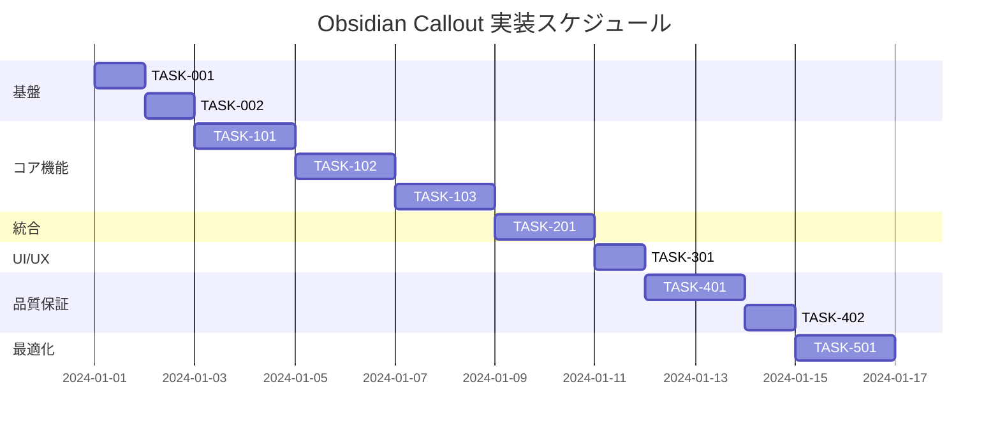

# Obsidian Callout 実装タスク

## 概要

全タスク数: 9
推定作業時間: 16-20時間
クリティカルパス: TASK-001 → TASK-002 → TASK-101 → TASK-102 → TASK-103 → TASK-201

## タスク一覧

### フェーズ1: 環境構築・基盤設定

#### TASK-001: 必要なライブラリの追加

- [x] **タスク完了**
- **タスクタイプ**: DIRECT
- **要件リンク**: REQ-004, REQ-401
- **依存タスク**: なし
- **実装詳細**:
  - `rehype` パッケージのインストール
  - `hast-util-select` のインストール
  - `hast-util-to-string` のインストール
  - `hast-util-is-element` のインストール
- **テスト要件**:
  - [ ] パッケージのインストール確認
  - [ ] 基本的なrehypeプラグインの動作テスト
- **完了条件**:
  - [ ] package.jsonに必要な依存関係が追加されている
  - [ ] npm installが正常に完了する

#### TASK-002: 基本プラグイン構造の作成

- [x] **タスク完了**
- **タスクタイプ**: DIRECT
- **要件リンク**: REQ-004, REQ-401, REQ-402
- **依存タスク**: TASK-001
- **実装詳細**:
  - `src/plugins/rehype-callout/index.js` ファイルの作成
  - 基本的なrehypeプラグイン構造の実装
  - blockquoteノードの検出ロジック
  - Astro設定ファイルへのプラグイン追加
- **テスト要件**:
  - [ ] プラグインの基本構造テスト
  - [ ] Astroビルドエラーがないことを確認
- **完了条件**:
  - [ ] rehypeプラグインファイルが作成されている
  - [ ] astro.config.mjsに設定が追加されている
  - [ ] ビルドが正常に通る

### フェーズ2: コア機能実装

#### TASK-101: 基本的なcallout認識・変換機能

- [x] **タスク完了**
- **タスクタイプ**: TDD
- **要件リンク**: REQ-001, REQ-002, REQ-003
- **依存タスク**: TASK-002
- **実装詳細**:
  - blockquote内の `> [!type]` パターン検出
  - 11種類のcalloutタイプ（note, tip, info, warning, danger, success, question, failure, bug, example, quote）の認識
  - HTML構造への変換ロジック
  - CSSクラスの付与
- **テスト要件**:
  - [ ] 単体テスト: callout記法の検出
  - [ ] 単体テスト: 各calloutタイプの認識
  - [ ] 統合テスト: HTML出力の確認
- **エラーハンドリング**:
  - [ ] 不正なcalloutタイプの処理 (EDGE-001)
  - [ ] 通常のblockquoteとの区別
- **完了条件**:
  - [ ] 基本的なcallout (`> [!note]`) が正しくHTMLに変換される
  - [ ] 11種類すべてのcalloutタイプが認識される

#### TASK-102: カスタムタイトル・折りたたみ機能

- [x] **タスク完了** *(TASK-101で実装済み)*
- **タスクタイプ**: TDD
- **要件リンク**: REQ-101, REQ-102, REQ-103, REQ-104
- **依存タスク**: TASK-101
- **実装詳細**:
  - `> [!type Title]` 形式のカスタムタイトル解析
  - `> [!type]+` / `> [!type]-` 形式の折りたたみ記法解析
  - 折りたたみ用のHTML構造とJavaScript実装
  - 初期状態（展開/折りたたみ）の制御
- **テスト要件**:
  - [ ] 単体テスト: カスタムタイトルの解析
  - [ ] 単体テスト: 折りたたみ記法の解析
  - [ ] 統合テスト: 折りたたみ機能の動作
- **UI/UX要件**:
  - [ ] 折りたたみアイコンの表示
  - [ ] アニメーション効果
  - [ ] キーボード操作対応
  - [ ] アクセシビリティ: ARIA属性の設定
- **完了条件**:
  - [ ] カスタムタイトルが正しく表示される
  - [ ] 折りたたみ機能が正しく動作する

#### TASK-103: ネスト機能

- [x] **タスク完了**
- **タスクタイプ**: TDD
- **要件リンク**: REQ-105, NFR-002
- **依存タスク**: TASK-102
- **実装詳細**:
  - callout内のネストされたcallout検出
  - 階層構造の適切な処理
  - ネストレベルの制限（20レベル）
  - CSS スタイリングの階層対応
- **テスト要件**:
  - [ ] 単体テスト: ネスト構造の解析
  - [ ] 単体テスト: ネストレベル制限
  - [ ] 統合テスト: 複数レベルのネスト表示
- **エラーハンドリング**:
  - [ ] 深すぎるネストの警告 (EDGE-003)
  - [ ] 無効なネスト構造の処理
- **完了条件**:
  - [ ] 3レベル以上のネストが正しく表示される
  - [ ] ネストレベル制限が適切に機能する

### フェーズ3: マークダウン統合・互換性

#### TASK-201: callout内マークダウン処理

- [ ] **タスク完了**
- **タスクタイプ**: TDD
- **要件リンク**: REQ-003, REQ-202
- **依存タスク**: TASK-103
- **実装詳細**:
  - callout内のマークダウンコンテンツの再帰的処理
  - 既存wikilinkプラグインとの互換性確保
  - リンク、画像、コードブロック、リストなどの適切な変換
- **テスト要件**:
  - [ ] 統合テスト: wikilink記法の動作確認
  - [ ] 統合テスト: 各種マークダウン記法の処理
  - [ ] 統合テスト: GFM記法との互換性
- **互換性要件**:
  - [ ] 既存wikilink機能への影響なし
  - [ ] GFMとの併用テスト
  - [ ] 既存コンテンツの誤変換防止 (EDGE-203)
- **完了条件**:
  - [ ] callout内でwikilink記法が正しく動作する
  - [ ] callout内で各種マークダウン記法が正しく処理される

### フェーズ4: スタイリング・UX

#### TASK-301: CSS スタイリング

- [ ] **タスク完了**
- **タスクタイプ**: DIRECT
- **要件リンク**: REQ-302, NFR-201, NFR-202
- **依存タスク**: TASK-201
- **実装詳細**:
  - callout用CSSスタイルの作成
  - 11種類のcalloutタイプ別スタイル
  - レスポンシブデザイン対応
  - ネスト表示の適切なインデント
- **UI/UX要件**:
  - [ ] モバイルデバイス対応
  - [ ] ダークモード対応（必要に応じて）
  - [ ] 適切な色彩コントラスト確保
  - [ ] 視覚的な階層表示
- **アクセシビリティ要件**:
  - [ ] スクリーンリーダー対応
  - [ ] 十分な色彩コントラスト
  - [ ] フォーカス表示の明確化
- **完了条件**:
  - [ ] 各calloutタイプが適切にスタイリングされている
  - [ ] モバイルデバイスで正しく表示される

### フェーズ5: テスト・品質保証

#### TASK-401: 包括的テストスイート

- [ ] **タスク完了**
- **タスクタイプ**: TDD
- **要件リンク**: 全要件
- **依存タスク**: TASK-301
- **実装詳細**:
  - 単体テストの網羅性確保
  - 統合テストの実装
  - エッジケーステストの実装
  - パフォーマンステスト
- **テスト要件**:
  - [ ] 基本機能の全パターンテスト
  - [ ] エラーハンドリングテスト
  - [ ] 境界値テスト
  - [ ] セキュリティテスト（XSS対応）
  - [ ] パフォーマンステスト（10,000行ドキュメント）
- **完了条件**:
  - [ ] テストカバレッジ90%以上
  - [ ] 全エッジケースのテスト通過
  - [ ] パフォーマンス要件の達成

#### TASK-402: ドキュメント・最終確認

- [ ] **タスク完了**
- **タスクタイプ**: DIRECT
- **要件リンク**: NFR-301
- **依存タスク**: TASK-401
- **実装詳細**:
  - プラグイン使用方法の文書化
  - 設定オプションの説明
  - 既存コードへの統合確認
- **テスト要件**:
  - [ ] 既存機能への副作用確認
  - [ ] ビルド・デプロイメントテスト
  - [ ] ホットリロード動作確認
- **完了条件**:
  - [ ] 全受け入れ基準のテスト通過
  - [ ] 既存機能に影響がない
  - [ ] ドキュメントが整備されている

### フェーズ6: パフォーマンス最適化

#### TASK-501: パフォーマンス最適化

- [ ] **タスク完了**
- **タスクタイプ**: TDD
- **要件リンク**: NFR-001, REQ-403
- **依存タスク**: TASK-402
- **実装詳細**:
  - 処理速度の最適化
  - メモリ使用量の削減
  - 大型ドキュメント処理の改善
- **テスト要件**:
  - [ ] 大型ドキュメント（10,000行）での処理時間測定
  - [ ] メモリ使用量の監視
  - [ ] ビルド時間への影響測定
- **完了条件**:
  - [ ] 5秒以内の処理完了（10,000行ドキュメント）
  - [ ] ビルド時間への影響が最小限

## 実行順序

## サブタスクテンプレート

### TDDタスクの場合

各タスクは以下のTDDプロセスで実装:

1. `tdd-requirements.md` - 詳細要件定義
2. `tdd-testcases.md` - テストケース作成
3. `tdd-red.md` - テスト実装（失敗）
4. `tdd-green.md` - 最小実装
5. `tdd-refactor.md` - リファクタリング
6. `tdd-verify-complete.md` - 品質確認

### DIRECTタスクの場合

各タスクは以下のDIRECTプロセスで実装:

1. `direct-setup.md` - 直接実装・設定
2. `direct-verify.md` - 動作確認・品質確認

## 重要な技術的制約

1. **rehypeプラグイン**: remarkではなくrehypeでの実装が必須
2. **処理順序**: 既存wikilinkプラグイン（remark）の後で実行
3. **互換性**: 既存のwikilink機能と競合しないこと
4. **パフォーマンス**: 大型ドキュメントでも5秒以内の処理完了
5. **アクセシビリティ**: スクリーンリーダー対応とキーボード操作対応

## 品質基準

- テストカバレッジ: 90%以上
- エラーハンドリング: 全エッジケースのカバー
- セキュリティ: XSS脆弱性対策の実装
- アクセシビリティ: WCAG 2.1 AA準拠
- パフォーマンス: NFR-001の要件達成