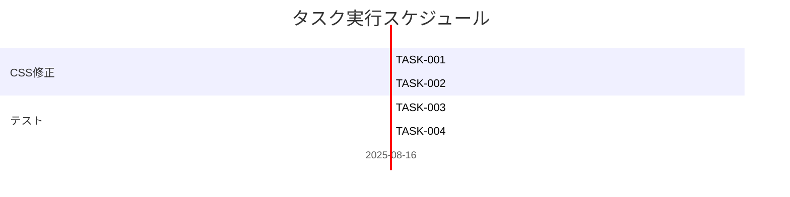

# 引用ネスト時のフォントサイズ問題修正 実装タスク

## 概要

全タスク数: 4
推定作業時間: 2時間
クリティカルパス: TASK-001 → TASK-002 → TASK-003 → TASK-004

## タスク一覧

### フェーズ1: CSS修正

#### TASK-001: CSSスタイル修正

- [x] **タスク完了**
- **タスクタイプ**: DIRECT
- **要件リンク**: REQ-001, REQ-002, REQ-003, IMPL-001, IMPL-002
- **依存タスク**: なし
- **実装詳細**:
  - `/src/styles/global.css`の124-129行目を修正
  - `font-size: 1.333em` を `font-size: 0.95em` に変更
  - フォントサイズ継承を防ぐプロパティの検討（必要に応じて）
  - CSSセレクタの詳細度確認
- **テスト要件**:
  - [ ] CSSの構文エラーがないこと
  - [ ] セレクタの優先度が適切であること
- **完了条件**:
  - [ ] 通常のblockquoteが0.95emのフォントサイズで表示される
  - [ ] calloutクラスとの分離が維持される

#### TASK-002: ブラウザ動作確認

- [x] **タスク完了**
- **タスクタイプ**: DIRECT  
- **要件リンク**: REQ-001, REQ-002, REQ-101, REQ-102
- **依存タスク**: TASK-001
- **実装詳細**:
  - 開発サーバーでの表示確認
  - ネストされた引用の表示確認
  - callout機能との競合確認
- **テスト要件**:
  - [ ] 通常の引用表示テスト
  - [ ] 2レベルネスト引用テスト  
  - [ ] 3レベルネスト引用テスト
  - [ ] callout機能動作テスト
- **完了条件**:
  - [ ] ネストレベルに関わらずフォントサイズが一定
  - [ ] callout機能が正常に動作する

### フェーズ2: 包括的テスト

#### TASK-003: テストページでの動作確認

- [ ] **タスク完了**
- **タスクタイプ**: TDD
- **要件リンク**: EDGE-001, EDGE-002, EDGE-101, EDGE-102, IMPL-102, IMPL-103
- **依存タスク**: TASK-002
- **実装詳細**:
  - `/src/content/blog/markdown-basic-test/index.md`での表示確認
  - `/src/content/blog/wikilink-test/index.md`での表示確認
  - ネストされた引用のケース確認
  - 引用内のWikiLink動作確認
- **テスト要件**:
  - [ ] 既存テストページの表示確認
  - [ ] 引用内コンテンツの正常表示
  - [ ] WikiLink機能の動作確認
  - [ ] Markdown記法の組み合わせテスト
- **UI/UX要件**:
  - [ ] 視覚的一貫性: ネスト階層が分かりやすい
  - [ ] 読みやすさ: フォントサイズが適切
  - [ ] モバイル対応: レスポンシブデザイン維持
- **完了条件**:
  - [ ] 引用内のリスト、テーブル、コードブロックが適切に表示される
  - [ ] 引用内のWikiLinkが正常に動作する
  - [ ] 既存記事の表示に破綻がない

#### TASK-004: レスポンシブ・互換性テスト

- [ ] **タスク完了**
- **タスクタイプ**: TDD
- **要件リンク**: NFR-102, EDGE-201, EDGE-202, REQ-403
- **依存タスク**: TASK-003
- **実装詳細**:
  - モバイルデバイスでの表示確認
  - 画面サイズ720px以下での動作確認
  - 異なるブラウザでの互換性確認
  - パフォーマンス確認
- **テスト要件**:
  - [ ] レスポンシブデザインテスト
  - [ ] 異なる画面サイズでの表示テスト
  - [ ] ブラウザ間互換性テスト
  - [ ] ページロード時間測定
- **UI/UX要件**:
  - [ ] モバイル対応: タッチ操作に適した表示
  - [ ] アクセシビリティ: フォントサイズの視認性
  - [ ] パフォーマンス: レンダリング速度維持
- **完了条件**:
  - [ ] モバイルデバイスで適切に表示される
  - [ ] ページロード時間が基準値内に収まる
  - [ ] レイアウト崩れが発生しない

## 実行順序

## サブタスクテンプレート

### DIRECTタスクの場合（TASK-001, TASK-002）

各タスクは以下のDIRECTプロセスで実装:

1. `direct-setup.md` - 直接実装・設定
2. `direct-verify.md` - 動作確認・品質確認

### TDDタスクの場合（TASK-003, TASK-004）

各タスクは以下のTDDプロセスで実装:

1. `tdd-requirements.md` - 詳細要件定義
2. `tdd-testcases.md` - テストケース作成
3. `tdd-red.md` - テスト実装（失敗）
4. `tdd-green.md` - 最小実装
5. `tdd-refactor.md` - リファクタリング
6. `tdd-verify-complete.md` - 品質確認

## 品質確認チェックリスト

### 機能要件確認

- [ ] REQ-001: 通常のblockquoteが0.95emで表示される
- [ ] REQ-002: ネストレベルに関わらずフォントサイズが一定
- [ ] REQ-003: callout機能との分離が維持される
- [ ] REQ-101: ネスト時のフォントサイズ継承が防止される
- [ ] REQ-102: 複数レベル適用時の適切な処理

### 非機能要件確認

- [ ] NFR-001: レンダリング性能が劣化していない
- [ ] NFR-002: ページロード時間が5%以下の影響
- [ ] NFR-101: 既存記事の表示に破綻がない
- [ ] NFR-102: モバイル表示が適切に動作する

### Edgeケース確認

- [ ] EDGE-001: 3レベル以上の深いネストで安定
- [ ] EDGE-002: callout内ネスト引用の適切表示
- [ ] EDGE-003: 引用内calloutの適切表示
- [ ] EDGE-101: 引用内コンテンツの適切表示
- [ ] EDGE-102: 引用内WikiLinkの正常動作