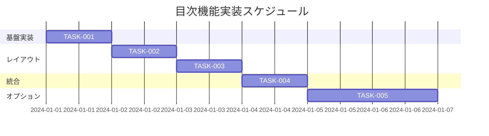

# 目次機能 実装タスク

## 概要

全タスク数: 5
推定作業時間: 6時間
クリティカルパス: TASK-001 → TASK-002 → TASK-003 → TASK-004

## タスク一覧

### フェーズ1: 基盤コンポーネント実装

#### TASK-001: TableOfContents基本コンポーネント

- [x] **タスク完了**
- **タスクタイプ**: DIRECT
- **要件リンク**: REQ-001, REQ-201, REQ-302, NFR-001
- **依存タスク**: なし
- **実装詳細**:
  - Astroコンポーネント `src/components/TableOfContents.astro` 作成
  - サーバーサイドでの見出し要素（H2, H3）の抽出
  - 見出しIDの自動生成（slugify）
  - 目次データ構造の構築（id, text, level, href）
  - 階層構造のインデント表示
  - セマンティックな HTML 構造（nav, ul, li, a）
- **テスト要件**:
  - [ ] 見出し要素が正しく検出される
  - [ ] 階層構造が適切に構築される
  - [ ] 生成されるHTMLがセマンティック
- **エラーハンドリング**:
  - [ ] 見出しが存在しない場合の非表示処理 (EDGE-001)
  - [ ] 無効なHTML構造の見出しのフィルタリング (EDGE-002)
  - [ ] 空の見出しテキストのデフォルト値設定 (EDGE-003)
- **完了条件**:
  - [ ] コンポーネントが正常にレンダリングされる
  - [ ] 見出し階層が適切に表示される
  - [ ] Edge ケースが適切に処理される

### フェーズ2: レイアウト実装

#### TASK-002: CSS Gridレイアウト実装

- [x] **タスク完了**
- **タスクタイプ**: DIRECT
- **要件リンク**: REQ-002, REQ-101, REQ-401, NFR-002
- **依存タスク**: TASK-001
- **実装詳細**:
  - CSS Grid レイアウトの実装
  - デスクトップ: 2カラム（prose + 目次）レイアウト
  - モバイル: 1カラム（目次が上部）レイアウト
  - レスポンシブブレークポイントの設定
  - Grid gap とマージンの調整
  - プリントスタイルの考慮
- **CSS実装**:
  ```css
  .blog-layout {
    display: grid;
    grid-template-columns: 1fr 250px;
    gap: 2rem;
  }
  @media (max-width: 768px) {
    .blog-layout {
      grid-template-columns: 1fr;
    }
    .table-of-contents {
      order: -1;
    }
  }
  ```
- **テスト要件**:
  - [ ] デスクトップで並列レイアウトが表示される
  - [ ] モバイルで目次が上部に移動する
  - [ ] ブレークポイントで適切に切り替わる
- **UI/UX要件**:
  - [ ] レスポンシブデザイン: 768px以下でモバイルレイアウト
  - [ ] 水平スクロール防止の確認
  - [ ] 適切な余白とギャップ
- **完了条件**:
  - [ ] 全画面サイズで適切にレイアウトされる
  - [ ] 水平スクロールが発生しない
  - [ ] プリント時も適切に表示される

#### TASK-003: CSS Sticky Position実装

- [x] **タスク完了**
- **タスクタイプ**: DIRECT
- **要件リンク**: REQ-003, REQ-004, NFR-002
- **依存タスク**: TASK-002
- **実装詳細**:
  - CSS sticky positioning の実装
  - スクロール時の固定表示
  - スムーズスクロールの実装
  - sticky 動作の最適化
  - ブラウザ互換性の確保
- **CSS実装**:
  ```css
  .table-of-contents {
    position: sticky;
    top: 2rem;
    height: fit-content;
    align-self: start;
  }
  html {
    scroll-behavior: smooth;
  }
  ```
- **テスト要件**:
  - [ ] スクロール時に目次が固定される
  - [ ] スムーズスクロールが動作する
  - [ ] ページ上部への復帰が正常
- **UI/UX要件**:
  - [ ] 自然なスクロール体験
  - [ ] 適切なsticky位置の設定
  - [ ] モバイルでのsticky動作確認
- **エラーハンドリング**:
  - [ ] 短いページでのsticky動作 (EDGE-101)
  - [ ] sticky非対応ブラウザの対応
- **完了条件**:
  - [ ] sticky positionが正常に動作する
  - [ ] スムーズスクロールが実装される
  - [ ] ブラウザ互換性が確保される

### フェーズ3: 統合・完成

#### TASK-004: ブログレイアウト統合

- [x] **タスク完了**
- **タスクタイプ**: DIRECT
- **要件リンク**: REQ-004, REQ-401, REQ-402
- **依存タスク**: TASK-003
- **実装詳細**:
  - BlogPost.astro レイアウトへの統合
  - 目次表示/非表示のロジック（見出し数による）
  - アクセシビリティ属性の追加
  - SEO 最適化（構造化データ）
  - 既存スタイルとの統合
- **統合作業**:
  ```astro
  <!-- BlogPost.astro内 -->
  <div class="blog-layout">
    <article class="prose">
      <slot />
    </article>
    <TableOfContents headings={headings} />
  </div>
  ```
- **テスト要件**:
  - [ ] ブログ記事で目次が正常に表示される
  - [ ] 既存機能との競合がない
  - [ ] SEOへの悪影響がない
- **UI/UX要件**:
  - [ ] アクセシビリティ: ARIA属性、ランドマーク
  - [ ] キーボードナビゲーション対応
  - [ ] スクリーンリーダー対応
  - [ ] コントラスト比の確保
- **完了条件**:
  - [ ] 全ブログ記事で適切に動作する
  - [ ] アクセシビリティ基準を満たす
  - [ ] 既存機能に影響しない

### フェーズ4: 拡張機能（オプション）

#### TASK-005: アクティブ状態管理機能

- [x] **タスク完了**
- **タスクタイプ**: TDD
- **要件リンク**: REQ-102, REQ-103, REQ-202
- **依存タスク**: TASK-004
- **実装詳細**:
  - Intersection Observer API の実装
  - 現在表示セクションの検出
  - アクティブ状態のクラス管理
  - パフォーマンス最適化（スロットリング）
  - プログレッシブエンハンスメント
- **JavaScript実装**:
  ```javascript
  const observer = new IntersectionObserver((entries) => {
    entries.forEach(entry => {
      const id = entry.target.id;
      const tocItem = document.querySelector(`[href="#${id}"]`);
      if (entry.isIntersecting) {
        tocItem?.classList.add('active');
      } else {
        tocItem?.classList.remove('active');
      }
    });
  });
  ```
- **テスト要件**:
  - [ ] TDD: 失敗テストから開始
  - [ ] 単体テスト: Intersection Observer ロジック
  - [ ] 統合テスト: スクロール時のアクティブ状態
  - [ ] E2Eテスト: ユーザーインタラクション
- **UI/UX要件**:
  - [ ] アクティブ項目のビジュアルハイライト
  - [ ] スムーズなアクティブ状態切り替え
  - [ ] JavaScript無効時の graceful degradation
- **完了条件**:
  - [ ] アクティブ状態が正確に更新される
  - [ ] JavaScript無効でも基本機能が動作
  - [ ] パフォーマンスに悪影響しない

## 実行順序



## サブタスクテンプレート

### DIRECTタスクの場合

各タスクは以下のDIRECTプロセスで実装:

1. **direct-setup.md** - 直接実装・設定
2. **direct-verify.md** - 動作確認・品質確認

### TDDタスクの場合（TASK-005のみ）

TASK-005は以下のTDDプロセスで実装:

1. **tdd-requirements.md** - 詳細要件定義
2. **tdd-testcases.md** - テストケース作成
3. **tdd-red.md** - テスト実装（失敗）
4. **tdd-green.md** - 最小実装
5. **tdd-refactor.md** - リファクタリング
6. **tdd-verify-complete.md** - 品質確認

## クリティカルパス詳細

**TASK-001 → TASK-002 → TASK-003 → TASK-004**

1. **基本コンポーネント** (1日): サーバーサイド見出し抽出
2. **Grid レイアウト** (1日): レスポンシブ対応
3. **Sticky Position** (1日): スクロール固定
4. **ブログ統合** (1日): 最終統合とテスト
5. **アクティブ状態** (2日): オプション機能

## 技術スタック

### 必須技術
- **Astro**: サーバーサイドコンポーネント
- **CSS Grid**: レイアウト システム
- **CSS Sticky**: スクロール固定
- **CSS Media Queries**: レスポンシブ対応

### オプション技術
- **JavaScript**: アクティブ状態管理（TASK-005）
- **Intersection Observer API**: セクション検出

## パフォーマンス考慮事項

- **Zero Runtime Cost**: サーバーサイド生成
- **Native Browser Optimization**: CSS Grid + Sticky
- **Progressive Enhancement**: JavaScript is optional
- **Mobile-First**: レスポンシブ設計

## アクセシビリティ要件

- [ ] セマンティック HTML（nav, ul, li, a）
- [ ] 適切な ARIA 属性
- [ ] キーボードナビゲーション
- [ ] スクリーンリーダー対応
- [ ] コントラスト比 4.5:1 以上
- [ ] フォーカス表示

## ブラウザ サポート

### 必須サポート
- **CSS Grid**: IE11+ (fallback with flexbox)
- **CSS Sticky**: Chrome 56+, Firefox 59+, Safari 13+

### Graceful Degradation
- Grid非対応: Flexbox fallback
- Sticky非対応: Static positioning