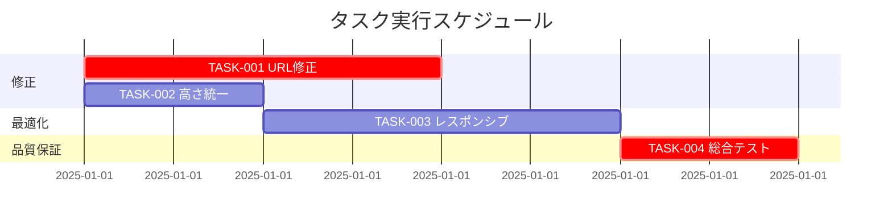

# 個別タグページデザイン改善 実装タスク

## 概要

全タスク数: 4
推定作業時間: 4-6時間
クリティカルパス: TASK-001 → TASK-002 → TASK-003 → TASK-004

## タスク一覧

### フェーズ1: URL不整合修正（最優先）

#### TASK-001: TagTreeコンポーネントのURL修正

- [x] **タスク完了**
- **タスクタイプ**: TDD
- **要件リンク**: REQ-001, REQ-101, REQ-102
- **依存タスク**: なし
- **実装詳細**:
  - TagTree.astroのbaseUrlパラメータ使用方法を修正
  - タグスラッグ生成でハイフン区切りをスラッシュ区切りに変更
  - 階層タグのhref生成ロジックを修正
- **テスト要件**:
  - [ ] 単体テスト: 階層タグURLが正しく生成される
  - [ ] 統合テスト: タグ一覧→個別タグページ遷移
  - [ ] 回帰テスト: 既存の単一タグURLに影響がない
- **エラーハンドリング**:
  - [ ] 不正なタグパス処理
  - [ ] 存在しないタグへのアクセス
- **完了条件**:
  - [x] tech/webクリックで/tags/tech/webに正しく遷移
  - [x] すべての階層タグリンクが機能する
  - [x] 既存のタグページに影響がない

### フェーズ2: スタイル統一

#### TASK-002: TagBadgeコンポーネントの高さ統一

- [ ] **タスク完了**
- **タスクタイプ**: TDD
- **要件リンク**: REQ-002, REQ-201
- **依存タスク**: なし（TASK-001と並行実行可能）
- **実装詳細**:
  - tag-variables.cssのCSS変数値調整
  - TagBadge.astroのpadding/margin統一
  - line-heightとfont-sizeの微調整
- **UI/UX要件**:
  - [ ] 統一性: 全コンテキストで同じ高さ
  - [ ] アクセシビリティ: 最小タップサイズ44px確保
  - [ ] 視覚的調和: 隣接要素との整列
- **テスト要件**:
  - [ ] ビジュアルテスト: 記事一覧での高さ統一
  - [ ] レスポンシブテスト: モバイルでの表示確認
  - [ ] 回帰テスト: 他ページのタグバッジに影響がない
- **完了条件**:
  - [ ] 個別タグページ内のタグバッジ高さが統一
  - [ ] 記事一覧とタグ詳細で同じ見た目
  - [ ] モバイルでも適切に表示

#### TASK-003: レスポンシブデザイン最適化

- [ ] **タスク完了**
- **タスクタイプ**: TDD
- **要件リンク**: REQ-003, REQ-103, NFR-101
- **依存タスク**: TASK-002（CSS変数を使用するため）
- **実装詳細**:
  - tag-variables.cssにモバイル用変数追加
  - [...]slug].astroのメディアクエリ最適化
  - パンくずナビゲーションのモバイル対応
- **UI/UX要件**:
  - [ ] モバイル対応: 320px幅でも適切に表示
  - [ ] タッチ操作: タップサイズ44px以上確保
  - [ ] 読みやすさ: フォントサイズとスペーシング調整
  - [ ] ナビゲーション: パンくずの省略表示対応
- **テスト要件**:
  - [ ] レスポンシブテスト: 320px〜1920px各解像度
  - [ ] タッチテスト: モバイルデバイスでの操作性
  - [ ] パフォーマンステスト: モバイルでの表示速度
- **エラーハンドリング**:
  - [ ] 長いタグ名での表示崩れ防止
  - [ ] 画面回転時のレイアウト維持
- **完了条件**:
  - [ ] 全デバイスで適切に表示される
  - [ ] タッチ操作が快適
  - [ ] 表示速度が許容範囲内

### フェーズ3: 品質保証・最適化

#### TASK-004: 総合テストと品質確認

- [ ] **タスク完了**
- **タスクタイプ**: TDD
- **要件リンク**: 全要件
- **依存タスク**: TASK-001, TASK-002, TASK-003
- **実装詳細**:
  - E2Eテストスイート作成
  - パフォーマンステスト実行
  - アクセシビリティテスト実行
  - 回帰テスト実行
- **テスト要件**:
  - [ ] E2Eテスト: 主要ユーザーフローの自動化
  - [ ] パフォーマンステスト: ページ表示速度3秒以内
  - [ ] アクセシビリティテスト: WCAG AA基準適合
  - [ ] 回帰テスト: 既存機能への影響確認
- **UI/UX要件**:
  - [ ] ユーザビリティ: 直感的なナビゲーション
  - [ ] 一貫性: 全ページでの統一感
  - [ ] パフォーマンス: 快適な操作感
- **品質基準**:
  - [ ] すべての受け入れ基準をクリア
  - [ ] ブラウザ互換性確認（Chrome, Firefox, Safari, Edge）
  - [ ] デバイス互換性確認（デスクトップ、タブレット、モバイル）
- **完了条件**:
  - [ ] 全テストがパス
  - [ ] パフォーマンス基準をクリア
  - [ ] アクセシビリティ基準をクリア
  - [ ] プロダクション環境での動作確認

## 実行順序



## 各タスクの詳細実装ガイド

### TASK-001: URL修正の具体的手順

1. **問題箇所の特定**:
   - `src/components/TagTree.astro` 168行目付近
   - `href={`${baseUrl}${item.tag.slug}`}` の部分

2. **修正内容**:
   ```astro
   // 修正前
   href={`${baseUrl}${item.tag.slug}`}

   // 修正後
   href={`${baseUrl}${item.tag.name.toLowerCase()}`}
   ```

3. **テスト方法**:
   - ブラウザで /tags/ にアクセス
   - techタグを展開
   - tech/webをクリックして正しいページに遷移することを確認

### TASK-002: 高さ統一の具体的手順

1. **CSS変数の調整**:
   - `src/styles/tag-variables.css` の padding, line-height 値調整

2. **視覚的確認**:
   - 個別タグページで記事一覧のタグバッジ高さを確認
   - DevToolsで要素検証

### TASK-003: レスポンシブ対応の具体的手順

1. **ブレークポイント設定**:
   - 320px, 768px, 1024px でのテスト

2. **モバイル最適化**:
   - フォントサイズ、パディング、マージンの調整

## リスク管理

### 高リスク項目

1. **URL変更による既存リンク切れ**
   - **対策**: 段階的テストと回帰テスト徹底
   - **検出方法**: 全タグページの自動巡回テスト

2. **CSS変更による他コンポーネントへの影響**
   - **対策**: CSS変数の影響範囲確認
   - **検出方法**: 全ページでのビジュアル回帰テスト

### 品質基準

- **機能**: 要件定義の受け入れ基準100%クリア
- **パフォーマンス**: ページ表示3秒以内
- **アクセシビリティ**: WCAG AA基準適合
- **互換性**: 主要ブラウザ・デバイス対応

## 成功指標

- [ ] 階層タグクリック時の404エラー 0件
- [ ] タグバッジ高さ不整合 0件
- [ ] モバイル表示での問題 0件
- [ ] 既存機能への影響 0件
- [ ] パフォーマンス劣化 0件