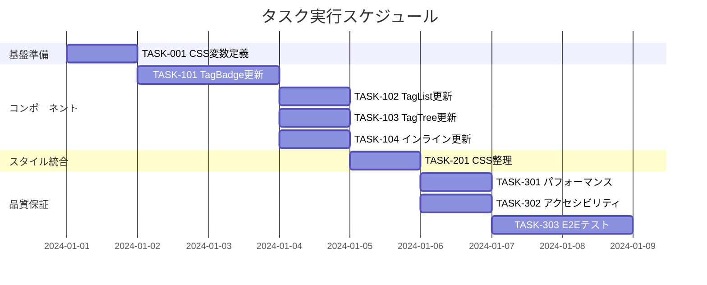

# タグスタイル統一 実装タスク

## 概要

全タスク数: 8
推定作業時間: 12時間
クリティカルパス: TASK-001 → TASK-101 → TASK-102 → TASK-201 → TASK-301

## タスク一覧

### フェーズ1: 基盤準備

#### TASK-001: CSS変数の定義と整理

- [x] **タスク完了**
- **タスクタイプ**: DIRECT
- **要件リンク**: REQ-402, NFR-301
- **依存タスク**: なし
- **実装詳細**:
  - CSS変数の定義ファイル作成
  - 統一スタイル用の変数定義
  - ダークモード用の変数定義
  - レスポンシブ用のブレークポイント定義
- **テスト要件**:
  - [ ] CSS変数が正しく読み込まれることを確認
  - [ ] ダークモードでの変数切り替えを確認
- **完了条件**:
  - [ ] すべてのCSS変数が定義されている
  - [ ] ダークモードで適切な値に切り替わる

### フェーズ2: コンポーネント実装

#### TASK-101: TagBadgeコンポーネントのスタイル統一

- [x] **タスク完了**
- **タスクタイプ**: TDD
- **要件リンク**: REQ-001, REQ-003, REQ-401
- **依存タスク**: TASK-001
- **実装詳細**:
  - 階層タグスタイルをベースにする
  - 単一タグも同じスタイルに変更
  - 出現回数表示の統一
  - ホバー効果の実装
- **テスト要件**:
  - [ ] 単体テスト: スタイル適用ロジック
  - [ ] ビジュアルテスト: 表示の一貫性
  - [ ] レスポンシブテスト: 各画面サイズでの表示
- **UI/UX要件**:
  - [ ] ホバー時のアニメーション: translateY(-1px)とbox-shadow
  - [ ] フォーカス時のアウトライン: 2px solid
  - [ ] モバイル対応: 44×44px以上のタップ領域
  - [ ] アクセシビリティ: aria-label、role属性
- **エラーハンドリング**:
  - [ ] 空のタグ名への対応
  - [ ] 極端に長いタグ名の処理

#### TASK-102: TagListコンポーネントの更新

- [ ] **タスク完了**
- **タスクタイプ**: TDD
- **要件リンク**: REQ-001, REQ-002, REQ-102
- **依存タスク**: TASK-101
- **実装詳細**:
  - TagBadgeコンポーネントの使用を確認
  - 統一スタイルの適用
  - レイアウトオプションの維持
- **テスト要件**:
  - [ ] 単体テスト: リスト表示ロジック
  - [ ] 統合テスト: TagBadgeとの連携
  - [ ] パフォーマンステスト: 100個以上のタグ表示
- **UI/UX要件**:
  - [ ] グリッド/水平/垂直レイアウトの対応
  - [ ] タグ間のスペーシング調整
  - [ ] モバイル対応: レスポンシブグリッド
- **完了条件**:
  - [ ] すべてのタグが統一スタイルで表示される
  - [ ] 出現回数が正しく表示される

#### TASK-103: TagTreeコンポーネントのスタイル適用

- [ ] **タスク完了**
- **タスクタイプ**: TDD
- **要件リンク**: REQ-001, REQ-003, REQ-203
- **依存タスク**: TASK-101
- **実装詳細**:
  - TagBadgeコンポーネントのスタイル統合
  - 階層表示での統一スタイル適用
  - 折りたたみ時のスタイル維持
- **テスト要件**:
  - [ ] 単体テスト: ツリー構造の表示
  - [ ] 統合テスト: TagBadgeとの連携
  - [ ] インタラクションテスト: 展開/折りたたみ動作
- **UI/UX要件**:
  - [ ] 階層レベルごとのインデント表示
  - [ ] 展開/折りたたみアニメーション
  - [ ] キーボードナビゲーション対応
  - [ ] スクリーンリーダー対応
- **完了条件**:
  - [ ] 階層タグが統一スタイルで表示される
  - [ ] 折りたたみ状態でもスタイルが維持される

#### TASK-104: インラインタグ処理の更新

- [ ] **タスク完了**
- **タスクタイプ**: TDD
- **要件リンク**: REQ-004, NFR-101
- **依存タスク**: TASK-101
- **実装詳細**:
  - インラインタグのHTML生成を更新
  - TagBadgeと同じCSSクラスを適用
  - エスケープ処理の確認
- **テスト要件**:
  - [ ] 単体テスト: タグ抽出と変換ロジック
  - [ ] セキュリティテスト: XSS対策の確認
  - [ ] 統合テスト: Markdownレンダリング
- **エラーハンドリング**:
  - [ ] 特殊文字のエスケープ
  - [ ] 無効なタグ名の処理
  - [ ] ネストされたタグの処理
- **完了条件**:
  - [ ] インラインタグが統一スタイルで表示される
  - [ ] セキュリティ要件を満たす

### フェーズ3: スタイル統合

#### TASK-201: グローバルCSSの整理と統一

- [ ] **タスク完了**
- **タスクタイプ**: DIRECT
- **要件リンク**: REQ-402, NFR-003, NFR-303
- **依存タスク**: TASK-101, TASK-102, TASK-103, TASK-104
- **実装詳細**:
  - 重複するスタイル定義の削除
  - CSS変数への置き換え
  - スコープの適切な設定
  - 未使用スタイルの削除
- **テスト要件**:
  - [ ] CSSサイズの確認（10KB以下）
  - [ ] スタイルの適用範囲確認
  - [ ] ビルドエラーの確認
- **完了条件**:
  - [ ] CSSが10KB以下
  - [ ] 重複スタイルが削除されている
  - [ ] 適切にスコープされている

### フェーズ4: 品質保証

#### TASK-301: パフォーマンステストとベンチマーク

- [ ] **タスク完了**
- **タスクタイプ**: TDD
- **要件リンク**: REQ-403, NFR-001, NFR-002
- **依存タスク**: TASK-201
- **実装詳細**:
  - パフォーマンステストスクリプトの作成
  - 100個以上のタグでのベンチマーク
  - レンダリング時間の測定
  - FPS測定の実装
- **テスト要件**:
  - [ ] レンダリング時間テスト（100ms以内）
  - [ ] スクロールパフォーマンステスト（60fps以上）
  - [ ] メモリリークテスト
- **完了条件**:
  - [ ] すべてのパフォーマンス要件を満たす
  - [ ] ベンチマーク結果が文書化されている

#### TASK-302: アクセシビリティテストと改善

- [ ] **タスク完了**
- **タスクタイプ**: TDD
- **要件リンク**: REQ-404, NFR-201, NFR-202, NFR-203, NFR-204
- **依存タスク**: TASK-201
- **実装詳細**:
  - WCAG 2.1 AA準拠のチェック
  - コントラスト比の検証
  - キーボードナビゲーションテスト
  - スクリーンリーダーテスト
- **テスト要件**:
  - [ ] 自動アクセシビリティテスト（axe-core）
  - [ ] 手動キーボードナビゲーションテスト
  - [ ] スクリーンリーダーでの読み上げテスト
  - [ ] コントラスト比測定（4.5:1以上）
- **UI/UX要件**:
  - [ ] フォーカスインジケータの明確化
  - [ ] ARIA属性の適切な設定
  - [ ] セマンティックHTMLの使用
  - [ ] キーボードショートカットの実装
- **完了条件**:
  - [ ] WCAG 2.1 AA基準を満たす
  - [ ] すべてのアクセシビリティテストに合格

#### TASK-303: E2Eテストとドキュメント更新

- [ ] **タスク完了**
- **タスクタイプ**: TDD
- **要件リンク**: 全要件
- **依存タスク**: TASK-301, TASK-302
- **実装詳細**:
  - E2Eテストシナリオの作成
  - 主要ユーザーフローのテスト
  - ドキュメントの更新
  - 実装ガイドの作成
- **テスト要件**:
  - [ ] タグ表示の一貫性テスト
  - [ ] インタラクションテスト
  - [ ] クロスブラウザテスト
  - [ ] レスポンシブテスト
- **完了条件**:
  - [ ] すべてのE2Eテストに合格
  - [ ] ドキュメントが最新化されている
  - [ ] 実装ガイドが完成している

## 実行順序



## 並行実行可能なタスク

### グループ1（TASK-101完了後）
- TASK-102: TagListコンポーネントの更新
- TASK-103: TagTreeコンポーネントのスタイル適用
- TASK-104: インラインタグ処理の更新

### グループ2（TASK-201完了後）
- TASK-301: パフォーマンステストとベンチマーク
- TASK-302: アクセシビリティテストと改善

## マイルストーン

1. **M1: 基盤完了** - TASK-001完了
   - CSS変数システムの確立

2. **M2: コンポーネント統一完了** - TASK-101〜104完了
   - すべてのコンポーネントで統一スタイル適用

3. **M3: 統合完了** - TASK-201完了
   - グローバルCSS整理完了

4. **M4: リリース準備完了** - TASK-301〜303完了
   - 品質保証完了、ドキュメント更新完了

## リスクと対策

### リスク1: 既存スタイルとの競合
- **対策**: 詳細な影響調査とスコープ管理

### リスク2: パフォーマンス劣化
- **対策**: 早期のベンチマーク実施と最適化

### リスク3: アクセシビリティ要件未達
- **対策**: 開発初期からのアクセシビリティチェック

## 成功基準

1. すべてのタグが統一されたスタイルで表示される
2. パフォーマンス要件（100ms以内、60fps以上）を満たす
3. WCAG 2.1 AA基準に準拠
4. 既存機能への影響なし
5. ドキュメントが完備されている

## Gitコミット戦略

### 重要な注意事項
**⚠️ コミットは必ずユーザーの承認を得てから実行すること**
- 各コミットポイントで実装内容を説明
- コミットメッセージ案を提示
- ユーザーの明示的な承認を待つ
- 承認後にコミットを実行

### コミットタイミング

#### TDDタスクのコミットポイント
各TDDタスクは以下の6つのコミットで構成：

1. **テストケース作成後** (`test: Add test cases for TASK-XXX`)
   - `tdd-testcases.md`作成後
   - テストコードの実装後（RED状態）

2. **最小実装完了後** (`feat: Implement minimum viable solution for TASK-XXX`)
   - `tdd-green.md`完了後
   - テストがPASSする最小実装

3. **リファクタリング完了後** (`refactor: Improve code quality for TASK-XXX`)
   - `tdd-refactor.md`完了後
   - コード品質改善後

4. **品質確認完了後** (`test: Verify and complete TASK-XXX`)
   - `tdd-verify-complete.md`完了後
   - 全テスト合格確認後

#### DIRECTタスクのコミットポイント
各DIRECTタスクは以下の2つのコミットで構成：

1. **実装完了後** (`feat: Complete setup for TASK-XXX`)
   - `direct-setup.md`完了後
   - 設定・実装完了後

2. **検証完了後** (`test: Verify TASK-XXX implementation`)
   - `direct-verify.md`完了後
   - 動作確認完了後

### コミットメッセージ規約

```
<type>(<scope>): <subject>

<body>

<footer>
```

**Type**:
- `feat`: 新機能追加
- `fix`: バグ修正
- `refactor`: リファクタリング
- `test`: テスト追加・修正
- `style`: スタイル変更
- `docs`: ドキュメント更新
- `chore`: ビルド設定等

**Scope例**:
- `tag-badge`: TagBadgeコンポーネント
- `tag-list`: TagListコンポーネント
- `tag-tree`: TagTreeコンポーネント
- `inline-tag`: インラインタグ処理
- `css`: スタイルシート

**具体的なコミット例**:

```bash
# TASK-101の場合
git commit -m "test(tag-badge): Add test cases for unified tag style
- Define test cases for hover effects
- Add accessibility tests
- Include responsive design tests
Refs: TASK-101"

git commit -m "feat(tag-badge): Implement unified tag badge style
- Apply hierarchical tag style to all tags
- Add count display with consistent format
- Implement hover animations
Refs: TASK-101"

git commit -m "refactor(tag-badge): Optimize CSS and component structure
- Extract common styles to CSS variables
- Improve component props interface
- Enhance performance
Refs: TASK-101"
```

### ブランチ戦略

```
main
  └── feature/tag-style-unification
       ├── task/001-css-variables
       ├── task/101-tag-badge
       ├── task/102-tag-list
       ├── task/103-tag-tree
       ├── task/104-inline-tags
       ├── task/201-css-cleanup
       ├── task/301-performance
       ├── task/302-accessibility
       └── task/303-e2e-tests
```

### マージ戦略

1. **各タスク完了時**: タスクブランチを`feature/tag-style-unification`にマージ
2. **フェーズ完了時**: 動作確認後、関連タスクをまとめてマージ
3. **全タスク完了時**: `feature/tag-style-unification`を`main`にマージ

### CI/CD考慮事項

各コミット時に自動実行：
- Lintチェック（ESLint, Stylelint）
- 型チェック（TypeScript）
- 単体テスト
- ビルド確認

フェーズ完了時に実行：
- 統合テスト
- パフォーマンステスト
- アクセシビリティテスト