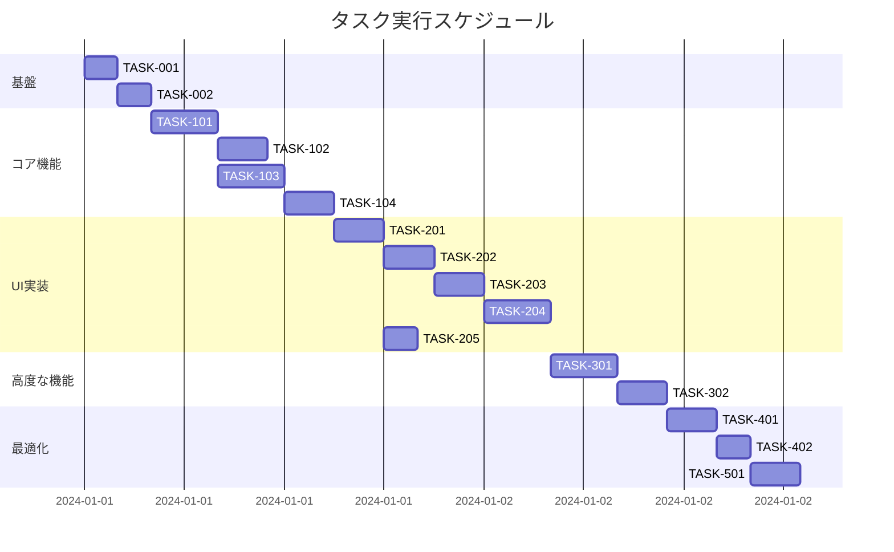

# タグ機能 実装タスク

## 概要

全タスク数: 15
推定作業時間: 32時間
クリティカルパス: TASK-001 → TASK-002 → TASK-101 → TASK-102 → TASK-201 → TASK-301

## タスク一覧

### フェーズ1: 基盤構築

#### TASK-001: タグ処理基盤の設定

- [x] **タスク完了**
- **タスクタイプ**: DIRECT
- **要件リンク**: REQ-001, REQ-401, REQ-402
- **依存タスク**: なし
- **実装詳細**:
  - タグ関連の型定義（Tag, TagHierarchy）
  - タグ処理ユーティリティのディレクトリ構造作成
  - 設定ファイルの準備
- **テスト要件**:
  - [ ] 型定義のコンパイルチェック
  - [ ] ディレクトリ構造の確認
- **完了条件**:
  - [ ] src/types/tag.ts が作成されている
  - [ ] src/utils/tag/ ディレクトリが作成されている

#### TASK-002: Remarkプラグイン基盤設定

- [x] **タスク完了**
- **タスクタイプ**: DIRECT
- **要件リンク**: REQ-001, REQ-104
- **依存タスク**: TASK-001
- **実装詳細**:
  - remark-tagsプラグインのディレクトリ作成
  - プラグインの基本構造設定
  - Astro設定への統合準備
- **テスト要件**:
  - [ ] プラグイン構造の確認
  - [ ] Astro設定との互換性確認
- **完了条件**:
  - [ ] src/plugins/remark-tags/ ディレクトリが存在する
  - [ ] プラグインの基本ファイル構造が準備されている

### フェーズ2: コア機能実装

#### TASK-101: タグ認識パーサー実装

- [ ] **タスク完了**
- **タスクタイプ**: TDD
- **要件リンク**: REQ-001, REQ-004, REQ-101
- **依存タスク**: TASK-002
- **実装詳細**:
  - Remarkプラグインでのタグ認識ロジック
  - #タグと#親/子/孫形式の階層タグ認識
  - タグの正規表現パターン実装
- **テスト要件**:
  - [ ] 単体テスト: 単純タグの認識
  - [ ] 単体テスト: 階層タグの認識
  - [ ] 単体テスト: 日本語タグの認識
  - [ ] 単体テスト: 特殊文字の処理
- **エラーハンドリング**:
  - [ ] 無効な文字の処理
  - [ ] 最大長超過の処理
  - [ ] 連続スラッシュの正規化

#### TASK-102: frontmatterタグ処理

- [ ] **タスク完了**
- **タスクタイプ**: TDD
- **要件リンク**: REQ-002, REQ-105
- **依存タスク**: TASK-101
- **実装詳細**:
  - frontmatterからのタグ抽出
  - タグメタデータの処理
  - コンテンツコレクションへの統合
- **テスト要件**:
  - [ ] 単体テスト: frontmatterタグの抽出
  - [ ] 単体テスト: 配列形式のタグ処理
  - [ ] 統合テスト: コンテンツコレクションとの連携
- **完了条件**:
  - [ ] frontmatterのtagsフィールドが処理される
  - [ ] 抽出されたタグがメタデータに含まれる

#### TASK-103: タグ階層構造処理

- [ ] **タスク完了**
- **タスクタイプ**: TDD
- **要件リンク**: REQ-004, REQ-101, REQ-403
- **依存タスク**: TASK-101
- **実装詳細**:
  - 階層タグのパース（/区切り）
  - 親子関係の構築
  - TagHierarchyデータ構造の生成
  - 最大階層深度（5レベル）の制限
- **テスト要件**:
  - [ ] 単体テスト: 階層パース
  - [ ] 単体テスト: 親子関係の構築
  - [ ] 単体テスト: 最大階層深度の検証
  - [ ] エッジケース: 循環参照の防止
- **エラーハンドリング**:
  - [ ] 階層深度超過の処理
  - [ ] 循環参照の検出

#### TASK-104: タグデータサービス実装

- [ ] **タスク完了**
- **タスクタイプ**: TDD
- **要件リンク**: REQ-002, REQ-102, REQ-103
- **依存タスク**: TASK-103
- **実装詳細**:
  - 全タグの収集と管理
  - タグ使用回数のカウント
  - 親タグによる子タグ記事の検索
  - タグ完全一致検索
- **テスト要件**:
  - [ ] 単体テスト: タグ収集ロジック
  - [ ] 単体テスト: 使用回数カウント
  - [ ] 単体テスト: 親タグ検索
  - [ ] 単体テスト: 完全一致検索
- **パフォーマンス要件**:
  - [ ] 1000記事でのタグ収集が効率的

### フェーズ3: UI実装

#### TASK-201: タグ表示コンポーネント

- [ ] **タスク完了**
- **タスクタイプ**: TDD
- **要件リンク**: REQ-003, NFR-201, NFR-203
- **依存タスク**: TASK-104
- **実装詳細**:
  - タグバッジコンポーネント
  - クリック可能なリンク化
  - #プレフィックス表示
  - ホバー効果の実装
- **UI/UX要件**:
  - [ ] 視覚的識別: 背景色と枠線
  - [ ] ホバー効果: アンダーライン/色変更
  - [ ] アクセシビリティ: ARIA属性
  - [ ] キーボード操作: フォーカス対応
- **テスト要件**:
  - [ ] コンポーネントテスト
  - [ ] アクセシビリティテスト
  - [ ] レスポンシブテスト

#### TASK-202: タグ一覧ページ実装

- [ ] **タスク完了**
- **タスクタイプ**: TDD
- **要件リンク**: REQ-005, REQ-201, NFR-001
- **依存タスク**: TASK-201
- **実装詳細**:
  - /tags ページの作成
  - 全タグのリスト表示
  - タグ使用回数の表示
  - タグのソート機能
- **UI/UX要件**:
  - [ ] ローディング状態: スケルトン表示
  - [ ] エラー表示: 適切なメッセージ
  - [ ] モバイル対応: レスポンシブグリッド
  - [ ] ページネーション: 大量タグ対応
- **テスト要件**:
  - [ ] ページレンダリングテスト
  - [ ] パフォーマンステスト（2秒以内）
  - [ ] レスポンシブテスト

#### TASK-203: タグ詳細ページ実装

- [ ] **タスク完了**
- **タスクタイプ**: TDD
- **要件リンク**: REQ-201, REQ-102, REQ-103
- **依存タスク**: TASK-202
- **実装詳細**:
  - /tags/[slug] 動的ルート
  - タグを持つ記事一覧表示
  - 親タグの場合は子タグ記事も含む
  - 記事のページネーション
- **UI/UX要件**:
  - [ ] 記事リスト: カード形式
  - [ ] ソート機能: 日付/タイトル
  - [ ] 404処理: 存在しないタグ
  - [ ] パンくずリスト: ナビゲーション
- **テスト要件**:
  - [ ] 動的ルーティングテスト
  - [ ] 親タグ記事包含テスト
  - [ ] 404ページテスト
- **エラーハンドリング**:
  - [ ] 存在しないタグのハンドリング

#### TASK-204: タグツリービュー実装

- [ ] **タスク完了**
- **タスクタイプ**: TDD
- **要件リンク**: REQ-006, REQ-202, NFR-202, NFR-003
- **依存タスク**: TASK-203
- **実装詳細**:
  - 階層構造の視覚化コンポーネント
  - 展開/折りたたみ機能
  - インデント表示
  - タグカウント表示
- **UI/UX要件**:
  - [ ] ツリー構造: インデント表示
  - [ ] インタラクション: 展開/折りたたみ（50ms以内）
  - [ ] アイコン: フォルダ/ファイルメタファー
  - [ ] アニメーション: スムーズな遷移
- **テスト要件**:
  - [ ] 階層表示テスト
  - [ ] インタラクションテスト
  - [ ] パフォーマンステスト（50ms以内）
  - [ ] 深い階層のテスト（5レベル）

#### TASK-205: 記事内タグ表示統合

- [ ] **タスク完了**
- **タスクタイプ**: TDD
- **要件リンク**: REQ-203, REQ-104
- **依存タスク**: TASK-201
- **実装詳細**:
  - 記事ページへのタグ表示追加
  - インラインタグのレンダリング
  - 記事末尾のタグリスト表示
- **UI/UX要件**:
  - [ ] インラインタグ: 本文内での自然な表示
  - [ ] タグリスト: 記事末尾での整理された表示
  - [ ] モバイル対応: 適切なサイズ調整
- **テスト要件**:
  - [ ] 記事内タグ表示テスト
  - [ ] インラインタグレンダリングテスト

### フェーズ4: 高度な機能

#### TASK-301: タグ検索・フィルタリング機能

- [ ] **タスク完了**
- **タスクタイプ**: TDD
- **要件リンク**: REQ-301, NFR-002
- **依存タスク**: TASK-204
- **実装詳細**:
  - タグ検索入力フィールド
  - リアルタイム検索結果表示
  - タグオートコンプリート
  - 検索履歴機能
- **UI/UX要件**:
  - [ ] 検索入力: デバウンス処理
  - [ ] オートコンプリート: 100ms以内の応答
  - [ ] 検索結果: インクリメンタル表示
  - [ ] キーボード操作: 矢印キーでの選択
- **テスト要件**:
  - [ ] 検索機能テスト
  - [ ] オートコンプリートテスト
  - [ ] パフォーマンステスト（100ms以内）
- **セキュリティ要件**:
  - [ ] XSS対策: 入力サニタイズ

#### TASK-302: タグクラウド実装

- [ ] **タスク完了**
- **タスクタイプ**: TDD
- **要件リンク**: REQ-302, REQ-006
- **依存タスク**: TASK-301
- **実装詳細**:
  - タグクラウドコンポーネント
  - 使用頻度による文字サイズ調整
  - カラーグラデーション
  - インタラクティブ効果
- **UI/UX要件**:
  - [ ] サイズ変化: 使用頻度に応じた5段階
  - [ ] カラー: 重要度による色分け
  - [ ] レイアウト: 自動配置アルゴリズム
  - [ ] アニメーション: ホバー時の拡大
- **テスト要件**:
  - [ ] レンダリングテスト
  - [ ] レスポンシブテスト
  - [ ] 大量タグでのパフォーマンステスト

### フェーズ5: 最適化とテスト

#### TASK-401: パフォーマンス最適化

- [ ] **タスク完了**
- **タスクタイプ**: TDD
- **要件リンク**: NFR-001, NFR-002, NFR-003
- **依存タスク**: TASK-302
- **実装詳細**:
  - タグデータのキャッシング
  - 遅延読み込みの実装
  - バンドルサイズの最適化
  - レンダリング最適化
- **テスト要件**:
  - [ ] パフォーマンス計測: 1000記事で2秒以内
  - [ ] メモリ使用量テスト
  - [ ] バンドルサイズ確認
- **完了条件**:
  - [ ] 全パフォーマンス要件を満たす

#### TASK-402: セキュリティ対策実装

- [ ] **タスク完了**
- **タスクタイプ**: TDD
- **要件リンク**: NFR-101, NFR-102
- **依存タスク**: TASK-401
- **実装詳細**:
  - XSS対策: タグ入力のサニタイズ
  - URLインジェクション対策
  - 悪意のあるタグ名の防止
- **テスト要件**:
  - [ ] XSS脆弱性テスト
  - [ ] インジェクション攻撃テスト
  - [ ] エッジケーステスト
- **完了条件**:
  - [ ] セキュリティ監査をパス

#### TASK-501: E2Eテストスイート

- [ ] **タスク完了**
- **タスクタイプ**: TDD
- **要件リンク**: 全要件
- **依存タスク**: TASK-402
- **実装詳細**:
  - Playwrightでのテストシナリオ作成
  - ユーザーフローの完全テスト
  - クロスブラウザテスト
  - モバイルデバイステスト
- **テスト要件**:
  - [ ] タグ作成フロー
  - [ ] タグ検索フロー
  - [ ] タグナビゲーションフロー
  - [ ] エラーハンドリングフロー
- **完了条件**:
  - [ ] 全受け入れ基準をパス
  - [ ] クロスブラウザ互換性確認

## 実行順序

## 並行実行可能なタスク

以下のタスクグループは並行実行可能：

- **グループ1**: TASK-103（階層構造処理）とTASK-102（frontmatter処理）
- **グループ2**: TASK-205（記事内タグ表示）はTASK-201完了後、他のUIタスクと並行可能

## マイルストーン

1. **M1: 基盤完了** - TASK-001, TASK-002完了（4時間）
2. **M2: コア機能完了** - TASK-101〜104完了（14時間）  
3. **M3: 基本UI完了** - TASK-201〜205完了（15時間）
4. **M4: 全機能完了** - TASK-301〜302完了（7時間）
5. **M5: リリース準備完了** - TASK-401〜501完了（8時間）

## リスクと対策

- **リスク1**: 階層タグのパフォーマンス問題
  - 対策: 早期にパフォーマンステストを実施
  
- **リスク2**: 既存コンテンツとの互換性
  - 対策: 段階的な機能追加とテスト

- **リスク3**: UIの複雑化
  - 対策: ユーザビリティテストの実施